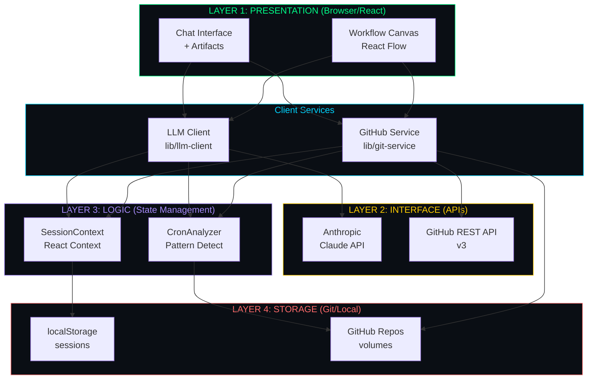
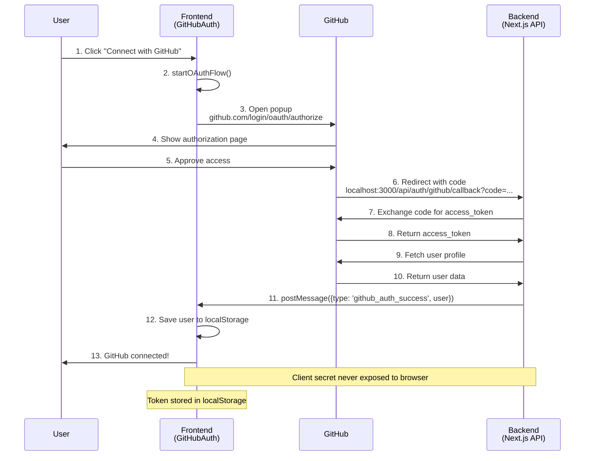
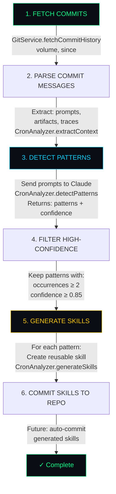
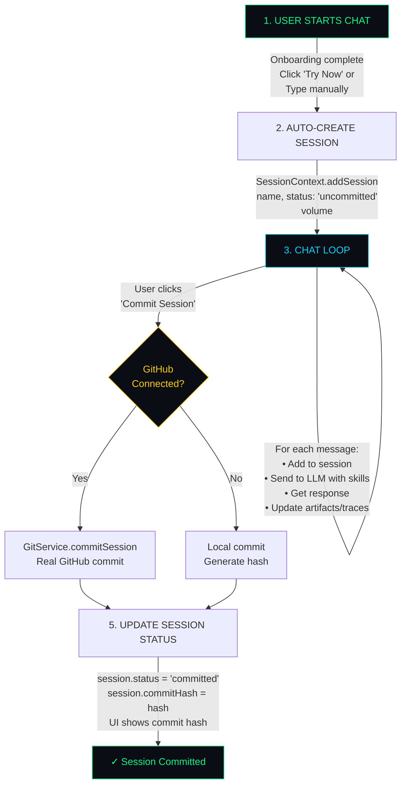
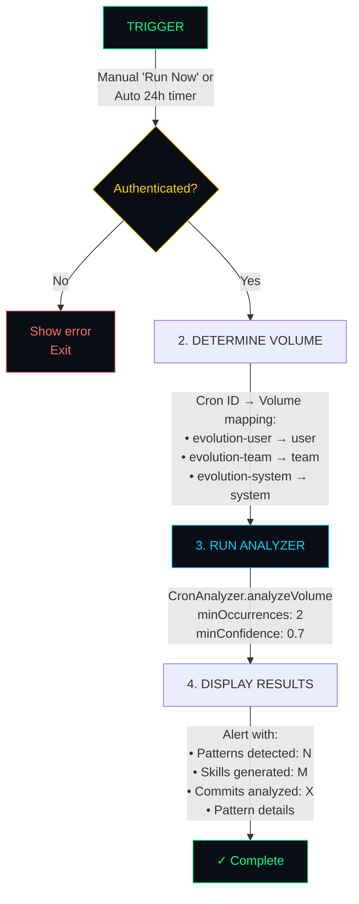
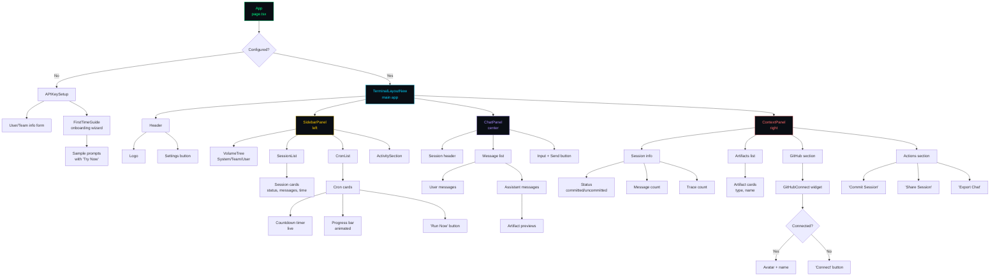

# LLMos-Lite Architecture

> Technical Deep-Dive: From Terminal OS to Self-Improving AI Workbench

## Table of Contents
1. [Philosophy & Design](#philosophy--design)
2. [System Architecture](#system-architecture)
3. [GitHub Integration](#github-integration)
4. [Evolution Engine](#evolution-engine)
5. [Data Flow & Workflows](#data-flow--workflows)
6. [Frontend Architecture](#frontend-architecture)
7. [Security Model](#security-model)
8. [Scalability & Performance](#scalability--performance)

---

## Philosophy & Design

### Core Principles

1. **Commits as Context Memory**
   - Traditional Git: Human-readable history
   - LLMos-Lite: AI-analyzable training data
   - Commit messages embed prompts, artifacts, traces

2. **Self-Improving System**
   - Users create sessions → Commits
   - Crons analyze commits → Detect patterns
   - Patterns → Auto-generated skills
   - Skills → Better workflows

3. **Zero-Cost Execution**
   - WebAssembly in browser (Pyodide, Three.js)
   - No server compute costs
   - Scales infinitely (P2P model)

4. **Collaboration-First**
   - Multi-volume hierarchy (System/Team/User)
   - Git-native collaboration (commits, branches, PRs)
   - Skills promotion workflow

---

## System Architecture

### Four-Layer Stack



### Key Components

#### 1. Frontend (Next.js 14 + React 18)
- **App Router** (`app/`)
  - `page.tsx` - Main entry, setup flow
  - `layout.tsx` - Root layout
  - `api/auth/github/callback/route.ts` - OAuth server-side handler

- **Components** (`components/`)
  - `onboarding/FirstTimeGuide.tsx` - Wizard with sample prompts
  - `chat/ChatPanel.tsx` - Main chat interface
  - `context/ContextPanel.tsx` - GitHub + actions sidebar
  - `panel1-volumes/CronList.tsx` - Cron countdown timers
  - `settings/GitHubConnect.tsx` - OAuth UI
  - `panel3-artifacts/` - Renderers (quantum, 3D, plots)

- **Libraries** (`lib/`)
  - `llm-client.ts` - Anthropic/OpenRouter client
  - `github-auth.ts` - OAuth flow
  - `git-service.ts` - GitHub API wrapper
  - `cron-analyzer.ts` - Pattern detection engine
  - `user-storage.ts` - Local storage utils

- **Contexts** (`contexts/`)
  - `SessionContext.tsx` - Session state (messages, artifacts, traces)

#### 2. Backend (Optional FastAPI)
- **Core** (`core/`)
  - `volumes.py` - Git-backed storage
  - `skills.py` - Skill loader/filter
  - `evolution.py` - Pattern detection (server-side)

- **API** (`api/`)
  - `main.py` - FastAPI endpoints
  - Currently optional (UI is standalone)

---

## GitHub Integration

### OAuth Flow



**Files:**
- `lib/github-auth.ts` - OAuth client-side logic
- `app/api/auth/github/callback/route.ts` - Server-side token exchange
- `components/settings/GitHubConnect.tsx` - UI component

### Repository Structure

Each user gets three volumes, mapped to GitHub repos:

| Volume | Repo Name | Access | Purpose |
|--------|-----------|--------|---------|
| User | `llmunix-user-{username}` | Private | Personal sessions, skills |
| Team | `llmunix-team-volumes` | Shared | Team collaboration |
| System | `llmunix/system-volumes` | Read-only | Global templates |

**Auto-Creation:**
- Repos created on first commit via `GitService.ensureRepository()`
- Uses GitHub REST API: `POST /user/repos`
- Private by default

### Commit Format

**The Innovation:** Commits are dual-purpose (human + machine readable)

```
session: Quantum VQE Optimization

Prompt: Create a VQE circuit for H2 molecule with ansatz and optimizer.

Stats:
- 12 messages
- 3 artifacts generated
- 8 traces executed

Artifacts:
- quantum-circuit: bell_state_circuit
- code: vqe_h2_circuit.py
- skill: quantum-optimization.md

🤖 LLMunix Context Memory
```

**Why This Matters:**
1. **Pattern Detection**: LLM can extract prompts from commits
2. **Skill Generation**: Recurring patterns → Auto-generate skills
3. **Collaboration**: Team sees what you're working on
4. **Audit Trail**: Full history of work

### Git Operations (Client-Side)

All Git operations happen via GitHub REST API (no git CLI needed):

```typescript
// lib/git-service.ts

// Commit session
await GitService.commitSession(volume, {
  id: sessionId,
  name: sessionName,
  messages: messages,
  artifacts: artifacts,
  traces: traces
});

// Fetch history for analysis
const commits = await GitService.fetchCommitHistory(volume, {
  since: new Date(Date.now() - 7 * 24 * 60 * 60 * 1000) // Last 7 days
});

// Pull latest sessions
const sessions = await GitService.pullLatestSessions(volume);
```

**GitHub API Endpoints Used:**
- `GET /repos/{owner}/{repo}` - Check if repo exists
- `POST /user/repos` - Create private repo
- `GET /repos/{owner}/{repo}/contents/{path}` - Read files
- `PUT /repos/{owner}/{repo}/contents/{path}` - Create/update files
- `GET /repos/{owner}/{repo}/commits` - Fetch commit history

---

## Evolution Engine

### Cron Analysis Pipeline



### Pattern Detection Algorithm

**Input**: Array of commit contexts
```typescript
{
  sha: string;
  prompt: string;
  artifacts: string[];
  traces: number[];
}[]
```

**Process**:
1. Format prompts as numbered list
2. Send to LLM with analysis prompt:
   ```
   Analyze these N prompts and identify recurring patterns.
   For each pattern:
   - Name (3-5 words)
   - Description (1 sentence)
   - Which prompt numbers (indices)
   - Confidence score (0-1)

   Focus on: similar domains, workflows, artifact types
   Return JSON: {patterns: [...]}
   ```
3. Parse JSON response
4. Map prompt indices back to commits
5. Calculate occurrences, group artifacts/traces

**Output**: Array of patterns
```typescript
{
  name: string;
  description: string;
  occurrences: number;
  confidence: number;
  commitShas: string[];
  prompts: string[];
  artifacts: string[];
}[]
```

### Skill Generation

**For each high-confidence pattern (>85%)**:

1. Create skill prompt:
   ```
   Create a reusable skill document for: {pattern.name}

   Description: {pattern.description}

   Example prompts:
   1. {prompt1}
   2. {prompt2}
   ...

   Artifacts produced: {artifacts}

   Create a skill document with:
   1. Title
   2. Purpose
   3. Input parameters
   4. Step-by-step workflow
   5. Example code/template
   6. Common variations

   Format as Markdown with YAML frontmatter.
   ```

2. Send to LLM
3. Parse Markdown response
4. Save as `{skill-name}.md`
5. (Future) Commit to user volume

---

## Data Flow & Workflows

### Session Lifecycle



### Cron Execution Flow



### Collaboration Workflow

```mermaid
flowchart TD
    A1[ALICE: Developer] --> A2[Creates 5 quantum<br/>circuit sessions]
    A2 --> A3[Commits all to<br/>user volume]
    A3 --> A4[Runs user cron]
    A4 --> A5[Pattern detected:<br/>Quantum Circuit Design<br/>5x, 92% confidence]
    A5 --> A6[Skill generated:<br/>quantum-circuit-design.md]
    A6 --> T1[TEAM VOLUME]

    T1[Team Volume<br/>Shared Repo] --> T2[Skill:<br/>quantum-circuit-design.md<br/>from Alice]

    T2 --> B1[BOB: Developer]
    B1 --> B2[Pulls latest from<br/>team volume]
    B2 --> B3[Sees Alice's<br/>quantum skill]
    B3 --> B4[Uses skill in<br/>his workflows]
    B4 --> B5[Creates 3 more<br/>quantum sessions]
    B5 --> B6[Commits to<br/>team volume]

    B6 --> C1[TEAM CRON]
    C1 --> C2[Analyzes team volume<br/>Weekly trigger]
    C2 --> C3[Detects cross-user<br/>pattern: Alice + Bob]
    C3 --> C4[Strengthens confidence<br/>98%]
    C4 --> C5[Updates skill with<br/>more examples]

    C5 --> S1[SYSTEM ADMIN]
    S1 --> S2[Reviews highly-used<br/>team skills]
    S2 --> S3[Promotes to<br/>system volume]

    S3 --> U1[ALL USERS]
    U1 --> U2[Benefit from<br/>evolved system skill]

    style A1 fill:#0a0e14,stroke:#00ff88,color:#00ff88
    style T1 fill:#0a0e14,stroke:#00d4ff,color:#00d4ff
    style B1 fill:#0a0e14,stroke:#00ff88,color:#00ff88
    style C1 fill:#0a0e14,stroke:#ffcc00,color:#ffcc00
    style S1 fill:#0a0e14,stroke:#a78bfa,color:#a78bfa
    style U1 fill:#0a0e14,stroke:#00ff88,color:#00ff88
```



---

## Frontend Architecture

### Component Hierarchy



### State Management

**React Context (`SessionContext`)**:
```typescript
{
  sessions: Session[];              // All sessions
  activeSessions: {                 // Grouped by volume
    user: Session[];
    team: Session[];
    system: Session[];
  };
  cronJobs: CronJob[];              // Cron jobs list
  activeSession: string | null;     // Selected session ID

  // Methods
  addSession: (data) => Session;
  updateSession: (id, updates) => void;
  deleteSession: (id) => void;
  addMessage: (sessionId, message) => void;
  updateCronJob: (id, updates) => void;
}
```

**Local Storage**:
- `llmos_sessions` - All sessions (persisted)
- `llmos_cron_jobs` - Cron state (persisted)
- `llmos_active_session` - Selected session (persisted)
- `llmos_github_user` - GitHub user profile (persisted)
- `llmos_user` - User info from onboarding (persisted)
- `llmos_team` - Team info from onboarding (persisted)
- `llmos_llm_config` - LLM API key + model (persisted)

### Real-Time Updates

**Countdown Timers**:
```typescript
// components/panel1-volumes/CronList.tsx

const [countdowns, setCountdowns] = useState<Record<cronId, seconds>>({});

useEffect(() => {
  const interval = setInterval(() => {
    setCountdowns(prev => {
      const next = {...prev};
      crons.forEach(cron => {
        if (next[cron.id] > 0) {
          next[cron.id] = Math.max(0, next[cron.id] - 1);
        }
      });
      return next;
    });
  }, 1000); // Tick every second

  return () => clearInterval(interval);
}, []);
```

**Progress Bar Animation**:
```tsx
<div className="h-1 bg-terminal-bg-tertiary rounded-full">
  <div
    className="h-full bg-terminal-accent-green transition-all duration-1000 ease-linear"
    style={{ width: `${progress}%` }}
  />
</div>
```
- Smooth 1-second transitions via CSS
- Progress = `(total - remaining) / total * 100`

---

## Security Model

### Authentication

**GitHub OAuth**:
- Client secret stored server-side (Next.js env vars)
- Never exposed to browser
- Token exchange happens in API route
- Access token returned to client via postMessage
- Token stored in localStorage (client-side only)

**LLM API Key**:
- Stored in localStorage
- Direct API calls from browser to Anthropic/OpenRouter
- User-owned key, user pays
- No proxy server needed

### Authorization

**Volume Access Control** (Future):
| Volume | User | Team Admin | System Admin |
|--------|------|------------|--------------|
| User | R/W | R | R |
| Team | R | R/W | R/W |
| System | R | R | R/W |

Currently: All operations client-side, enforced by GitHub repo permissions

### Data Security

**Sensitive Data**:
- API keys: localStorage (not encrypted)
- GitHub tokens: localStorage (not encrypted)
- Session data: localStorage + GitHub (private repos)

**Production Recommendations**:
- Use httpOnly cookies for tokens
- Encrypt localStorage data
- Implement server-side session management
- Use GitHub Apps instead of OAuth

### Execution Safety

**WebAssembly Sandbox**:
- Python/JS code runs in browser (Pyodide)
- No access to file system
- No network access (except via MCP)
- Resource limits (memory, CPU)

---

## Scalability & Performance

### Frontend Performance

**Optimizations**:
- Next.js dynamic imports (code splitting)
- React.memo for expensive components
- Virtualized lists for long sessions
- Lazy loading of artifacts
- Debounced search/filter

**Bundle Size**:
- Main: ~500KB (Next.js + React)
- Pyodide: ~6MB (loaded on demand)
- Total: ~6.5MB (cached after first load)

### GitHub API Rate Limits

**Limits**:
- Authenticated: 5000 requests/hour
- Unauthenticated: 60 requests/hour

**Mitigation**:
- Cache commit history locally
- Batch operations
- Use conditional requests (ETags)
- Implement exponential backoff

**Typical Usage**:
- Commit session: 2 requests (check + create)
- Fetch history: 1 request
- Cron analysis: 3-5 requests (fetch commits + files)
- Total: ~10 requests/session → 500 sessions/hour max

### Storage Limits

**Browser Storage**:
- localStorage: ~10MB
- IndexedDB: ~50MB+ (future)

**GitHub**:
- File size: 100MB
- Repo size: No hard limit (soft limit ~1GB)

**Session Data**:
- Average session: ~50KB
- 100 sessions: ~5MB
- Fits comfortably in localStorage

### Future Scalability

**Backend Migration**:
- Add FastAPI backend for heavy operations
- Server-side cron scheduling
- Database for session metadata
- Redis for caching

**Distributed Architecture**:
- CDN for static assets
- WebSockets for real-time collaboration
- Message queue for async jobs
- Vector DB for semantic search

---

## Migration from Original LLMos

### What Changed

| Aspect | Original llmos | llmos-lite |
|--------|---------------|------------|
| **Storage** | File-based | Git-backed + localStorage |
| **Execution** | Server (Python) | Browser (WebAssembly) |
| **Interface** | Terminal CLI | Web UI (React) |
| **Capabilities** | Python tools | Markdown skills + artifacts |
| **Evolution** | Complex (sentience/valence) | Simple (pattern detection) |
| **Collaboration** | File system | GitHub (commits/PRs) |
| **Cost** | Server compute | Free (client-side) |

### Migration Strategy

**For existing llmos users**:
1. Export traces from `/workspace/memories/traces/`
2. Convert to session JSON format
3. Commit to llmos-lite user volume
4. Cron will analyze and generate skills

---

## Appendix

### File Locations Reference

**GitHub Integration**:
- `lib/github-auth.ts` - OAuth client
- `lib/git-service.ts` - GitHub API wrapper
- `lib/cron-analyzer.ts` - Pattern detection
- `app/api/auth/github/callback/route.ts` - OAuth callback
- `components/settings/GitHubConnect.tsx` - UI widget

**UI Components**:
- `components/onboarding/FirstTimeGuide.tsx` - Sample prompts
- `components/context/ContextPanel.tsx` - GitHub + actions
- `components/panel1-volumes/CronList.tsx` - Countdown timers
- `components/chat/ChatPanel.tsx` - Main chat
- `components/panel3-artifacts/` - Artifact renderers

**Configuration**:
- `ui/.env.local.example` - Environment template
- `ui/tailwind.config.js` - Terminal theme
- `ui/styles/globals.css` - CSS variables

### Environment Variables

```env
# Required
ANTHROPIC_API_KEY=sk-ant-...

# GitHub OAuth (optional)
GITHUB_CLIENT_ID=your_client_id
GITHUB_CLIENT_SECRET=your_client_secret
NEXT_PUBLIC_GITHUB_CLIENT_ID=your_client_id
NEXTAUTH_SECRET=$(openssl rand -base64 32)
NEXTAUTH_URL=http://localhost:3000

# Optional
LLMOS_VOLUMES_PATH=./volumes
```

### API Endpoints (Future)

```
GET  /api/sessions              # List sessions
POST /api/sessions              # Create session
GET  /api/sessions/:id          # Get session
PUT  /api/sessions/:id          # Update session
DEL  /api/sessions/:id          # Delete session

POST /api/sessions/:id/commit   # Commit to GitHub

GET  /api/crons                 # List cron jobs
POST /api/crons/:id/run         # Trigger cron

GET  /api/skills                # List skills
POST /api/skills                # Create skill
GET  /api/skills/:id            # Get skill
```

---

**End of Architecture Document**

For user-facing documentation, see README.md.
For setup instructions, see the Quick Start section in README.md.
