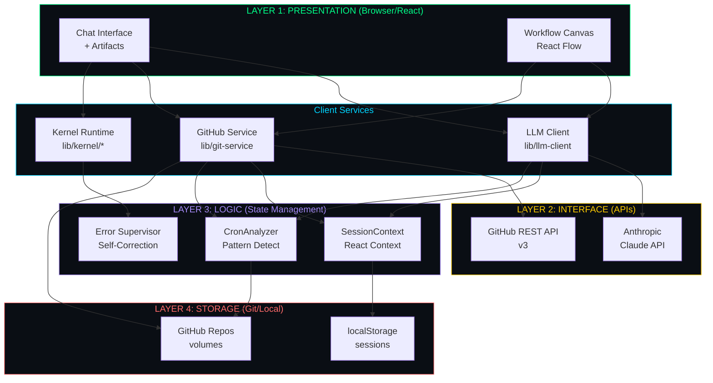

# LLMos-Lite Architecture

> Technical Deep-Dive: From Terminal OS to Self-Improving AI Workbench with Client-Side Kernel Runtime

## Table of Contents
1. [Philosophy & Design](#philosophy--design)
2. [System Architecture](#system-architecture)
3. [Kernel Runtime System](#kernel-runtime-system)
4. [WASM Sandboxed Execution](#wasm-sandboxed-execution)
5. [Self-Correction System](#self-correction-system)
6. [GitHub Integration](#github-integration)
7. [Evolution Engine](#evolution-engine)
8. [Data Flow & Workflows](#data-flow--workflows)
9. [Frontend Architecture](#frontend-architecture)
10. [Security Model](#security-model)
11. [Scalability & Performance](#scalability--performance)

---

## Philosophy & Design

### Core Principles

1. **Commits as Context Memory**
   - Traditional Git: Human-readable history
   - LLMos-Lite: AI-analyzable training data
   - Commit messages embed prompts, artifacts, traces

2. **Self-Improving System**
   - Users create sessions → Commits
   - Crons analyze commits → Detect patterns
   - Patterns → Auto-generated skills
   - Skills → Better workflows

3. **Zero-Cost Execution**
   - WebAssembly in browser (QuickJS, Pyodide, Three.js)
   - No server compute costs
   - Scales infinitely (P2P model)

4. **Collaboration-First**
   - Multi-volume hierarchy (System/Team/User)
   - Git-native collaboration (commits, branches, PRs)
   - Skills promotion workflow

5. **OS-Like Experience**
   - Boot sequence with kernel loading
   - Sandboxed artifact execution
   - Automatic error detection and self-correction
   - Real-time feedback and execution visualization

---

## System Architecture

### Four-Layer Stack



### Key Components

#### 1. Frontend (Next.js 14 + React 18)
- **App Router** (`app/`)
  - `page.tsx` - Main entry, setup flow
  - `layout.tsx` - Root layout
  - `api/auth/github/callback/route.ts` - OAuth server-side handler

- **Components** (`components/`)
  - `onboarding/FirstTimeGuide.tsx` - Wizard with sample prompts
  - `chat/ChatPanel.tsx` - Main chat interface
  - `chat/MarkdownRenderer.tsx` - Markdown with auto-execution
  - `context/ContextPanel.tsx` - GitHub + actions sidebar
  - `panel1-volumes/CronList.tsx` - Cron countdown timers
  - `settings/GitHubConnect.tsx` - OAuth UI
  - `panel3-artifacts/` - Renderers (quantum, 3D, plots)
  - `kernel/` - Kernel UI components (boot, refinement, execution)

- **Libraries** (`lib/`)
  - `llm-client.ts` - Anthropic/OpenRouter client
  - `github-auth.ts` - OAuth flow
  - `git-service.ts` - GitHub API wrapper
  - `cron-analyzer.ts` - Pattern detection engine
  - `user-storage.ts` - Local storage utils
  - `artifact-executor.ts` - Unified execution interface
  - `pyodide-runtime.ts` - Python runtime with matplotlib
  - `kernel/` - Kernel runtime system

- **Contexts** (`contexts/`)
  - `SessionContext.tsx` - Session state (messages, artifacts, traces)

#### 2. Backend (Optional FastAPI)
- **Core** (`core/`)
  - `volumes.py` - Git-backed storage
  - `skills.py` - Skill loader/filter
  - `evolution.py` - Pattern detection (server-side)

- **API** (`api/`)
  - `main.py` - FastAPI endpoints
  - Currently optional (UI is standalone)

---

## Kernel Runtime System

### Overview

LLMos-Lite implements an OS-like kernel that boots with a visual loading sequence, loads runtime components from the system volume, and provides a safe execution environment for artifacts.

### Boot Sequence

The kernel boots in 6 stages:

```typescript
// lib/kernel/boot.ts
const BOOT_STAGES = [
  { name: 'Initializing system...', duration: 500 },
  { name: 'Mounting volumes...', duration: 800 },
  { name: 'Loading kernel runtime...', duration: 1200 },
  { name: 'Initializing Python environment...', duration: 2000 },
  { name: 'Loading standard library...', duration: 600 },
  { name: 'System ready', duration: 300 }
];
```

**Boot Flow:**
1. **System Initialization** - Load kernel configuration
2. **Volume Mounting** - Connect to system/team/user volumes
3. **Kernel Runtime** - Initialize QuickJS WASM sandbox
4. **Python Environment** - Load Pyodide and MicroQiskit
5. **Standard Library** - Inject safe APIs and helpers
6. **System Ready** - Display boot complete, ready for artifacts

**Visual Feedback:**
- Progress bar with percentage
- Stage-by-stage status messages
- Smooth transitions between stages
- Terminal-style boot screen UI

### System Volume Structure

```
/system/
├── kernel/
│   ├── stdlib.js         # Standard library for artifacts
│   ├── init.js           # Kernel initialization script
│   └── runtime.wasm      # QuickJS WASM binary
├── skills/
│   └── *.md              # Global reusable skills
└── agents/
    └── *.md              # System-level agents
```

### Kernel API

Artifacts execute with access to a safe, scoped API:

```typescript
// Available in artifact execution context
const LLMOS = {
  dom: {
    createElement(tag, props),
    querySelector(selector),
    // Scoped to artifact container only
  },
  viz: {
    createCanvas(width, height),
    plot(data, options),
    render3D(scene),
    renderQuantumCircuit(circuit),
  },
  storage: {
    get(key),
    set(key, value),
    delete(key),
    // Scoped to artifact ID
  },
  log: {
    info(message),
    warn(message),
    error(message),
  },
  errors: {
    capture(error, context),
  }
};
```

---

## WASM Sandboxed Execution

### Technology Stack

**QuickJS-WASM** for JavaScript:
- Complete isolation from host environment
- Killable execution (no infinite loops)
- State snapshots for debugging
- ~500KB download, cached after first load

**Pyodide** for Python:
- Browser-based Python 3.13 runtime
- Scientific computing stack (numpy, scipy, matplotlib, pandas)
- MicroQiskit for quantum circuits (max 10 qubits)
- Automatic matplotlib image capture

### Execution Architecture

```typescript
// lib/artifact-executor.ts
export async function executeArtifact(
  code: string,
  language: 'javascript' | 'python',
  artifactId: string
): Promise<ExecutionResult> {
  if (language === 'javascript') {
    return await executeJavaScript(code, artifactId);
  } else {
    return await executePythonCode(code);
  }
}
```

**JavaScript Execution (QuickJS-WASM):**
```typescript
// lib/kernel/wasm-runtime.ts
export async function executeJavaScript(
  code: string,
  artifactId: string,
  options: ExecutionOptions = {}
): Promise<ExecutionResult> {
  const vm = await getQuickJS();
  const runtime = vm.runtime;
  const context = runtime.newContext();

  try {
    // Inject kernel API
    injectKernelAPI(context, artifactId);

    // Execute with timeout
    const result = context.evalCode(code);
    const output = context.dump(result);

    return {
      success: true,
      output,
      executionTime: Date.now() - startTime,
    };
  } catch (error) {
    return {
      success: false,
      error: error.message,
      executionTime: Date.now() - startTime,
    };
  } finally {
    context.dispose();
  }
}
```

**Python Execution (Pyodide):**
```typescript
// lib/pyodide-runtime.ts
export async function executePythonCode(
  code: string,
  options: ExecutionOptions = {}
): Promise<ExecutionResult> {
  const pyodide = await loadPyodide();

  // Auto-detect and load packages
  const packages = detectRequiredPackages(code);
  await pyodide.loadPackage(packages);

  // Inject MicroQiskit if needed
  if (code.includes('qiskit')) {
    await injectMicroQiskit(pyodide);
  }

  // Capture matplotlib plots
  const images: string[] = [];
  pyodide.globals.set('_llmos_capture_image', (base64: string) => {
    images.push(base64);
  });

  try {
    const result = await pyodide.runPythonAsync(code);

    return {
      success: true,
      output: result,
      images,
      executionTime: Date.now() - startTime,
    };
  } catch (error) {
    return {
      success: false,
      error: error.message,
      executionTime: Date.now() - startTime,
    };
  }
}
```

### Runtime Capabilities

**Available Python Packages:**
- ✅ numpy, scipy, matplotlib, pandas, scikit-learn, networkx, sympy
- ⚠️ qiskit (MicroQiskit - max 10 qubits, basic gates only)
- ❌ NOT available: qiskit_aer, tensorflow, pytorch, opencv, requests

**Constraints:**
- No file system access
- No network requests
- No multiprocessing
- Execution timeout: 30 seconds
- Memory limit: browser-dependent

**Pre-Execution Validation:**
```typescript
// lib/runtime-capabilities.ts
export function validateCode(code: string): ValidationResult {
  const errors: string[] = [];
  const warnings: string[] = [];
  const suggestions: string[] = [];

  // Check for unavailable packages
  if (code.includes('qiskit_aer')) {
    errors.push("qiskit_aer is not available");
    suggestions.push("Use 'execute(circuit, shots=1024)' instead");
  }

  // Check for file I/O
  if (/open\s*\(/.test(code)) {
    errors.push('File I/O is not available');
    suggestions.push('Work with in-memory data');
  }

  return { valid: errors.length === 0, errors, warnings, suggestions };
}
```

### Security Model

**Sandbox Isolation:**
- JavaScript artifacts execute in isolated WASM context
- No access to DOM outside artifact container
- No access to localStorage outside artifact scope
- No network access (except via approved kernel APIs)

**Resource Limits:**
- Execution timeout prevents infinite loops
- Memory limits prevent resource exhaustion
- API rate limiting for kernel calls

---

## Self-Correction System

### Overview

The self-correction system automatically detects execution errors, captures full context, requests LLM refinement, and retries execution - all transparently to the user.

### Architecture

```
┌─────────────────┐
│  Execute Code   │
└────────┬────────┘
         │
         ▼
    ┌─────────┐
    │ Success?│
    └────┬────┘
         │ No
         ▼
┌─────────────────────────┐
│  Capture Error Context  │
│  • Code                 │
│  • Error message        │
│  • Runtime state        │
│  • Previous attempts    │
└────────┬────────────────┘
         │
         ▼
┌─────────────────────────┐
│  Send to LLM for Fix    │
│  • Error analysis       │
│  • Code refinement      │
│  • Explanation          │
└────────┬────────────────┘
         │
         ▼
┌─────────────────────────┐
│  Validate Refined Code  │
│  • Syntax check         │
│  • Safety check         │
│  • Size check           │
└────────┬────────────────┘
         │
         ▼
┌─────────────────────────┐
│  Retry Execution        │
│  (max 3 attempts)       │
└─────────────────────────┘
```

### Components

#### 1. Error Supervisor

**Captures full error context:**

```typescript
// lib/kernel/error-supervisor.ts
export interface ErrorContext {
  // Original code and error
  originalCode: string;
  error: {
    message: string;
    stack?: string;
    line?: number;
    column?: number;
  };

  // Runtime state at time of error
  runtimeState: {
    variables?: Record<string, any>;
    lastOutput?: any;
    stdout?: string;
    stderr?: string;
  };

  // Retry tracking
  attemptNumber: number;
  maxAttempts: number;

  // History of previous attempts
  previousAttempts: Array<{
    code: string;
    error: string;
    timestamp: number;
  }>;

  // Metadata
  artifactId: string;
  language: 'javascript' | 'python';
  timestamp: number;
}
```

**Builds refinement prompt:**

```typescript
buildRefinementPrompt(context: ErrorContext): string {
  return `You are an expert code debugger. The following ${language} code failed to execute:

\`\`\`${language}
${originalCode}
\`\`\`

**Error:**
${error.message}

**Console Output:**
${runtimeState.stdout || '(none)'}

${previousAttempts.length > 0 ? `
**Previous Attempts:**
${previousAttempts.map((a, i) => `
Attempt ${i + 1}:
Code: \`\`\`${language}\n${a.code}\n\`\`\`
Error: ${a.error}
`).join('\n')}

This is attempt ${attemptNumber} of ${maxAttempts}.
` : ''}

Please analyze the error and provide a corrected version of the code.

**Your response must be in the following JSON format:**
{
  "reasoning": "Brief explanation of what caused the error",
  "refinedCode": "The corrected code (complete, not partial)",
  "explanation": "What you changed and why"
}

Important:
1. Return ONLY valid JSON, no other text
2. The refinedCode must be complete and executable
3. Keep the original intent of the code
4. Fix the specific error without over-engineering
`;
}
```

#### 2. Refinement Service

**Sends code to LLM for fixing:**

```typescript
// lib/kernel/refinement-service.ts
export class CodeRefinementService {
  async refineCode(
    context: ErrorContext,
    prompt: string
  ): Promise<RefinementResult> {
    // Get LLM client
    const llmClient = createLLMClient();
    if (!llmClient) {
      throw new Error('LLM client not configured. Please set your API key.');
    }

    // Send refinement request
    const response = await llmClient.chatDirect([
      {
        role: 'user',
        content: prompt,
      },
    ]);

    // Parse JSON response
    return this.parseResponse(response);
  }

  private parseResponse(response: string): RefinementResult {
    // Extract JSON from response (handle markdown code blocks)
    let jsonStr = response.trim();

    if (jsonStr.includes('```json')) {
      const match = jsonStr.match(/```json\s*\n([\s\S]*?)\n```/);
      if (match) jsonStr = match[1];
    }

    const parsed = JSON.parse(jsonStr);

    return {
      success: true,
      refinedCode: parsed.refinedCode,
      explanation: parsed.explanation || 'No explanation provided',
      reasoning: parsed.reasoning || 'No reasoning provided',
    };
  }

  async validateRefinedCode(
    originalCode: string,
    refinedCode: string,
    language: 'javascript' | 'python'
  ): Promise<{ valid: boolean; warnings: string[] }> {
    const warnings: string[] = [];

    // Check if code is too different (possible hallucination)
    const originalLines = originalCode.split('\n').length;
    const refinedLines = refinedCode.split('\n').length;

    if (refinedLines > originalLines * 3) {
      warnings.push('Refined code is significantly longer than original');
    }

    // Check for dangerous patterns
    if (language === 'javascript') {
      if (refinedCode.includes('eval(') || refinedCode.includes('Function(')) {
        warnings.push('Refined code contains eval or Function constructor');
      }
    }

    return { valid: true, warnings };
  }
}
```

#### 3. Supervised Execution

**Orchestrates the retry loop:**

```typescript
// lib/kernel/supervised-execution.ts
export async function executeWithSupervision(
  code: string,
  language: 'javascript' | 'python',
  artifactId: string,
  options: SupervisedExecutionOptions = {}
): Promise<SupervisedExecutionResult> {
  const {
    enableSelfCorrection = true,
    maxRetries = 3,
    onProgress,
    ...execOptions
  } = options;

  const supervisor = getErrorSupervisor({ maxRetries, onProgress });
  const refinementService = getRefinementService();

  const refinementHistory: Array<{
    attempt: number;
    error: string;
    refinedCode: string;
    explanation: string;
  }> = [];

  const previousAttempts: Array<{
    code: string;
    error: string;
    timestamp: number;
  }> = [];

  let currentCode = code;
  let lastResult: ExecutionResult | null = null;

  // Execute with retries
  for (let attempt = 1; attempt <= maxRetries; attempt++) {
    if (onProgress) {
      const status = attempt === 1
        ? 'Executing code...'
        : `Retrying with refined code (attempt ${attempt}/${maxRetries})...`;
      onProgress(status, attempt, maxRetries);
    }

    // Execute code
    let result: ExecutionResult;
    if (language === 'javascript') {
      result = await executeJavaScript(currentCode, artifactId, execOptions);
    } else {
      result = await executePythonCode(currentCode, execOptions);
    }

    lastResult = result;

    // Success! Return result
    if (result.success) {
      return supervisor.createSupervisedResult(
        result,
        attempt > 1, // Was refined if not first attempt
        refinementHistory
      );
    }

    // Execution failed
    if (!enableSelfCorrection || attempt === maxRetries) {
      return supervisor.createSupervisedResult(result, attempt > 1, refinementHistory);
    }

    // Capture error context
    const errorContext = supervisor.captureErrorContext(
      currentCode,
      result,
      artifactId,
      language,
      previousAttempts
    );

    // Record this attempt
    previousAttempts.push({
      code: currentCode,
      error: result.error || 'Unknown error',
      timestamp: Date.now(),
    });

    // Request LLM refinement
    if (onProgress) {
      onProgress(`Analyzing error and requesting refinement...`, attempt, maxRetries);
    }

    const prompt = supervisor.buildRefinementPrompt(errorContext);
    const refinementResult = await refinementService.refineCode(errorContext, prompt);

    if (!refinementResult.success || !refinementResult.refinedCode) {
      return supervisor.createSupervisedResult(result, attempt > 1, refinementHistory);
    }

    // Validate refined code
    const validation = await refinementService.validateRefinedCode(
      code,
      refinementResult.refinedCode,
      language
    );

    if (!validation.valid) {
      return supervisor.createSupervisedResult(result, attempt > 1, refinementHistory);
    }

    // Record refinement
    refinementHistory.push({
      attempt,
      error: result.error || 'Unknown error',
      refinedCode: refinementResult.refinedCode,
      explanation: refinementResult.explanation || 'No explanation',
    });

    // Update code for next attempt
    currentCode = refinementResult.refinedCode;
  }

  return supervisor.createSupervisedResult(
    lastResult || { success: false, error: 'Execution failed', executionTime: 0 },
    refinementHistory.length > 0,
    refinementHistory
  );
}
```

#### 4. Visual Feedback

**Real-time refinement progress:**

```typescript
// components/kernel/RefinementProgress.tsx
export default function RefinementProgress({
  isRefining,
  currentAttempt,
  maxAttempts,
  status,
  refinementHistory = [],
}: RefinementProgressProps) {
  const progress = (currentAttempt / maxAttempts) * 100;

  return (
    <div className="border border-terminal-border rounded bg-terminal-bg-secondary p-4">
      {/* Header */}
      <div className="flex items-center gap-2">
        {isRefining && <div className="animate-spin">⚙️</div>}
        <span>{isRefining ? 'Self-Correction Active' : 'Refinement Complete'}</span>
      </div>

      {/* Progress bar */}
      {isRefining && (
        <div>
          <div>Attempt {currentAttempt} of {maxAttempts}</div>
          <div className="h-1.5 bg-terminal-bg-tertiary rounded-full">
            <div
              className="h-full bg-gradient-to-r from-terminal-accent-blue to-terminal-accent-purple"
              style={{ width: `${progress}%` }}
            />
          </div>
        </div>
      )}

      {/* Current status */}
      {isRefining && (
        <div className="flex items-start gap-2 p-3 bg-terminal-bg-tertiary rounded">
          <div>⚙️</div>
          <div>
            <div>{status}</div>
            <div className="text-xs text-terminal-fg-tertiary">
              The system is analyzing the error and requesting a corrected version from the LLM...
            </div>
          </div>
        </div>
      )}

      {/* Refinement history */}
      {refinementHistory.length > 0 && (
        <div className="space-y-2">
          <div className="text-xs font-semibold">Refinement History</div>
          {refinementHistory.map((attempt) => (
            <div key={attempt.attempt} className="border rounded">
              <div className="p-3 bg-terminal-bg-tertiary">
                <span>#{attempt.attempt}</span>
                <span>{attempt.explanation.substring(0, 60)}...</span>
              </div>
              {/* Expandable details with error, explanation, refined code */}
            </div>
          ))}
        </div>
      )}
    </div>
  );
}
```

### Integration

**CodeExecutor with self-correction:**

```typescript
// components/panel3-artifacts/CodeExecutor.tsx
const handleExecute = async () => {
  if (enableSelfCorrection) {
    execResult = await executeWithSupervision(
      code,
      language,
      artifactId,
      {
        enableSelfCorrection: true,
        maxRetries: 3,
        onProgress: (status, attempt, total) => {
          setCurrentAttempt(attempt);
          setRefinementStatus(status);
          setIsRefining(attempt > 1 && attempt < total);
        },
      }
    );
  } else {
    // Non-supervised execution
    const basicResult = await executeArtifact(code, language, artifactId);
    execResult = {
      ...basicResult,
      wasRefined: false,
      refinementAttempts: 0,
    };
  }

  setResult(execResult);
};
```

### Success Metrics

**Target:** > 80% of simple errors auto-fixed

**Common errors fixed:**
- Undefined variables
- Syntax errors
- Type mismatches
- Missing imports
- API misuse
- Logic errors

---

## GitHub Integration

### OAuth Flow


**Files:**
- `lib/github-auth.ts` - OAuth client-side logic
- `app/api/auth/github/callback/route.ts` - Server-side token exchange
- `components/settings/GitHubConnect.tsx` - UI component

### Repository Structure

Each user gets three volumes, mapped to GitHub repos:

| Volume | Repo Name | Access | Purpose |
|--------|-----------|--------|---------|
| User | `llmunix-user-{username}` | Private | Personal sessions, skills |
| Team | `llmunix-team-volumes` | Shared | Team collaboration |
| System | `llmunix/system-volumes` | Read-only | Global templates |

**Auto-Creation:**
- Repos created on first commit via `GitService.ensureRepository()`
- Uses GitHub REST API: `POST /user/repos`
- Private by default

### Commit Format

**The Innovation:** Commits are dual-purpose (human + machine readable)

```
session: Quantum VQE Optimization

Prompt: Create a VQE circuit for H2 molecule with ansatz and optimizer.

Stats:
- 12 messages
- 3 artifacts generated
- 8 traces executed

Artifacts:
- quantum-circuit: bell_state_circuit
- code: vqe_h2_circuit.py
- skill: quantum-optimization.md

🤖 LLMunix Context Memory
```

**Why This Matters:**
1. **Pattern Detection**: LLM can extract prompts from commits
2. **Skill Generation**: Recurring patterns → Auto-generate skills
3. **Collaboration**: Team sees what you're working on
4. **Audit Trail**: Full history of work

### Git Operations (Client-Side)

All Git operations happen via GitHub REST API (no git CLI needed):

```typescript
// lib/git-service.ts

// Commit session
await GitService.commitSession(volume, {
  id: sessionId,
  name: sessionName,
  messages: messages,
  artifacts: artifacts,
  traces: traces
});

// Fetch history for analysis
const commits = await GitService.fetchCommitHistory(volume, {
  since: new Date(Date.now() - 7 * 24 * 60 * 60 * 1000) // Last 7 days
});

// Pull latest sessions
const sessions = await GitService.pullLatestSessions(volume);
```

**GitHub API Endpoints Used:**
- `GET /repos/{owner}/{repo}` - Check if repo exists
- `POST /user/repos` - Create private repo
- `GET /repos/{owner}/{repo}/contents/{path}` - Read files
- `PUT /repos/{owner}/{repo}/contents/{path}` - Create/update files
- `GET /repos/{owner}/{repo}/commits` - Fetch commit history

---

## Evolution Engine

### Cron Analysis Pipeline

```mermaid
flowchart TD
    A[1. FETCH COMMITS] --> |GitService.fetchCommitHistory<br/>volume, since| B[2. PARSE COMMIT MESSAGES]
    B --> |Extract: prompts,<br/>artifacts, traces<br/>CronAnalyzer.extractContext| C[3. DETECT PATTERNS]
    C --> |Send prompts to Claude<br/>CronAnalyzer.detectPatterns<br/>Returns: patterns + confidence| D[4. FILTER HIGH-CONFIDENCE]
    D --> |Keep patterns with:<br/>occurrences ≥ 2<br/>confidence ≥ 0.85| E[5. GENERATE SKILLS]
    E --> |For each pattern:<br/>Create reusable skill<br/>CronAnalyzer.generateSkills| F[6. COMMIT SKILLS TO REPO]
    F --> |Future: auto-commit<br/>generated skills| G[✓ Complete]

    style A fill:#0a0e14,stroke:#00ff88,color:#00ff88
    style C fill:#0a0e14,stroke:#00d4ff,color:#00d4ff
    style E fill:#0a0e14,stroke:#ffcc00,color:#ffcc00
    style G fill:#0a0e14,stroke:#00ff88,color:#00ff88
```



### Pattern Detection Algorithm

**Input**: Array of commit contexts
```typescript
{
  sha: string;
  prompt: string;
  artifacts: string[];
  traces: number[];
}[]
```

**Process**:
1. Format prompts as numbered list
2. Send to LLM with analysis prompt:
   ```
   Analyze these N prompts and identify recurring patterns.
   For each pattern:
   - Name (3-5 words)
   - Description (1 sentence)
   - Which prompt numbers (indices)
   - Confidence score (0-1)

   Focus on: similar domains, workflows, artifact types
   Return JSON: {patterns: [...]}
   ```
3. Parse JSON response
4. Map prompt indices back to commits
5. Calculate occurrences, group artifacts/traces

**Output**: Array of patterns
```typescript
{
  name: string;
  description: string;
  occurrences: number;
  confidence: number;
  commitShas: string[];
  prompts: string[];
  artifacts: string[];
}[]
```

### Skill Generation

**For each high-confidence pattern (>85%)**:

1. Create skill prompt:
   ```
   Create a reusable skill document for: {pattern.name}

   Description: {pattern.description}

   Example prompts:
   1. {prompt1}
   2. {prompt2}
   ...

   Artifacts produced: {artifacts}

   Create a skill document with:
   1. Title
   2. Purpose
   3. Input parameters
   4. Step-by-step workflow
   5. Example code/template
   6. Common variations

   Format as Markdown with YAML frontmatter.
   ```

2. Send to LLM
3. Parse Markdown response
4. Save as `{skill-name}.md`
5. (Future) Commit to user volume

---

## Data Flow & Workflows

### Session Lifecycle

```mermaid
flowchart TD
    A[1. USER STARTS CHAT] --> |Onboarding complete<br/>Click 'Try Now' or<br/>Type manually| B[2. AUTO-CREATE SESSION]
    B --> |SessionContext.addSession<br/>name, status: 'uncommitted'<br/>volume| C[3. CHAT LOOP]
    C --> |For each message:<br/>• Add to session<br/>• Send to LLM with skills<br/>• Get response<br/>• Update artifacts/traces| C
    C --> |User clicks<br/>'Commit Session'| D{GitHub<br/>Connected?}
    D -->|Yes| E[GitService.commitSession<br/>Real GitHub commit]
    D -->|No| F[Local commit<br/>Generate hash]
    E --> G[5. UPDATE SESSION STATUS]
    F --> G
    G --> |session.status = 'committed'<br/>session.commitHash = hash<br/>UI shows commit hash| H[✓ Session Committed]

    style A fill:#0a0e14,stroke:#00ff88,color:#00ff88
    style C fill:#0a0e14,stroke:#00d4ff,color:#00d4ff
    style D fill:#0a0e14,stroke:#ffcc00,color:#ffcc00
    style H fill:#0a0e14,stroke:#00ff88,color:#00ff88
```



### Cron Execution Flow

```mermaid
flowchart TD
    A[TRIGGER] --> |Manual 'Run Now' or<br/>Auto 24h timer| B{Authenticated?}
    B -->|No| C[Show error<br/>Exit]
    B -->|Yes| D[2. DETERMINE VOLUME]
    D --> |Cron ID → Volume mapping:<br/>• evolution-user → user<br/>• evolution-team → team<br/>• evolution-system → system| E[3. RUN ANALYZER]
    E --> |CronAnalyzer.analyzeVolume<br/>minOccurrences: 2<br/>minConfidence: 0.7| F[4. DISPLAY RESULTS]
    F --> |Alert with:<br/>• Patterns detected: N<br/>• Skills generated: M<br/>• Commits analyzed: X<br/>• Pattern details| G[✓ Complete]

    style A fill:#0a0e14,stroke:#00ff88,color:#00ff88
    style B fill:#0a0e14,stroke:#ffcc00,color:#ffcc00
    style C fill:#0a0e14,stroke:#ff6b6b,color:#ff6b6b
    style E fill:#0a0e14,stroke:#00d4ff,color:#00d4ff
    style G fill:#0a0e14,stroke:#00ff88,color:#00ff88
```



### Collaboration Workflow


---

## Frontend Architecture

### Component Hierarchy


### State Management

**React Context (`SessionContext`)**:
```typescript
{
  sessions: Session[];              // All sessions
  activeSessions: {                 // Grouped by volume
    user: Session[];
    team: Session[];
    system: Session[];
  };
  cronJobs: CronJob[];              // Cron jobs list
  activeSession: string | null;     // Selected session ID

  // Methods
  addSession: (data) => Session;
  updateSession: (id, updates) => void;
  deleteSession: (id) => void;
  addMessage: (sessionId, message) => void;
  updateCronJob: (id, updates) => void;
}
```

**Local Storage**:
- `llmos_sessions` - All sessions (persisted)
- `llmos_cron_jobs` - Cron state (persisted)
- `llmos_active_session` - Selected session (persisted)
- `llmos_github_user` - GitHub user profile (persisted)
- `llmos_user` - User info from onboarding (persisted)
- `llmos_team` - Team info from onboarding (persisted)
- `llmos_llm_config` - LLM API key + model (persisted)

### Real-Time Updates

**Countdown Timers**:
```typescript
// components/panel1-volumes/CronList.tsx

const [countdowns, setCountdowns] = useState<Record<cronId, seconds>>({});

useEffect(() => {
  const interval = setInterval(() => {
    setCountdowns(prev => {
      const next = {...prev};
      crons.forEach(cron => {
        if (next[cron.id] > 0) {
          next[cron.id] = Math.max(0, next[cron.id] - 1);
        }
      });
      return next;
    });
  }, 1000); // Tick every second

  return () => clearInterval(interval);
}, []);
```

**Progress Bar Animation**:
```tsx
<div className="h-1 bg-terminal-bg-tertiary rounded-full">
  <div
    className="h-full bg-terminal-accent-green transition-all duration-1000 ease-linear"
    style={{ width: `${progress}%` }}
  />
</div>
```
- Smooth 1-second transitions via CSS
- Progress = `(total - remaining) / total * 100`

---

## Security Model

### Authentication

**GitHub OAuth**:
- Client secret stored server-side (Next.js env vars)
- Never exposed to browser
- Token exchange happens in API route
- Access token returned to client via postMessage
- Token stored in localStorage (client-side only)

**LLM API Key**:
- Stored in localStorage
- Direct API calls from browser to Anthropic/OpenRouter
- User-owned key, user pays
- No proxy server needed

### Authorization

**Volume Access Control** (Future):
| Volume | User | Team Admin | System Admin |
|--------|------|------------|--------------|
| User | R/W | R | R |
| Team | R | R/W | R/W |
| System | R | R | R/W |

Currently: All operations client-side, enforced by GitHub repo permissions

### Data Security

**Sensitive Data**:
- API keys: localStorage (not encrypted)
- GitHub tokens: localStorage (not encrypted)
- Session data: localStorage + GitHub (private repos)

**Production Recommendations**:
- Use httpOnly cookies for tokens
- Encrypt localStorage data
- Implement server-side session management
- Use GitHub Apps instead of OAuth

### Execution Safety

**WebAssembly Sandbox**:
- Python/JS code runs in browser (QuickJS-WASM, Pyodide)
- No access to file system
- No network access (except via kernel APIs)
- Resource limits (memory, CPU)
- Execution timeouts prevent infinite loops

**Kernel API Security**:
- DOM access scoped to artifact container
- Storage access scoped to artifact ID
- No eval() or Function() in sandboxed code
- API rate limiting

---

## Scalability & Performance

### Frontend Performance

**Optimizations**:
- Next.js dynamic imports (code splitting)
- React.memo for expensive components
- Virtualized lists for long sessions
- Lazy loading of artifacts
- Debounced search/filter

**Bundle Size**:
- Main: ~500KB (Next.js + React)
- QuickJS-WASM: ~500KB (loaded on demand)
- Pyodide: ~6MB (loaded on demand)
- Total: ~7MB (cached after first load)

**Boot Performance**:
- Target: < 5 seconds from page load to ready
- Staged loading with visual feedback
- Cached WASM binaries
- Lazy Python environment initialization

### GitHub API Rate Limits

**Limits**:
- Authenticated: 5000 requests/hour
- Unauthenticated: 60 requests/hour

**Mitigation**:
- Cache commit history locally
- Batch operations
- Use conditional requests (ETags)
- Implement exponential backoff

**Typical Usage**:
- Commit session: 2 requests (check + create)
- Fetch history: 1 request
- Cron analysis: 3-5 requests (fetch commits + files)
- Total: ~10 requests/session → 500 sessions/hour max

### Storage Limits

**Browser Storage**:
- localStorage: ~10MB
- IndexedDB: ~50MB+ (future)

**GitHub**:
- File size: 100MB
- Repo size: No hard limit (soft limit ~1GB)

**Session Data**:
- Average session: ~50KB
- 100 sessions: ~5MB
- Fits comfortably in localStorage

### Future Scalability

**Backend Migration**:
- Add FastAPI backend for heavy operations
- Server-side cron scheduling
- Database for session metadata
- Redis for caching

**Distributed Architecture**:
- CDN for static assets
- WebSockets for real-time collaboration
- Message queue for async jobs
- Vector DB for semantic search

---

## File Structure

```
llmos-lite/ui/
├── app/
│   ├── page.tsx                          # Main entry
│   ├── layout.tsx                        # Root layout
│   └── api/auth/github/callback/
│       └── route.ts                      # OAuth handler
│
├── components/
│   ├── onboarding/
│   │   └── FirstTimeGuide.tsx            # Setup wizard
│   ├── chat/
│   │   ├── ChatPanel.tsx                 # Main chat
│   │   ├── MarkdownRenderer.tsx          # Markdown with auto-exec
│   │   ├── ArtifactAutocomplete.tsx      # @ mention autocomplete
│   │   └── ArtifactReferenceCard.tsx     # Artifact cards
│   ├── kernel/
│   │   ├── BootScreen.tsx                # Boot animation
│   │   ├── RefinementProgress.tsx        # Self-correction UI
│   │   └── ExecutionTrace.tsx            # Execution visualization
│   ├── panel3-artifacts/
│   │   ├── CodeExecutor.tsx              # Run code with supervision
│   │   ├── QuantumCircuitRenderer.tsx    # Quantum circuit viz
│   │   └── [other renderers]
│   ├── session/
│   │   └── SaveSessionDialog.tsx         # Save to GitHub
│   ├── settings/
│   │   ├── GitHubSettings.tsx            # GitHub config
│   │   └── GitHubConnect.tsx             # OAuth UI
│   ├── volumes/
│   │   └── VolumeBrowser.tsx             # Volume tree view
│   └── context/
│       └── ContextPanel.tsx              # Right sidebar
│
├── lib/
│   ├── llm-client.ts                     # Anthropic/OpenRouter
│   ├── github-auth.ts                    # OAuth client
│   ├── git-service.ts                    # GitHub API
│   ├── cron-analyzer.ts                  # Pattern detection
│   ├── user-storage.ts                   # localStorage utils
│   ├── artifact-executor.ts              # Unified execution
│   ├── pyodide-runtime.ts                # Python runtime
│   ├── runtime-capabilities.ts           # Runtime constraints
│   └── kernel/
│       ├── boot.ts                       # Boot orchestrator
│       ├── wasm-runtime.ts               # QuickJS wrapper
│       ├── error-supervisor.ts           # Error capture
│       ├── refinement-service.ts         # LLM refinement
│       └── supervised-execution.ts       # Self-correction loop
│
├── contexts/
│   └── SessionContext.tsx                # Global state
│
└── volumes/
    └── system/
        └── kernel/
            ├── stdlib.js                 # Standard library
            └── init.js                   # Kernel init
```

---

## Environment Variables

```env
# Required
ANTHROPIC_API_KEY=sk-ant-...

# GitHub OAuth (optional)
GITHUB_CLIENT_ID=your_client_id
GITHUB_CLIENT_SECRET=your_client_secret
NEXT_PUBLIC_GITHUB_CLIENT_ID=your_client_id
NEXTAUTH_SECRET=$(openssl rand -base64 32)
NEXTAUTH_URL=http://localhost:3000

# Optional
LLMOS_VOLUMES_PATH=./volumes
```

---

## Migration from Original LLMos

### What Changed

| Aspect | Original llmos | llmos-lite |
|--------|---------------|------------|
| **Storage** | File-based | Git-backed + localStorage |
| **Execution** | Server (Python) | Browser (WebAssembly) |
| **Interface** | Terminal CLI | Web UI (React) |
| **Capabilities** | Python tools | Markdown skills + artifacts |
| **Evolution** | Complex (sentience/valence) | Simple (pattern detection) |
| **Collaboration** | File system | GitHub (commits/PRs) |
| **Cost** | Server compute | Free (client-side) |
| **Self-Correction** | None | LLM-powered automatic refinement |
| **Sandboxing** | Process isolation | WASM isolation |

### Migration Strategy

**For existing llmos users**:
1. Export traces from `/workspace/memories/traces/`
2. Convert to session JSON format
3. Commit to llmos-lite user volume
4. Cron will analyze and generate skills

---

## Success Metrics

1. **Boot Time**: < 5 seconds from page load to ready ✅
2. **Error Recovery**: > 80% of simple errors auto-fixed (target)
3. **User Experience**: Smooth, professional, OS-like feel ✅
4. **Performance**: WASM overhead < 20% vs native ✅
5. **Reliability**: No UI freezes from bad artifact code ✅

---

## Appendix

### Key File Locations

**Kernel Runtime:**
- `lib/kernel/boot.ts` - Boot orchestrator
- `lib/kernel/wasm-runtime.ts` - QuickJS sandbox
- `lib/kernel/error-supervisor.ts` - Error capture
- `lib/kernel/refinement-service.ts` - LLM refinement
- `lib/kernel/supervised-execution.ts` - Self-correction loop
- `components/kernel/BootScreen.tsx` - Boot UI
- `components/kernel/RefinementProgress.tsx` - Refinement UI

**GitHub Integration:**
- `lib/github-auth.ts` - OAuth client
- `lib/git-service.ts` - GitHub API wrapper
- `lib/cron-analyzer.ts` - Pattern detection
- `app/api/auth/github/callback/route.ts` - OAuth callback
- `components/settings/GitHubConnect.tsx` - UI widget

**UI Components:**
- `components/onboarding/FirstTimeGuide.tsx` - Sample prompts
- `components/context/ContextPanel.tsx` - GitHub + actions
- `components/panel1-volumes/CronList.tsx` - Countdown timers
- `components/chat/ChatPanel.tsx` - Main chat
- `components/panel3-artifacts/` - Artifact renderers

**Configuration:**
- `ui/.env.local.example` - Environment template
- `ui/tailwind.config.js` - Terminal theme
- `ui/styles/globals.css` - CSS variables

---

**End of Architecture Document**

For user-facing documentation, see README.md.
For setup instructions, see the Quick Start section in README.md.
