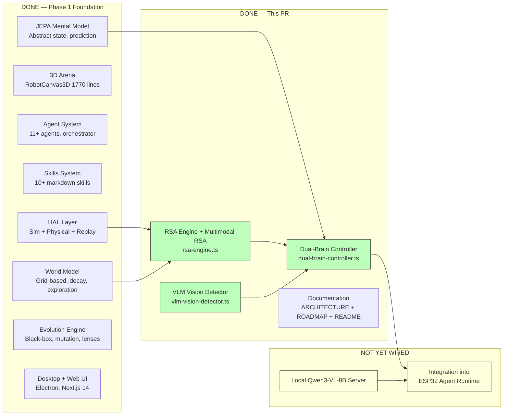
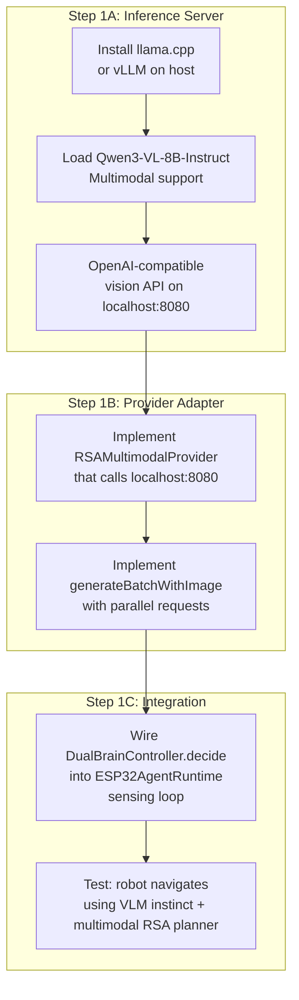
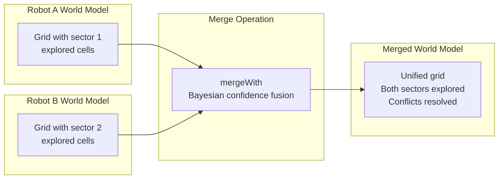
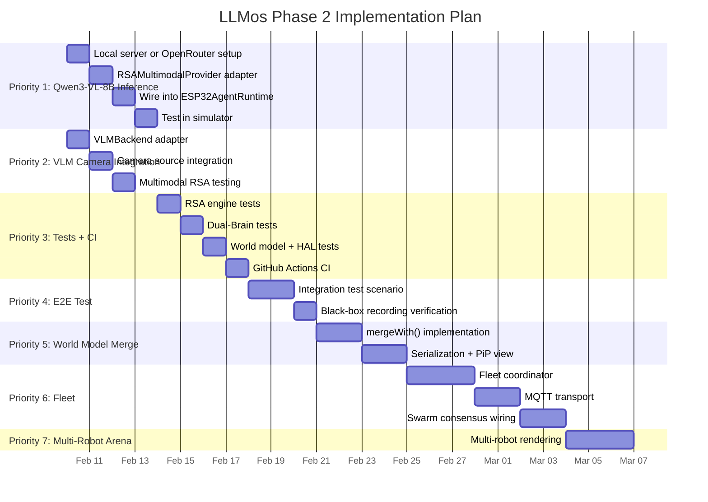

# NEXT-STEPS.md — LLMos Implementation Plan

**Date:** 2026-02-07
**Status:** Phase 1 (Foundation) complete. Phase 2 (Dual-Brain & Local Intelligence) starting.

---

## Current Project Status

### What's Built and Working



### Component Completion Matrix

| Component | File(s) | Status | Lines |
|-----------|---------|--------|-------|
| HAL Command Validator | `lib/hal/command-validator.ts` | Done | 500+ |
| HAL Tool Executor | `lib/hal/hal-tool-executor.ts` | Done | 369 |
| Simulation Adapter | `lib/hal/simulation-adapter.ts` | Done | — |
| Physical Adapter | `lib/hal/physical-adapter.ts` | Done | — |
| System Agent Orchestrator | `lib/system-agent-orchestrator.ts` | Done | 1200+ |
| Multi-Agent Validator | `lib/agents/multi-agent-validator.ts` | Done | 300+ |
| Agent Messenger | `lib/agents/agent-messenger.ts` | Done | 788 |
| Skill Parser | `lib/skill-parser.ts` | Done | 316 |
| World Model | `lib/runtime/world-model.ts` | Done | 808 |
| JEPA Mental Model | `lib/runtime/jepa-mental-model.ts` | Done | 617 |
| Robot4 Runtime | `lib/runtime/robot4-runtime.ts` | Done | 700+ |
| ESP32 Agent Runtime | `lib/runtime/esp32-agent-runtime.ts` | Done | 1240 |
| Camera Vision Model | `lib/runtime/camera-vision-model.ts` | Done (cloud) | — |
| Black-Box Recorder | `lib/evolution/black-box-recorder.ts` | Done | 600+ |
| Evolutionary Patcher | `lib/evolution/evolutionary-patcher.ts` | Done | — |
| 3D Arena | `components/canvas/RobotCanvas3D.tsx` | Done | 1770 |
| **RSA Engine + Multimodal RSA** | **`lib/runtime/rsa-engine.ts`** | **Done** | **700+** |
| **Dual-Brain Controller** | **`lib/runtime/dual-brain-controller.ts`** | **Done** | **601** |
| **VLM Vision Detector** | **`lib/runtime/vision/vlm-vision-detector.ts`** | **Done** | **280+** |
| **Vision Types + Utilities** | **`lib/runtime/vision/mobilenet-detector.ts`** | **Done** | **510** |
| Local Qwen3-VL-8B Inference | — | Not started | — |
| Dual-Brain ↔ Runtime wiring | — | Not started | — |
| World Model Merging | — | Not started | — |
| Fleet Coordinator | — | Not started | — |
| MQTT Transport | — | Not started | — |
| Unit Tests | `__tests__/` | ~15-20% coverage | 2 files |
| CI/CD | `.github/workflows/` | Not started | — |

---

## What Was Done in This PR

Two commits on `claude/review-code-ai-agents-OUOMc`:

### Commit 1: Code Review & Gap Analysis
- Mapped the article vision (Distributed World Models, Dual-Brain, Fleet Coordination) against every file in the codebase
- Identified 4 major gaps and concrete extension points
- Produced `docs/development/2026-02-07_code_review_next_steps.md`

### Commit 2: Dual-Brain Architecture Implementation
Three new runtime modules and complete documentation overhaul:

**RSA Engine + Multimodal RSA** (`lib/runtime/rsa-engine.ts`)
- Full [RSA algorithm](https://arxiv.org/html/2509.26626v1): population → subsample → aggregate → recurse
- 4 presets: `quick` (3s), `standard` (8s), `deep` (22s), `swarm` (6s)
- `planRobotAction()` with optional `imageBase64` for multimodal RSA
- `runWithImage()` — each RSA candidate independently analyzes the camera frame
- `VISION_AGGREGATION_PROMPT` for visual cross-referencing during aggregation
- `RSAMultimodalProvider` interface for VLM backends (Qwen3-VL-8B)
- `swarmConsensus()` for multi-robot world model merging

**Dual-Brain Controller** (`lib/runtime/dual-brain-controller.ts`)
- 3-layer decision cascade: reactive rules (<5ms) → VLM instinct (~200-500ms) → multimodal RSA planner (3-8s)
- 7 escalation conditions with per-condition RSA preset selection
- Plan caching (planner generates sequence, instinct executes step-by-step)
- Full metrics: brain attribution, latency tracking, escalation histograms

**VLM Vision Detector** (`lib/runtime/vision/vlm-vision-detector.ts`)
- Direct image → VisionFrame conversion via Qwen3-VL-8B
- Structured prompt for consistent VisionFrame JSON output
- OCR, spatial reasoning, unlimited object vocabulary
- `VLMBackend` interface for any OpenAI-compatible vision API

**Vision Types + Utilities** (`lib/runtime/vision/mobilenet-detector.ts`)
- `VisionFrame` structured JSON — the bridge between perception and cognition
- Depth estimation utilities and known object size constants
- Scene analysis (openings, blocked directions, floor visibility)

**Documentation** (all with Mermaid diagrams and paper links)
- `ARCHITECTURE.md` — New Dual-Brain section with 6 Mermaid diagrams
- `ROADMAP.md` — Revised Phase 2-4 with milestones, Gantt chart, success criteria
- `README.md` — Updated project description and research references

---

## Next Steps — Priority Ordered

### Priority 1: Wire the Dual-Brain to Qwen3-VL-8B (makes everything else work)



**What to do:**
1. Set up [llama.cpp](https://github.com/ggerganov/llama.cpp) or [vLLM](https://github.com/vllm-project/vllm) server with [Qwen3-VL-8B-Instruct](https://huggingface.co/Qwen/Qwen3-VL-8B-Instruct) (multimodal, ~8GB VRAM)
2. Create `lib/runtime/inference/local-vlm-provider.ts` implementing `RSAMultimodalProvider`
3. In `ESP32AgentRuntime`, replace the current single-LLM-call loop with `DualBrainController.decide()`
4. Test in simulator: set goal "explore room" → verify VLM instinct handles walls → verify multimodal RSA planner escalates on stuck
5. Alternative: use OpenRouter API (`qwen/qwen3-vl-8b-instruct`, $0.08/M input) for quick testing

**Why first:** Without this, the multimodal RSA engine and Dual-Brain controller are just interfaces. This step makes them run.

**Estimated effort:** 2-3 days
**Hardware needed:** Any GPU with 8GB+ VRAM (RTX 3060, RTX 4060, etc.) or OpenRouter API key

---

### Priority 2: Connect Camera Frames to VLM Vision Detector

**What to do:**
1. Create `VLMBackend` adapter that calls Qwen3-VL-8B via OpenAI-compatible vision API
2. Connect to camera source (webcam for desktop, ESP32-CAM stream for real robot)
3. Pipe base64-encoded frames through `VLMVisionDetector.processFrame()`
4. Feed `VisionFrame` output into `DualBrainController.decide()` context
5. Test multimodal RSA: verify that `planRobotAction()` with `imageBase64` produces better spatial reasoning than text-only

**Why second:** The Dual-Brain already works with sensor data alone. VLM vision adds rich scene understanding — object identification, OCR, depth estimation, and spatial reasoning from a single model.

**Estimated effort:** 2-3 days

---

### Priority 3: Unit Tests + CI

**What to do:**
1. Add test files:
   - `__tests__/lib/runtime/rsa-engine.test.ts` — population mechanics, consensus measurement, majority voting, early termination
   - `__tests__/lib/runtime/dual-brain-controller.test.ts` — escalation logic, reactive rules, plan caching
   - `__tests__/lib/runtime/vision/vlm-vision-detector.test.ts` — VisionFrame parsing, VLM response handling
   - `__tests__/lib/runtime/world-model.test.ts` — grid operations, exploration tracking, confidence decay
   - `__tests__/lib/hal/command-validator.test.ts` — safety rules, speed reduction, emergency stop
2. Create `.github/workflows/ci.yml`:
   ```yaml
   on: [pull_request]
   jobs:
     check:
       runs-on: ubuntu-latest
       steps:
         - uses: actions/checkout@v4
         - uses: actions/setup-node@v4
         - run: npm ci
         - run: npx tsc --noEmit
         - run: npm run lint
         - run: npm test
   ```

**Why third:** The code works but has no safety net. Tests prevent regressions as integration work proceeds.

**Estimated effort:** 3-4 days

---

### Priority 4: End-to-End Integration Test

**What to do:**
1. Create an integration test that runs entirely in the simulator:
   - Spawn robot in 3D arena with obstacles
   - Set goal: "Find and collect the red cube"
   - Verify instinct handles reactive obstacle avoidance (check brain=instinct decisions)
   - Verify planner escalates when robot gets stuck (check brain=planner decisions)
   - Verify world model updates as robot explores (check exploration progress increases)
   - Verify VisionFrame detections include obstacles near the robot
2. Record the full run with `BlackBoxRecorder` for replay analysis

**Why fourth:** This validates the entire pipeline from sensing to action. If this test passes, the core architecture works.

**Estimated effort:** 2-3 days

---

### Priority 5: World Model Merging (Enables Swarm)



**What to do:**
1. Add to `WorldModel` class in `lib/runtime/world-model.ts`:
   - `mergeWith(snapshot: WorldModelSnapshot, trustWeight: number): void` — Bayesian grid fusion
   - `toSerializable(): string` — JSON export for network transport
   - `static fromSerializable(json: string): WorldModel` — reconstruct from JSON
2. Merge rules:
   - Both `unknown` → stays `unknown`
   - One observed, one `unknown` → use observed value
   - Both observed, agree → increase confidence
   - Both observed, disagree → use higher confidence, reduce merged confidence
3. Add merged-model PiP view in `RobotWorldPanel.tsx`

**Why fifth:** This is the foundation for swarm intelligence (Phase 3). Once merging works, RSA swarm consensus can operate on real world model data.

**Estimated effort:** 3-4 days

---

### Priority 6: Fleet Communication (MQTT)

**What to do:**
1. Create `lib/hardware/fleet-coordinator.ts`:
   - Consume `FleetConfig` from `esp32-device-manager.ts` (currently defined but unused)
   - Implement `leader-follower` sync mode with heartbeat monitoring
   - Leader election via highest device uptime
2. Define message protocol:
   - `SNAPSHOT_SHARE` — world model snapshot from one robot
   - `TASK_ASSIGN` — leader assigns exploration sector
   - `HEARTBEAT` — alive signal with battery/position
   - `LEADER_ELECT` — election messages
3. Implement MQTT transport (ESP32 native via ESP-IDF, host via `mqtt.js`)
4. Wire `swarmConsensus()` from RSA engine to process incoming snapshots

**Why sixth:** Requires world model merging (Priority 5) and working Dual-Brain (Priority 1) first.

**Estimated effort:** 5-7 days

---

### Priority 7: Multi-Robot 3D Arena

**What to do:**
1. Extend `RobotCanvas3D.tsx` to render 2+ robots with distinct colors/labels
2. Show each robot's local world model PiP alongside the merged model
3. Visualize communication links between robots (lines/pulses)
4. Show fleet topology dashboard (leader, followers, health status)

**Estimated effort:** 3-4 days

---

### Priority 8: Aggregation-Aware RL (Advanced — Phase 4)

From [RSA paper Section 4](https://arxiv.org/html/2509.26626v1): Standard RL fine-tuning can *degrade* RSA performance because the model isn't trained to aggregate. The paper proposes augmenting training data with aggregation prompts.

**What to do:**
1. Collect robot planning scenarios from simulator runs (including camera frames)
2. Generate multimodal aggregation training data: problem + image + K candidate visual analyses
3. Fine-tune Qwen3-VL-8B with RLOO on mixed standard + aggregation prompts
4. Evaluate: compare multimodal RSA performance with base vs. aggregation-aware model

**Why last:** Requires working RSA pipeline (Priority 1), substantial training data, and GPU time. High impact but longer horizon.

**Estimated effort:** 2-3 weeks

---

## Implementation Timeline



---

## Architecture Decisions Made

| Decision | Choice | Rationale |
|----------|--------|-----------|
| Vision + Language model | **Qwen3-VL-8B-Instruct** | Unified multimodal model. Sees images directly. OCR in 32 languages. 131K context. $0.08/M on OpenRouter or run locally. |
| Reasoning strategy | **Multimodal RSA** | Paper proves K=2 already massive improvement. With VLM, RSA cross-references spatial observations across candidates. |
| Depth estimation | **VLM spatial reasoning** | Qwen3-VL-8B estimates depth from visual cues. Multimodal RSA improves accuracy by aggregating multiple estimates. |
| Instinct implementation | **Rule-based + VLM single-pass** | Rules for emergency (<5ms), VLM for nuanced visual decisions (~200-500ms). |
| Swarm consensus | **Multimodal RSA swarm mode** | Robot observations + camera frames are candidates in the population. VLM cross-references visual observations. |
| Inter-robot protocol | **MQTT** | Native ESP-IDF support, pub/sub fits swarm pattern, lightweight. |
| World model merge | **Bayesian confidence fusion** | Naturally handles varying sensor quality and temporal decay. |

## Architecture Decisions Still Needed

| Decision | Options | When Needed |
|----------|---------|-------------|
| Qwen3-VL-8B deployment | Local (llama.cpp/vLLM) vs OpenRouter cloud | Priority 1 (benchmark latency vs. cost) |
| Inference server | llama.cpp vs vLLM vs Ollama | Priority 1 (test which gives best multimodal batch throughput) |
| Camera source for ESP32 | ESP32-CAM stream vs USB webcam on host | Priority 2 (affects latency architecture) |
| Test framework for 3D sim | Jest + mock canvas vs headless Three.js | Priority 3 |
| MQTT broker | Mosquitto vs HiveMQ vs embedded | Priority 6 |

---

## Key Research Papers

| Paper / Model | Link | How We Use It |
|-------|------|---------------|
| Qwen3-VL-8B-Instruct | [huggingface.co](https://huggingface.co/Qwen/Qwen3-VL-8B-Instruct) | Unified vision-language backbone. Perceives images + reasons in one pass. |
| RSA: Recursive Self-Aggregation | [arxiv.org/html/2509.26626v1](https://arxiv.org/html/2509.26626v1) | Multimodal planner brain. Cross-references visual observations across candidates. |
| JEPA | [openreview.net](https://openreview.net/forum?id=BZ5a1r-kVsf) | Mental model. Predict-before-act paradigm for abstract state. |

---

## Files to Touch Next

These are the specific integration points for Priority 1 (wiring up the Dual-Brain with Qwen3-VL-8B):

| File | What to Do |
|------|-----------|
| **New:** `lib/runtime/inference/local-vlm-provider.ts` | Implement `RSAMultimodalProvider` calling local Qwen3-VL-8B server or OpenRouter |
| **Modify:** `lib/runtime/esp32-agent-runtime.ts` | Replace single-LLM-call loop with `DualBrainController.decide()` |
| **Modify:** `lib/evolution/black-box-recorder.ts` | Add `brainDecision` field to frame recording (which brain, latency, escalation) |
| **New:** `lib/runtime/inference/vlm-backend-adapter.ts` | Implement `VLMBackend` wrapping OpenAI-compatible vision API for `VLMVisionDetector` |
| **Modify:** `lib/runtime/world-model.ts` | Add `mergeWith()` method (~line 775) for Priority 5 |
| **Modify:** `lib/hardware/esp32-device-manager.ts` | Wire `FleetConfig` to actual fleet coordinator for Priority 6 |
