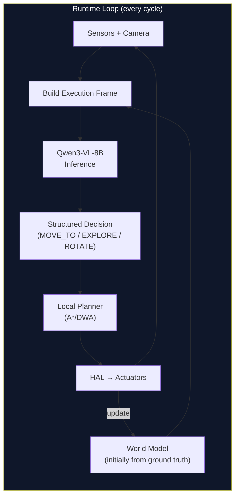
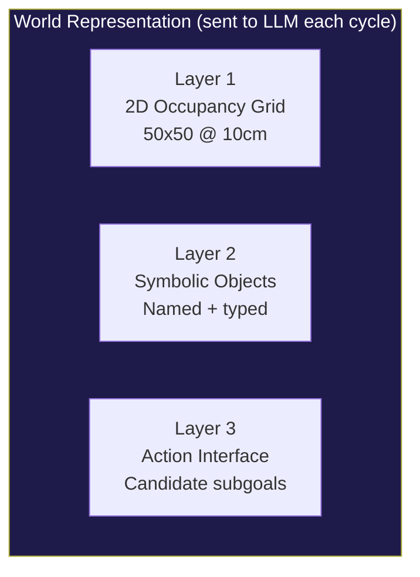
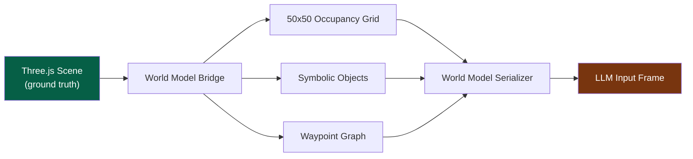
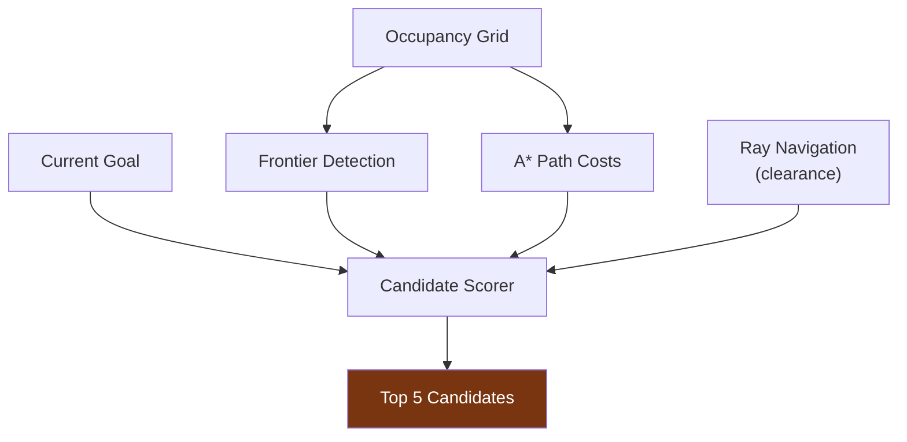
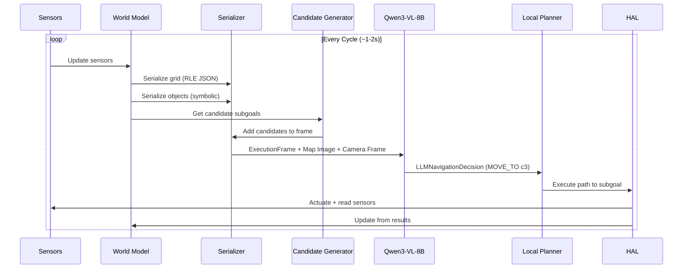
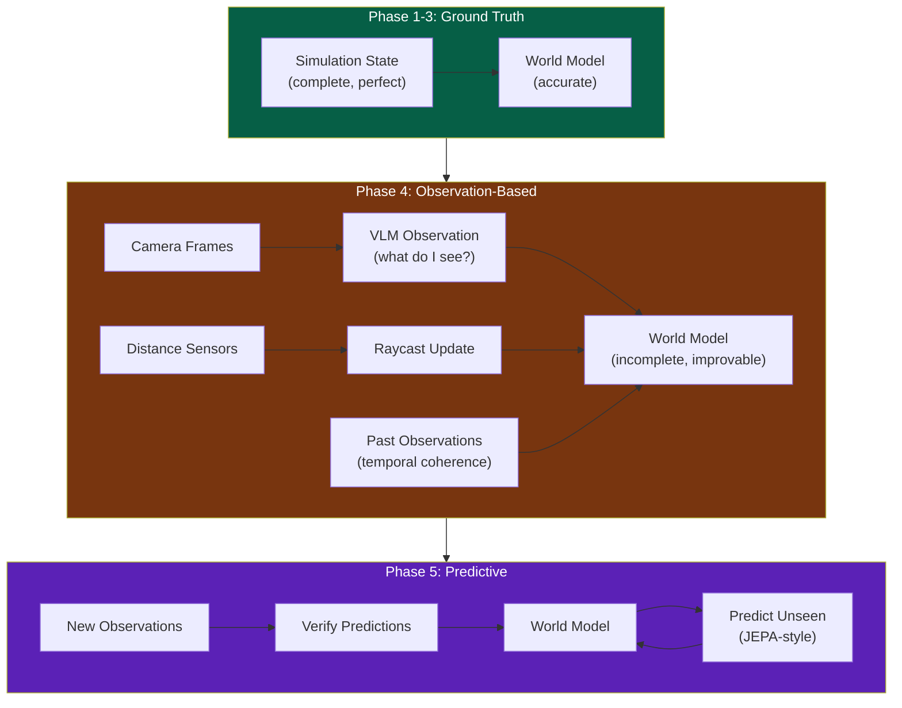

# LLMos — Next Steps: First Functional POC

> **STATUS: POC COMPLETE** — All 5 phases implemented and tested (346+ tests across 21 suites). The navigation stack works end-to-end with both mock and real LLM inference. V1 Stepper Cube Robot hardware layer is built. Next milestone: physical deployment.

**Goal**: A working end-to-end loop where a robot (simulated or physical) navigates a 5m x 5m arena using Qwen3-VL-8B as its runtime brain, receiving a structured world model each cycle and returning high-level navigation decisions — not raw motor commands.

**Core Architectural Decision**: The Runtime LLM receives an **internal world model** alongside sensor data and conversation history. This world model is initially built from ground-truth simulation state, but is designed from day one as an *incomplete, improvable* representation that future iterations will construct from observations alone.

---

## The Big Picture



**What the LLM is NOT doing**: generating motor PWM values, computing paths, managing PID loops.

**What the LLM IS doing**: choosing subgoals, selecting strategies, reasoning about the world model, explaining decisions, recovering from failures.

---

## Phase 0: World Model Serialization Layer

**Status**: DONE. All serialization formats implemented and tested in `lib/runtime/world-model-serializer.ts` (RLE JSON, ASCII grid, patch updates). Top-down map renderer in `lib/runtime/map-renderer.ts`. Candidate generator in `lib/runtime/candidate-generator.ts`.

### 0.1 Define the Hybrid World Representation

The world model sent to the VLM each cycle is a **hybrid** of three layers:



#### Layer 1: 2D Occupancy Grid (50x50 cells, 10cm resolution)

The existing `WorldModel` class already maintains this grid. We need to add serialization:

**File to create**: `lib/runtime/world-model-serializer.ts`

```typescript
// Three output formats from the same grid:

// Format A: Compact JSON with RLE encoding (primary, for structured reasoning)
interface GridSerializationJSON {
  frame: 'world';
  size_m: [number, number];     // [5.0, 5.0]
  resolution_m: number;         // 0.10
  origin_m: [number, number];   // [0.0, 0.0]
  occupancy_rle: string;        // Run-length encoded: "U:1200,F:1000,O:300"
  robot: { pose_m: [number, number]; yaw_deg: number };
  goal: { pose_m: [number, number]; tolerance_m: number };
}

// Format B: Top-down rendered image (for VLM visual reasoning)
// Black=obstacle, White=free, Gray=unknown, Green=robot, Red=goal
// Rendered as 500x500px PNG, fed as image input to Qwen3-VL-8B
interface GridSerializationImage {
  type: 'image/png';
  width: number;
  height: number;
  dataUrl: string;  // base64 PNG
}

// Format C: ASCII grid (for debugging and lightweight contexts)
// 25x25 downsampled: # obstacle, . free, ? unknown, R robot, G goal
interface GridSerializationASCII {
  type: 'ascii';
  grid: string;     // Multi-line ASCII art
  legend: string;
}
```

**Integration point**: `WorldModel.serialize(format: 'json' | 'image' | 'ascii')` method.

**Key design rule**: Never dump the full 2500-cell grid raw. Always use:
- RLE (run-length encoding) for JSON
- Patch updates ("cells changed since last step") for subsequent cycles
- Downsampling for ASCII

#### Layer 2: Symbolic Object Layer

The existing `SceneGraph` (`lib/runtime/scene-graph/`) already tracks objects, rooms, waypoints with semantic labels. We need to serialize it into a compact format for the LLM:

```typescript
interface SymbolicLayer {
  objects: Array<{
    id: string;
    type: string;        // 'table', 'wall', 'door', 'obstacle', 'collectible'
    bbox_m: [number, number, number, number]; // [x1, y1, x2, y2]
    label?: string;      // "charging_station", "exit_door"
  }>;
  topology: {
    waypoints: Array<{
      id: string;
      pos_m: [number, number];
      label: string;
    }>;
    edges: Array<{
      from: string;
      to: string;
      cost: number;
      status: 'clear' | 'blocked' | 'unknown';
    }>;
  };
  constraints: {
    keepout: Array<{ poly_m: [number, number][] }>;
    min_clearance_m: number;
  };
}
```

**Integration point**: `SceneGraph.serializeForLLM()` method.

#### Layer 3: Action Interface (Candidate Subgoals)

The LLM does NOT pick raw coordinates. It selects from a curated list of **candidates** generated by the classical planner:

```typescript
interface ActionInterface {
  candidates: Array<{
    id: string;
    type: 'subgoal' | 'frontier' | 'waypoint';
    pos_m: [number, number];
    score: number;       // Heuristic score (distance + clearance + novelty)
    note: string;        // Human-readable: "wide clearance path", "explore unknown"
  }>;
  last_step: {
    action: string;
    result: 'success' | 'blocked' | 'timeout' | 'collision';
    details: string;
  };
}
```

**Integration point**: A new `CandidateGenerator` that uses the `WorldModel` grid + `RayNavigation` to produce 3-5 ranked candidates each cycle.

### 0.2 LLM Output Schema (Constrained)

The LLM returns a strict JSON decision, never raw motor commands:

```typescript
interface LLMNavigationDecision {
  action: {
    type: 'MOVE_TO' | 'EXPLORE' | 'ROTATE_TO' | 'FOLLOW_WALL' | 'STOP';
    target_id?: string;         // Reference to a candidate ID
    target_m?: [number, number]; // Only if proposing a novel coordinate
    yaw_deg?: number;           // For ROTATE_TO
  };
  fallback: {
    if_failed: 'EXPLORE' | 'ROTATE_TO' | 'STOP';
    target_id?: string;
  };
  world_model_update?: {
    // LLM can suggest corrections to world model (advisory only)
    corrections: Array<{
      pos_m: [number, number];
      observed_state: 'free' | 'obstacle' | 'unknown';
      confidence: number;
    }>;
  };
  explanation: string;
}
```

**Key safety principle**: The LLM's world model corrections are **advisory**. The controller validates them against sensor data before applying. The LLM is a planner/narrator, not the ground truth.

---

## Phase 1: Ground-Truth World Model Pipeline

**Why start with ground truth**: We have a fully functional Three.js simulation with known positions of every wall, obstacle, and object. Using this as the initial world model lets us validate the entire LLM reasoning loop before tackling the much harder problem of building the world model from observations.

### 1.1 Simulation State Exporter

**File to create**: `lib/runtime/world-model-bridge.ts`

This module bridges the Three.js simulation state to the world model format:



**Tasks**:
1. Read `Robot4World` (walls, obstacles, beacons, lines, bounds) from `robot4-runtime.ts`
2. Rasterize wall segments and obstacle circles onto the 50x50 grid
3. Generate waypoint graph from free space (Voronoi diagram or grid-based sampling)
4. Register named objects from simulation (collectibles, dock zones, etc.)
5. Compute frontier cells (boundary between known and unknown — for exploration)
6. Feed all three layers into the serializer

### 1.2 Candidate Generator

**File to create**: `lib/runtime/candidate-generator.ts`

Each cycle, generate 3-5 candidate subgoals for the LLM to choose from:



Candidate types:
- **Goal-directed subgoals**: Points along the A* path to the goal, picking waypoints every ~1m
- **Frontier subgoals**: Boundaries of explored/unknown territory (for exploration)
- **Recovery subgoals**: Safe retreat positions when stuck or blocked
- **Waypoint subgoals**: Named waypoints from the topology graph

Scoring heuristic:
```
score = w_goal * (1 / distance_to_goal)
      + w_clearance * min_clearance_along_path
      + w_novelty * unexplored_cells_nearby
      + w_feasibility * (1 / path_cost)
```

### 1.3 Top-Down Map Renderer

**File to create**: `lib/runtime/map-renderer.ts`

Render the occupancy grid as a simple image for the VLM:

- 500x500 pixel PNG (or canvas-generated)
- Color scheme: Black=obstacle, White=free, Gray=unknown, Green dot=robot with heading arrow, Red dot=goal, Blue dots=candidates, Yellow=frontier
- Overlaid grid lines every 10 cells (1m markers)
- Robot's FOV cone rendered as translucent overlay

This image is the **primary visual input** alongside the camera frame. The VLM sees both the camera (egocentric view) and the map (allocentric view) simultaneously, enabling spatial reasoning that neither alone could support.

---

## Phase 2: Runtime LLM Integration Loop

### 2.1 Execution Frame Assembly

Connect the new world model serialization into the `ExecutionFrame` from `lib/runtime/execution-frame.ts`:



The `ExecutionFrame` sent to the LLM contains:
1. **Goal** (text)
2. **World model** (JSON: grid RLE + objects + topology + candidates)
3. **Map image** (top-down PNG)
4. **Camera frame** (current egocentric view)
5. **Last action result** (success/failure + details)
6. **History** (last 3-5 cycles, compact)
7. **Internal state** (mode, position, battery, confidence)

### 2.2 Dual-Brain Decision with World Model

Modify the `DualBrainController` to pass the world model to both brains:

**Instinct brain** (single-pass, ~200-500ms):
- Receives: camera frame + map image + compact JSON (position, goal, top 3 candidates, last result)
- Returns: quick selection from candidates or STOP
- Use case: normal navigation, no surprises

**Planner brain** (RSA, ~3-8s):
- Receives: full execution frame with all three world model layers
- Each RSA candidate independently reasons about the world model
- Aggregator cross-references multiple strategies
- Use case: stuck recovery, novel situations, exploration planning

**Escalation with world model context**:
- Stuck detection now checks the world model: if the same cells have been visited >3 times, escalate
- Frontier detection: if all nearby cells are explored and goal unreached, escalate to explore
- Confidence: if LLM output doesn't match world model expectations, escalate

### 2.3 Local Planner (Classical)

**File to create**: `lib/runtime/local-planner.ts`

The LLM chooses **where to go**. The local planner figures out **how to get there**:

```typescript
interface LocalPlannerConfig {
  algorithm: 'astar' | 'dwa' | 'simple_drive';
  max_planning_time_ms: number;
  replanning_distance_m: number;
  obstacle_inflation_cells: number;
}
```

For the POC, start with a simple approach:
1. A* on the occupancy grid from robot position to selected subgoal
2. Follow the path waypoint by waypoint
3. If path blocked, report failure back to LLM for replanning
4. Emergency stop if distance sensor < safety threshold

The classical planner is the **safety net**. Even if the LLM makes a questionable choice, the planner enforces collision-free paths and the HAL enforces motor limits.

---

## Phase 3: End-to-End Integration Test

### 3.1 Test Scenario: Navigate to Goal in Arena with Obstacles

```
Arena: 5m x 5m
Robot start: (0.5, 0.5), heading East
Goal: (4.0, 4.0)
Obstacles: 3 boxes at (2.0, 1.5), (2.5, 3.0), (3.5, 2.0)
Walls: Arena boundary
```

**Success criteria**:
1. Robot reaches within 30cm of goal
2. Zero collisions with obstacles or walls
3. LLM decisions are coherent (explanation matches action)
4. World model stays consistent across cycles
5. Total navigation time < 60 seconds (simulation)

### 3.2 Test Scenario: Explore Unknown Arena

```
Arena: 5m x 5m (initially unknown to robot, but ground truth feeds world model)
Robot start: (2.5, 2.5), heading North
Goal: Explore >80% of arena
Obstacles: Random 5 obstacles
```

**Success criteria**:
1. Robot explores >80% of cells
2. No repeated loops (stuck counter stays low)
3. Frontier-based exploration selects efficient targets
4. World model accuracy >90% compared to ground truth

### 3.3 Test Scenario: Recovery from Dead End

```
Arena: L-shaped corridor
Robot: Inside dead end
Goal: Far side of L-shape
```

**Success criteria**:
1. LLM recognizes dead end from world model
2. Escalates to planner brain
3. Plans multi-step retreat and re-route
4. Successfully navigates out and reaches goal

---

## Phase 4: Transition from Ground Truth to Observation-Based World Model

> This is the longer-term goal. The POC uses ground truth, but the architecture must support this transition cleanly.



The transition path:
1. **Phase 4a**: Replace ground-truth grid with sensor-only updates (existing `updateFromSensors` in `WorldModel`)
2. **Phase 4b**: Use VLM observations to populate the symbolic object layer (VLM sees "table" → add to scene graph)
3. **Phase 4c**: Use the `CognitiveWorldModel` subsystem to maintain temporal coherence (existing `temporal-coherence.ts`)
4. **Phase 4d**: Let the LLM's advisory corrections improve the model where sensors are ambiguous
5. **Phase 5**: JEPA-style prediction — predict what's in unseen cells based on patterns, then verify when observed

**The key abstraction**: The `WorldModelBridge` interface is identical whether the source is ground truth or observations. The LLM never knows the difference. This means the entire reasoning loop validated in Phases 1-3 works unchanged in Phase 4+.

---

## Implementation Order (Task Checklist)

### Sprint 1: World Model Serialization (foundation) — DONE

- [x] **`lib/runtime/world-model-serializer.ts`** — RLE encoding, JSON serialization, ASCII grid, patch updates
- [x] **`lib/runtime/map-renderer.ts`** — Top-down PNG rendering of occupancy grid (canvas-based)
- [x] **`lib/runtime/world-model-bridge.ts`** — Bridge from Three.js simulation state to world model
- [x] **`lib/runtime/candidate-generator.ts`** — Frontier detection + subgoal scoring + top-K selection
- [x] Add `WorldModel.serialize()` method that produces the hybrid 3-layer representation
- [x] Add `SceneGraph.serializeForLLM()` method for compact symbolic layer

### Sprint 2: LLM Integration Loop — DONE

- [x] **`lib/runtime/local-planner.ts`** — A* pathfinding on occupancy grid + waypoint following
- [x] **`lib/runtime/navigation-types.ts`** — LLM I/O schemas + validation
- [x] **`lib/runtime/navigation-loop.ts`** — Top-level cycle orchestrator with prompt assembly
- [x] Define and enforce strict output schema (`LLMNavigationDecision`) with JSON validation
- [x] Implement decision → local planner → HAL execution pipeline
- [x] Add world model update from execution results (mark cells as visited, update obstacle confidence)

### Sprint 3: Dual-Brain Integration — DONE

- [x] Modify `DualBrainController` to pass world model to both instinct and planner brains
- [x] Instinct prompt: compact world model (position + goal + top 3 candidates + last result)
- [x] Planner prompt: full execution frame with all three layers
- [x] Add world-model-aware escalation triggers (repeated cell visits, frontier exhaustion)
- [x] Wire RSA engine to use map image as multimodal input in aggregation

### Sprint 4: End-to-End Testing — DONE

- [x] Create test arena configurations (simple navigation, exploration, dead-end recovery, narrow corridor) in `lib/runtime/test-arenas.ts`
- [x] Build cycle-by-cycle execution logger (world model snapshot + LLM input/output each cycle)
- [x] Implement success criteria evaluation (goal reached, collision count, exploration %, coherence)
- [x] Run tests in simulation mode with mock LLM for CI — 346+ tests across 21 suites
- [x] CLI demo: `npx tsx scripts/run-navigation.ts` with --all, --live, --vision flags

### Sprint 5: Observation-Based & Predictive — DONE

- [x] Abstract `WorldModelBridge` into an interface that can be swapped (ground truth vs. observation)
- [x] **`lib/runtime/sensor-bridge.ts`** — VisionWorldModelBridge builds grid from VLM observations only
- [x] **`lib/runtime/vision-simulator.ts`** — GroundTruthVisionSimulator for testing without VLM
- [x] **`lib/runtime/vision-scene-bridge.ts`** — VisionFrame → SceneGraph projection
- [x] **`lib/runtime/predictive-world-model.ts`** — Phase 5 spatial heuristic predictions (wall continuation, corridor detection, open space expansion)
- [x] **`lib/runtime/fleet-coordinator.ts`** — Multi-robot fleet coordination + world model merging
- [x] **`lib/runtime/navigation-hal-bridge.ts`** — NavigationLoop → HAL execution bridge
- [x] **`lib/runtime/navigation-ui-bridge.ts`** — NavigationLoop → React UI state bridge
- [x] **`lib/runtime/openrouter-inference.ts`** — OpenRouter API adapter with vision + stats

### Sprint 6: V1 Hardware Layer — DONE

- [x] **`firmware/esp32-s3-stepper/esp32-s3-stepper.ino`** — ESP32-S3 stepper motor controller (UDP JSON, port 4210)
- [x] **`firmware/esp32-cam-mjpeg/esp32-cam-mjpeg.ino`** — ESP32-CAM MJPEG streamer (HTTP, port 80)
- [x] **`lib/hal/stepper-kinematics.ts`** — 28BYJ-48 motor math (4096 steps/rev, 217.3 steps/cm)
- [x] **`lib/hal/wifi-connection.ts`** — UDP transport layer (port 4210, 2s timeout, 3 retries)
- [x] **`lib/hal/firmware-safety-config.ts`** — Motor safety limits, host heartbeat, coil current
- [x] **`lib/hal/serial-protocol.ts`** — CRC-16 framing, sequence numbers, ack/retry

---

## Architecture Principles for the POC

1. **Controller is truth, LLM is advisory**. The occupancy grid is maintained by sensor fusion. The LLM can suggest corrections, but the controller validates them.

2. **Strict schemas everywhere**. The LLM input and output formats are fixed JSON schemas. Format drift kills reliability.

3. **The LLM picks strategy, classical planners execute**. MOVE_TO(target) → A* → PID → motors. The LLM never touches motor PWM.

4. **The world model is always incomplete**. Even with ground truth, we don't dump everything. We use RLE, patch updates, and candidate pre-filtering. This trains the architecture for the observation-based future.

5. **Dual input modality**. The VLM receives both the camera frame (egocentric, "what do I see right now") and the map image (allocentric, "where am I in the world"). This dual view is what makes VLM reasoning powerful for navigation.

6. **Fallbacks are deterministic**. If the LLM times out, the local planner continues on the last valid path. If the local planner fails, emergency stop. The robot is always safe.

7. **Every cycle is logged**. The black-box recorder captures the full execution frame + LLM response + actual outcome. This data feeds the evolution engine for agent improvement.

---

## Existing Code to Leverage

| Component | File | Status | POC Role |
|---|---|---|---|
| Occupancy Grid | `lib/runtime/world-model.ts` | Functional | Core grid, already 50x50 @ 10cm |
| Scene Graph | `lib/runtime/scene-graph/` | Functional | Symbolic layer source |
| Dual Brain | `lib/runtime/dual-brain-controller.ts` | Functional | Decision architecture |
| RSA Engine | `lib/runtime/rsa-engine.ts` | Functional | Planner brain with multimodal support |
| VLM Vision | `lib/runtime/vision/vlm-vision-detector.ts` | Functional | Camera frame analysis |
| JEPA Mental Model | `lib/runtime/jepa-mental-model.ts` | Functional | Action prediction (Phase 4+) |
| Ray Navigation | `lib/runtime/navigation/ray-navigation.ts` | Partial | Clearance scoring for candidates |
| HAL | `lib/hal/` | Functional | Unified sim/physical interface |
| Robot4 Runtime | `lib/runtime/robot4-runtime.ts` | Functional | Physics simulation, ground truth source |
| 3D Canvas | `components/robot/RobotCanvas3D.tsx` | Functional | Visualization, debugging |
| Execution Frame | `lib/runtime/execution-frame.ts` | New (types) | Frame structure for LLM input |
| LLM Bytecode | `lib/runtime/llm-bytecode.ts` | New (types) | Output frame validation |
| Black Box | `lib/evolution/black-box-recorder.ts` | Functional | Cycle logging for evolution |

---

---

## Phase 6: V1 Physical Hardware Deployment

> **Status**: Hardware layer built. Firmware written. Next: physical assembly and validation.

The LLMos codebase now includes a complete hardware specification — officially called **"Robot V1 — Stepper Cube Robot"** — with ESP32-S3 + ESP32-CAM + 28BYJ-48 steppers + 8cm cube chassis. The software-side is built. What remains is physical assembly, protocol validation, and connecting the TypeScript runtime to real hardware.

### 6.1 Physical Assembly & Kinematic Calibration

1. **3D print the "Stepper Cube" chassis** from `Agent_Robot_Model/Robot_one/`. The 8cm cube mounts the ESP32s, ULN2003 drivers, and motors.
2. **Mount the rear ball caster** — stepper motors have low torque, so reducing friction prevents wheel slip (which ruins dead-reckoning).
3. **Verify wheel dimensions** — the codebase hardcodes 6.0 cm wheel diameter (18.85 cm circumference) and 12.0 cm wheel base. If your wheels differ, use `{"cmd":"set_config","wheel_diameter_cm":F,"wheel_base_cm":F}` to calibrate.

### 6.2 Communication Protocol Deployment

1. **Flash ESP32-CAM** (`firmware/esp32-cam-mjpeg/esp32-cam-mjpeg.ino`) — serves HTTP MJPEG at `http://<IP>/stream` (320x240 @ 10fps). Validate in browser.
2. **Flash ESP32-S3** (`firmware/esp32-s3-stepper/esp32-s3-stepper.ino`) — UDP listener on port 4210. Validate with: `{"cmd":"move_cm","left_cm":10.0,"right_cm":10.0,"speed":500}` — robot should move forward exactly 10cm (~2173 steps).

### 6.3 Activating the LLMos Navigation Loop

1. **Configure IP bindings** — map ESP32-S3 and ESP32-CAM IP addresses in environment config.
2. **Test movement commands** — the runtime should compile VLM decisions into UDP commands like `{"cmd":"move_cm","left_cm":20.0,"right_cm":20.0,"speed":1024}`.
3. **Respect speed limits** — max speed is 1024 steps/s (~4.71 cm/s). Do not exceed or steppers will skip.

### 6.4 Closing the Loop with Spatial Memory (Odometry)

1. **Status polling** — continuously send `{"cmd":"get_status"}` to ESP32-S3. Returns exact step counts for dead-reckoning pose updates.
2. **Obstacle detection test** — place robot facing a wall. Camera detects wall → host LLM pauses → queries odometry → generates `{"cmd":"rotate_deg","degrees":90.0,"speed":1024}`.

---

## What Success Looks Like

A 30-second video of the Three.js simulation showing:

1. Robot starts in corner of 5x5m arena
2. Top-down map overlay shows the world model building in real-time
3. Candidate subgoals appear as colored dots
4. Robot selects a candidate, drives toward it, avoids obstacles
5. When stuck, the planner brain activates (visible UI indicator)
6. Robot reaches the goal
7. Console shows the LLM's explanations at each step

The same code, with the `WorldModelBridge` swapped from `SimulationBridge` to `SensorBridge`, will work on the physical ESP32 robot without changing the LLM reasoning loop.
