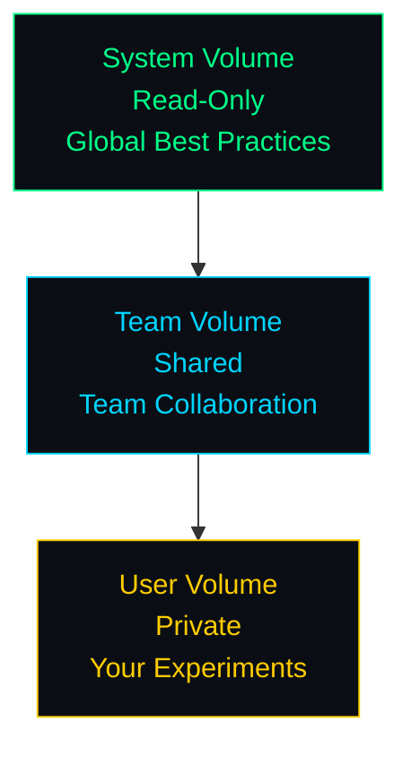
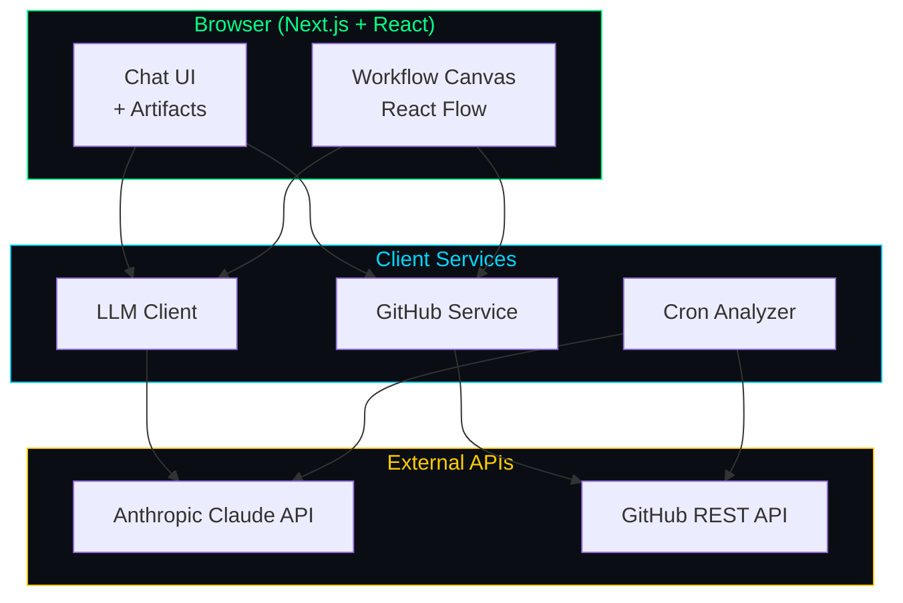

# LLMos-Lite

> **A Self-Improving AI Workbench with GitHub-Backed Context Memory**

LLMos-Lite transforms your GitHub commits into AI training data. Every session you create, every prompt you write, becomes context memory that evolves into reusable skills - automatically.

## Table of Contents

- [What Makes This Different](#what-makes-this-different)
- [Quick Start (5 Minutes)](#quick-start-5-minutes)
- [Key Features](#key-features)
- [How It Works](#how-it-works)
- [Project Structure](#project-structure)
- [Configuration](#configuration)
- [Developer Guide](#developer-guide)
- [Quick Reference](#quick-reference)
- [Troubleshooting](#troubleshooting)

---

## What Makes This Different

Traditional Git commits are for humans. **LLMos-Lite commits are for AI.**

```
session: Quantum Circuit Design

Prompt: Create a Bell state circuit with 2 qubits...

Stats:
- 8 messages
- 3 artifacts generated
- 5 traces executed

🤖 LLMunix Context Memory
```

**Your AI analyzes these commits → Detects patterns → Generates skills → You get smarter workflows**

---

## Quick Start (5 Minutes)

### Prerequisites

- Node.js 18+ and npm
- Anthropic API key ([Get one here](https://console.anthropic.com/))
- GitHub account (optional, for persistence)

### Setup

```bash
# 1. Navigate to the UI directory
cd llmos-lite/ui

# 2. Install dependencies
npm install

# 3. Configure environment
cp .env.local.example .env.local
```

### Get Your API Keys

#### Required: Anthropic API Key

Add your key during onboarding in the UI, or set it as an environment variable:

```bash
export ANTHROPIC_API_KEY=sk-ant-...
```

#### Optional: GitHub OAuth (for persistence)

1. **Create OAuth App** at [GitHub Developer Settings](https://github.com/settings/developers)
   - **Application name**: `LLMos-Lite Dev`
   - **Homepage URL**: `http://localhost:3000`
   - **Authorization callback URL**: `http://localhost:3000/api/auth/github/callback`

2. **Add credentials to `.env.local`**:
   ```env
   GITHUB_CLIENT_ID=your_github_client_id
   GITHUB_CLIENT_SECRET=your_github_client_secret
   NEXT_PUBLIC_GITHUB_CLIENT_ID=your_github_client_id
   NEXTAUTH_SECRET=$(openssl rand -base64 32)
   NEXTAUTH_URL=http://localhost:3000
   ```

### Run

```bash
npm run dev
```

Open [http://localhost:3000](http://localhost:3000)

### Try It Out

1. Complete onboarding (add Anthropic API key)
2. **Click "Try Now"** on quantum/3D sample prompts
3. Chat with AI, create sessions
4. **Connect GitHub** (right sidebar → GITHUB section)
5. **Commit Session** (right sidebar → ACTIONS)
6. **Run Evolution Cron** (left sidebar → CRONS → "Run Now")

---

## Key Features

### 1. Clickable Sample Prompts

No more copy-paste. Click **"Try Now"** to send quantum/3D prompts directly to chat.

### 2. GitHub Integration (Optional)

- **Real Git Commits**: Sessions → GitHub repos
- **Cross-Device Sync**: Access anywhere
- **Team Collaboration**: Shared team volumes
- **Context Memory**: Commits embed prompts for AI analysis

### 3. Intelligent Cron Analysis

- Analyzes your commit history
- Detects recurring patterns (e.g., "quantum circuits" × 5 times)
- **Auto-generates skills** from patterns
- Live countdown timers show next execution

### 4. Interactive Artifacts

- **Quantum Circuits**: Qiskit visualizations
- **3D Graphics**: Three.js renders
- **Data Plots**: Convergence graphs
- **Code Execution**: Python/JS in browser (WebAssembly)

### 5. Multi-Volume Architecture



---

## How It Works

### The Self-Improvement Loop

```mermaid
graph LR
    A[Day 1-7: You Work] --> B[Create Sessions]
    B --> C[Commit to GitHub]
    C --> D[Prompts Embedded]

    D --> E[Night 7: AI Evolves]
    E --> F[Cron Analyzes History]
    F --> G[Detects Patterns]
    G --> H[Generates Skills]

    H --> I[Day 8+: You Benefit]
    I --> J[Skills Auto-Loaded]
    J --> K[Better AI Guidance]
    K --> L[Faster Workflows]

    L -.->|Continuous Improvement| B

    style A fill:#0a0e14,stroke:#00ff88,color:#00ff88
    style E fill:#0a0e14,stroke:#00d4ff,color:#00d4ff
    style I fill:#0a0e14,stroke:#ffcc00,color:#ffcc00
```



#### Phase 1: You Work (Day 1-7)

- Create sessions (chat, code, analyze)
- Each session committed to GitHub
- Commit messages embed prompts + artifacts

#### Phase 2: AI Evolves (Night 7)

- Cron runs (or manual trigger)
- Fetches commit history from GitHub
- Extracts prompts: "quantum circuit" × 5
- LLM detects pattern (92% confidence)
- Generates skill: `quantum-circuit-design.md`

#### Phase 3: You Benefit (Day 8+)

- New skill auto-loaded in context
- AI gives better guidance
- Faster workflows

### Commit as Context Memory

Every commit you make:

```
session: VQE Optimization

Prompt: Create VQE circuit for H2 molecule...

Stats:
- 12 messages
- 3 artifacts: code, circuit, plot
- 8 traces executed

Artifacts:
- quantum-circuit: bell_state
- code: vqe_h2.py
- skill: quantum-optimization.md

🤖 LLMunix Context Memory
```

This structured format enables:
- **Pattern Detection**: "User created 5 quantum circuits → pattern"
- **Skill Generation**: "Generate skill from pattern"
- **Team Learning**: "Team created 20 API endpoints → team skill"

---

## Project Structure

```mermaid
graph TD
    A[llmos-lite/] --> B[ui/]
    A --> C[api/]
    A --> D[core/]
    A --> E[volumes/]

    B --> B1[components/]
    B --> B2[lib/]
    B --> B3[app/]

    B1 --> B1a[onboarding/<br/>Sample Prompts]
    B1 --> B1b[settings/<br/>GitHub Connection]
    B1 --> B1c[context/<br/>Commit Sessions]
    B1 --> B1d[panel1-volumes/<br/>Cron Timers]
    B1 --> B1e[chat/<br/>Main Interface]
    B1 --> B1f[panel3-artifacts/<br/>Visualizations]

    B2 --> B2a[github-auth.ts<br/>OAuth]
    B2 --> B2b[git-service.ts<br/>Git Ops]
    B2 --> B2c[cron-analyzer.ts<br/>Pattern Detection]
    B2 --> B2d[llm-client.ts<br/>LLM API]

    B3 --> B3a[api/auth/github/<br/>OAuth Callback]

    C --> C1[skills.py<br/>FastAPI Endpoints]
    C --> C2[sessions.py<br/>Session Management]
    C --> C3[chat.py<br/>Chat Proxy]

    D --> D1[volumes.py<br/>Git Storage]
    D --> D2[skills.py<br/>Skills Loader]
    D --> D3[evolution.py<br/>Pattern Detection]

    E --> E1[system/skills/<br/>Global Skills]
    E --> E2[teams/{id}/skills/<br/>Team Skills]
    E --> E3[users/{id}/<br/>User Data]

    E3 --> E3a[sessions/<br/>Session JSON]
    E3 --> E3b[skills/<br/>Auto-Generated]

    style A fill:#0a0e14,stroke:#00ff88,color:#00ff88
    style B fill:#0a0e14,stroke:#00d4ff,color:#00d4ff
    style C fill:#0a0e14,stroke:#ffcc00,color:#ffcc00
    style D fill:#0a0e14,stroke:#ff6b6b,color:#ff6b6b
    style E fill:#0a0e14,stroke:#a78bfa,color:#a78bfa
```

### Key Directories

#### `ui/` - Next.js Web App (THE MAIN EVENT)

- **`components/onboarding/`** - Sample prompts with "Try Now" buttons
- **`components/settings/`** - GitHub connection UI
- **`components/context/`** - Commit session functionality
- **`components/panel1-volumes/`** - Cron countdown timers
- **`lib/github-auth.ts`** - GitHub OAuth client
- **`lib/git-service.ts`** - Git operations via REST API
- **`lib/cron-analyzer.ts`** - AI pattern detection engine
- **`app/api/auth/github/`** - OAuth callback handler

#### `api/` - FastAPI Backend (Optional)

- **`skills.py`** - Skills CRUD endpoints
- **`sessions.py`** - Session management
- **`chat.py`** - Chat proxy with OpenRouter

#### `core/` - Python Backend Logic

- **`volumes.py`** - Git-backed storage
- **`skills.py`** - Skills loader
- **`evolution.py`** - Pattern detection

#### `volumes/` - Git Repositories (Auto-Created)

- **`system/skills/`** - Global skills
- **`teams/{id}/skills/`** - Team skills
- **`users/{id}/`** - User sessions + skills

---

## Configuration

### Environment Variables

#### UI (`.env.local`)

```env
# Required for chat (or set during onboarding)
ANTHROPIC_API_KEY=sk-ant-...

# Optional: GitHub Integration
GITHUB_CLIENT_ID=your_client_id
GITHUB_CLIENT_SECRET=your_secret
NEXT_PUBLIC_GITHUB_CLIENT_ID=your_client_id
NEXTAUTH_SECRET=$(openssl rand -base64 32)
NEXTAUTH_URL=http://localhost:3000
```

#### Backend (if using Python API)

```bash
export ANTHROPIC_API_KEY=sk-ant-...
export LLMOS_VOLUMES_PATH=./volumes
```

---

## Developer Guide

### System Architecture



**Key Components:**

- `lib/llm-client.ts` - Anthropic/OpenRouter client
- `lib/github-auth.ts` - OAuth flow
- `lib/git-service.ts` - Commit/fetch operations
- `lib/cron-analyzer.ts` - Pattern detection engine
- `contexts/SessionContext.tsx` - Session state management

### Adding Features

#### 1. Add a New Artifact Type

```typescript
// components/panel3-artifacts/ArtifactViewer.tsx

// Define type
type MyArtifact = {
  type: 'my-artifact';
  data: { /* your data */ };
};

// Add renderer
case 'my-artifact':
  return <MyArtifactRenderer data={artifact.data} />;
```

#### 2. Customize Evolution Pattern

```typescript
// lib/cron-analyzer.ts

// Adjust thresholds
CronAnalyzer.analyzeVolume(volume, {
  minOccurrences: 3,    // Pattern needs 3+ instances
  minConfidence: 0.85,   // 85% confidence required
});
```

#### 3. Add Custom Cron Job

```typescript
// components/panel1-volumes/CronList.tsx

const crons: CronJob[] = [
  {
    id: 'my-custom-cron',
    name: 'My Analysis',
    status: 'scheduled',
    nextRunSeconds: 3600,  // 1 hour
    intervalSeconds: 86400, // 24 hours
  },
  // ...
];
```

### Testing

```bash
# Run tests (when available)
npm test

# Type checking
npm run type-check

# Linting
npm run lint

# Build for production
npm run build
```

### UI Theme

**Terminal Color Palette:**

- **Background**: `#0a0e14` (dark)
- **Accent Green**: `#00ff88` (success, active)
- **Accent Blue**: `#00d4ff` (info)
- **Accent Yellow**: `#ffcc00` (warning)
- **Font**: JetBrains Mono (monospace)

---

## Quick Reference

| Want to... | Do this... |
|-----------|-----------|
| Start dev server | `cd llmos-lite/ui && npm run dev` |
| Try sample prompts | Onboarding wizard → "Try Now" |
| Connect GitHub | Right sidebar → GITHUB → "Connect" |
| Commit session | Right sidebar → ACTIONS → "Commit" |
| Run evolution | Left sidebar → CRONS → "Run Now" |
| Add API key | Settings (gear icon) |
| View artifacts | Chat panel → artifact previews |
| Check cron status | Left sidebar → countdown timers |

---

## Troubleshooting

### "OAuth popup blocked"

**Solution**: Allow popups for localhost in browser settings

### "Not authenticated with GitHub"

**Solutions**:
- Click "Connect with GitHub" in right sidebar
- Check `.env.local` has correct credentials
- Restart dev server after adding env vars

### "Commit failed"

**Solutions**:
- Check browser console for errors
- Verify GitHub token still valid
- Ensure repo exists and is accessible

### "No patterns detected"

**Solutions**:
- Need at least 2 similar sessions committed
- Check commit messages include prompts
- Try manually running cron with "Run Now"

### "Cron countdown stuck"

**Solution**: Refresh page (client-side timer resets) - this is expected behavior

---

## Security

### GitHub OAuth

- Client secret **never exposed** to browser
- OAuth callback handled server-side (Next.js API route)
- Access tokens stored in localStorage (client-side only)
- Private repos by default

### Execution Safety

- Python/JS code runs in browser via WebAssembly (Pyodide)
- Sandboxed execution environment
- No server-side code execution
- Resource limits enforced

---

## Roadmap

### ✅ Completed (v0.1)

- [x] Sample prompts with "Try Now" buttons
- [x] GitHub OAuth integration
- [x] Real Git commits with context
- [x] Cron countdown timers
- [x] AI pattern detection
- [x] Auto skill generation
- [x] Multi-volume architecture

### 🔄 In Progress (v0.2)

- [ ] React Flow workflow canvas
- [ ] Drag-and-drop node editor
- [ ] Real-time collaboration
- [ ] Mobile PWA

### 📋 Planned (v0.3)

- [ ] Vector DB for semantic skill search
- [ ] Skill marketplace
- [ ] Multi-LLM support (GPT-4, Gemini)
- [ ] Webhook integration for GitHub
- [ ] Advanced analytics dashboard

---

## Contributing

We welcome contributions! Here's how:

1. **Fork the repo**
2. **Create a feature branch**: `git checkout -b feature/my-feature`
3. **Make your changes** (follow existing code style)
4. **Test thoroughly** (ensure `npm run build` succeeds)
5. **Commit with context**: Use descriptive messages
6. **Push and create PR**

### Code Style

- TypeScript for UI code
- Functional React components
- Terminal-themed design
- Clear variable names
- Comments for complex logic

### Where to Contribute

- **New artifact types** (quantum, ML, data viz)
- **Evolution algorithms** (better pattern detection)
- **UI improvements** (mobile, accessibility)
- **Documentation** (tutorials, examples)
- **Tests** (unit, integration, E2E)

---

## Documentation

- **[ARCHITECTURE.md](./ARCHITECTURE.md)** - Technical deep-dive
- **[.env.local.example](./llmos-lite/ui/.env.local.example)** - Configuration template

---

## License

Apache 2.0

---

## Credits

Built on insights from the original `llmos` architecture, reimagined for the GitHub-native AI era.

**Core Innovation**: Treating Git commits as AI training data, enabling:
- Self-improving workflows
- Team knowledge sharing
- Automated skill evolution
- Zero-cost execution (browser-based)

---

## Getting Help

- **Issues**: [GitHub Issues](https://github.com/llmunix/llmos-lite/issues)
- **Discord**: (coming soon)
- **Docs**: See [ARCHITECTURE.md](./ARCHITECTURE.md) for technical details
- **Browser console**: Check for error messages

---

**Remember**: The more you use it, the smarter it gets. Commit early, commit often! 🚀
