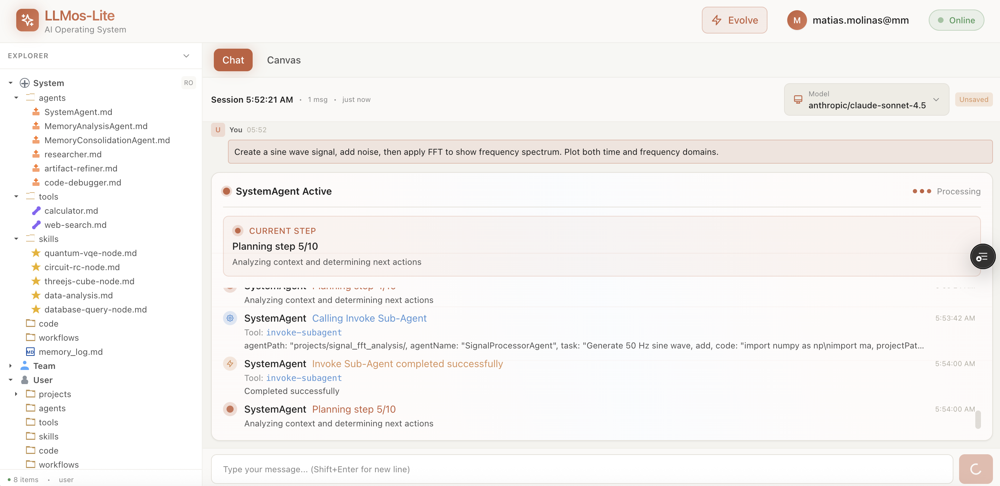

# LLMos-Lite 🚀

**An AI Operating System That Actually Learns**

LLMos-Lite is a self-evolving AI operating system that learns from every interaction, builds institutional knowledge, and gets smarter over time. Built for scientific computing, data science, and 3D visualization—all running in your browser.


### Agent Workflow in Action

Watch the SystemAgent orchestrate complex tasks through intelligent planning and sub-agent delegation:



*The Chat interface shows real-time agent execution with planning steps, sub-agent invocations, and progress tracking.*

### Canvas Visualization

View generated outputs directly in the Canvas tab with interactive visualizations:


*FFT analysis output showing time domain signal with noise and frequency domain spectrum—all generated and rendered in-browser.*

---

## 🆕 What's New

### 🎯 Infinite App Store - Generative UI (NEW!)

**The biggest update yet**: LLMos-Lite now generates **live, interactive React applets** on demand!

Instead of just returning text or files, when you ask for interactive tools, calculators, or explorers, the AI generates a **fully functional UI applet** that appears instantly in your interface.

```
You: "Build an interactive 3D surface plotter with sliders for x/y range and colormap selection"

SystemAgent:
🎨 Generating React applet...
✅ Compiling and validating...
🚀 Applet deployed to Applets panel!
📁 Project files saved to projects/surface_plotter/
```

**Key Features:**
- **Instant UI Generation**: Ask for any tool and get a working React component
- **Self-Healing Compilation**: Code is validated before deployment; errors auto-fixed
- **Persistent Files**: Applets saved as `.tsx` files you can modify and reuse
- **Complete Projects**: Every applet comes with source code, agents, and execution traces

**Try These Prompts:**
- "Build an interactive quantum circuit designer with drag-and-drop gates"
- "Create a signal analyzer with FFT visualization and adjustable parameters"
- "Make a color palette generator with hex/rgb conversion"

### Recent Updates

- **Multi-Step Agent Planning** - SystemAgent now shows detailed planning progress (e.g., "Planning step 5/10") with real-time status updates
- **Sub-Agent Orchestration** - Intelligent task delegation to specialized agents like `SignalProcessorAgent` for domain-specific tasks
- **Canvas Tab** - New dedicated visualization tab for viewing generated plots, images, and outputs with Code/Design toggle
- **Applets Panel** - New panel for live interactive React applets generated on demand
- **Enhanced File Explorer** - Improved sidebar with organized sections for System (agents, tools, skills), Team, and User volumes
- **Project Structure** - Auto-generated project folders with applets, components, memory, and output directories
- **Model Selection** - Choose from multiple LLM providers including Anthropic Claude models directly in the UI
- **Real-time Progress Tracking** - Visual indicators for agent status, processing state, and execution timeline

---

## 🎯 Main Goals

### 🧠 **Memory-Powered Intelligence**
Unlike traditional AI assistants that forget everything after each conversation, LLMos-Lite:
- **Learns from every execution** - Successful patterns become system knowledge
- **Queries past experiences** - Consults memory before planning new tasks
- **Improves over time** - Each run makes the next one better
- **Never forgets** - Persistent memory across all sessions

### 📁 **File-First Architecture**
Everything is **real files in persistent storage**, not chat artifacts:
- All outputs saved to organized project structures
- Complete file tree showing every file and folder
- Virtual file system with browser localStorage persistence
- Read-only system volume with immutable artifacts

### 🔄 **Self-Improving System**
The system doesn't stay static—it **evolves**:
- Memory system with short-term execution logs and long-term learnings
- Pattern recognition that identifies what works and what doesn't
- Continuous learning where every task updates system knowledge
- Compound intelligence that gets better with use

---

## 💻 What You Can Do Now

### 🎨 Generative UI - Infinite App Store (NEW!)
- **Interactive Applets**: Ask for any tool and get a live React component
- **Parameter Explorers**: Sliders, dropdowns, inputs for real-time parameter adjustment
- **Calculators & Converters**: Unit converters, formula calculators, data transformers
- **Visualizers**: Interactive plots, 3D explorers, data dashboards
- **Form Builders**: NDA generators, configuration wizards, data entry forms
- **Simulators**: Physics simulations, quantum circuits, signal processors

### Scientific Computing & Data Science
- **Signal Processing**: FFT analysis, filtering, spectrograms, wavelet transforms
- **Machine Learning**: Classification, regression, clustering with scikit-learn
- **Data Analysis**: Statistical analysis, time series forecasting with pandas
- **3D Visualization**: Surface plots, parametric curves, vector fields with matplotlib
- **Numerical Computing**: Solve differential equations, optimization, Monte Carlo simulations

### Interactive Development
- **Live Python Execution**: Code runs instantly in your browser via Pyodide
- **Live React Applets**: Dynamic React components compiled and rendered in-browser
- **Real-time Previews**: See matplotlib plots and applet results as you code
- **Canvas Visualization**: Dedicated tab for viewing generated plots with Code/Design views
- **Applets Panel**: Interactive UI components with state, controls, and persistence
- **File Management**: Full file tree with VFS storage and organized project structures
- **Code Editor**: Split-view with syntax highlighting and auto-execution
- **Agent Dashboard**: Real-time progress tracking with planning steps and execution timeline

### Available Libraries
**Python (WebAssembly via Pyodide):**
✅ numpy • scipy • matplotlib • pandas • scikit-learn • networkx • sympy

**React Applets (Browser-native):**
✅ React hooks • Tailwind CSS • Math/JSON APIs • Browser APIs

---

## 🚀 Quick Start

```bash
git clone https://github.com/EvolvingAgentsLabs/llmos.git
cd llmos/llmos-lite/ui
npm install
npm run dev
```

Open http://localhost:3000

**First Task Example:**
```
You: "Create a sine wave, add noise, then apply FFT to show the frequency spectrum"

SystemAgent:
📝 Creating project: signal_fft_analysis
📊 Generating Python code with scipy.fft
✅ Executing in browser...
📊 FFT peak detected at 50 Hz
📁 Saved to projects/signal_fft_analysis/output/
📝 Logged to memory for future learning

Your project is ready in the file tree!
```

---

## 🔮 What's Coming Next

### Near Future (Work in Progress)
- **Applet Library**: Save and reuse generated applets across sessions
- **Applet Sharing**: Export applets as standalone HTML files
- **Enhanced Memory System**: Visual memory browser and pattern visualization
- **Agent Evolution**: Agents that rewrite themselves based on success metrics
- **Three.js Runtime**: Interactive 3D graphics and animations in applets
- **Cross-Project Learning**: Share learnings between different projects
- **Session Replay**: Replay and analyze past executions

### Long-Term Vision
- **Self-Improving OS**: System that adapts to any technical domain you teach it
- **Research Accelerator**: Transform papers into implementations in minutes
- **Applet Marketplace**: Community-shared interactive tools and components
- **Community Knowledge**: Marketplace for sharing skills and agents
- **Multi-Language Support**: Extend beyond Python to JavaScript, R, Julia
- **Real-time Collaboration**: Multi-user sessions with shared memory

---

## 🏗️ Architecture Highlights

```
SystemAgent (Orchestrator)
    ├─ Memory System (/system/memory_log.md)
    │   ├─ Queries past experiences before planning
    │   └─ Records outcomes for continuous learning
    │
    ├─ Virtual File System (VFS)
    │   ├─ Browser localStorage persistence
    │   └─ Organized project structures
    │
    ├─ Python Runtime (Pyodide)
    │   ├─ Executes code in browser sandbox
    │   └─ Captures matplotlib plots as images
    │
    ├─ Applet Runtime (NEW!)
    │   ├─ Browser-side TSX transpilation via Babel
    │   ├─ Dynamic React component compilation
    │   ├─ Self-healing with compile-time validation
    │   └─ Scoped execution with React hooks + APIs
    │
    └─ File Tree UI
        ├─ System volume (read-only)
        ├─ Team volume (shared)
        └─ User volume (projects)
```

**Every execution creates:**
```
projects/[name]/
├── applets/              # React applet source files (.tsx)
├── components/
│   └── agents/           # Sub-agent definitions (.md)
├── tools/                # Custom tool definitions
├── skills/               # Skill nodes
├── output/
│   ├── code/             # Generated Python files
│   └── visualizations/   # Matplotlib plots
└── memory/
    ├── short_term/       # Execution traces
    └── long_term/        # Consolidated learnings
```

---

## 📚 Documentation

- **README.md** (this file) - Overview and quick start
- **llmos-lite/README.md** - Detailed feature documentation
- **llmos-lite/ARCHITECTURE.md** - Technical architecture
- **llmos-lite/LLMUNIX_COMPLETE.md** - Complete implementation guide

---

## 🤝 Contributing

LLMos-Lite is open source and actively developed. Contributions welcome!

**Areas for Contribution:**
- Domain packs for new fields (robotics, bioinformatics, finance)
- Memory algorithms and pattern recognition improvements
- New system tools and runtime capabilities
- UI/UX enhancements

See **llmos-lite/CONTRIBUTING.md** for guidelines.

---

## 📖 Philosophy

**Infinite App Store**
Don't download apps—describe what you need and the OS builds it. Every tool is generated on demand, compiled in real-time, and persisted for reuse.

**Text-In, Reality-Out**
Your words compile to code, UI, and visualizations. Input is natural language; output is working software.

**File-First, Browser-Native**
Inspired by Claude Code—files are the source of truth, everything is persistent, operations are transparent.

**Self-Evolving Intelligence**
Unlike static tools, learns from every execution and builds institutional knowledge.

**Domain-Ready, Not Domain-Specific**
Start with scientific computing, teach it your domain through use, watch it become fluent over time.

---

## 💬 Community

- **GitHub**: https://github.com/EvolvingAgentsLabs/llmos
- **Issues**: https://github.com/EvolvingAgentsLabs/llmos/issues
- **Discussions**: https://github.com/EvolvingAgentsLabs/llmos/discussions

---

## 📝 License

Apache 2.0 License - See LICENSE file for details

---

**Ready to build an AI that actually learns?** 🧠
**Ready for organized, persistent outputs?** 📁
**Ready for a system that gets smarter over time?** 📈

```bash
cd llmos-lite/ui
npm run dev
```

**Watch the system evolve.** 🚀
