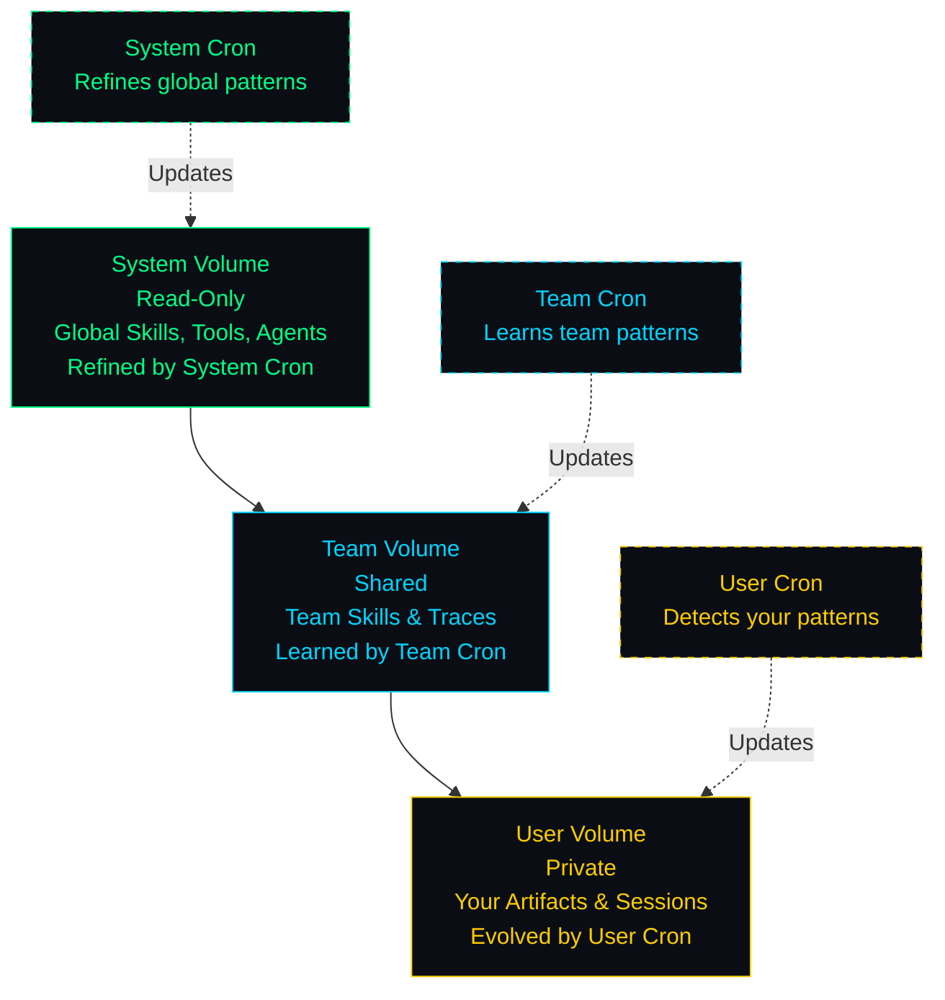
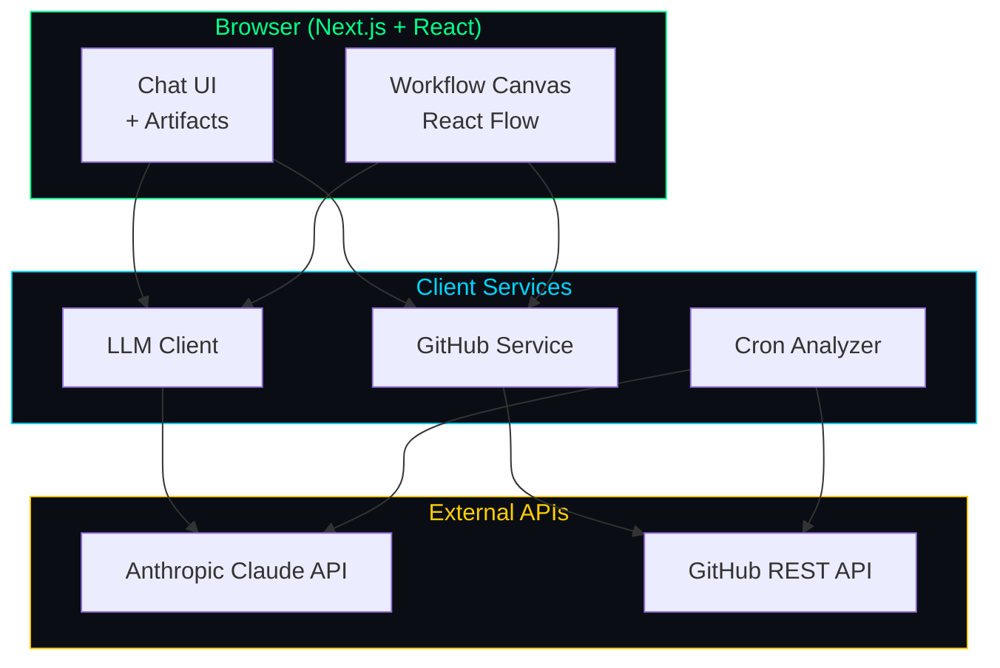

# LLMos-Lite

> **The Operating System for Professional Knowledge Work**

LLMos-Lite transforms your GitHub commits into AI training data. Every session you create, every prompt you write, becomes context memory that evolves into reusable methodologies - automatically.

**Works across industries**: Legal • Financial Services • Management Consulting • Biology Research • Robotics • Audit & Assurance • Software Development

## Table of Contents

- [What Makes This Different](#what-makes-this-different)
- [Quick Start (5 Minutes)](#quick-start-5-minutes)
- [Key Features](#key-features)
- [How It Works](#how-it-works)
- [Project Structure](#project-structure)
- [Configuration](#configuration)
- [Developer Guide](#developer-guide)
- [Quick Reference](#quick-reference)
- [Troubleshooting](#troubleshooting)

---

## What Makes This Different

**LLMos-Lite is a self-improving AI workbench that learns from your work.**

Your workspace (skills, agents, tools, traces) lives in GitHub repos. As you work, the system analyzes your patterns to auto-generate reusable skills - like an OS that evolves with you.

**Traditional Setup:**
```
You → Chat with AI → Session ends → Context lost
```

**LLMos-Lite:**
```
You → Chat → Generate artifacts → Commit to workspace
     → Crons analyze patterns → Auto-generate skills
     → Skills enhance future chats → Smarter over time
```

**Example workflow:**
1. You create 5 quantum circuit sessions (stored as traces)
2. User Cron detects pattern: "quantum circuits" (92% confidence)
3. Auto-generates skill: `quantum-circuit-design.md`
4. Next time you chat about quantum, AI has your skill loaded
5. Better suggestions, faster results

**Why GitHub volumes?**
- **Cross-device**: Your workspace syncs everywhere
- **Team learning**: Share team skills and patterns
- **Version control**: Full history of your AI's evolution
- **Collaboration**: Team crons learn from collective work

---

## Multi-Domain Knowledge Platform

**LLMos-Lite adapts to your industry**, not the other way around.

### How It Works Across Domains

The core insight: **Artifacts are not just deliverables—they're living memory of how to create them.**

Whether you're drafting legal contracts, analyzing financial models, or developing campaign strategies, the system:
1. **Learns your patterns** (contract clauses, valuation methods, messaging frameworks)
2. **Auto-generates playbooks** (reusable workflows specific to your domain)
3. **Evolves with your team** (collective intelligence that compounds over time)

### Industry Applications

| Industry | Workspace | Playbooks | AI Specialists | Example Use Case |
|----------|-----------|-----------|----------------|------------------|
| **Legal** | Matters | Legal Procedures | Legal Assistants | "Analyze M&A contract for red flags, generate term sheet" |
| **Financial** | Portfolios | Investment Strategies | Analysts | "DCF valuation for tech startup, sensitivity analysis" |
| **Consulting** | Engagements | Frameworks | Consultants | "Market sizing for SaaS product, competitive landscape" |
| **Biology** | Experiments | Research Protocols | Research Assistants | "CRISPR gene editing protocol, protein structure prediction" |
| **Robotics** | Projects | Control Strategies | Simulation Agents | "Path planning for autonomous drone, PID tuning" |
| **Audit** | Audits | Audit Procedures | Auditors | "Inventory testing, control deficiency documentation" |
| **Development** | Volumes | Skills | Agents | "Build quantum circuit simulator, optimize algorithm" |

### What Changes Per Industry

**UI & Language**
- Professional themes (not just terminal green)
- Domain-specific terminology (e.g., "Matter" for legal, "Portfolio" for finance)
- Industry-appropriate sample prompts

**Templates & Workflows**
- Pre-loaded methodologies from your field
- Industry-standard frameworks
- Firm-specific best practices

**AI Specialists**
- Legal assistants for contract review
- Financial analysts for valuation
- Research assistants for experiment design
- Simulation agents for robotics control
- Audit specialists for compliance testing

**See**: [DOMAIN_ANALYSIS.md](./DOMAIN_ANALYSIS.md) for detailed requirements by industry.

---

## Quick Start (5 Minutes)

### Prerequisites

- Node.js 18+ and npm
- OpenRouter API key ([Get one here](https://openrouter.ai/keys)) - Use any LLM (Claude, GPT-4, Gemini, etc.)
- GitHub account (recommended, for workspace persistence)

### Setup

```bash
# 1. Navigate to the UI directory
cd llmos-lite/ui

# 2. Install dependencies
npm install

# 3. (Optional) Configure GitHub OAuth for server-side token exchange
cp .env.local.example .env.local
# Edit .env.local with your GitHub OAuth credentials (see below)
```

### Get Your API Keys

#### Required: OpenRouter API Key

**LLMos-Lite uses OpenRouter**, giving you access to any LLM:
- Claude (Opus, Sonnet, Haiku)
- GPT-4 (Turbo, Vision)
- Gemini Pro
- Llama 3, Mistral, and more

**Setup during onboarding:**
1. Get your key at [openrouter.ai/keys](https://openrouter.ai/keys)
2. Open http://localhost:3000
3. Complete onboarding wizard
4. Enter your OpenRouter API key
5. Select your preferred default model

**Why OpenRouter?** One key, many models. Switch between Claude, GPT-4, and others without code changes.

#### Recommended: GitHub OAuth (for workspace persistence)

**Why connect GitHub?**
- **Persistent Volumes**: Your workspace (skills, tools, agents, traces) stored in GitHub repos
- **Cross-Device Access**: Work from anywhere
- **Team Collaboration**: Shared team volumes for collaboration
- **Learning System**: Crons analyze your commit history to auto-generate skills

**Setup (two options):**

**Option 1: Connect from UI (easiest)**
1. Open http://localhost:3000
2. Complete onboarding
3. Right sidebar → GITHUB section → "Connect with GitHub"
4. Authorize the app
5. Done! Your volumes are now backed by GitHub repos

**Option 2: Configure OAuth for local development**
1. **Create GitHub OAuth App** at [GitHub Developer Settings](https://github.com/settings/developers)
   - **Application name**: `LLMos-Lite Dev`
   - **Homepage URL**: `http://localhost:3000`
   - **Authorization callback URL**: `http://localhost:3000/api/auth/github/callback`

2. **Add credentials to `.env.local`**:
   ```env
   GITHUB_CLIENT_ID=your_github_client_id
   GITHUB_CLIENT_SECRET=your_github_client_secret
   NEXT_PUBLIC_GITHUB_CLIENT_ID=your_github_client_id
   NEXTAUTH_SECRET=$(openssl rand -base64 32)
   NEXTAUTH_URL=http://localhost:3000
   ```

**What gets stored in GitHub?**
- **User Volume**: `llmunix-user-{username}` - Your skills, agents, tools, session traces
- **Team Volume**: `llmunix-team-volumes` - Shared team artifacts
- **System Volume**: `llmunix/system-volumes` - Global templates (read-only)

### Run

```bash
npm run dev
```

Open [http://localhost:3000](http://localhost:3000)

### Try It Out

1. **Complete onboarding** (add OpenRouter API key, select model)
2. **Click "Try Now"** on quantum/3D sample prompts
3. **Chat with AI**, create sessions, generate artifacts
4. **Connect GitHub** (right sidebar → GITHUB section) to persist your workspace
5. **Commit Session** (right sidebar → ACTIONS) to save to GitHub
6. **Run Evolution Cron** (left sidebar → CRONS → "Run Now") to analyze patterns and generate skills

---

## Key Features

### 1. Clickable Sample Prompts

No more copy-paste. Click **"Try Now"** to send quantum/3D prompts directly to chat.

### 2. GitHub-Backed Workspace Volumes

- **Persistent Storage**: Skills, agents, tools, traces stored in GitHub repos
- **Learning System**: Crons analyze commit history to detect patterns
- **Cross-Device Access**: Your workspace available anywhere
- **Team Collaboration**: Shared team volumes for collective learning
- **Version Control**: Full history of artifacts and decisions

### 3. Intelligent Cron-Based Learning

- **User Cron**: Analyzes your personal workspace to detect your workflow patterns
- **Team Cron**: Identifies team-wide patterns across shared volumes
- **System Cron**: Refines global skills from collective usage
- **Auto-generates skills** from recurring patterns (>85% confidence)
- **Live countdown timers** show next evolution cycle

### 4. Interactive Artifacts with WebAssembly Execution

- **Quantum Circuits**: Qiskit code generation, visualization, and execution
- **3D Graphics**: Three.js interactive renders with executable code
- **Data Plots**: Matplotlib/Plotly visualizations with execution
- **Dual View Mode**: See both graphical output and generated code
- **Run Button**: Execute Python/JavaScript code directly in browser
- **Safe Execution**: Pyodide WebAssembly sandbox (no server needed)
- **Output Capture**: See stdout, stderr, results, and errors

### 5. Multi-Volume Workspace Architecture



**Each volume is a GitHub repository containing:**
- **Skills** (`skills/`) - Markdown documents with reusable workflows
- **Agents** (`agents/`) - Sub-agent definitions that run client-side with LLM access
- **Tools** (`tools/`) - Python/JavaScript tools that execute in browser via WebAssembly
- **Traces** (`traces/`) - Decision history, prompts, context, agent communication
- **Sessions** (`sessions/`) - Chat sessions with artifacts

**Tools and Agents execute client-side:**
- Tools: Python/JS code in markdown → Pyodide WebAssembly execution
- Agents: Can call LLMs and use tools autonomously
- Everything runs in your browser, nothing on our servers

---

## How It Works

### The Self-Improvement Loop

```mermaid
graph LR
    A[Day 1-7: You Work] --> B[Create Sessions]
    B --> C[Commit to GitHub]
    C --> D[Prompts Embedded]

    D --> E[Night 7: AI Evolves]
    E --> F[Cron Analyzes History]
    F --> G[Detects Patterns]
    G --> H[Generates Skills]

    H --> I[Day 8+: You Benefit]
    I --> J[Skills Auto-Loaded]
    J --> K[Better AI Guidance]
    K --> L[Faster Workflows]

    L -.->|Continuous Improvement| B

    style A fill:#0a0e14,stroke:#00ff88,color:#00ff88
    style E fill:#0a0e14,stroke:#00d4ff,color:#00d4ff
    style I fill:#0a0e14,stroke:#ffcc00,color:#ffcc00
```



#### Phase 1: You Work (Day 1-7)

- Create sessions, generate artifacts (skills, agents, tools)
- Commit to your User Volume (GitHub repo)
- Traces capture prompts, decisions, agent interactions

#### Phase 2: Cron Learns (Night 7)

- **User Cron** analyzes your commit history
- Extracts patterns from traces: "quantum circuit" × 5
- LLM detects pattern (92% confidence)
- Auto-generates skill: `quantum-circuit-design.md`
- Commits skill back to User Volume

#### Phase 3: You Benefit (Day 8+)

- New skill auto-loaded when you chat
- AI has better context and guidance
- Faster workflows, smarter suggestions
- Skill can be promoted to Team/System volumes

### Workspace Artifacts as Learning Data

**What gets stored in your GitHub volumes:**

```
volumes/
├── user-{username}/           # Your private workspace
│   ├── skills/                # Auto-generated from your patterns
│   │   └── quantum-vqe-optimization.md
│   ├── agents/                # Sub-agents you define
│   │   └── circuit-analyzer-agent.md
│   ├── tools/                 # Custom tools
│   │   └── qiskit-wrapper.py
│   ├── traces/                # Decision history & context
│   │   └── 2025-12-18-quantum-session.json
│   └── sessions/              # Chat sessions
│       └── vqe-h2-molecule.json
├── team-{id}/                 # Team shared workspace
│   └── skills/                # Team-learned patterns
└── system/                    # Global workspace (read-only)
    └── skills/                # Refined best practices
```

**Each trace captures:**
- User prompts and LLM responses
- Artifacts generated (skills, agents, tools)
- Decision context and reasoning
- Inter-agent communication

**Crons analyze traces to detect patterns:**
- **Pattern Detection**: "User created 5 quantum circuits → pattern detected"
- **Skill Generation**: "Generate reusable skill from pattern"
- **Team Learning**: "3 team members using similar workflow → promote to team skill"
- **System Evolution**: "Highly-used team skill → promote to system volume"

### Tools and Agents Execute in Browser

**Define a tool** (in `volumes/user-{username}/tools/calculator.md`):
```markdown
---
name: Calculator
description: Evaluate mathematical expressions
language: python
inputs:
  - name: expression
    type: string
    required: true
outputs:
  - name: result
    type: number
---

## Code

\`\`\`python
def main(expression):
    """Safely evaluate math expression"""
    import ast
    import operator

    # Safe operators only
    ops = {
        ast.Add: operator.add,
        ast.Sub: operator.sub,
        ast.Mult: operator.mul,
        ast.Div: operator.truediv,
    }

    # Parse and evaluate
    tree = ast.parse(expression, mode='eval')
    # ... safety checks ...
    return result
\`\`\`
```

**Define an agent** (in `volumes/user-{username}/agents/researcher.md`):
```markdown
---
name: Research Agent
description: Autonomous researcher with web search and analysis
model: anthropic/claude-sonnet-4.5
tools:
  - web-search
  - data-analyzer
  - report-generator
maxIterations: 10
---

## System Prompt

You are an expert research assistant. Use the available tools to:
1. Search for information
2. Analyze data
3. Generate comprehensive reports

When you need data, use \`\`\`tool blocks to call tools.
```

**Agent execution flow:**
1. User: "Research quantum computing trends"
2. Agent calls `web-search` tool → Gets articles
3. Agent calls `data-analyzer` tool → Extracts insights
4. Agent calls `report-generator` tool → Creates markdown report
5. Returns final report to user

All execution happens in your browser via WebAssembly!

---

## Project Structure

```mermaid
graph TD
    A[llmos-lite/] --> B[ui/]
    A --> C[api/]
    A --> D[core/]
    A --> E[volumes/]

    B --> B1[components/]
    B --> B2[lib/]
    B --> B3[app/]

    B1 --> B1a["onboarding/
    Sample Prompts"]
    B1 --> B1b["settings/
    GitHub Connection"]
    B1 --> B1c["context/
    Commit Sessions"]
    B1 --> B1d["panel1-volumes/
    Cron Timers"]
    B1 --> B1e["chat/
    Main Interface"]
    B1 --> B1f["panel3-artifacts/
    Visualizations"]

    B2 --> B2a["github-auth.ts
    OAuth"]
    B2 --> B2b["git-service.ts
    Git Ops"]
    B2 --> B2c["cron-analyzer.ts
    Pattern Detection"]
    B2 --> B2d["llm-client.ts
    LLM API"]

    B3 --> B3a["api/auth/github/
    OAuth Callback"]

    C --> C1["skills.py
    FastAPI Endpoints"]
    C --> C2["sessions.py
    Session Management"]
    C --> C3["chat.py
    Chat Proxy"]

    D --> D1["volumes.py
    Git Storage"]
    D --> D2["skills.py
    Skills Loader"]
    D --> D3["evolution.py
    Pattern Detection"]

    E --> E1["system/skills/
    Global Skills"]
    E --> E2["teams/ID/skills/
    Team Skills"]
    E --> E3["users/ID/
    User Data"]

    E3 --> E3a["sessions/
    Session JSON"]
    E3 --> E3b["skills/
    Auto-Generated"]

    style A fill:#0a0e14,stroke:#00ff88,color:#00ff88
    style B fill:#0a0e14,stroke:#00d4ff,color:#00d4ff
    style C fill:#0a0e14,stroke:#ffcc00,color:#ffcc00
    style D fill:#0a0e14,stroke:#ff6b6b,color:#ff6b6b
    style E fill:#0a0e14,stroke:#a78bfa,color:#a78bfa
```



### Key Directories

#### `ui/` - Next.js Web App (THE MAIN EVENT)

- **`components/onboarding/`** - Sample prompts with "Try Now" buttons
- **`components/settings/`** - GitHub connection UI
- **`components/context/`** - Commit session functionality
- **`components/panel1-volumes/`** - Cron countdown timers
- **`lib/github-auth.ts`** - GitHub OAuth client
- **`lib/git-service.ts`** - Git operations via REST API
- **`lib/cron-analyzer.ts`** - AI pattern detection engine
- **`app/api/auth/github/`** - OAuth callback handler

#### `api/` - FastAPI Backend (Optional)

- **`skills.py`** - Skills CRUD endpoints
- **`sessions.py`** - Session management
- **`chat.py`** - Chat proxy with OpenRouter

#### `core/` - Python Backend Logic

- **`volumes.py`** - Git-backed storage
- **`skills.py`** - Skills loader
- **`evolution.py`** - Pattern detection

#### `volumes/` - Git Repositories (Auto-Created)

**User Volume** (`llmunix-user-{username}` GitHub repo):
- `skills/` - Auto-generated skills from your patterns
- `agents/` - Sub-agent definitions
- `tools/` - Custom tool implementations
- `traces/` - Decision history, prompts, context
- `sessions/` - Chat sessions with artifacts

**Team Volume** (`llmunix-team-volumes` GitHub repo):
- `skills/` - Team-learned patterns
- `agents/` - Shared team agents
- `tools/` - Team tools
- `traces/` - Cross-team collaboration history

**System Volume** (`llmunix/system-volumes` GitHub repo, read-only):
- `skills/` - Global best practices
- `agents/` - System agents
- `tools/` - Core tools

---

## Configuration

### Environment Variables

#### UI (`.env.local`) - Optional for Local Development

```env
# GitHub OAuth (for server-side token exchange)
# Users can also connect via UI without these
GITHUB_CLIENT_ID=your_client_id
GITHUB_CLIENT_SECRET=your_client_secret
NEXT_PUBLIC_GITHUB_CLIENT_ID=your_client_id
NEXTAUTH_SECRET=$(openssl rand -base64 32)
NEXTAUTH_URL=http://localhost:3000
```

**Note:** Users configure their OpenRouter API key during onboarding in the UI. No server-side API keys needed.

#### Backend (if using Python API)

```bash
# Users provide their own keys via UI
# Backend doesn't store keys
export LLMOS_VOLUMES_PATH=./volumes
```

---

## Developer Guide

### System Architecture



**Key Components:**

- `lib/llm-client.ts` - OpenRouter client (supports Claude, GPT-4, Gemini, etc.)
- `lib/github-auth.ts` - GitHub OAuth flow for workspace persistence
- `lib/git-service.ts` - Git operations (commit artifacts, fetch traces)
- `lib/cron-analyzer.ts` - Pattern detection and skill generation engine
- `contexts/SessionContext.tsx` - Session and artifact state management

### Adding Features

#### 1. Add a New Artifact Type

```typescript
// components/panel3-artifacts/ArtifactViewer.tsx

// Define type
type MyArtifact = {
  type: 'my-artifact';
  data: { /* your data */ };
};

// Add renderer
case 'my-artifact':
  return <MyArtifactRenderer data={artifact.data} />;
```

#### 2. Customize Evolution Pattern

```typescript
// lib/cron-analyzer.ts

// Adjust thresholds
CronAnalyzer.analyzeVolume(volume, {
  minOccurrences: 3,    // Pattern needs 3+ instances
  minConfidence: 0.85,   // 85% confidence required
});
```

#### 3. Add Custom Cron Job

```typescript
// components/panel1-volumes/CronList.tsx

const crons: CronJob[] = [
  {
    id: 'my-custom-cron',
    name: 'My Analysis',
    status: 'scheduled',
    nextRunSeconds: 3600,  // 1 hour
    intervalSeconds: 86400, // 24 hours
  },
  // ...
];
```

### Testing

```bash
# Run tests (when available)
npm test

# Type checking
npm run type-check

# Linting
npm run lint

# Build for production
npm run build
```

### UI Theme

**Terminal Color Palette:**

- **Background**: `#0a0e14` (dark)
- **Accent Green**: `#00ff88` (success, active)
- **Accent Blue**: `#00d4ff` (info)
- **Accent Yellow**: `#ffcc00` (warning)
- **Font**: JetBrains Mono (monospace)

---

## Quick Reference

| Want to... | Do this... |
|-----------|-----------|
| Start dev server | `cd llmos-lite/ui && npm run dev` |
| Try sample prompts | Onboarding wizard → "Try Now" |
| Connect GitHub | Right sidebar → GITHUB → "Connect" |
| Commit session | Right sidebar → ACTIONS → "Commit" |
| Run evolution | Left sidebar → CRONS → "Run Now" |
| Add API key | Settings (gear icon) |
| View artifacts | Chat panel → artifact previews |
| Check cron status | Left sidebar → countdown timers |

---

## Troubleshooting

### "OAuth popup blocked"

**Solution**: Allow popups for localhost in browser settings

### "Not authenticated with GitHub"

**Solutions**:
- Click "Connect with GitHub" in right sidebar
- Check `.env.local` has correct credentials
- Restart dev server after adding env vars

### "Commit failed"

**Solutions**:
- Check browser console for errors
- Verify GitHub token still valid
- Ensure repo exists and is accessible

### "No patterns detected"

**Solutions**:
- Need at least 2 similar sessions committed
- Check commit messages include prompts
- Try manually running cron with "Run Now"

### "Cron countdown stuck"

**Solution**: Refresh page (client-side timer resets) - this is expected behavior

---

## Security

### GitHub OAuth

- Client secret **never exposed** to browser
- OAuth callback handled server-side (Next.js API route)
- Access tokens stored in localStorage (client-side only)
- Private repos by default

### Zero-Trust Data Architecture

**Your data never touches our servers:**
- **OpenRouter API calls**: Browser → OpenRouter (direct)
- **GitHub operations**: Browser → GitHub (direct)
- **Session storage**: Browser localStorage only
- **Workspace volumes**: Your GitHub repos only
- **Code execution**: Browser WebAssembly only

We cannot see:
- Your OpenRouter API key
- Your chat sessions
- Your workspace artifacts
- Your GitHub data
- Your tool/agent execution

### WebAssembly Execution Safety

**All code runs in your browser:**
- **Python**: Pyodide (Python 3.11 in WebAssembly)
- **JavaScript**: Sandboxed execution context
- **No file system access**: Cannot read/write files
- **No network access**: Except explicit fetch() calls
- **Resource limits**: 30-second timeout, memory limits
- **Output capture**: Separate stdout/stderr streams

---

## Roadmap

### ✅ Completed (v0.1)

- [x] Sample prompts with "Try Now" buttons
- [x] GitHub OAuth integration
- [x] Real Git commits with context
- [x] Cron countdown timers
- [x] AI pattern detection
- [x] Auto skill generation
- [x] Multi-volume architecture
- [x] **WebAssembly code execution** - Python via Pyodide, JavaScript sandboxed
- [x] **Artifact execution** - Run generated quantum/3D/plot code in browser
- [x] **Tool execution system** - Parse and execute tools from markdown
- [x] **Agent execution engine** - Sub-agents with LLM + tool access

### ✅ Completed (v0.2)

- [x] **Auto-load tools/agents/skills from GitHub volumes** - VolumeLoader system
- [x] **Agent communication protocol** - Inter-agent messaging and task delegation
- [x] **Skill execution engine** - Skills that orchestrate tools and agents
- [x] **Multi-agent collaboration** - Agents can delegate tasks to other agents
- [x] **Workflow parsing** - Parse skill workflows from markdown (tools, agents, LLM calls, conditionals, loops)

### ✅ Completed (v0.3 - Domain Adaptation)

- [x] **Multi-domain analysis** - Requirements for legal, financial, consulting, biology, robotics, audit domains
- [x] **Theme system** - Configurable themes (Terminal, Professional, Financial) with light/dark modes
- [x] **Terminology system** - Domain-specific language (Matters, Portfolios, Engagements, Experiments, Projects, etc.)
- [x] **Industry onboarding** - Select industry, auto-configure theme and terminology
- [x] **Integrated industry selection** - Industry selector as first onboarding step
- [x] **Professional theme CSS** - ThemeProvider with dynamic CSS variable application
- [x] **Domain-specific sample prompts** - 3 curated prompts per industry (24 total)
- [x] **Industry template library** - Pre-configured skills, tools, agents for each domain

### ✅ Completed (v0.4 - Collaboration & Scale)

- [x] **Real-time collaboration** - WebSocket-based synchronization across users and devices
- [x] **Mobile PWA** - Progressive Web App with offline support, service workers, and install prompts
- [x] **Vector DB for semantic search** - Embedding-based skill discovery with cosine similarity
- [x] **Skill marketplace** - Community sharing, ratings, versioning, and dependency management
- [x] **GitHub webhook integration** - Automated reindexing, evolution triggers, and notifications
- [x] **Advanced analytics dashboard** - Usage metrics, trends, and evolution insights

**See**: [V0.4_FEATURES.md](./V0.4_FEATURES.md) for comprehensive documentation.

### 📋 Planned (v0.5)

- [ ] Operational Transform for concurrent editing
- [ ] Voice/video chat integration
- [ ] Advanced vector backends (Pinecone, Weaviate)
- [ ] Marketplace payments and revenue sharing
- [ ] Predictive analytics with ML
- [ ] Mobile native apps (React Native)
- [ ] Desktop apps (Electron)

---

## Contributing

We welcome contributions! Here's how:

1. **Fork the repo**
2. **Create a feature branch**: `git checkout -b feature/my-feature`
3. **Make your changes** (follow existing code style)
4. **Test thoroughly** (ensure `npm run build` succeeds)
5. **Commit with context**: Use descriptive messages
6. **Push and create PR**

### Code Style

- TypeScript for UI code
- Functional React components
- Terminal-themed design
- Clear variable names
- Comments for complex logic

### Where to Contribute

- **New artifact types** (quantum, ML, data viz)
- **Evolution algorithms** (better pattern detection)
- **UI improvements** (mobile, accessibility)
- **Documentation** (tutorials, examples)
- **Tests** (unit, integration, E2E)

---

## Documentation

- **[ARCHITECTURE.md](./ARCHITECTURE.md)** - Technical deep-dive
- **[.env.local.example](./llmos-lite/ui/.env.local.example)** - Configuration template

---

## License

Apache 2.0

---

## Credits

Built on insights from the original `llmos` architecture, reimagined for the GitHub-native AI era.

**Core Innovation**: Treating Git commits as AI training data, enabling:
- Self-improving workflows
- Team knowledge sharing
- Automated skill evolution
- Zero-cost execution (browser-based)

---

## Getting Help

- **Issues**: [GitHub Issues](https://github.com/llmunix/llmos-lite/issues)
- **Discord**: (coming soon)
- **Docs**: See [ARCHITECTURE.md](./ARCHITECTURE.md) for technical details
- **Browser console**: Check for error messages

---

**Remember**: The more you use it, the smarter it gets. Commit early, commit often! 🚀
