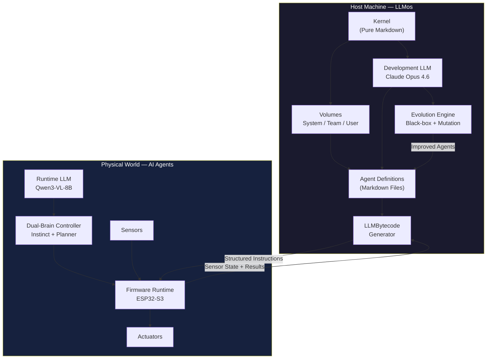
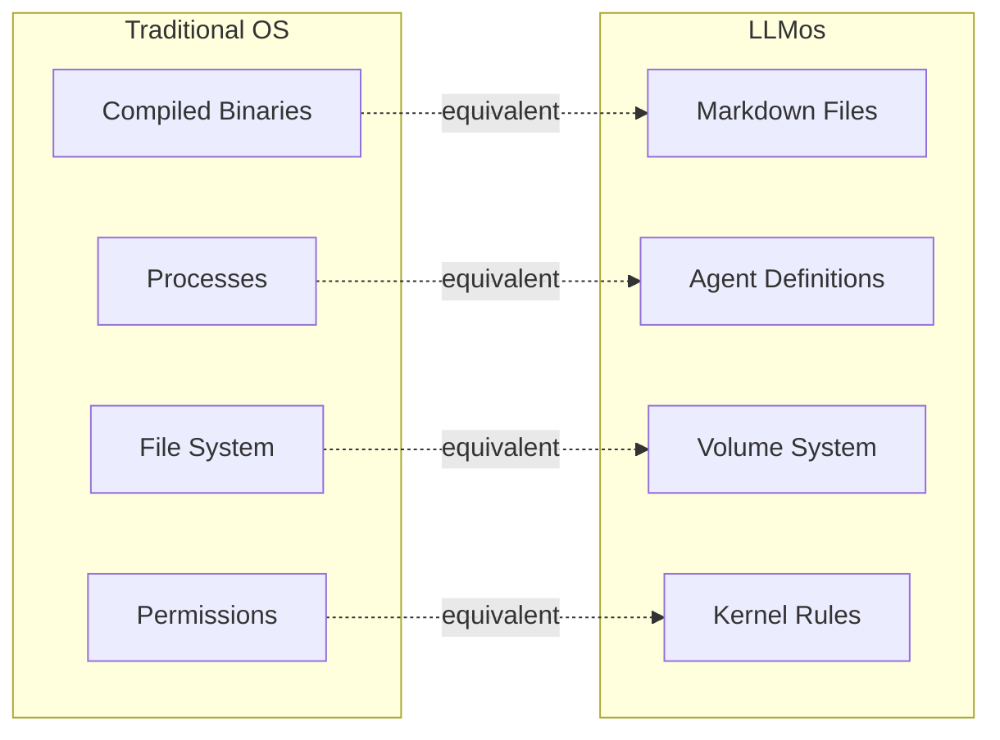
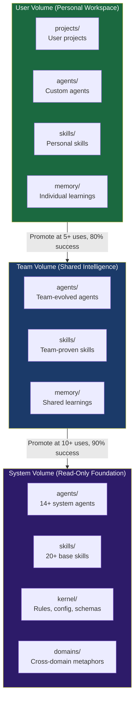
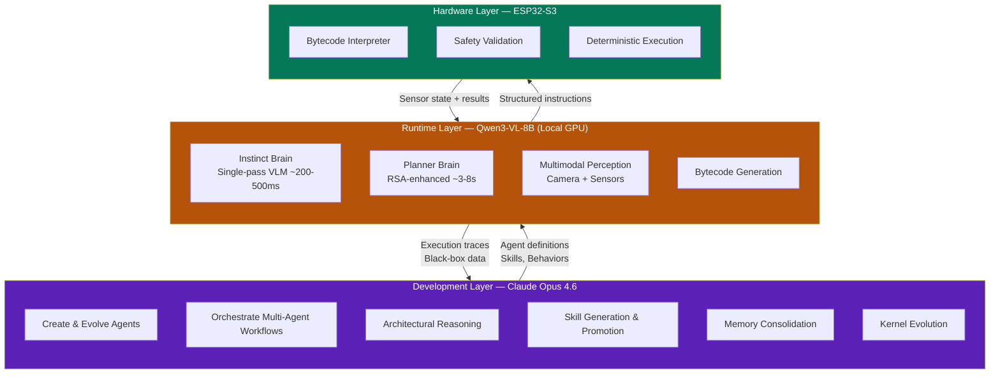
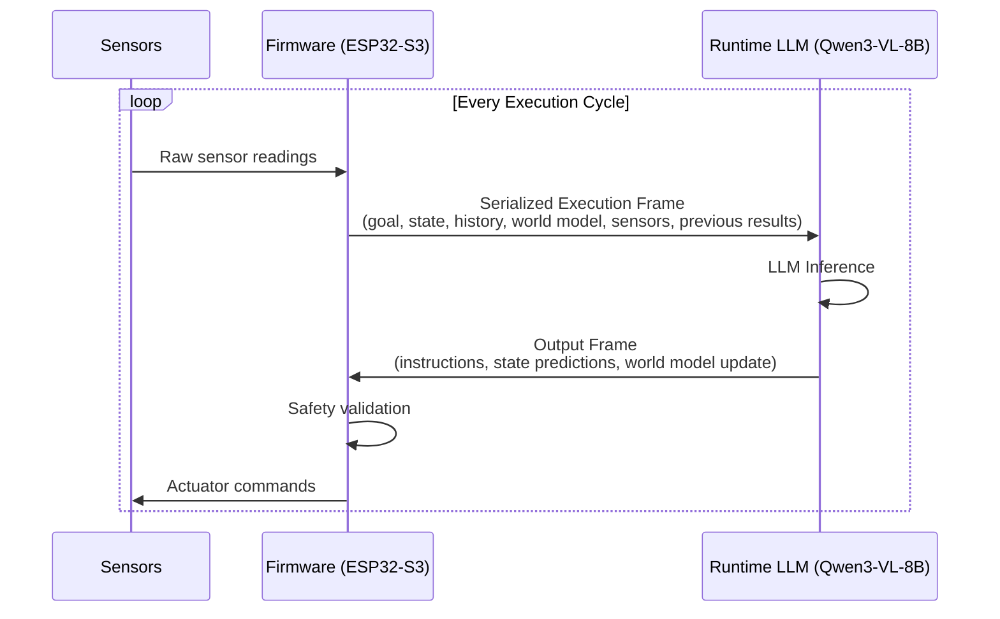
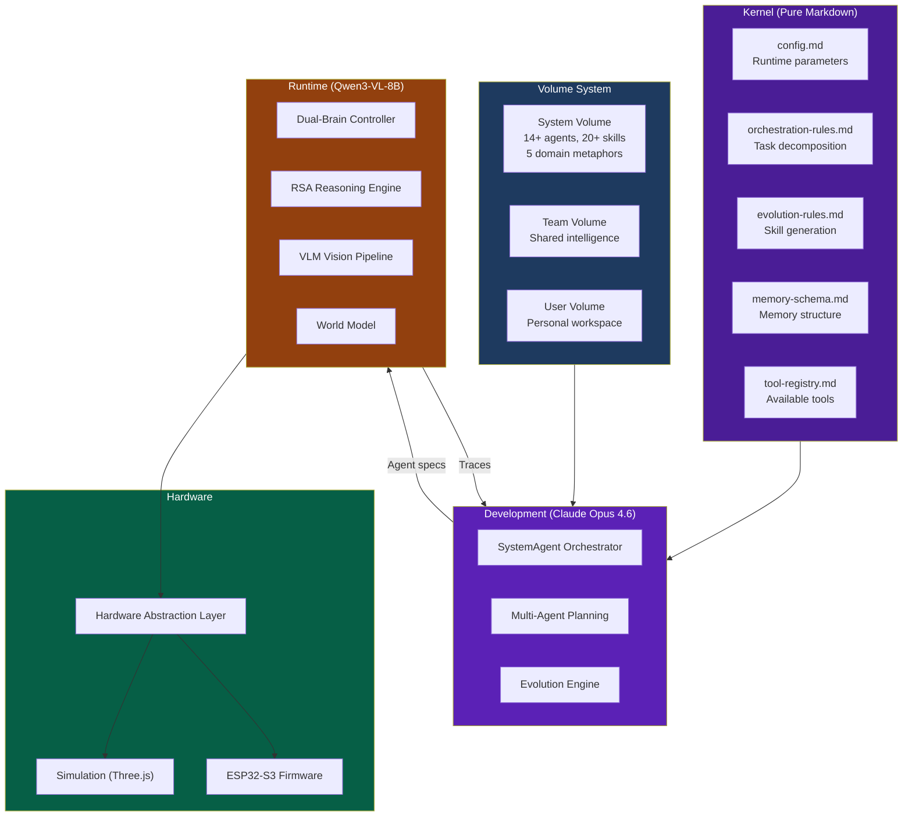
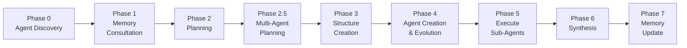

# LLMos — The Operating System for AI Physical Agents

<div align="center">


**An operating system that runs on the host machine to develop, deploy, and evolve AI agents that operate in the physical world.**

[GitHub](https://github.com/EvolvingAgentsLabs/llmos) · [Roadmap](ROADMAP.md) · [Architecture](docs/architecture/ARCHITECTURE.md) · [Contributing](#contributing)

</div>

---

## What is LLMos?

LLMos is an operating system that runs on a host computer and manages AI agents that control physical hardware. It treats AI agents the same way a traditional OS treats processes — as first-class citizens with identity, memory, permissions, and the ability to evolve.



The system uses **two different LLMs** for two fundamentally different jobs:

| Role | LLM | What It Does |
|------|-----|-------------|
| **Development & Evolution** | Claude Opus 4.6 | Runs on the host. Creates agents, writes skills, evolves behaviors, orchestrates multi-agent workflows, reasons about architecture. This is the OS-level intelligence. |
| **Agent Runtime** | Qwen3-VL-8B | Runs locally on GPU. Powers the physical agents' perception and decision-making in real-time. Multimodal (sees camera frames). Operates in closed-loop cycles at the hardware boundary. |

---

## Project Status

LLMos is under **active development and architectural refactoring**.

- The repository contains working simulation, firmware, HAL, dual-brain runtime, RSA reasoning engine, and the full agent/volume/kernel system.
- The structured protocol between host and microcontroller already functions as a **distributed LLM bytecode runtime**.
- The architecture is evolving toward a formalized embedded bytecode interpreter and eventually direct binary generation.
- Some parts of the repository reflect earlier iterations and may not match the latest architectural direction.

This is a **research-grade system**, not a production robotics framework.

---

## The Thesis

Every LLM robotics project today follows the same pipeline:

```
Human Intent → LLM → Python/C → Compiler → Binary → Robot
```

This pipeline was designed for humans writing code. The LLM is forced to produce artifacts optimized for human readability — classes, inheritance, design patterns — then a compiler translates them into what the machine actually needs.

LLMos inverts this at two levels:

**For agent development** (the OS layer):
```
Human Intent → Claude Opus 4.6 → Markdown Agents → Evolving Behaviors → Deployment
```

**For agent execution** (the runtime layer):
```
Sensor State → Qwen3-VL-8B → LLMBytecode → Firmware Runtime → Actuators → Loop
```

The development LLM thinks in markdown — agents, skills, and memory are all text files it can read, write, and improve. The runtime LLM thinks in structured instructions — deterministic bytecode that a microcontroller executes directly.

**Object-oriented programming is a human abstraction. Markdown is the interface between human intent and AI reasoning. Low-level procedural bytecode is what microcontrollers execute. LLMos uses the right representation at each layer.**

---

## Core Concepts

### 1. Pure Markdown Architecture

Everything in LLMos is a text file. Agents, skills, memory, kernel rules, configuration — all markdown. This is not a limitation; it is the core design principle.



| Traditional OS | LLMos |
|----------------|--------|
| Compiled binaries | Markdown files |
| Processes | Agent execution loops |
| Users | Humans AND AI Physical Agents |
| File system | Volume system (System / Team / User) |
| Permissions | Volume access + kernel rules |
| System calls | LLM inference requests |
| IPC | Agent-to-agent messaging |
| Package manager | Skill promotion pipeline |

### 2. Agent Definitions

Agents are markdown files with YAML frontmatter and natural language instructions. The Development LLM (Claude Opus 4.6) can create, read, modify, and evolve them.

```markdown
---
name: WallFollowerAgent
type: specialist
capabilities:
  - obstacle_avoidance
  - wall_following
  - spatial_reasoning
tools:
  - Bash
  - Read
  - Write
model: qwen/qwen3-vl-8b-instruct
origin: evolved_from: /system/agents/ReactiveRobotAgent.md
version: 2.1.0
---

# WallFollowerAgent

You are a reactive navigation agent specialized in wall-following behavior.

## Perception
Analyze VisionFrame and sensor readings each cycle. Identify walls,
openings, and obstacles using depth estimates.

## Decision Rules
1. If wall detected within 15cm on right → maintain distance, continue forward
2. If opening detected on right → turn right 45 degrees
3. If obstacle ahead within 20cm → turn left until clear
4. If no wall detected → spiral right until wall contact

## Learned Patterns
- Right-side wall following is 23% more efficient in rectangular rooms
- Gentle turns (60/100 differential) outperform sharp turns (0/100)
- Battery conservation: reduce speed below 30% charge
```

The agent definition IS the documentation IS the evolution history. When the system learns a new pattern, it writes it into the agent file. When an agent needs to improve, the Development LLM edits its markdown.

The system ships with 14+ agents including SystemAgent (orchestrator), PlanningAgent, MutationAgent, ReactiveRobotAgent, RobotAIAgent, and more.

### 3. Volume System

LLMos organizes knowledge into three-tiered volumes, similar to how an OS manages file system permissions:



| Volume | Access | Purpose |
|--------|--------|---------|
| **System** | Read-only at runtime | Immutable foundation. Base agents, skills, kernel rules, domain metaphors. Ships with the repository. |
| **Team** | Read-write, shared | Collective intelligence. Agents and skills proven across team members. Promoted from User volume at 80%+ success rate over 5+ uses. |
| **User** | Read-write, personal | Individual workspace. Projects, custom agents, personal skills, execution memory. The working directory for each user/agent. |

Skills flow upward through the volumes as they prove reliable. A pattern discovered by one user can become a team standard and eventually a system primitive — all through markdown files and automatic promotion rules.

### 4. The Kernel

The LLMos kernel is not compiled code. It is a set of markdown files that define how the system behaves:

```
public/system/kernel/
├── config.md              # Runtime parameters, limits, feature flags
├── orchestration-rules.md # How tasks are decomposed and executed
├── evolution-rules.md     # How patterns are detected and skills generated
├── memory-schema.md       # How memories are structured and queried
├── tool-registry.md       # Available tools and usage patterns
├── concept-to-tool-map.md # Maps abstract concepts to concrete tools
└── trace-linking.md       # Execution trace correlation rules
```

The Development LLM reads these files before every task. Changes take effect immediately — edit a rule, and the next execution follows it. The kernel supports controlled self-modification: skills are auto-generated, but kernel changes require human approval.

### 5. Dual-LLM Architecture

This is the fundamental architectural decision: **development and runtime use different LLMs optimized for different jobs**.



**Development LLM (Claude Opus 4.6)** — Runs on the host via Claude Code. Handles everything that requires deep reasoning, large context, and multi-step planning:
- Creating and evolving agent definitions (markdown)
- Orchestrating multi-agent workflows (minimum 3 agents per project)
- Generating and promoting skills across volumes
- Consolidating memory from execution traces
- Proposing kernel improvements
- Reasoning about architecture and debugging failures

**Runtime LLM (Qwen3-VL-8B)** — Runs locally on host GPU (8GB+ VRAM). Handles real-time perception and decision-making for the physical agents:
- **Instinct Brain**: Single-pass multimodal inference (~200-500ms). Reactive behaviors — obstacle avoidance, wall following, object tracking. The "reflex arc."
- **Planner Brain**: RSA-enhanced deeper reasoning (3-8s). Strategy — exploration planning, skill generation, swarm coordination, recovery from novel situations. The "prefrontal cortex."
- **Vision**: Unified vision-language model. Sees camera frames, estimates depth, reads text, identifies arbitrary objects — all in one pass.

The separation means the Development LLM can take its time reasoning about complex problems while the Runtime LLM maintains real-time closed-loop control of physical hardware. Neither blocks the other.

### 6. LLMBytecode

The Runtime LLM does not generate Python or C. It generates **structured, deterministic execution instructions** that the microcontroller interprets directly:



The instruction protocol contains:
- **Instruction semantics** — motor commands, sensor reads, LED control, timing
- **Variable updates** — state mutation within the cycle
- **State transitions** — mode changes, goal updates
- **Closed-loop structure** — every frame assumes the loop continues
- **External input injection** — sensor readings enter at defined points
- **Deterministic execution** — guaranteed on the MCU side
- **Safety validation** — before any actuation

This is not human-readable high-level code. It is not C. It is not assembly. It behaves as **bytecode executed by an embedded runtime**.

### 7. The Execution Frame

Every cycle, the Runtime LLM receives a serialized execution frame and emits the next one. The frame is the atomic unit of LLMos computation:

```
┌─────────────────────────────────────────────────────────┐
│                    EXECUTION FRAME                       │
│                                                         │
│  ┌─────────┐ ┌─────────┐ ┌──────────┐ ┌─────────────┐ │
│  │  GOAL   │ │ HISTORY │ │  STATE   │ │ WORLD MODEL │ │
│  └─────────┘ └─────────┘ └──────────┘ └─────────────┘ │
│  ┌──────────────────┐ ┌──────────────────────────────┐ │
│  │  SENSOR READINGS │ │  PREVIOUS ACTION RESULTS     │ │
│  └──────────────────┘ └──────────────────────────────┘ │
│  ┌──────────────────────────────────────────────────┐  │
│  │  FALLBACK STATE (deterministic error recovery)   │  │
│  └──────────────────────────────────────────────────┘  │
└────────────────────────┬────────────────────────────────┘
                         │
                    LLM INFERENCE
                   (Qwen3-VL-8B)
                         │
                         ▼
┌─────────────────────────────────────────────────────────┐
│                    OUTPUT FRAME                           │
│                                                         │
│  ┌──────────────────────────────────────────────────┐  │
│  │  NEXT INSTRUCTIONS (commands + parameters)       │  │
│  └──────────────────────────────────────────────────┘  │
│  ┌──────────────────────────────────────────────────┐  │
│  │  STATE PREDICTIONS (updated beliefs)             │  │
│  └──────────────────────────────────────────────────┘  │
│  ┌──────────────────────────────────────────────────┐  │
│  │  WORLD MODEL UPDATE (spatial/environmental)      │  │
│  └──────────────────────────────────────────────────┘  │
└─────────────────────────────────────────────────────────┘
                         │
                    FIRMWARE RUNTIME
                      (ESP32-S3)
                         │
              ┌──────────┴──────────┐
              ▼                     ▼
     ┌────────────────┐   ┌────────────────┐
     │ ACTUATORS       │   │ SENSORS        │
     │ (motor neurons) │   │ (sensory       │
     │                 │   │  neurons)       │
     └────────────────┘   └───────┬────────┘
                                  │
                         [Feed into next frame]
```

Each execution cycle contains:

| Element | Description |
|---|---|
| **Goal** | What the agent is trying to achieve |
| **History** | Last N cycles providing temporal context |
| **Internal State** | Variables representing the agent's beliefs, updated each cycle |
| **World Model** | Internal spatial/environmental representation |
| **Sensor Inputs** | Current physical readings — the agent's "sensory neurons" |
| **Previous Action Results** | Outcomes from last cycle's commands — "motor neuron" feedback |
| **Fallback Logic** | Deterministic state-maintenance that runs when LLM inference fails |

---

## Key Finding: The Model-Size Boundary

Building LLMos has produced an empirical finding that informs the entire architecture:

> **The balance between hardcoded tool logic and LLM-generated bytecode is a function of model capability.**

When the model is small (4B parameters), the system must rely heavily on pre-built, hardcoded tool implementations. The LLM contributes high-level sequencing — *what* to do and *when* — but the *how* is locked in compiled firmware routines.

As model size increases (8B+), the LLM can reliably generate more of the low-level control flow itself, taking over increasingly fine-grained behavioral control.

This creates a **sliding scale**. LLMBytecode must accommodate both ends: a minimal instruction set that small models use to orchestrate pre-built tools, and a richer instruction space that larger models use to express novel behaviors.

The Dual-LLM architecture leverages this directly: Claude Opus 4.6 (large, remote) handles the complex development reasoning where model capability matters most, while Qwen3-VL-8B (8B, local) handles the real-time runtime loop where latency matters most and the instruction set is constrained.

---

## Architecture

### System Organization



### Hardware Abstraction Layer (HAL)

The HAL ensures that:
- The same LLMBytecode instructions work identically in simulation and on real hardware
- Motor limits, voltage constraints, and timing boundaries are validated before execution
- Deterministic safety invariants are enforced regardless of what the LLM generates
- New hardware targets can be added without changing the bytecode specification

### Firmware Runtime (ESP32-S3)

The microcontroller does **not** run the LLM. It runs an execution runtime that:
- Interprets structured LLM instructions received over serial
- Maintains local execution state between cycles
- Enforces safety constraints at the hardware boundary
- Communicates sensor readings and execution results back to the host
- Executes deterministic fallback logic when host communication is interrupted

### Agent Execution Workflow

When the Development LLM (Claude Opus 4.6) receives a goal, it follows an 8-phase workflow:



1. **Discover** existing agents via glob patterns across volumes
2. **Consult** memory for similar past executions
3. **Plan** the task with multi-phase sub-agent assignments
4. **Ensure** minimum 3 agents per project (copy, evolve, or create from scratch)
5. **Create** project structure with agents/, memory/, output/, skills/ directories
6. **Execute** each sub-agent by reading its markdown and following its instructions
7. **Synthesize** results and documentation
8. **Update** memory for future learning

---

## Technical Stack

| Layer | Technology | Purpose |
|---|---|---|
| **Development LLM** | Claude Opus 4.6 (via Claude Code) | Agent creation, evolution, orchestration, architectural reasoning |
| **Runtime LLM** | Qwen3-VL-8B (local GPU) | Multimodal perception, real-time decision-making, bytecode generation |
| **Runtime LLM Inference** | llama.cpp / vLLM / OpenRouter | Local or cloud model serving for Qwen3-VL-8B |
| **RSA Engine** | Recursive Self-Aggregation | Planner brain — multimodal cross-referencing of visual observations |
| **Desktop / Frontend** | Next.js 14, Electron, Three.js | Application shell, native USB/FS access, 3D simulation |
| **Host Runtime** | TypeScript | System agent orchestrator, tool system, workflow context |
| **Firmware** | C++ (ESP32-S3) | Serial protocol runtime, deterministic validation, safety enforcement |
| **Bytecode Runtime** | Structured instruction interpreter | Embedded runtime on MCU |
| **Agent Format** | Markdown + YAML frontmatter | Agent definitions, skills, memory, kernel rules |
| **Volume Storage** | Local FS / Vercel Blob | Three-tier volume system |

---

## Relationship to Emerging Research

**LLM OS thesis** (Karpathy, 2023-2025) — LLMs as kernel processes of a new operating system. Karpathy described token streams as "assembly-level execution traces" and used the term "cognitive microcontrollers." LLMos extends this to literal microcontrollers: the LLM kernel generates instructions that a physical MCU executes.

**LLM-native programming languages** (Haslehurst, 2025) — When LLMs design their own optimal language, they converge toward assembly-like structures with short English mnemonics — not toward Python or natural language. This validates that human-oriented languages add overhead for LLM code generation.

**Interpreted vs. compiled LLM paradigm** (Verou, 2025) — The distinction between storing a prompt for repeated execution (interpreted) vs. using the LLM once to generate a deterministic program (compiled). LLMBytecode is explicitly "compiled": each cycle, the Runtime LLM generates a concrete instruction frame that executes deterministically.

**RSA: Recursive Self-Aggregation** (2025) — A method that allows smaller models to match larger model reasoning quality by recursively sampling and aggregating multiple responses. LLMos uses multimodal RSA to let Qwen3-VL-8B achieve deep planning quality while maintaining local, offline execution.

**Edge LLM inference** (BitNet, TinyLlama, Qwen-nano) — Ongoing model compression making on-device inference feasible. As models shrink enough to run on edge hardware, the distributed VM architecture can progressively collapse into a single device — the LLM and its bytecode interpreter colocated on the same board.

---

## Project Structure

```
llmos/
├── .claude/
│   └── commands/
│       └── llmos.md                 # /llmos slash command — the SystemAgent
│
├── public/system/                   # Kernel + system blueprints (read-only)
│   ├── kernel/                      # Orchestration rules, config, schemas
│   ├── agents/                      # 14+ system agent definitions (markdown)
│   ├── prompts/                     # LLM invocation prompts and templates
│   ├── domains/                     # Cross-domain reasoning metaphors
│   ├── tools/                       # Tool specifications
│   └── memory_log.md               # System-level execution history
│
├── public/volumes/system/           # System volume seed
│   ├── agents/                      # Hardware control agents
│   ├── skills/                      # 20+ reusable skills (markdown)
│   ├── hal-tools/                   # HAL tool definitions
│   └── project-templates/           # Scaffolding templates
│
├── volumes/
│   ├── system/                      # Mutable system volume (runtime)
│   └── user/                        # User personal workspace
│
├── lib/                             # Core implementation
│   ├── runtime/
│   │   ├── dual-brain-controller.ts # Instinct + Planner brains
│   │   ├── rsa-engine.ts            # RSA reasoning engine
│   │   ├── world-model.ts           # Grid-based world model
│   │   ├── jepa-mental-model.ts     # JEPA predict-before-act model
│   │   ├── esp32-agent-runtime.ts   # ESP32 agent runtime loop
│   │   ├── robot4-runtime.ts        # 60Hz firmware simulator
│   │   └── vision/
│   │       └── vlm-vision-detector.ts # Qwen3-VL-8B vision pipeline
│   ├── hal/                         # Hardware abstraction layer
│   ├── agents/                      # Agent messenger, validator
│   ├── evolution/                   # Black-box recorder, mutation engine
│   └── hardware/                    # ESP32 device manager, fleet config
│
├── components/                      # React UI components
│   └── canvas/
│       └── RobotCanvas3D.tsx        # Three.js 3D simulation arena
│
├── firmware/                        # ESP32-S3 firmware (C++)
├── backend/                         # Optional Python backend
├── electron/                        # Electron desktop wrapper
├── app/                             # Next.js application
└── docs/                            # Documentation
```

---

## Getting Started

### Using Claude Code (Development LLM)

LLMos integrates directly with Claude Code via the `/llmos` slash command:

```bash
# Clone the repository
git clone https://github.com/EvolvingAgentsLabs/llmos
cd llmos
npm install

# Use the /llmos command in Claude Code to invoke the SystemAgent
# Example: /llmos Create an AI agent for a wall-avoiding robot
```

The `/llmos` command activates the SystemAgent, which discovers existing agents, consults memory, creates a multi-agent plan, and executes it — all through markdown files.

### Running the Desktop Application

```bash
npm run electron:dev
```

### Running the Web Application

```bash
npm run dev
```

---

## Roadmap

| Phase | Description | Status |
|---|---|---|
| **Phase 0** | Distributed Instruction Runtime — LLM → Structured Protocol → Firmware | Done |
| **Phase 1** | Foundation — Desktop app, ESP32 pipeline, agent/volume/kernel system | Done |
| **Phase 2** | Dual-Brain & Local Intelligence — Qwen3-VL-8B runtime, multimodal RSA, VLM vision | In Progress |
| **Phase 3** | Swarm Intelligence — Multi-robot RSA consensus, world model merging, fleet coordination | Planned |
| **Phase 4** | Plugin Architecture — Community skills, custom domains, aggregation-aware RL | Planned |
| **Phase 5** | Native Binary Generation — LLM emits machine-level instruction blocks | Research |

See [ROADMAP.md](ROADMAP.md) for detailed milestones, timelines, and architecture decisions.

---

## Contributing

LLMos is a research system. Expect architectural changes, refactors, breaking changes, and experimental modules.

**Areas of contribution:**

- Agent definitions and skill patterns (markdown)
- LLMBytecode instruction set formalization
- Dual-Brain controller tuning and escalation logic
- RSA engine optimization and multimodal aggregation
- Embedded interpreter design and optimization
- Firmware safety invariant specification
- Simulation-to-hardware consistency verification
- New sensor/actuator HAL definitions
- Volume system tooling and skill promotion

See [CONTRIBUTING.md](CONTRIBUTING.md) for guidelines.

---

## License

Apache 2.0 — Built by [Evolving Agents Labs](https://github.com/EvolvingAgentsLabs).

---

<div align="center">

**Development intelligence (Claude Opus 4.6) creates and evolves the agents.
Runtime intelligence (Qwen3-VL-8B) drives them in the physical world.
The operating system connects both through pure markdown.**

</div>
