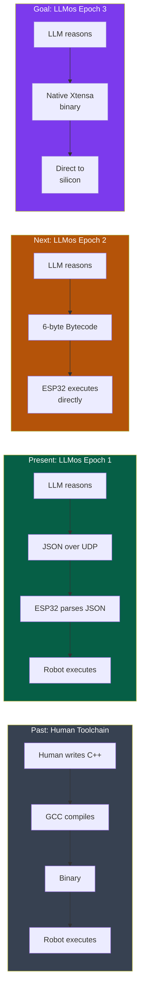
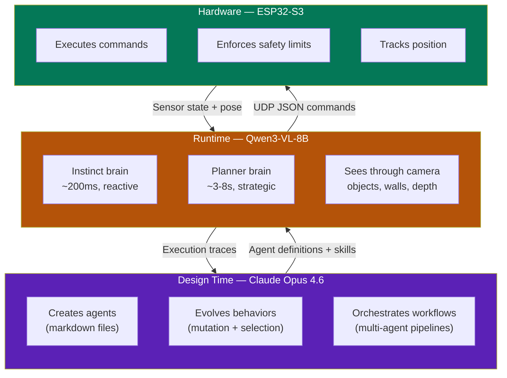

<div align="center">

# LLMos

### The first OS where LLMs compile directly to hardware. From Markdown to Machine Code.


</div>

---

```
  ┌──────────────────────────────────────────────────────────────────┐
  │                                                                  │
  │   You write a markdown file.                                     │
  │   Claude Opus 4.6 turns it into an agent definition.             │
  │   Qwen3-VL-8B runs that agent 10 times per second.               │
  │   An 8cm cube robot navigates your living room.                  │
  │                                                                  │
  │   346 tests prove it works. Zero require real hardware.          │
  │                                                                  │
  └──────────────────────────────────────────────────────────────────┘
```

LLMos is an operating system for AI physical agents. It treats language models the way Unix treats C programs — as the native executable format. Agents are markdown files. The kernel is markdown. Skills, memory, and configuration are all markdown. Two LLMs divide the work: **Claude Opus 4.6** develops and evolves agents at design time, **Qwen3-VL-8B** drives them through the physical world at runtime.

The result is a complete navigation stack — occupancy grids, A* pathfinding, vision pipelines, fleet coordination — that runs identically on a Three.js simulation and an [8cm cube robot](#the-robot) with two ESP32 chips and stepper motors. And the endgame is eliminating JSON, Python, and C++ entirely — the LLM generates bytecode, then native machine code, speaking directly to the silicon.

[Book](https://evolvingagentslabs.github.io/llmos/) · [Roadmap](ROADMAP.md) · [Contributing](#contributing)

---

## Why Not Just Use ROS?

| | **Traditional Robotics (ROS)** | **LLMos** |
|---|---|---|
| **Brain** | Hand-coded state machines, PID loops, SLAM pipelines | LLM as kernel — perceives, reasons, plans, acts |
| **Programs** | Compiled C++/Python binaries | Markdown files the LLM reads and writes |
| **Recovery** | Pre-programmed fallback states | LLM reasons about novel failures in real time |
| **Learning** | Requires retraining or manual code changes | Evolution engine mutates agents, promotes winning skills |
| **Adding behaviors** | Write code, compile, deploy, debug | Write a markdown file describing what you want |
| **Multi-robot** | Complex ROS2 DDS setup | Shared world model, LLM-coordinated task assignment |
| **Hardware swap** | Rewrite drivers and message types | Same HAL interface — swap one adapter file |
| **Getting started** | Install ROS, configure workspace, build catkin/colcon | `npm install && npx tsx scripts/run-navigation.ts` |

This is not a production robotics framework. It is a research system exploring what happens when language models are genuinely in charge.

---

## Two Paths to Try It

### Path A: Run the Simulation in 60 Seconds

No hardware. No GPU. No API key. Just a terminal.

```bash
git clone https://github.com/EvolvingAgentsLabs/llmos
cd llmos
npm install

# Verify everything works (346+ tests, all pass in ~30s)
npx jest --no-coverage

# Watch a robot navigate four arenas with a mock LLM
npx tsx scripts/run-navigation.ts --all --verbose
```

You will see cycle-by-cycle output: the robot's position, the action chosen, distance to goal. The mock LLM parses candidates from the prompt and always picks the highest-scored one — deterministic, reproducible, no network calls.

**Want real LLM decisions?** Set `OPENROUTER_API_KEY` and add `--live`:

```bash
npx tsx scripts/run-navigation.ts --live
```

Now Qwen3-VL-8B makes every navigation decision. Same code, same arenas — but the robot reasons instead of following a script.

### Path B: Awaken the Physical Agent

You have an [8cm cube robot](#the-robot) on your desk. Two ESP32 chips, two stepper motors, a camera.

```bash
# 1. Flash the motor controller (ESP32-S3)
#    firmware/esp32-s3-stepper/esp32-s3-stepper.ino
#    Set your WiFi credentials, upload via Arduino IDE

# 2. Flash the camera (ESP32-CAM)
#    firmware/esp32-cam-mjpeg/esp32-cam-mjpeg.ino

# 3. Test the eyes — open in browser:
#    http://<ESP32-CAM-IP>/stream
#    You should see live 320x240 video at ~10fps

# 4. Test the muscles — send a UDP command:
echo '{"cmd":"move_cm","left_cm":10,"right_cm":10,"speed":500}' | \
  nc -u <ESP32-S3-IP> 4210

# 5. If the robot moved exactly 10cm forward:
#    The LLM takes over the steering wheel.
```

> **Maker Checkpoint:** Do you see video at `/stream`? Did the robot move 10cm? If both yes — your robot has eyes and muscles. The brain comes next.

See [Chapter 15: V1 Hardware Deployment](https://evolvingagentslabs.github.io/llmos/15-v1-hardware-deployment.html) for the full assembly and calibration guide.

---

## How It Actually Works

A single navigation cycle, from camera frame to wheel rotation:

```mermaid
graph LR
    CAM["ESP32-CAM<br/>320x240 MJPEG"] -->|HTTP /stream| HOST["Host PC"]
    HOST -->|frame| VLM["Qwen3-VL-8B<br/>(vision)"]
    VLM -->|objects, walls, floor| WM["World Model<br/>50x50 grid"]
    WM -->|occupancy + pose| CG["Candidate<br/>Generator"]
    CG -->|scored subgoals| LLM["Qwen3-VL-8B<br/>(navigation)"]
    LLM -->|JSON decision| PLAN["A* Planner"]
    PLAN -->|waypoints| HAL["HAL"]
    HAL -->|"UDP JSON<br/>(→ Bytecode in Epoch 2)"| ESP["ESP32-S3<br/>Steppers"]
    ESP -->|step counts| ODO["Odometry"]
    ODO -->|pose update| WM

    style CAM fill:#065f46,color:#fff
    style ESP fill:#065f46,color:#fff
    style VLM fill:#b45309,color:#fff
    style LLM fill:#b45309,color:#fff
    style WM fill:#1e3a5f,color:#fff
    style HOST fill:#1a1a2e,color:#fff
```



Each cycle takes ~1-2s with cloud inference, ~200-500ms with local GPU. The robot sees, thinks, acts, observes the result, and repeats. Every component is tested independently — 346 tests across 21 suites, zero require hardware or network.

**The key architectural decision:** the LLM picks strategy (where to go, when to explore, how to recover from being stuck). Classical algorithms handle tactics (A* pathfinding, occupancy grid updates, motor control). Neither does the other's job.

---

## The Evolution of Execution

LLMos is not just a robot controller. It is a research project in **neural compilation** — teaching LLMs to bypass human programming languages entirely and speak directly to hardware.



| Epoch | Mechanism | Latency | Status |
|-------|-----------|---------|--------|
| **1: Semantic** | JSON strings over UDP | ~15ms parse time | **Current** |
| **2: Bytecode** | 6-byte hex arrays, zero parsing | ~0.1ms | Designed, [ISA defined](https://evolvingagentslabs.github.io/llmos/16-the-neural-compiler.html) |
| **3: Native** | LLM emits Xtensa machine code | ~0.00001ms | Research goal |

The same motor command, three ways:

```
Epoch 1 (JSON — 58 bytes, ~15ms parse):
  {"cmd":"move_cm","left_cm":10,"right_cm":10,"speed":500}

Epoch 2 (Bytecode — 6 bytes, ~0.1ms):
  AA 01 64 64 CB FF

Epoch 3 (Native Xtensa — 4 bytes, direct execute):
  0x006420  (MOVI.N a2, 100; executes on silicon)
```

Today the ESP32 parses JSON character by character. Tomorrow it reads 6 bytes into a struct. Eventually the LLM generates raw machine code that executes without any interpreter at all.

This is the trajectory from "LLM as chatbot" to **"LLM as compiler."**

Read the full vision: [Chapter 16: The Neural Compiler](https://evolvingagentslabs.github.io/llmos/16-the-neural-compiler.html)

---

## The Robot

The **V1 Stepper Cube** — an 8cm 3D-printed cube with everything inside:

| Component | What It Is | What It Does |
|-----------|-----------|-------------|
| **ESP32-S3-DevKitC-1** | Motor controller | Listens for UDP JSON on port 4210, drives steppers |
| **ESP32-CAM (AI-Thinker)** | Camera | Streams MJPEG at 320x240 @ 10fps over HTTP |
| **2x 28BYJ-48** | Stepper motors | 4096 steps/rev, ~217 steps/cm, max ~4.7 cm/s |
| **2x ULN2003** | Motor drivers | Darlington arrays driving the steppers |
| **6cm wheels** | Locomotion | 12cm wheel base, differential drive |
| **Ball caster** | Rear support | Low friction — critical for rotation accuracy |
| **5V 2A USB-C** | Power | Powers both ESP32s and both motors |

Two parallel networks: UDP for muscles (port 4210), HTTP for eyes (port 80). The firmware enforces safety: 2-second host timeout triggers emergency stop, max 1024 steps/second, motor coils disabled when idle.

Full BOM, wiring diagrams, and 3D print files: [`Agent_Robot_Model/Readme.md`](Agent_Robot_Model/Readme.md)

---

## The Dual-LLM Architecture



**Why two LLMs?** Because development and runtime have fundamentally different requirements:

| | Claude Opus 4.6 (Development) | Qwen3-VL-8B (Runtime) |
|---|---|---|
| **Runs** | Cloud, via Claude Code | Local GPU (8GB VRAM) or OpenRouter |
| **Speed** | Seconds to minutes (acceptable) | 200ms-8s per cycle (must be fast) |
| **Job** | Create agents, write skills, reason about architecture | Perceive world, make navigation decisions |
| **Input** | Markdown files, execution traces | Camera frames, occupancy grids, candidate lists |
| **Output** | Agent definitions, evolved behaviors | JSON navigation decisions |

The development LLM thinks in markdown — agents, skills, and memory are all text files it reads, writes, and improves. The runtime LLM thinks in structured JSON — constrained decisions that classical planners execute deterministically.

---

## Core Concepts

### Everything Is Markdown

```
Traditional OS          LLMos
─────────────          ─────
Compiled binaries   →  Markdown files
Processes           →  Agent execution loops
File system         →  Volume system (System / Team / User)
Permissions         →  Volume access + kernel rules
System calls        →  LLM inference requests
IPC                 →  Agent-to-agent messaging
Package manager     →  Skill promotion pipeline
Device drivers      →  HAL adapters
```

Agents are markdown files with YAML frontmatter. The development LLM creates, reads, modifies, and evolves them. When the system learns a new pattern, it writes it into the agent file. The agent definition *is* the documentation *is* the evolution history.

### The Volume System

Skills flow upward as they prove reliable:

```
  User Volume        ──→  Team Volume       ──→  System Volume
  (personal workspace)    (shared intelligence)   (immutable foundation)

  Promote at               Promote at
  5+ uses, 80% success     10+ uses, 90% success
```

A pattern discovered by one robot can become a fleet standard and eventually a system primitive — all through markdown files and automatic promotion rules.

### The Navigation Stack

The 50x50 occupancy grid at 10cm resolution is the robot's spatial memory. Every cell is `unknown`, `free`, `occupied`, or `explored`. The grid gets updated from two sources: ground-truth positions (simulation) or vision-language model analysis (physical robot).

Five action types: `MOVE_TO`, `EXPLORE`, `ROTATE_TO`, `FOLLOW_WALL`, `STOP`. The LLM picks one per cycle along with a fallback. The A* planner turns the decision into waypoints. The HAL turns waypoints into motor commands.

---

## Project Status

| What | Status |
|------|--------|
| World model + serialization | Done |
| LLM navigation loop (13-step cycle) | Done |
| Vision pipeline (camera → grid) | Done |
| Dual-brain controller (instinct + planner) | Done |
| Predictive intelligence (spatial heuristics) | Done |
| Fleet coordination (shared world models) | Done (in-memory), MQTT pending |
| V1 firmware (ESP32-S3 + ESP32-CAM) | Done |
| Stepper kinematics + WiFi transport | Done |
| Physical robot assembly + testing | Next milestone |
| 346+ tests across 21 suites | All passing |
| 6/6 navigation criteria with live LLM | Validated |

---

## Project Structure

```
llmos/
├── firmware/                    # ESP32 firmware (C++)
│   ├── esp32-s3-stepper/        #   Motor controller, UDP, odometry
│   └── esp32-cam-mjpeg/         #   MJPEG camera streamer
├── lib/
│   ├── runtime/                 # Navigation stack (TypeScript)
│   │   ├── world-model.ts       #   50x50 occupancy grid
│   │   ├── navigation-loop.ts   #   13-step cycle orchestrator
│   │   ├── local-planner.ts     #   A* pathfinding
│   │   ├── candidate-generator.ts   Subgoal scoring
│   │   ├── dual-brain-controller.ts Instinct + planner
│   │   ├── vision-simulator.ts  #   Ground-truth vision
│   │   ├── fleet-coordinator.ts #   Multi-robot coordination
│   │   └── test-arenas.ts       #   4 predefined environments
│   ├── hal/                     # Hardware abstraction layer
│   │   ├── types.ts             #   HAL interface (5 subsystems)
│   │   ├── stepper-kinematics.ts    28BYJ-48 motor math
│   │   ├── wifi-connection.ts   #   UDP transport (port 4210)
│   │   └── physical-adapter.ts  #   PhysicalHAL for ESP32
│   ├── agents/                  # Agent messenger, validator
│   └── evolution/               # Black-box recorder, mutation
├── public/
│   ├── system/                  # Kernel + system blueprints
│   │   ├── kernel/              #   Rules, config, schemas
│   │   └── agents/              #   14+ system agent definitions
│   └── volumes/system/          # System volume (skills, tools)
├── components/                  # React UI
│   └── robot/RobotCanvas3D.tsx  #   Three.js 3D arena
├── scripts/
│   └── run-navigation.ts        # CLI demo (--all --live --vision)
├── docs/                        # The Book (15 chapters)
├── Agent_Robot_Model/           # 3D print files, BOM, wiring
└── __tests__/                   # 346+ tests, 21 suites
```

---

## Technical Stack

| Layer | Technology |
|---|---|
| **Development LLM** | Claude Opus 4.6 via Claude Code |
| **Runtime LLM** | Qwen3-VL-8B (local GPU or OpenRouter) |
| **Frontend** | Next.js 14, Electron, Three.js |
| **Runtime** | TypeScript (navigation, world model, HAL) |
| **Motor Firmware** | C++ on ESP32-S3 (AccelStepper, UDP JSON) |
| **Camera Firmware** | C++ on ESP32-CAM (MJPEG, 320x240 @ 10fps) |
| **Transport** | UDP JSON (port 4210) + HTTP MJPEG (port 80) |
| **Agent Format** | Markdown + YAML frontmatter |
| **Testing** | Jest + ts-jest, 346+ tests, no hardware needed |

---

## Roadmap

| Phase | Status |
|---|---|
| Phase 0: Distributed Instruction Runtime | Done |
| Phase 1: Desktop app, agent/volume/kernel system | Done |
| Phase 2: Navigation POC (world model, LLM loop, vision, prediction) | Done |
| V1 Hardware: Stepper Cube firmware, kinematics, WiFi | Done (software) |
| Physical deployment: Assembly, calibration, first autonomous run | **Next** |
| Epoch 2: Bytecode VM — LLM generates 6-byte hex, ESP32 executes directly | Designed |
| Phase 3: Fleet over MQTT, multi-robot physical coordination | Planned |
| Phase 4: Plugin architecture, community skills | Planned |
| Epoch 3: Native binary generation — LLM emits Xtensa machine code | Research |

See [ROADMAP.md](ROADMAP.md) for detailed milestones.

---

## The Book

The accompanying book walks through every layer of the system across 15 chapters — from the philosophical thesis ("LLM as kernel") down to the TypeScript implementation and physical hardware deployment.

**Read it at [evolvingagentslabs.github.io/llmos](https://evolvingagentslabs.github.io/llmos/)**

---

## Contributing

LLMos is a research system. Expect architectural changes and experimental modules.

**Current priorities:**
- V1 robot physical testing and calibration
- Sim-to-real gap closure (sensor noise, motor drift)
- Local Qwen3-VL-8B inference optimization (< 500ms)
- **Bytecode VM for ESP32-S3** — replace JSON parser with 6-byte command handler
- **Grammar-constrained decoding** — GBNF grammars for LLM bytecode output
- New test arenas and navigation strategies
- HAL drivers for new hardware (LiDAR, depth cameras)
- Fleet coordination over MQTT
- Agent and skill pattern contributions (markdown)

See [CONTRIBUTING.md](CONTRIBUTING.md) for guidelines.

---

## License

Apache 2.0 — Built by [Evolving Agents Labs](https://github.com/EvolvingAgentsLabs).

<div align="center">

*A markdown file becomes an agent. The agent sees through a camera. It thinks with a language model. It moves with stepper motors. Tomorrow, the LLM writes the machine code directly. This is LLMos.*

</div>
