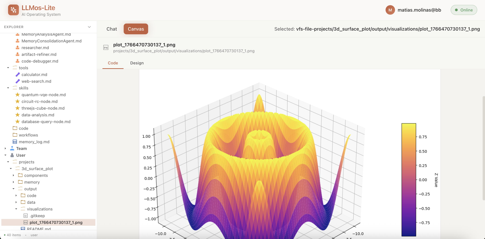

# LLMos-Lite 🚀

**An AI Operating System That Actually Learns**

LLMos-Lite is a self-evolving AI operating system that learns from every interaction, builds institutional knowledge, and gets smarter over time. Built for scientific computing, data science, and 3D visualization—all running in your browser.



---

## 🎯 Main Goals

### 🧠 **Memory-Powered Intelligence**
Unlike traditional AI assistants that forget everything after each conversation, LLMos-Lite:
- **Learns from every execution** - Successful patterns become system knowledge
- **Queries past experiences** - Consults memory before planning new tasks
- **Improves over time** - Each run makes the next one better
- **Never forgets** - Persistent memory across all sessions

### 📁 **File-First Architecture**
Everything is **real files in persistent storage**, not chat artifacts:
- All outputs saved to organized project structures
- Complete file tree showing every file and folder
- Virtual file system with browser localStorage persistence
- Read-only system volume with immutable artifacts

### 🔄 **Self-Improving System**
The system doesn't stay static—it **evolves**:
- Memory system with short-term execution logs and long-term learnings
- Pattern recognition that identifies what works and what doesn't
- Continuous learning where every task updates system knowledge
- Compound intelligence that gets better with use

---

## 💻 What You Can Do Now

### Scientific Computing & Data Science
- **Signal Processing**: FFT analysis, filtering, spectrograms, wavelet transforms
- **Machine Learning**: Classification, regression, clustering with scikit-learn
- **Data Analysis**: Statistical analysis, time series forecasting with pandas
- **3D Visualization**: Surface plots, parametric curves, vector fields with matplotlib
- **Numerical Computing**: Solve differential equations, optimization, Monte Carlo simulations

### Interactive Development
- **Live Python Execution**: Code runs instantly in your browser via Pyodide
- **Real-time Previews**: See matplotlib plots and results as you code
- **File Management**: Full file tree with VFS storage
- **Code Editor**: Split-view with syntax highlighting and auto-execution

### Available Libraries (WebAssembly-Compatible)
✅ numpy • scipy • matplotlib • pandas • scikit-learn • networkx • sympy

---

## 🚀 Quick Start

```bash
git clone https://github.com/EvolvingAgentsLabs/llmos.git
cd llmos/llmos-lite/ui
npm install
npm run dev
```

Open http://localhost:3000

**First Task Example:**
```
You: "Create a sine wave, add noise, then apply FFT to show the frequency spectrum"

SystemAgent:
📝 Creating project: signal_fft_analysis
📊 Generating Python code with scipy.fft
✅ Executing in browser...
📊 FFT peak detected at 50 Hz
📁 Saved to projects/signal_fft_analysis/output/
📝 Logged to memory for future learning

Your project is ready in the file tree!
```

---

## 🔮 What's Coming Next

### Near Future
- **Enhanced Memory System**: Visual memory browser and pattern visualization
- **Agent Evolution**: Agents that rewrite themselves based on success metrics
- **Three.js Runtime**: Interactive 3D graphics and animations
- **Cross-Project Learning**: Share learnings between different projects
- **Session Replay**: Replay and analyze past executions

### Long-Term Vision
- **Self-Improving OS**: System that adapts to any technical domain you teach it
- **Research Accelerator**: Transform papers into implementations in minutes
- **Community Knowledge**: Marketplace for sharing skills and agents
- **Multi-Language Support**: Extend beyond Python to JavaScript, R, Julia
- **Real-time Collaboration**: Multi-user sessions with shared memory

---

## 🏗️ Architecture Highlights

```
SystemAgent (Orchestrator)
    ├─ Memory System (/system/memory_log.md)
    │   ├─ Queries past experiences before planning
    │   └─ Records outcomes for continuous learning
    │
    ├─ Virtual File System (VFS)
    │   ├─ Browser localStorage persistence
    │   └─ Organized project structures
    │
    ├─ Python Runtime (Pyodide)
    │   ├─ Executes code in browser sandbox
    │   └─ Captures matplotlib plots as images
    │
    └─ File Tree UI
        ├─ System volume (read-only)
        ├─ Team volume (shared)
        └─ User volume (projects)
```

**Every execution creates:**
```
projects/[name]/
├── components/agents/    # Agent definitions
├── output/
│   ├── code/            # Generated Python files
│   ├── data/            # Data files
│   └── visualizations/  # Matplotlib plots
└── memory/
    ├── short_term/      # Execution logs
    └── long_term/       # Learnings
```

---

## 📚 Documentation

- **README.md** (this file) - Overview and quick start
- **llmos-lite/README.md** - Detailed feature documentation
- **llmos-lite/ARCHITECTURE.md** - Technical architecture
- **llmos-lite/LLMUNIX_COMPLETE.md** - Complete implementation guide

---

## 🤝 Contributing

LLMos-Lite is open source and actively developed. Contributions welcome!

**Areas for Contribution:**
- Domain packs for new fields (robotics, bioinformatics, finance)
- Memory algorithms and pattern recognition improvements
- New system tools and runtime capabilities
- UI/UX enhancements

See **llmos-lite/CONTRIBUTING.md** for guidelines.

---

## 📖 Philosophy

**File-First, Browser-Native**
Inspired by Claude Code—files are the source of truth, everything is persistent, operations are transparent.

**Self-Evolving Intelligence**
Unlike static tools, learns from every execution and builds institutional knowledge.

**Domain-Ready, Not Domain-Specific**
Start with scientific computing, teach it your domain through use, watch it become fluent over time.

---

## 💬 Community

- **GitHub**: https://github.com/EvolvingAgentsLabs/llmos
- **Issues**: https://github.com/EvolvingAgentsLabs/llmos/issues
- **Discussions**: https://github.com/EvolvingAgentsLabs/llmos/discussions

---

## 📝 License

Apache 2.0 License - See LICENSE file for details

---

**Ready to build an AI that actually learns?** 🧠
**Ready for organized, persistent outputs?** 📁
**Ready for a system that gets smarter over time?** 📈

```bash
cd llmos-lite/ui
npm run dev
```

**Watch the system evolve.** 🚀
