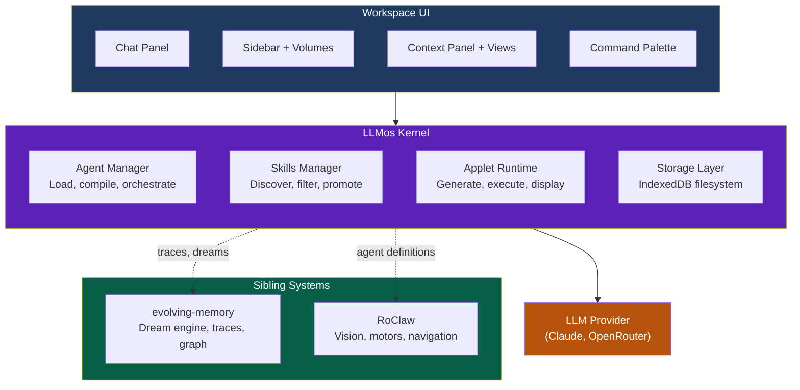

<div align="center">

# LLMos

### The Agent Kernel — where LLMs are the native runtime.


</div>

---

```
  ┌──────────────────────────────────────────────────────────────────┐
  │                                                                  │
  │   You write a markdown file.                                     │
  │   The kernel compiles it into an agent.                          │
  │   The agent uses tools, creates applets, learns skills.          │
  │   Everything runs in the browser — no backend.                   │
  │                                                                  │
  └──────────────────────────────────────────────────────────────────┘
```

LLMos is an operating system for AI agents. It treats language models the way Unix treats C programs — as the native executable format. Agents are markdown files. The kernel is markdown. Skills, memory, and configuration are all markdown.

LLMos is the **prefrontal cortex** of a three-part cognitive ecosystem:

| Repository | Brain Region | Role |
|---|---|---|
| **[evolving-memory](https://github.com/EvolvingAgentsLabs/evolving-memory)** | Hippocampus | Cognitive Trajectory Engine — dream consolidation, topological memory, ISA/VM |
| **[RoClaw](https://github.com/EvolvingAgentsLabs/RoClaw)** | Cerebellum | Physical embodiment — vision loop, motor ISA, semantic navigation |
| **llmos** (this repo) | Prefrontal Cortex | Agent kernel — orchestration, applets, skills, workspace UI |

[Book](https://evolvingagentslabs.github.io/llmos/) · [Roadmap](ROADMAP.md) · [Contributing](#contributing)

---

## How It Works


```mermaid
graph TB
    subgraph KERNEL["LLMos Kernel"]
        direction TB
        AGENTS["Agent Manager<br/>Load, compile, orchestrate"]
        SKILLS["Skills Manager<br/>Discover, filter, promote"]
        APPLETS["Applet Runtime<br/>Generate, execute, display"]
        STORAGE["Storage Layer<br/>IndexedDB filesystem"]
    end

    subgraph UI["Workspace UI"]
        direction TB
        CHAT["Chat Panel"]
        SIDEBAR["Sidebar + Volumes"]
        CONTEXT["Context Panel + Views"]
        CMD["Command Palette"]
    end

    subgraph EXTERNAL["Sibling Systems"]
        direction TB
        MEMORY["evolving-memory<br/>Dream engine, traces, graph"]
        ROCLAW["RoClaw<br/>Vision, motors, navigation"]
    end

    LLM["LLM Provider<br/>(Claude, OpenRouter)"]

    UI --> KERNEL
    KERNEL --> LLM
    KERNEL -.->|"traces, dreams"| MEMORY
    KERNEL -.->|"agent definitions"| ROCLAW

    style KERNEL fill:#5b21b6,color:#fff
    style UI fill:#1e3a5f,color:#fff
    style EXTERNAL fill:#065f46,color:#fff
    style LLM fill:#b45309,color:#fff
```

The kernel runs entirely in the browser. Agents are markdown files with YAML frontmatter — the development LLM creates, reads, modifies, and orchestrates them. When the system learns a new pattern, it writes it into a skill file. The agent definition *is* the documentation *is* the evolution history.

---

## Quick Start

```bash
git clone https://github.com/EvolvingAgentsLabs/llmos
cd llmos
npm install
npm run dev
```

Open `http://localhost:3000`. The workspace launches with a chat panel, sidebar, and context viewer — everything runs client-side.

For the Electron desktop app:

```bash
npm run electron:dev
```

---

## Core Concepts

### Everything Is Markdown

```
Traditional OS          LLMos
─────────────          ─────
Compiled binaries   →  Markdown files
Processes           →  Agent execution loops
File system         →  Volume system (System / Team / User)
Permissions         →  Volume access + kernel rules
System calls        →  LLM inference requests
IPC                 →  Agent-to-agent messaging
Package manager     →  Skill promotion pipeline
```

### The Volume System

Skills flow upward as they prove reliable:

```
  User Volume        ──→  Team Volume       ──→  System Volume
  (personal workspace)    (shared intelligence)   (immutable foundation)

  Promote at               Promote at
  5+ uses, 80% success     10+ uses, 90% success
```

### The Kernel

The `ClientKernel` orchestrates all components:

```typescript
import { getKernel } from '@/lib/kernel';

const kernel = getKernel(llmCallback);

// Create a project
const project = await kernel.createProject('my-project', 'Build a data analyzer');

// Ensure agents exist
await kernel.ensureProjectAgents(project.path, project.goal);

// Invoke an agent
const result = await kernel.invokeAgent(
  'projects/my-project/agents/AnalyzerAgent.md',
  'Analyze this dataset',
  project.path
);
```

### Applets

Agents can generate runtime applets — small interactive components that render in the workspace. The LLM writes the code, the applet runtime executes it, and the desktop manager displays it.

---

## Architecture

```
llmos/
├── app/                        # Next.js pages + layout
├── components/
│   ├── chat/                   #   Chat panel, messages, input
│   ├── workspace/              #   Adaptive layout, panels, command palette
│   ├── sidebar/                #   Sidebar, volume browser
│   ├── applets/                #   Applet rendering
│   ├── artifacts/              #   Artifact viewer
│   ├── layout/                 #   Header, navigation
│   └── system/                 #   3D background, holographic UI
├── contexts/                   # React contexts (Workspace, Project, Applet)
├── hooks/                      # Custom hooks (code execution, workflows)
├── lib/
│   ├── kernel/                 #   ClientKernel — boot, orchestration, API
│   ├── agents/                 #   Agent compiler, loader, messenger, orchestrator
│   ├── skills/                 #   Skill manager, promotion pipeline
│   ├── applets/                #   Applet store, desktop manager, error fixer
│   ├── llm/                    #   LLM client, types, storage
│   ├── storage/                #   IndexedDB filesystem adapter
│   ├── debug/                  #   Logger, console store, metrics
│   ├── runtime/                #   Applet runtime, speculative execution
│   └── ...                     #   Tool executor, MCP client, utilities
├── public/
│   ├── system/                 #   Kernel rules, system agent definitions
│   └── volumes/                #   System volume (skills, tools)
├── electron/                   # Electron shell (serial, native features)
└── docs/                       # The Book
```

---

## Technical Stack

| Layer | Technology |
|---|---|
| **Development LLM** | Claude Opus 4.6 via Claude Code |
| **Frontend** | Next.js 14, React, Tailwind CSS |
| **Desktop** | Electron (optional) |
| **Kernel** | TypeScript, client-side only |
| **Storage** | IndexedDB (via filesystem adapter) |
| **Agent Format** | Markdown + YAML frontmatter |
| **Memory** | [evolving-memory](https://github.com/EvolvingAgentsLabs/evolving-memory) (REST API) |
| **Hardware** | [RoClaw](https://github.com/EvolvingAgentsLabs/RoClaw) (separate repo) |

---

## The Cognitive Trinity

LLMos is one part of a three-repository ecosystem. Each repo maps to a brain region with a distinct responsibility:

**evolving-memory** (Hippocampus) handles persistence and learning — the Cognitive Trajectory Engine with dream consolidation (SWS/REM/Consolidation phases), topological memory graphs, fidelity-weighted trace merging, and a REST/WebSocket server that any client can connect to.

**RoClaw** (Cerebellum) handles physical embodiment — the vision-language loop, hex-bytecode motor ISA, semantic navigation maps, and ESP32 firmware. It connects to evolving-memory via HTTP for dream cycles and trace ingestion.

**llmos** (Prefrontal Cortex) handles high-level orchestration — agent compilation, skill management, applet generation, and the workspace UI. It's the "thinking" layer that decides *what* to do, while RoClaw decides *how* to move and evolving-memory decides *what to remember*.

---

## Roadmap

| Phase | Status |
|---|---|
| Phase 0: Distributed Instruction Runtime | Done |
| Phase 1: Desktop app, agent/volume/kernel system | Done |
| Ecosystem restructuring (Cognitive Trinity) | **Done** |
| evolving-memory REST server integration | **Done** |
| RoClaw memory deduplication | **Done** |
| Phase 3: Multi-agent workflows, advanced orchestration | In Progress |
| Phase 4: Plugin architecture, community skills | Planned |

See [ROADMAP.md](ROADMAP.md) for detailed milestones.

---

## The Book

The accompanying book walks through every layer of the system — from the philosophical thesis ("LLM as kernel") down to the TypeScript implementation.

**Read it at [evolvingagentslabs.github.io/llmos](https://evolvingagentslabs.github.io/llmos/)**

---

## Contributing

LLMos is a research system. Expect architectural changes and experimental modules.

**Current priorities:**
- Multi-agent orchestration patterns
- Applet generation and runtime improvements
- Skill promotion pipeline refinement
- evolving-memory integration (traces, dream cycles)
- Agent and skill pattern contributions (markdown)

See [CONTRIBUTING.md](CONTRIBUTING.md) for guidelines.

---

## License

Apache 2.0 — Built by [Evolving Agents Labs](https://github.com/EvolvingAgentsLabs).

<div align="center">

*A markdown file becomes an agent. The agent thinks with a language model. It creates tools, learns skills, and remembers through dreams. Three repos, one cognitive architecture. This is LLMos.*

</div>
