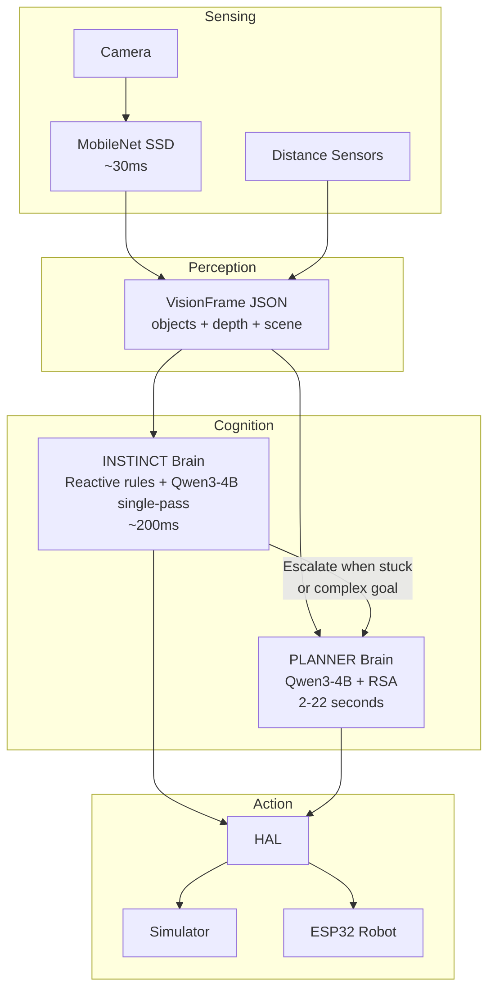

# LLMos: The Operating System for Physical AI Agents

<div align="center">


**A hybrid runtime environment where AI agents are first-class citizens that can perceive, reason, act on hardware, and evolve over time — all running locally, no cloud required.**

</div>

---

## What is LLMos?

LLMos is an "Operating System" designed for the era of physical AI. Unlike traditional robotics frameworks (ROS) or simple LLM chatbots, LLMos treats **Agentic Behaviors** as installable software.

It allows you to program robots using natural language, compiles those intentions into executable "Skills," and provides a **Dual-Brain** cognitive architecture that thinks deeply and reacts instantly.

### Key Capabilities

*   **Natural Language Programming:** Type "Create a robot that avoids walls" and the system generates the code, HAL bindings, and logic.
*   **Dual-Brain Architecture:** Fast instinct brain (MobileNet + Qwen3-4B, ~200ms) handles reactive avoidance. Deep planner brain (Qwen3-4B + [RSA](https://arxiv.org/html/2509.26626v1), 2-22s) handles goal planning and exploration.
*   **Zero Cloud Dependency:** Runs fully offline on a host computer with GPU. No API costs. No latency.
*   **Markdown-as-Code:** Agents, Skills, and Tools are defined in human-readable Markdown files that serve as both documentation and executable logic.
*   **Hybrid Runtime:** Runs entirely in the browser (via WebAssembly/Pyodide), on Desktop (Electron), or deploys to physical hardware (ESP32).
*   **Swarm Intelligence:** Multiple robots merge world models via [RSA consensus](https://arxiv.org/html/2509.26626v1) — the "MapReduce for physical intelligence."
*   **Cognitive World Model:** A persistent spatial-temporal grid that allows robots to track object permanence and detect changes over time.

---

## Dual-Brain Architecture



The **Instinct** brain handles immediate decisions: obstacle avoidance, wall following, simple tracking. The **Planner** brain handles deep reasoning: exploration strategy, skill generation, multi-robot coordination.

[RSA](https://arxiv.org/html/2509.26626v1) (Recursive Self-Aggregation) enables the small local model (Qwen3-4B, 4B parameters) to match the reasoning quality of much larger cloud models like o3-mini and DeepSeek-R1 by recursively aggregating multiple candidate reasoning chains.

---

## Tech Stack

*   **Frontend/Desktop:** Next.js 14, Electron, Tailwind CSS, React Flow.
*   **Simulation:** Three.js, React-Three-Fiber.
*   **Runtime Logic:** TypeScript, Python (via Pyodide), WebAssembly (@wasmer/sdk).
*   **Intelligence:** [Qwen3-4B](https://huggingface.co/Qwen/Qwen3-4B-Instruct) + [RSA](https://arxiv.org/html/2509.26626v1) (local), [MobileNet SSD](https://arxiv.org/abs/1801.04381) (vision).
*   **Storage:** Browser-native Virtual File System (VFS) with LightningFS.
*   **Hardware:** ESP32-S3 (C++ Firmware, WASM runtime).

---

## Getting Started

### Prerequisites
*   Node.js 18+
*   Python 3.10+ (for backend services/compilation)
*   Git
*   GPU with 8GB+ VRAM (for local Qwen3-4B inference — optional, cloud API fallback available)

### Installation

1.  **Clone the repository:**
    ```bash
    git clone https://github.com/EvolvingAgentsLabs/llmos
    cd llmos
    ```

2.  **Install dependencies:**
    ```bash
    npm install
    ```

3.  **Run in Development Mode:**

    *   **Web Mode (Simulator Only):**
        ```bash
        npm run dev
        ```
    *   **Desktop Mode (Electron + Hardware Access):**
        ```bash
        npm run electron:dev
        ```

4.  **Setup Keys:**
    Upon launch, the setup wizard will ask for your LLM API Key (Gemini or OpenAI). This key is stored locally in your browser/desktop storage and is never sent to our servers. For fully offline operation, set up a local Qwen3-4B server (see ROADMAP.md Phase 2).

---

## Core Architecture

LLMos is built on five pillars that distinguish it from standard agent frameworks.

### 1. Dual-Brain Cognitive Architecture (`/lib/runtime`)
Two cognitive layers run in parallel:
*   **Instinct Brain** — Reactive rules + single-pass LLM (~200ms). Handles obstacle avoidance, wall following, simple tracking.
*   **Planner Brain** — RSA-enhanced LLM (2-22s). Handles exploration planning, skill generation, swarm coordination.
*   **MobileNet Vision** — Local object detection (~30ms) with bbox-based depth estimation. Feeds structured JSON to both brains.

### 2. The Volume System (`/volumes`)
The file system is the database. Data is organized into hierarchical volumes:
*   **System Volume:** Read-only core agents, Standard Library tools, and certified Skills.
*   **Team Volume:** Shared skills and knowledge patterns discovered by the "Dreaming Engine."
*   **User Volume:** Your local projects, custom agents, and interaction traces.

### 3. HAL (Hardware Abstraction Layer) (`/lib/hal`)
The HAL allows the exact same Agent code to run in the 3D Simulator and on physical robots.
*   **Tools:** Defined in Markdown (e.g., `hal_drive.md`, `hal_vision_scan.md`).
*   **Validation:** A `CommandValidator` intercepts LLM instructions to ensure physical safety before they reach the motors.

### 4. The Applet System (`/components/applets`)
LLMos includes a dynamic UI system called "Applets." These are micro-applications that Agents can generate on the fly to help users complete tasks.

### 5. Dreaming & Evolution (`/lib/evolution`)
Robots improve while idle. The "Dreaming Engine" analyzes `BlackBox` recordings of failed interactions:
1.  **Replay:** Simulates the failure scenario in Three.js.
2.  **Mutate:** The LLM generates variations of the code to fix the issue.
3.  **Evaluate:** Successful mutations are patched into the Skill Markdown file.

---

## Project Structure

```
llmos/
├── app/                  # Next.js App Router (UI Pages & API Routes)
├── components/           # React Components
│   ├── applets/          # Dynamic Applet UI System
│   ├── canvas/           # Three.js Visualization & Sim
│   ├── chat/             # Agent Chat Interface
│   ├── robot/            # Robot Control Panels
│   └── visualization/    # Decision Trees & Flow Graphs
├── electron/             # Electron Main Process & Native Bridges
├── firmware/             # ESP32 C++ Code & WASM Runtimes
├── lib/                  # Core Logic
│   ├── agents/           # Agent Orchestrators & Compilers
│   ├── evolution/        # Dreaming Engine & Self-Correction
│   ├── hal/              # Hardware Abstraction Layer
│   ├── kernel/           # OS Boot Logic & Process Mgmt
│   ├── runtime/          # Cognitive Runtimes
│   │   ├── rsa-engine.ts            # RSA algorithm
│   │   ├── dual-brain-controller.ts # Instinct + Planner orchestration
│   │   ├── jepa-mental-model.ts     # JEPA-inspired abstract state
│   │   ├── world-model.ts           # Grid-based spatial model
│   │   └── vision/
│   │       └── mobilenet-detector.ts # MobileNet object detection
│   └── virtual-fs.ts     # In-browser File System
├── volumes/              # The "Brain" (Markdown Knowledge Base)
│   ├── system/           # Built-in Agents & Skills
│   └── user/             # User Data (Local)
└── __tests__/            # Integration Tests
```

---

## Hardware Setup (Optional)

To use LLMos with real hardware, you need an **ESP32-S3**.

**Basic Wiring:**
*   **Motors:** GPIO 12/13/14/15 -> Motor Driver
*   **Sensors:** GPIO 16/17 -> HC-SR04 (Ultrasonic)
*   **Connection:** Connect via USB. The Electron app will auto-detect the serial port.

*See `docs/hardware/STANDARD_ROBOT_V1.md` for full schematics.*

---

## Research References

This project builds on:

| Paper | Role in LLMos |
|-------|---------------|
| [RSA: Recursive Self-Aggregation Unlocks Deep Thinking in LLMs](https://arxiv.org/html/2509.26626v1) | Planner brain — enables small local model to match cloud-scale reasoning |
| [JEPA: A Path Towards Autonomous Machine Intelligence](https://openreview.net/forum?id=BZ5a1r-kVsf) | Mental model architecture — predict-before-act paradigm |
| [MobileNet V2](https://arxiv.org/abs/1801.04381) | Vision pipeline — fast local object detection |
| [MobileNet SSD](https://arxiv.org/abs/1704.04861) | Object detection backbone for structured scene understanding |

---

## Contributing

We are in **Phase 1 (Foundation)** heading into **Phase 2 (Dual-Brain & Local Intelligence)**.

1.  Check `ROADMAP.md` for current priorities.
2.  Look for "Good First Issues" related to UI polish or new HAL tool definitions.
3.  Ensure all new logic includes tests in `__tests__/`.

---

## License

Apache 2.0 - Open Source. Built by **Evolving Agents Labs**.
