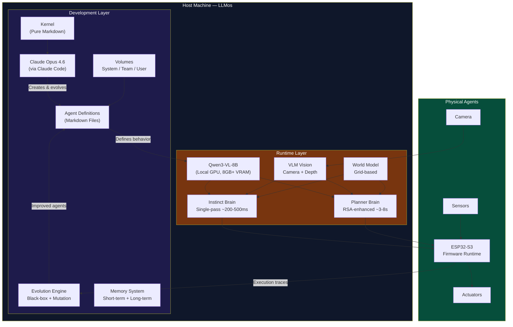
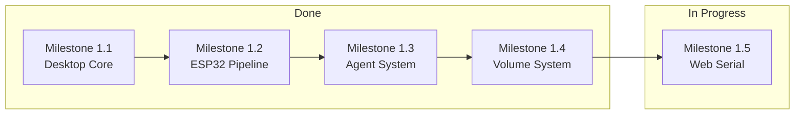
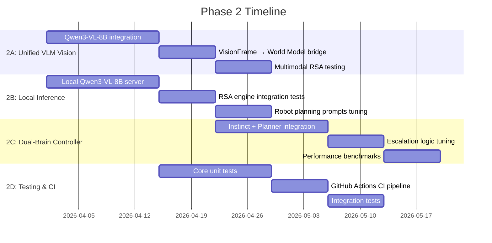
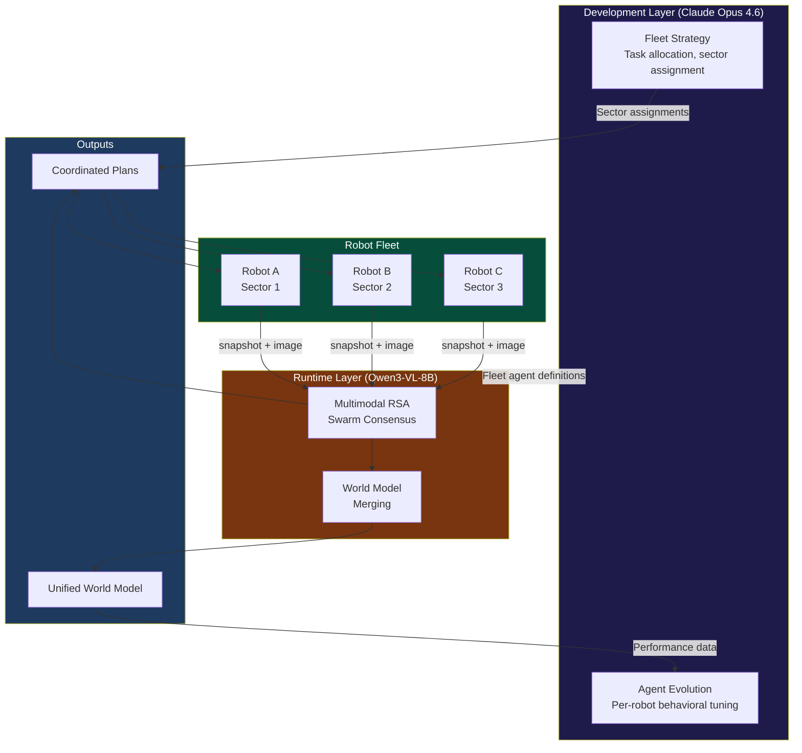
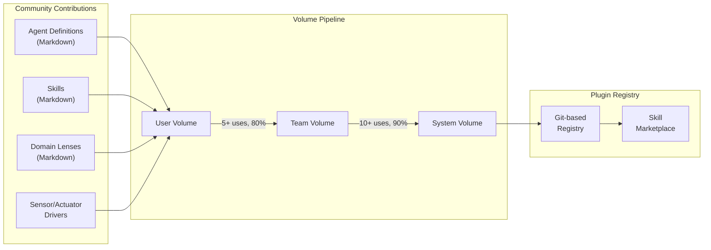
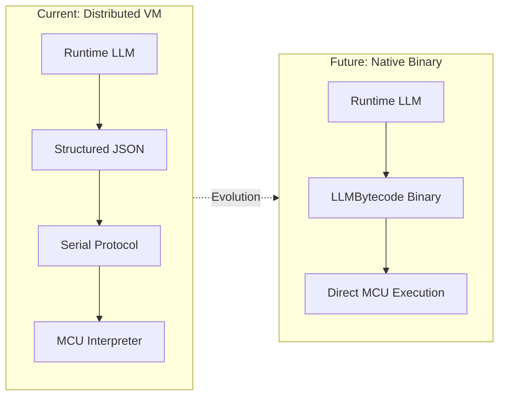

# LLMos Roadmap

**Vision**: An operating system running on the host machine that develops, deploys, and evolves AI agents operating in the physical world — using two LLMs: one for development and evolution (Claude Opus 4.6), another for real-time agent runtime (Qwen3-VL-8B).

---

## Dual-LLM Architecture Overview

---

## What Makes LLMos Different

- **Dual-LLM Architecture**: Development LLM (Claude Opus 4.6) for creating and evolving agents + Runtime LLM (Qwen3-VL-8B) for real-time physical agent control
- **Pure Markdown OS**: Agents, skills, memory, and kernel rules are all text files — human-readable, AI-writable, Git-versionable
- **Volume System**: Three-tier knowledge hierarchy (System / Team / User) with automatic skill promotion
- **Physical World Focus**: Not just chat — real motors, sensors, cameras, and robots
- **Dual-Brain Runtime**: Fast instinct (Qwen3-VL-8B single-pass) + deep planner (Qwen3-VL-8B + [RSA](https://arxiv.org/html/2509.26626v1))
- **Zero Cloud Dependency**: Runtime operates fully offline on a host computer with GPU
- **Swarm Intelligence**: Multiple robots merge world models via RSA consensus

---

## Development Phases

### Phase 1: Foundation (Q1 2026) — CURRENT

**Goal**: Working desktop application with ESP32 pipeline and full agent/volume/kernel system.

#### Milestone 1.1: Desktop Core — DONE
- [x] Electron + Next.js desktop application
- [x] Clean chat interface
- [x] File system integration
- [x] Streamlined for desktop-only

#### Milestone 1.2: ESP32 Pipeline
- [ ] USB serial connection and device detection (Electron)
- [ ] One-click firmware flashing
- [ ] Natural language → LLMBytecode generation
- [ ] Test workflow: "avoid walls" → working robot

#### Milestone 1.3: Agent & Volume System — DONE
- [x] Pure markdown agent definitions with YAML frontmatter
- [x] 14+ system agents (SystemAgent, PlanningAgent, MutationAgent, etc.)
- [x] 20+ reusable skills in system volume
- [x] Three-tier volume system (System / Team / User)
- [x] Kernel as markdown (config, orchestration rules, evolution rules)
- [x] Skill promotion pipeline (User → Team → System)

#### Milestone 1.4: Polish & Reliability
- [ ] Error handling and user feedback
- [ ] Connection troubleshooting wizard
- [ ] Auto-recovery from failures

#### Milestone 1.5: The Web Frontier (Zero-Install Robotics)
**Goal**: Control hardware directly from the browser without installing Electron.

- [ ] HAL Refactor: `ElectronSerialAdapter` + `WebSerialAdapter`
- [ ] Browser "Connect to Robot" UI with capability checks
- [ ] `esptool-js` browser firmware flashing

---

### Phase 2: Dual-Brain & Local Intelligence (Q2 2026)

**Goal**: Wire the Dual-LLM architecture end-to-end. Claude Opus 4.6 develops agents, Qwen3-VL-8B runs them in real-time.

This phase is driven by three key insights:
1. Cloud LLMs are too slow (~1-2s) and expensive (~$36/hr at 10Hz) for physical agent runtime
2. [RSA](https://arxiv.org/html/2509.26626v1) enables Qwen3-VL-8B to match o3-mini/DeepSeek-R1 reasoning quality for planning
3. A unified VLM (Qwen3-VL-8B) eliminates the need for separate object detection models at runtime

#### Milestone 2.1: Qwen3-VL-8B Vision Pipeline (Runtime LLM)
- [x] Create `VLMVisionDetector` for direct image → VisionFrame conversion
- [x] Implement `VLMBackend` interface for OpenAI-compatible vision API
- [x] Add `vlm_estimate` depth method to Detection type
- [ ] Wire `VisionFrame` JSON output to world model updates
- [ ] Connect to camera source (webcam for desktop, ESP32-CAM stream for real robot)
- [ ] Benchmark: <500ms per frame on host GPU

**Success criteria**: Robot can detect and describe arbitrary objects from a camera frame with depth estimates via Qwen3-VL-8B

#### Milestone 2.2: Local LLM Inference (Runtime LLM Server)
- [ ] Set up [llama.cpp](https://github.com/ggerganov/llama.cpp) or [vLLM](https://github.com/vllm-project/vllm) server on host
- [ ] Load [Qwen3-VL-8B-Instruct](https://huggingface.co/Qwen/Qwen3-VL-8B-Instruct) with multimodal support
- [ ] Implement `RSAMultimodalProvider` adapter for local server
- [ ] Benchmark: <500ms for single-pass, <3s for RSA quick preset
- [ ] OpenRouter cloud API as alternative ($0.08/M input, $0.50/M output)

**Success criteria**: Physical agents operate fully offline with local Qwen3-VL-8B as runtime LLM

#### Milestone 2.3: Multimodal RSA Engine Integration (Runtime LLM Planner)
- [x] Implement RSA algorithm (`lib/runtime/rsa-engine.ts`)
- [x] Implement preset configurations (quick/standard/deep/swarm)
- [x] Add `RSAMultimodalProvider` interface for VLM-based RSA
- [x] Add `runWithImage()` method for multimodal RSA
- [x] Add `VISION_AGGREGATION_PROMPT` for visual cross-referencing
- [ ] Integration tests with robot planning scenarios
- [ ] Tune aggregation prompts for navigation tasks
- [ ] Benchmark multimodal RSA quality vs. single-pass vs. cloud LLM
- [ ] Implement swarm consensus mode for multi-robot

**Success criteria**: Multimodal RSA `quick` preset (N=4, K=2, T=2) where each candidate independently analyzes the camera frame produces better spatial understanding than single-pass VLM

#### Milestone 2.4: Dual-Brain Controller (Runtime LLM Decision Layer)
- [x] Implement `DualBrainController` (`lib/runtime/dual-brain-controller.ts`)
- [x] Implement reactive instinct rules
- [ ] Wire escalation logic to RSA engine
- [ ] Implement async planning (planner runs in background while instinct acts)
- [ ] Add brain-decision tracking to black-box recorder
- [ ] Dashboard: show which brain made each decision with latency

**Success criteria**: Robot navigates complex environment using instinct for reactive avoidance and planner for goal-directed exploration

#### Milestone 2.5: Development LLM Integration (Claude Opus 4.6)
- [x] Claude Code `/llmos` slash command for SystemAgent invocation
- [x] 8-phase agent execution workflow
- [x] Multi-agent planning with minimum 3 agents per project
- [ ] Automatic agent evolution from runtime execution traces
- [ ] Skill promotion from runtime patterns to volume system
- [ ] Cross-session memory consolidation

**Success criteria**: Claude Opus 4.6 can create agents that Qwen3-VL-8B runs successfully on physical hardware, and evolve them based on runtime performance data

#### Milestone 2.6: Testing & CI
- [ ] Unit tests: world model, JEPA, HAL validator, skill parser, RSA engine
- [ ] GitHub Actions: lint → type-check → test → build on every PR
- [ ] Integration test: spawn robot → set goal → verify world model updates

---

### Phase 3: Swarm Intelligence & Fleet (Q3 2026)

**Goal**: Multiple robots collaborating via RSA-based consensus, with the Development LLM coordinating fleet strategy.

#### Milestone 3.1: World Model Merging
- [ ] Add `mergeWith(otherModel, trustWeight)` to `WorldModel`
- [ ] Serialize `WorldModelSnapshot` for network transport
- [ ] Bayesian confidence fusion for conflicting observations
- [ ] Visualize merged model in 3D arena PiP view

#### Milestone 3.2: Fleet Communication
- [ ] MQTT transport for ESP32 fleet (native ESP-IDF support)
- [ ] Message protocol: `SNAPSHOT_SHARE`, `TASK_ASSIGN`, `HEARTBEAT`, `LEADER_ELECT`
- [ ] Wire `FleetConfig` leader-follower mode in `esp32-device-manager.ts`
- [ ] Fleet health dashboard with topology visualization

#### Milestone 3.3: RSA Swarm Consensus
- [ ] Run `swarmConsensus()` to merge robot observations
- [ ] Task distribution: RSA generates exploration assignments per robot
- [ ] Conflict resolution via trust-weighted aggregation
- [ ] Demo: 3 robots collectively map unknown environment

#### Milestone 3.4: Multi-Robot 3D Arena
- [ ] Extend `RobotCanvas3D.tsx` to render 2+ robots with distinct colors
- [ ] Show each robot's local world model vs. merged model
- [ ] Formation visualization and communication links

---

### Phase 4: Plugin Architecture & Community (Q4 2026)

**Goal**: Extensible system where community can contribute agents, skills, and domain lenses.

- [ ] Plugin manifest format (JSON + TypeScript/JavaScript)
- [ ] Git-based plugin registry
- [ ] Community skill marketplace
- [ ] Aggregation-aware RL training pipeline (per RSA paper Section 4)
- [ ] Custom domain lenses for mutation engine
- [ ] Third-party sensor driver plugins

---

### Phase 5: Native Binary Generation (2027+)

**Goal**: The Runtime LLM emits machine-level instruction blocks, removing all intermediate human-oriented representation.

| Sub-phase | Description | Status |
|---|---|---|
| Formal LLMBytecode Spec | Instruction categories, grammar, state model, safety invariants | In Progress |
| Embedded Interpreter | Formal VM on MCU with opcode table, replacing ad-hoc protocol | Planned |
| Static Compilation | Pre-validated instruction blocks, reduced runtime overhead | Planned |
| Native Binary Gen | LLM emits machine-level instructions, no intermediate representation | Research |

---

## Technology Stack

### Development Layer (Claude Opus 4.6)

| Component | Technology | Purpose |
|-----------|-----------|---------|
| LLM | Claude Opus 4.6 (via Claude Code) | Agent creation, evolution, orchestration |
| Interface | `/llmos` slash command | SystemAgent invocation |
| Agent Format | Markdown + YAML frontmatter | Agent definitions, skills, memory |
| Volume System | Local FS / Vercel Blob | Three-tier knowledge hierarchy |
| Kernel | Pure Markdown | Orchestration rules, config, schemas |

### Runtime Layer (Qwen3-VL-8B)

| Component | Technology | Purpose |
|-----------|-----------|---------|
| Vision + Language | [Qwen3-VL-8B-Instruct](https://huggingface.co/Qwen/Qwen3-VL-8B-Instruct) | Unified multimodal perception + reasoning |
| Instinct | Qwen3-VL-8B single-pass | Fast visual reasoning (~200-500ms) |
| Planner | Qwen3-VL-8B + Multimodal [RSA](https://arxiv.org/html/2509.26626v1) | Deep deliberative planning (3-8s) |
| Inference | [llama.cpp](https://github.com/ggerganov/llama.cpp) / [vLLM](https://github.com/vllm-project/vllm) / [OpenRouter](https://openrouter.ai/) | Local or cloud model serving |
| Depth | VLM spatial reasoning | Direct depth estimation from visual understanding |

### Application Layer

| Component | Technology | Purpose |
|-----------|-----------|---------|
| Framework | Next.js 14 | Application shell |
| Desktop | Electron | Native USB/FS access |
| Language | TypeScript | Type safety |
| State | Zustand | Lightweight state management |
| 3D | Three.js / React-Three-Fiber | Robot simulation arena |

### Hardware Layer

| Component | Technology | Purpose |
|-----------|-----------|---------|
| Desktop Serial | `node-serialport` | Automatic device detection |
| Web Serial | `navigator.serial` | Browser-based robot control |
| Flashing | `esptool.js` / `esptool.py` | Firmware deployment |
| Fleet Protocol | MQTT | Multi-robot communication |
| Microcontroller | ESP32-S3 | Robot hardware |

---

## Key Research References

| Paper / Model | How We Use It |
|-------|---------------|
| [Qwen3-VL-8B-Instruct](https://huggingface.co/Qwen/Qwen3-VL-8B-Instruct) | Runtime LLM — unified vision-language backbone for physical agent perception and decision-making |
| [RSA: Recursive Self-Aggregation](https://arxiv.org/html/2509.26626v1) | Planner brain — multimodal RSA cross-references visual observations for deep planning |
| [JEPA: Joint Embedding Predictive Architecture](https://openreview.net/forum?id=BZ5a1r-kVsf) | Mental model — predict-before-act paradigm for abstract state |
| LLM OS thesis (Karpathy, 2023-2025) | Foundational concept — LLMs as kernel processes, extended to physical microcontrollers |

---

## The Vision

```mermaid
graph TB
    subgraph TODAY["Today"]
        H["Human Developer"]
        IDE["Heavy IDE"]
        CODE["C++/Python Code"]
        COMPILE["Compile & Flash"]
        ROBOT_TODAY["Single Robot"]
    end

    subgraph TOMORROW["Tomorrow with LLMos"]
        USER["Human (plain English)"]
        DEV_AI["Claude Opus 4.6<br/>Creates & evolves agents"]
        MARKDOWN["Markdown Agents<br/>Self-improving"]
        RUNTIME_AI["Qwen3-VL-8B<br/>Real-time control"]
        FLEET_TOMORROW["Robot Fleet<br/>Shared intelligence"]
    end

    H --> IDE --> CODE --> COMPILE --> ROBOT_TODAY
    USER --> DEV_AI --> MARKDOWN --> RUNTIME_AI --> FLEET_TOMORROW

    style TODAY fill:#450a0a,color:#fff
    style TOMORROW fill:#052e16,color:#fff
```

**Today**: Programming robots requires learning C++, installing heavy IDEs, and manually coding every behavior. Cloud AI is too slow and expensive for real-time physical agents.

**Tomorrow with LLMos**: Describe what you want in plain English. Claude Opus 4.6 creates and evolves the agents as markdown files. Qwen3-VL-8B runs them in real-time on local GPU — seeing, reasoning, and acting in the physical world. Agents learn from every interaction, promote successful patterns through the volume system, and coordinate as swarms. No cloud dependency for runtime. No coding. No limits.
