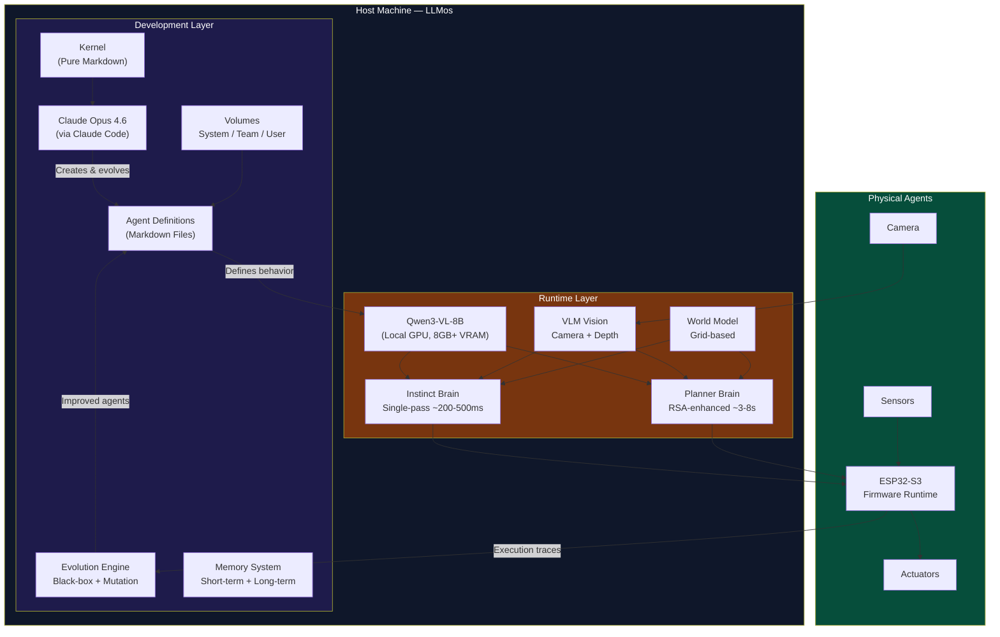
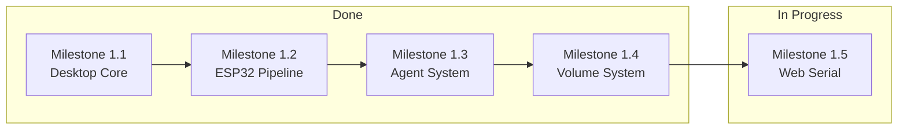
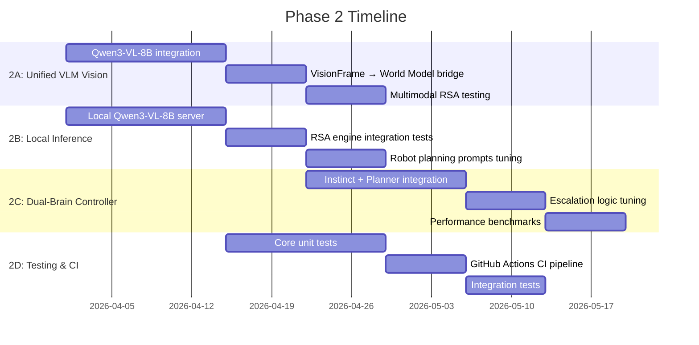
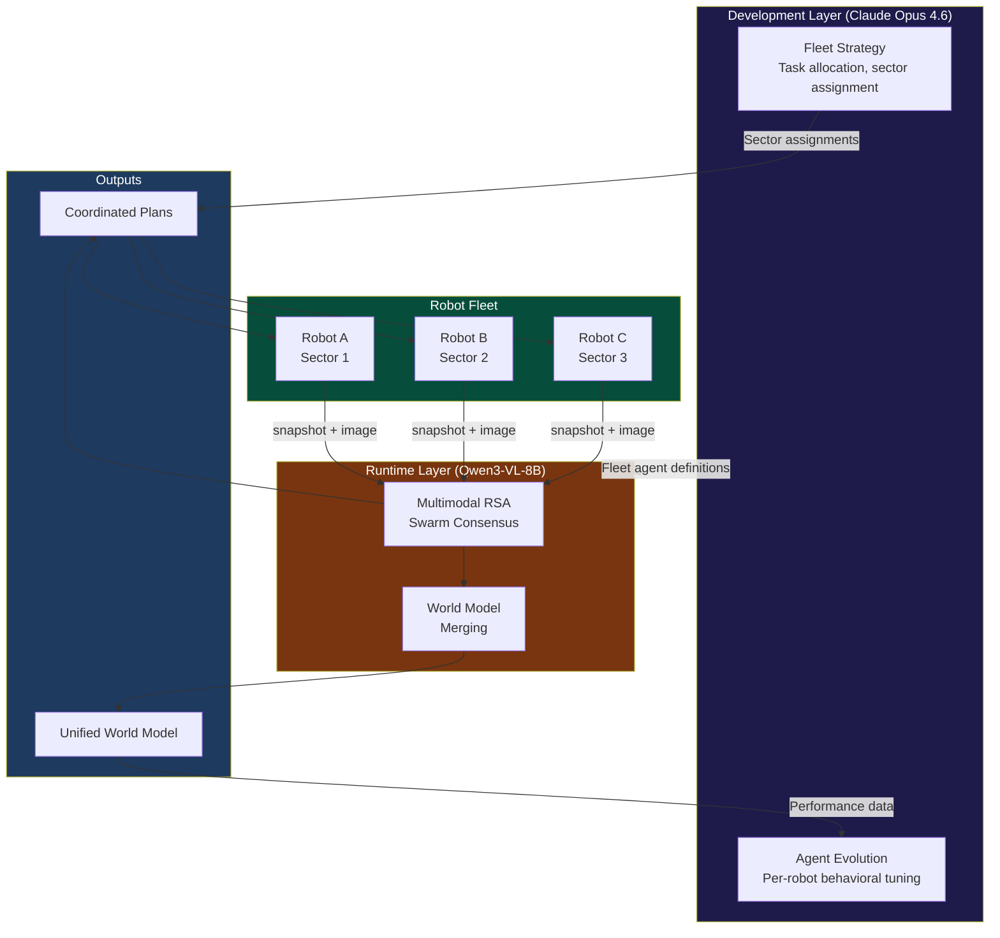
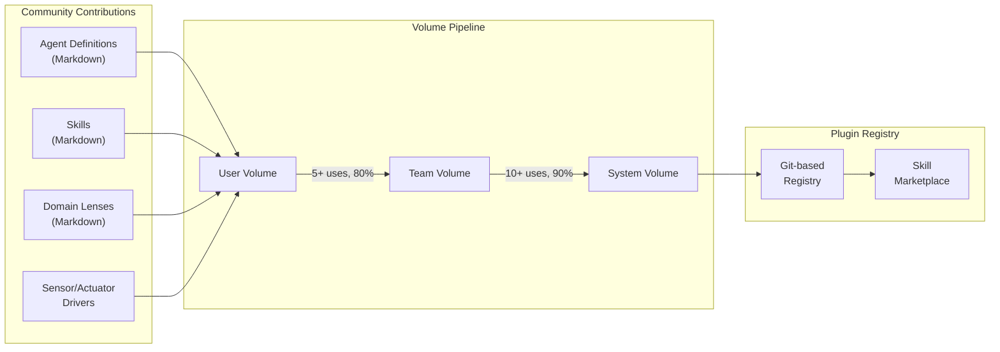
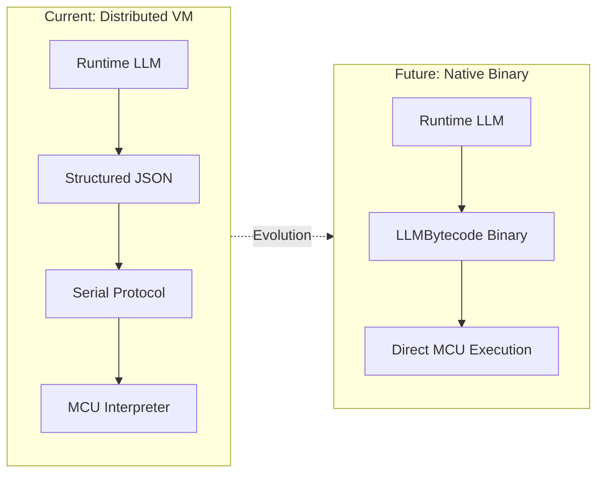

# LLMos Roadmap

**Vision**: An operating system running on the host machine that develops, deploys, and evolves AI agents operating in the physical world — using two LLMs: one for development and evolution (Claude Opus 4.6), another for real-time agent runtime (Qwen3-VL-8B).

---

## Dual-LLM Architecture Overview

---

## What Makes LLMos Different

- **Dual-LLM Architecture**: Development LLM (Claude Opus 4.6) for creating and evolving agents + Runtime LLM (Qwen3-VL-8B) for real-time physical agent control
- **Pure Markdown OS**: Agents, skills, memory, and kernel rules are all text files — human-readable, AI-writable, Git-versionable
- **Volume System**: Three-tier knowledge hierarchy (System / Team / User) with automatic skill promotion
- **Physical World Focus**: Not just chat — real motors, sensors, cameras, and robots
- **Dual-Brain Runtime**: Fast instinct (Qwen3-VL-8B single-pass) + deep planner (Qwen3-VL-8B + [RSA](https://arxiv.org/html/2509.26626v1))
- **Zero Cloud Dependency**: Runtime operates fully offline on a host computer with GPU
- **Swarm Intelligence**: Multiple robots merge world models via RSA consensus

---

## Development Phases

### Phase 1: Foundation (Q1 2026) — DONE

**Goal**: Working desktop application with ESP32 pipeline and full agent/volume/kernel system.

#### Milestone 1.1: Desktop Core — DONE
- [x] Electron + Next.js desktop application
- [x] Clean chat interface
- [x] File system integration
- [x] Streamlined for desktop-only

#### Milestone 1.2: ESP32 Pipeline — DONE
- [x] ESP32-S3 stepper motor firmware (`firmware/esp32-s3-stepper/`)
- [x] ESP32-CAM MJPEG firmware (`firmware/esp32-cam-mjpeg/`)
- [x] WiFi UDP transport for motor commands (`lib/hal/wifi-connection.ts`)
- [x] Stepper kinematics and calibration (`lib/hal/stepper-kinematics.ts`)
- [x] HAL physical adapter (`lib/hal/physical-adapter.ts`)

#### Milestone 1.3: Agent & Volume System — DONE
- [x] Pure markdown agent definitions with YAML frontmatter
- [x] 14+ system agents (SystemAgent, PlanningAgent, MutationAgent, etc.)
- [x] 20+ reusable skills in system volume
- [x] Three-tier volume system (System / Team / User)
- [x] Kernel as markdown (config, orchestration rules, evolution rules)
- [x] Skill promotion pipeline (User → Team → System)

#### Milestone 1.4: Polish & Reliability
- [ ] Error handling and user feedback
- [ ] Connection troubleshooting wizard
- [ ] Auto-recovery from failures

#### Milestone 1.5: The Web Frontier (Zero-Install Robotics)
**Goal**: Control hardware directly from the browser without installing Electron.

- [ ] HAL Refactor: `ElectronSerialAdapter` + `WebSerialAdapter`
- [ ] Browser "Connect to Robot" UI with capability checks
- [ ] `esptool-js` browser firmware flashing

---

### Phase 2: Navigation POC & Dual-Brain Intelligence (Q1-Q2 2026) — DONE

**Goal**: Wire the Dual-LLM architecture end-to-end. Claude Opus 4.6 develops agents, Qwen3-VL-8B runs them in real-time. Complete navigation stack with world model, LLM loop, vision pipeline, predictive intelligence, and fleet coordination.

This phase is driven by three key insights:
1. Cloud LLMs are too slow (~1-2s) and expensive (~$36/hr at 10Hz) for physical agent runtime
2. [RSA](https://arxiv.org/html/2509.26626v1) enables Qwen3-VL-8B to match o3-mini/DeepSeek-R1 reasoning quality for planning
3. A unified VLM (Qwen3-VL-8B) eliminates the need for separate object detection models at runtime

#### Milestone 2.1: Navigation Stack — DONE
- [x] `lib/runtime/world-model-serializer.ts` — RLE JSON, ASCII, patch serialization
- [x] `lib/runtime/world-model-bridge.ts` — Ground-truth bridge (Robot4World → grid)
- [x] `lib/runtime/candidate-generator.ts` — Subgoal candidates for LLM
- [x] `lib/runtime/map-renderer.ts` — Top-down PNG rendering
- [x] `lib/runtime/local-planner.ts` — A* pathfinding on occupancy grid
- [x] `lib/runtime/navigation-types.ts` — LLM I/O schemas + validation
- [x] `lib/runtime/navigation-loop.ts` — Top-level cycle orchestrator
- [x] `lib/runtime/navigation-runtime.ts` — NavigationRuntime with physics simulation

#### Milestone 2.2: Vision Pipeline — DONE
- [x] `lib/runtime/vision-simulator.ts` — GroundTruthVisionSimulator
- [x] `lib/runtime/vision-scene-bridge.ts` — VisionFrame → SceneGraph
- [x] `lib/runtime/sensor-bridge.ts` — VisionWorldModelBridge (observations only)
- [x] VisionFrame JSON output wired to world model updates
- [x] Vision pipeline end-to-end tested

#### Milestone 2.3: Multimodal RSA Engine — DONE
- [x] Implement RSA algorithm (`lib/runtime/rsa-engine.ts`)
- [x] Implement preset configurations (quick/standard/deep/swarm)
- [x] Add `RSAMultimodalProvider` interface for VLM-based RSA
- [x] Add `runWithImage()` method for multimodal RSA
- [x] Add `VISION_AGGREGATION_PROMPT` for visual cross-referencing
- [ ] Tune aggregation prompts for navigation tasks
- [ ] Benchmark multimodal RSA quality vs. single-pass vs. cloud LLM

#### Milestone 2.4: Predictive Intelligence & Fleet — DONE
- [x] `lib/runtime/predictive-world-model.ts` — Spatial heuristic predictions (wall continuation, corridor detection, open space expansion)
- [x] `lib/runtime/fleet-coordinator.ts` — Multi-robot fleet coordination + world model merging
- [x] `lib/runtime/navigation-hal-bridge.ts` — NavigationLoop → HAL execution bridge
- [x] `lib/runtime/navigation-ui-bridge.ts` — NavigationLoop → React UI state bridge
- [x] `lib/runtime/openrouter-inference.ts` — OpenRouter API adapter with vision + stats

#### Milestone 2.5: V1 Hardware Layer — DONE
- [x] `firmware/esp32-s3-stepper/esp32-s3-stepper.ino` — Motor controller, UDP JSON, odometry
- [x] `firmware/esp32-cam-mjpeg/esp32-cam-mjpeg.ino` — MJPEG camera streamer
- [x] `lib/hal/stepper-kinematics.ts` — 28BYJ-48 motor math
- [x] `lib/hal/wifi-connection.ts` — UDP transport layer
- [x] `lib/hal/firmware-safety-config.ts` — Motor safety limits
- [x] `lib/hal/serial-protocol.ts` — CRC-16 framing, ack/retry

#### Milestone 2.6: Testing — DONE
- [x] 346+ tests across 21 suites — all passing
- [x] Navigation end-to-end tests with 4 predefined arenas
- [x] 6/6 navigation criteria passed with live LLM inference
- [x] CLI demo: `npx tsx scripts/run-navigation.ts` (--all, --live, --vision)
- [ ] GitHub Actions CI pipeline

#### Milestone 2.7: Remaining Integration Work
- [ ] Wire escalation logic from DualBrainController to RSA engine
- [ ] Local Qwen3-VL-8B server setup (llama.cpp or vLLM)
- [ ] Automatic agent evolution from runtime execution traces
- [ ] Skill promotion from runtime patterns to volume system

---

### V1 Physical Deployment (Q1-Q2 2026) — IN PROGRESS

**Goal**: Deploy the LLMos navigation stack to the V1 Stepper Cube Robot physical hardware. Software layer is complete; this phase is about physical assembly, protocol validation, and sim-to-real closure.

#### Step 1: Physical Assembly & Kinematic Calibration
- [ ] 3D print the 8cm cube chassis from `Agent_Robot_Model/Robot_one/`
- [ ] Mount ESP32-S3, ESP32-CAM, ULN2003 drivers, 28BYJ-48 motors
- [ ] Install rear ball caster for low-friction third contact point
- [ ] Verify wheel dimensions match codebase constants (6cm diameter, 10cm wheel base)
- [ ] If wheels differ, calibrate via `{"cmd":"set_config","wheel_diameter_cm":F,"wheel_base_cm":F}`

#### Step 2: Communication Protocol Validation
- [ ] Flash ESP32-CAM with `firmware/esp32-cam-mjpeg/esp32-cam-mjpeg.ino`
- [ ] Validate MJPEG stream at `http://<IP>/stream` (320x240 @ 10fps)
- [ ] Flash ESP32-S3 with `firmware/esp32-s3-stepper/esp32-s3-stepper.ino`
- [ ] Validate UDP commands: `{"cmd":"move_cm","left_cm":10.0,"right_cm":10.0,"speed":500}` → 10cm forward
- [ ] Validate rotation: `{"cmd":"rotate_deg","degrees":90.0,"speed":1024}` → exact 90° turn

#### Step 3: LLMos Navigation Loop on Real Hardware
- [ ] Configure ESP32 IP addresses in runtime environment
- [ ] Run NavigationHALBridge with PhysicalHAL connected to V1 robot
- [ ] Validate movement commands stay within max speed (1024 steps/s)
- [ ] Test obstacle avoidance with real camera + VLM

#### Step 4: Spatial Memory & Odometry
- [ ] Continuous `get_status` polling for step-count odometry
- [ ] Dead-reckoning pose updates from differential drive math
- [ ] Wall detection → rotate response in physical environment
- [ ] Compare physical world model accuracy against measured ground truth

---

### Phase 3: Swarm Intelligence & Fleet (Q3 2026) — PARTIAL

**Goal**: Multiple robots collaborating via RSA-based consensus, with the Development LLM coordinating fleet strategy. The in-memory FleetCoordinator (world model merging, task assignment, frontier distribution) is implemented and tested. What remains is MQTT transport for physical robots.

#### Milestone 3.1: World Model Merging
- [ ] Add `mergeWith(otherModel, trustWeight)` to `WorldModel`
- [ ] Serialize `WorldModelSnapshot` for network transport
- [ ] Bayesian confidence fusion for conflicting observations
- [ ] Visualize merged model in 3D arena PiP view

#### Milestone 3.2: Fleet Communication
- [ ] MQTT transport for ESP32 fleet (native ESP-IDF support)
- [ ] Message protocol: `SNAPSHOT_SHARE`, `TASK_ASSIGN`, `HEARTBEAT`, `LEADER_ELECT`
- [ ] Wire `FleetConfig` leader-follower mode in `esp32-device-manager.ts`
- [ ] Fleet health dashboard with topology visualization

#### Milestone 3.3: RSA Swarm Consensus
- [ ] Run `swarmConsensus()` to merge robot observations
- [ ] Task distribution: RSA generates exploration assignments per robot
- [ ] Conflict resolution via trust-weighted aggregation
- [ ] Demo: 3 robots collectively map unknown environment

#### Milestone 3.4: Multi-Robot 3D Arena
- [ ] Extend `RobotCanvas3D.tsx` to render 2+ robots with distinct colors
- [ ] Show each robot's local world model vs. merged model
- [ ] Formation visualization and communication links

---

### Phase 4: Plugin Architecture & Community (Q4 2026)

**Goal**: Extensible system where community can contribute agents, skills, and domain lenses.

- [ ] Plugin manifest format (JSON + TypeScript/JavaScript)
- [ ] Git-based plugin registry
- [ ] Community skill marketplace
- [ ] Aggregation-aware RL training pipeline (per RSA paper Section 4)
- [ ] Custom domain lenses for mutation engine
- [ ] Third-party sensor driver plugins

---

### Phase 5: Native Binary Generation (2027+)

**Goal**: The Runtime LLM emits machine-level instruction blocks, removing all intermediate human-oriented representation.

| Sub-phase | Description | Status |
|---|---|---|
| Formal LLMBytecode Spec | Instruction categories, grammar, state model, safety invariants | In Progress |
| Embedded Interpreter | Formal VM on MCU with opcode table, replacing ad-hoc protocol | Planned |
| Static Compilation | Pre-validated instruction blocks, reduced runtime overhead | Planned |
| Native Binary Gen | LLM emits machine-level instructions, no intermediate representation | Research |

---

## Technology Stack

### Development Layer (Claude Opus 4.6)

| Component | Technology | Purpose |
|-----------|-----------|---------|
| LLM | Claude Opus 4.6 (via Claude Code) | Agent creation, evolution, orchestration |
| Interface | `/llmos` slash command | SystemAgent invocation |
| Agent Format | Markdown + YAML frontmatter | Agent definitions, skills, memory |
| Volume System | Local FS / Vercel Blob | Three-tier knowledge hierarchy |
| Kernel | Pure Markdown | Orchestration rules, config, schemas |

### Runtime Layer (Qwen3-VL-8B)

| Component | Technology | Purpose |
|-----------|-----------|---------|
| Vision + Language | [Qwen3-VL-8B-Instruct](https://huggingface.co/Qwen/Qwen3-VL-8B-Instruct) | Unified multimodal perception + reasoning |
| Instinct | Qwen3-VL-8B single-pass | Fast visual reasoning (~200-500ms) |
| Planner | Qwen3-VL-8B + Multimodal [RSA](https://arxiv.org/html/2509.26626v1) | Deep deliberative planning (3-8s) |
| Inference | [llama.cpp](https://github.com/ggerganov/llama.cpp) / [vLLM](https://github.com/vllm-project/vllm) / [OpenRouter](https://openrouter.ai/) | Local or cloud model serving |
| Depth | VLM spatial reasoning | Direct depth estimation from visual understanding |

### Application Layer

| Component | Technology | Purpose |
|-----------|-----------|---------|
| Framework | Next.js 14 | Application shell |
| Desktop | Electron | Native USB/FS access |
| Language | TypeScript | Type safety |
| State | Zustand | Lightweight state management |
| 3D | Three.js / React-Three-Fiber | Robot simulation arena |

### Hardware Layer (V1 Stepper Cube Robot)

| Component | Technology | Purpose |
|-----------|-----------|---------|
| Motor Controller | ESP32-S3-DevKitC-1 | Stepper motor control, WiFi UDP (port 4210) |
| Camera | ESP32-CAM (AI-Thinker) | MJPEG streaming, WiFi HTTP (port 80) |
| Motors | 2x 28BYJ-48 + ULN2003 | Differential drive, 4096 steps/rev |
| Kinematics | `lib/hal/stepper-kinematics.ts` | Step/distance conversion, differential drive math |
| WiFi Transport | `lib/hal/wifi-connection.ts` | UDP JSON commands, 2s timeout, 3 retries |
| Serial Protocol | `lib/hal/serial-protocol.ts` | CRC-16 framing, sequence numbers |
| Safety | `lib/hal/firmware-safety-config.ts` | Host heartbeat, max steps, coil current |
| Desktop Serial | `node-serialport` | Automatic device detection |
| Web Serial | `navigator.serial` | Browser-based robot control |
| Fleet Protocol | MQTT (planned) | Multi-robot communication |

---

## Key Research References

| Paper / Model | How We Use It |
|-------|---------------|
| [Qwen3-VL-8B-Instruct](https://huggingface.co/Qwen/Qwen3-VL-8B-Instruct) | Runtime LLM — unified vision-language backbone for physical agent perception and decision-making |
| [RSA: Recursive Self-Aggregation](https://arxiv.org/html/2509.26626v1) | Planner brain — multimodal RSA cross-references visual observations for deep planning |
| [JEPA: Joint Embedding Predictive Architecture](https://openreview.net/forum?id=BZ5a1r-kVsf) | Mental model — predict-before-act paradigm for abstract state |
| LLM OS thesis (Karpathy, 2023-2025) | Foundational concept — LLMs as kernel processes, extended to physical microcontrollers |

---

## The Vision

```mermaid
graph TB
    subgraph TODAY["Today"]
        H["Human Developer"]
        IDE["Heavy IDE"]
        CODE["C++/Python Code"]
        COMPILE["Compile & Flash"]
        ROBOT_TODAY["Single Robot"]
    end

    subgraph TOMORROW["Tomorrow with LLMos"]
        USER["Human (plain English)"]
        DEV_AI["Claude Opus 4.6<br/>Creates & evolves agents"]
        MARKDOWN["Markdown Agents<br/>Self-improving"]
        RUNTIME_AI["Qwen3-VL-8B<br/>Real-time control"]
        FLEET_TOMORROW["Robot Fleet<br/>Shared intelligence"]
    end

    H --> IDE --> CODE --> COMPILE --> ROBOT_TODAY
    USER --> DEV_AI --> MARKDOWN --> RUNTIME_AI --> FLEET_TOMORROW

    style TODAY fill:#450a0a,color:#fff
    style TOMORROW fill:#052e16,color:#fff
```

**Today**: Programming robots requires learning C++, installing heavy IDEs, and manually coding every behavior. Cloud AI is too slow and expensive for real-time physical agents.

**Tomorrow with LLMos**: Describe what you want in plain English. Claude Opus 4.6 creates and evolves the agents as markdown files. Qwen3-VL-8B runs them in real-time on local GPU — seeing, reasoning, and acting in the physical world. Agents learn from every interaction, promote successful patterns through the volume system, and coordinate as swarms. No cloud dependency for runtime. No coding. No limits.
