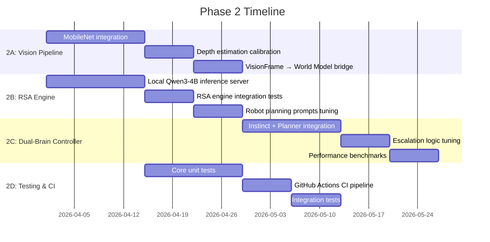
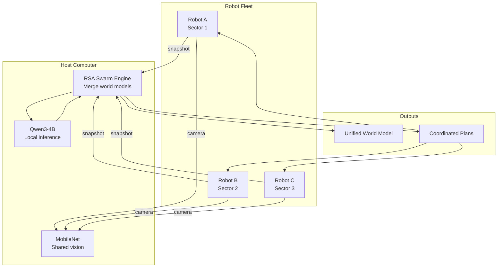

# LLMos Roadmap

**Vision**: An operating system where AI agents control physical hardware through natural language — with a Dual-Brain architecture that reasons deeply and reacts instantly, all running locally.

Talk to AI. Robots listen. That simple.

---

## Project Goals

### Core Mission
Make robotics accessible to everyone. No coding required, just describe what you want.

### What Makes LLMos Different
- **Natural Language First**: Describe your robot's behavior in plain English
- **Physical World Focus**: Not just chat - real motors, sensors, and robots
- **Dual-Brain Architecture**: Fast instinct (MobileNet + LLM single-pass) + deep planner ([RSA](https://arxiv.org/html/2509.26626v1) + LLM)
- **Zero Cloud Dependency**: Runs fully offline on a host computer with GPU — no API costs
- **Hybrid Runtime**: Run natively on Desktop or directly in the Browser via Web Serial
- **Swarm Intelligence**: Multiple robots merge world models via RSA consensus

---

## Development Phases

### Phase 1: Foundation (Q1 2026) — CURRENT
**Goal**: One amazing workflow that works perfectly

#### Milestone 1.1: Desktop Core (Weeks 1-2) — DONE
- [x] Electron + Next.js desktop application
- [x] Clean chat interface
- [x] File system integration
- [x] Streamlined for desktop-only (remove web compilation)

#### Milestone 1.2: ESP32 Pipeline (Weeks 3-4)
- [ ] USB serial connection and device detection (Electron)
- [ ] One-click firmware flashing
- [ ] Natural language → C code generation
- [ ] Test workflow: "avoid walls" → working robot

#### Milestone 1.3: Polish & Reliability (Weeks 5-6)
- [ ] Error handling and user feedback
- [ ] Connection troubleshooting wizard
- [ ] Auto-recovery from failures

#### Milestone 1.5: The Web Frontier (Zero-Install Robotics) (Weeks 6-7)
**Goal**: Control hardware directly from `llmos.vercel.app` without installing Electron.

- [ ] HAL Refactor: `ElectronSerialAdapter` + `WebSerialAdapter`
- [ ] Browser "Connect to Robot" UI with capability checks
- [ ] `esptool-js` browser firmware flashing

---

### Phase 2: Dual-Brain & Local Intelligence (Q2 2026)
**Goal**: Replace cloud LLM dependency with local Dual-Brain architecture

This phase is driven by two key insights:
1. Cloud LLMs are too slow (~1-2s) and expensive (~$36/hr at 10Hz) for physical agents
2. [RSA](https://arxiv.org/html/2509.26626v1) enables Qwen3-4B to match o3-mini/DeepSeek-R1 reasoning quality

#### Milestone 2.1: MobileNet Vision Pipeline
- [ ] Integrate TensorFlow.js [COCO-SSD](https://github.com/tensorflow/tfjs-models/tree/master/coco-ssd) model
- [ ] Implement depth estimation (known object sizes + bbox area + floor position)
- [ ] Wire `VisionFrame` JSON output to world model updates
- [ ] Calibrate depth estimation for ESP32-CAM (OV2640 lens)
- [ ] Benchmark: <50ms per frame on host GPU

**Success criteria**: Robot can detect "chair at 120cm on the left" from a camera frame in <50ms

#### Milestone 2.2: Local LLM Inference
- [ ] Set up [llama.cpp](https://github.com/ggerganov/llama.cpp) or [vLLM](https://github.com/vllm-project/vllm) server on host
- [ ] Load [Qwen3-4B-Instruct](https://huggingface.co/Qwen/Qwen3-4B-Instruct) (Q4_K_M quantization)
- [ ] Implement `RSAInferenceProvider` adapter for local server
- [ ] Benchmark: <200ms for single-pass, <3s for RSA quick preset
- [ ] Fallback to cloud API when local model unavailable

**Success criteria**: Robot operates fully offline with local Qwen3-4B

#### Milestone 2.3: RSA Engine Integration
- [x] Implement RSA algorithm (`lib/runtime/rsa-engine.ts`)
- [x] Implement preset configurations (quick/standard/deep/swarm)
- [ ] Integration tests with robot planning scenarios
- [ ] Tune aggregation prompts for navigation tasks
- [ ] Benchmark RSA quality vs. single-pass vs. cloud LLM
- [ ] Implement swarm consensus mode for multi-robot

**Success criteria**: RSA `quick` preset (N=4, K=2, T=2) solves stuck-robot scenarios that single-pass fails on

#### Milestone 2.4: Dual-Brain Controller
- [x] Implement `DualBrainController` (`lib/runtime/dual-brain-controller.ts`)
- [x] Implement reactive instinct rules
- [ ] Wire escalation logic to RSA engine
- [ ] Implement async planning (planner runs in background while instinct acts)
- [ ] Add brain-decision tracking to black-box recorder
- [ ] Dashboard: show which brain made each decision with latency

**Success criteria**: Robot navigates complex environment using instinct for reactive avoidance and planner for goal-directed exploration

#### Milestone 2.5: Testing & CI
- [ ] Unit tests: world model, JEPA, HAL validator, skill parser, RSA engine
- [ ] GitHub Actions: lint → type-check → test → build on every PR
- [ ] Integration test: spawn robot → set goal → verify world model updates

---

### Phase 3: Swarm Intelligence & Fleet (Q3 2026)
**Goal**: Multiple robots collaborating via RSA-based consensus

#### Milestone 3.1: World Model Merging
- [ ] Add `mergeWith(otherModel, trustWeight)` to `WorldModel`
- [ ] Serialize `WorldModelSnapshot` for network transport
- [ ] Bayesian confidence fusion for conflicting observations
- [ ] Visualize merged model in 3D arena PiP view

#### Milestone 3.2: Fleet Communication
- [ ] MQTT transport for ESP32 fleet (native ESP-IDF support)
- [ ] Message protocol: `SNAPSHOT_SHARE`, `TASK_ASSIGN`, `HEARTBEAT`, `LEADER_ELECT`
- [ ] Wire `FleetConfig` leader-follower mode in `esp32-device-manager.ts`
- [ ] Fleet health dashboard with topology visualization

#### Milestone 3.3: RSA Swarm Consensus
- [ ] Run `swarmConsensus()` to merge robot observations
- [ ] Task distribution: RSA generates exploration assignments per robot
- [ ] Conflict resolution via trust-weighted aggregation
- [ ] Demo: 3 robots collectively map unknown environment

#### Milestone 3.4: Multi-Robot 3D Arena
- [ ] Extend `RobotCanvas3D.tsx` to render 2+ robots with distinct colors
- [ ] Show each robot's local world model vs. merged model
- [ ] Formation visualization and communication links

---

### Phase 4: Plugin Architecture & Community (Q4 2026)
**Goal**: Extensible system where community can contribute

- [ ] Plugin manifest format (JSON + TypeScript/JavaScript)
- [ ] Git-based plugin registry
- [ ] Community skill marketplace
- [ ] Aggregation-aware RL training pipeline (per RSA paper Section 4)
- [ ] Custom domain lenses for mutation engine
- [ ] Third-party sensor driver plugins

---

## Technology Stack

### Core Application
| Component | Technology | Purpose |
|-----------|-----------|---------|
| Framework | Next.js 14 | Application shell |
| Desktop | Electron | Native USB/FS access |
| Language | TypeScript | Type safety |
| State | Zustand | Lightweight state management |
| 3D | Three.js / React-Three-Fiber | Robot simulation arena |

### Dual-Brain Intelligence
| Component | Technology | Purpose |
|-----------|-----------|---------|
| Vision | [MobileNet SSD](https://arxiv.org/abs/1801.04381) via TensorFlow.js | Local object detection (~30ms) |
| Instinct | [Qwen3-4B-Instruct](https://huggingface.co/Qwen/Qwen3-4B-Instruct) | Fast single-pass reasoning (~200ms) |
| Planner | Qwen3-4B + [RSA](https://arxiv.org/html/2509.26626v1) | Deep deliberative planning (2-22s) |
| Inference | [llama.cpp](https://github.com/ggerganov/llama.cpp) / [vLLM](https://github.com/vllm-project/vllm) | Local model serving |
| Depth | Pinhole camera model + heuristics | BBox-based depth estimation |

### Hardware Integration
| Component | Technology | Purpose |
|-----------|-----------|---------|
| Desktop Serial | `node-serialport` | Automatic device detection |
| Web Serial | `navigator.serial` | Browser-based robot control |
| Flashing | `esptool.js` / `esptool.py` | Firmware deployment |
| Fleet Protocol | MQTT | Multi-robot communication |
| Microcontroller | ESP32-S3 | Robot hardware |

### Runtimes
| Runtime | Technology | Purpose |
|---------|-----------|---------|
| Python | Pyodide 0.29+ | Scientific computing in browser |
| JavaScript | QuickJS | Sandboxed execution |
| C/WASM | Wasmer SDK + Clang | Firmware compilation |
| Robot4 | Custom | 60Hz firmware simulator |

---

## Key Research References

| Paper | How We Use It |
|-------|---------------|
| [RSA: Recursive Self-Aggregation](https://arxiv.org/html/2509.26626v1) | Planner brain — small LLM matches large model quality |
| [JEPA: Joint Embedding Predictive Architecture](https://openreview.net/forum?id=BZ5a1r-kVsf) | Mental model — predict-before-act paradigm |
| [MobileNet V2](https://arxiv.org/abs/1801.04381) | Vision pipeline — fast local object detection |
| [MobileNet SSD](https://arxiv.org/abs/1704.04861) | Object detection backbone |

---

## The Vision

**Today**: Programming robots requires weeks of learning and installing heavy IDEs. Cloud AI is too slow and expensive for physical agents.

**Tomorrow with LLMos**: Describe what you want in plain English. A Dual-Brain architecture reasons deeply (RSA planner) and reacts instantly (instinct), all running locally on a $200 GPU. Swarms of robots share knowledge through RSA consensus. No cloud. No coding. No limits.
