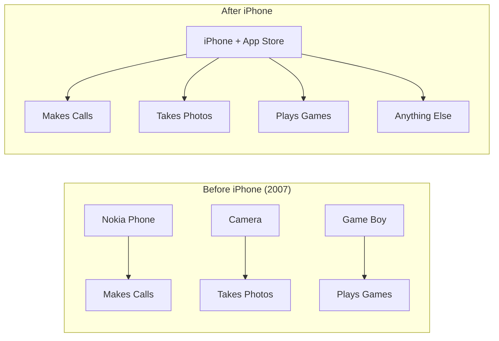
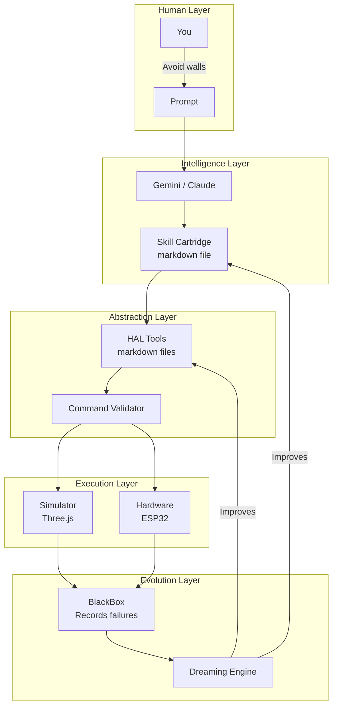
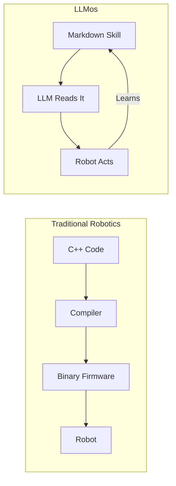
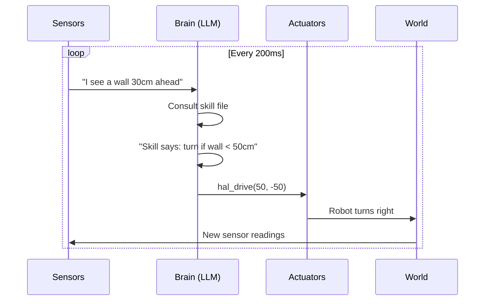
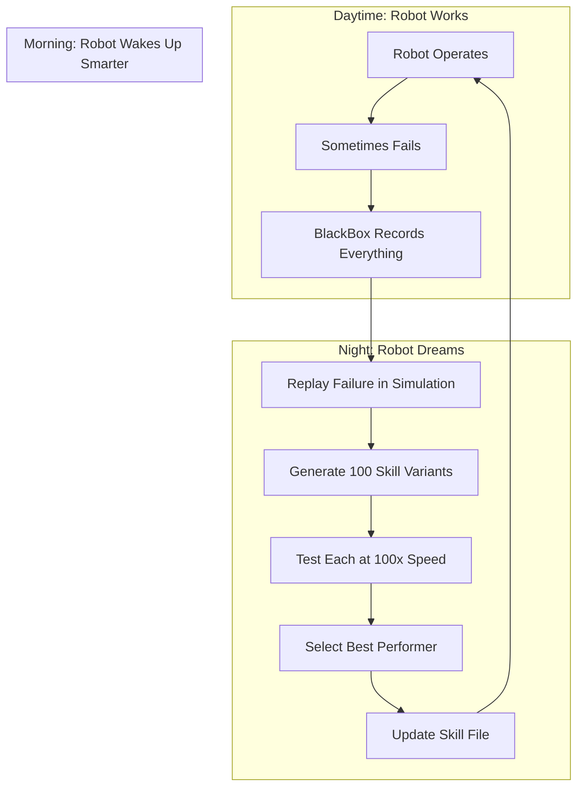
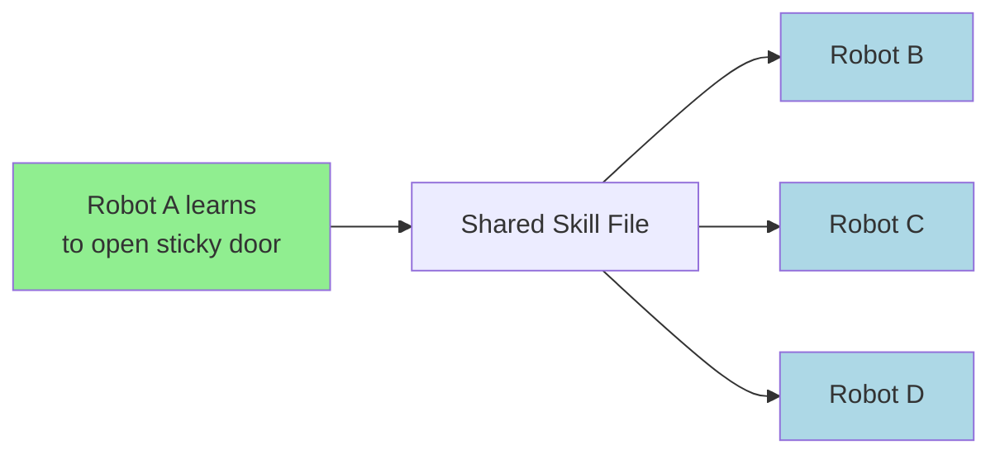
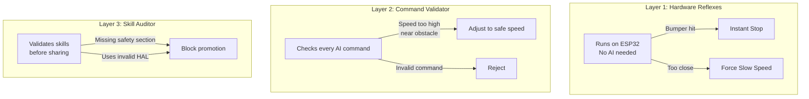
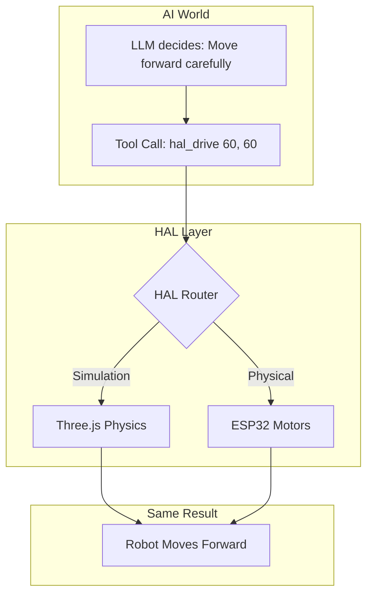
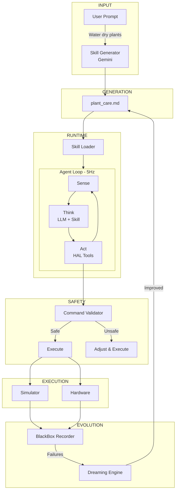
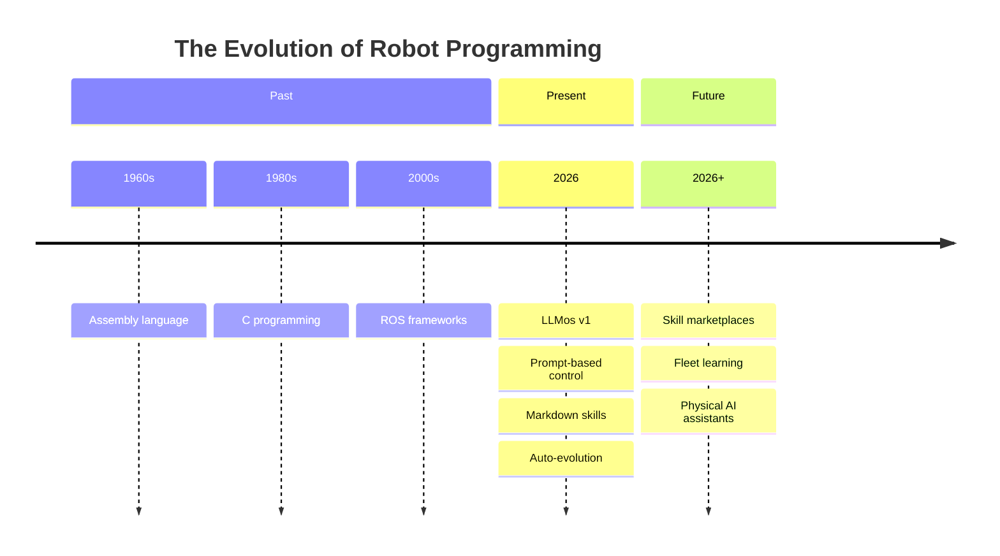

# AI Physical Agents: The Smartphone Moment for Robotics

**Why we're building robots that program themselves—and why it matters.**

---

> **🚧 In Active Development**: LLMos compiles and core features work. We're wiring everything together now. Expect full functionality within days, not weeks. Jump in early or wait for the dust to settle—your choice.

---

## Why This, Why Now

Three things converged that made this possible:

1. **LLMs got good at reasoning** — Not just text. Vision, planning, tool use.
2. **Hardware got cheap** — A robot brain costs $10 now, not $1000.
3. **The abstraction was missing** — Nobody built the "operating system" layer.

We're building that layer.

---

## The Core Insight

Robotics today is like phones before the App Store.



**Robots today**: Buy a vacuum robot, it vacuums. Buy a different robot, it waters plants. Each machine = one job.

**Robots with LLMos**: One robot. Download a skill. Now it vacuums. Download another skill. Now it waters plants. Same hardware, infinite purposes.

The hardware is the screen. The skill is the app.

---

## The Architecture



Every layer is designed to be:
- **Readable** by humans
- **Readable** by AI
- **Evolvable** automatically

---

## Core Concept #1: Everything is Text

In LLMos, robot behaviors aren't compiled binaries. They're markdown files.



**Why this matters:**

| Traditional | LLMos |
|-------------|-------|
| Change requires recompile | Change requires editing text |
| Only engineers can modify | Anyone can modify |
| Robot can't improve itself | Robot can rewrite its own skills |
| Knowledge stuck in one robot | Knowledge spreads via file sharing |

---

## Core Concept #2: The Sense-Think-Act Loop

Every AI physical agent runs a continuous loop:



The magic is in the "Brain" step. Traditional robots use if/else logic. LLMos uses natural language reasoning:

```
Traditional: if (distance < 30) { turn(); }

LLMos: "I see a wall getting closer. My skill says to maintain
        20cm distance. I should turn right slightly to correct."
```

The LLM *understands* the situation. It doesn't just react to numbers.

---

## Core Concept #3: Auto-Evolution

This is what makes LLMos different from every other robot framework.



**The robot improves while it sleeps.**

No human intervention. No retraining. The system:
1. Identifies what went wrong
2. Hypothesizes alternatives
3. Tests them in simulation
4. Deploys the winner

And because skills are just files, improvements can spread:



One robot's lesson becomes every robot's knowledge.

---

## Core Concept #4: Safety as Architecture

Self-improving robots need guardrails. We built safety into every layer:



The AI proposes. Multiple safety layers dispose.

---

## Core Concept #5: The HAL Abstraction

Hardware Abstraction Layer (HAL) is the bridge between AI intent and physical action:



Write once, run everywhere. Test in simulation, deploy to hardware.

---

## The Full Picture



---

## Why We're Building This

The barrier to robotics isn't hardware anymore. You can buy:
- Robot brain (ESP32): $10
- Motors: $5
- Sensors: $5

**The barrier is programming.**

Teaching a robot to do something new means:
- Hiring engineers ($$$)
- Writing C++ (months)
- Testing carefully (more months)
- Maintaining forever

LLMos inverts this:
- Anyone can write a prompt
- AI generates the implementation
- Simulation tests it instantly
- Robot improves itself

**We're democratizing physical AI.**

---

## Current Status

| Component | Status |
|-----------|--------|
| 3D Simulator | ✅ Working |
| Skill Generation | ✅ Working |
| HAL (TypeScript) | ✅ Working |
| HAL (Markdown) | ✅ Working |
| Command Validator | ✅ Working |
| Hardware Reflexes | ✅ Working |
| Physics Simulation | ✅ Working |
| BlackBox Recorder | ✅ Working |
| Agentic Auditor | ✅ Working |
| Dreaming Engine | 🔄 Integration in progress |
| ESP32 Hardware | 🔄 Integration in progress |
| Multi-robot | 📋 Planned |

**The code compiles. Core features work. We're connecting the pieces.**

Full functionality coming in days, not weeks.

---

## The Vision



We're building the App Store for the real world.

Download a skill. Your robot becomes a gardener, a security guard, a pet sitter, a warehouse worker.

One robot. Infinite trades.

---

## Get Involved

```bash
git clone https://github.com/EvolvingAgentsLabs/llmos
cd llmos && npm install && npm run dev
```

Open `localhost:3000`. Type a prompt. Watch the future.

We're building in public. The construction site is open.

---

**GitHub**: [github.com/EvolvingAgentsLabs/llmos](https://github.com/EvolvingAgentsLabs/llmos)

*Apache 2.0 Licensed. Built by makers, for makers.*

---

**Tags**: #LLMos #PhysicalAI #Robotics #AutoEvolution #AI #OpenSource
