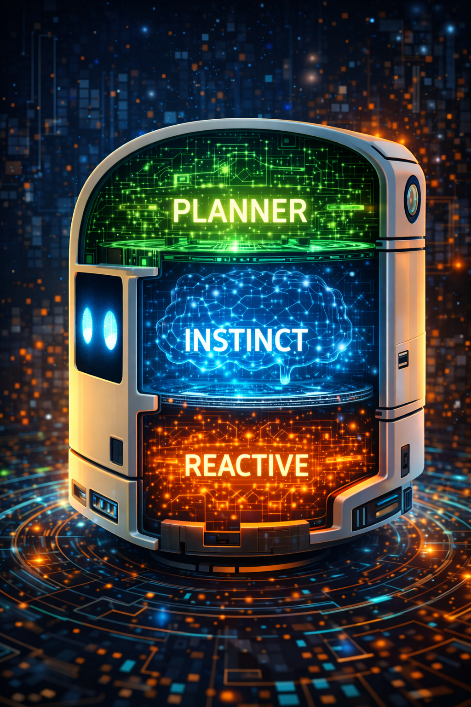

# Chapter 5: The Dual Brain -- Instinct, Planning, and Escalation



<!-- IMAGE_PROMPT: Isometric digital illustration, clean technical style, dark navy (#0d1117) background, soft neon accent lighting in cyan and magenta, a small wheeled robot with a glowing blue eye sensor as recurring character, flat vector aesthetic with subtle depth, no photorealism, 16:9 aspect ratio. Robot head in cross-section with three stacked layers. Bottom (green, fastest): Reactive Instinct with reflex arcs. Middle (yellow): LLM Instinct with neural pattern. Top (red, slowest): RSA Planner with branching thought chains. Arrow labeled "Escalation" points upward. -->

---

Every animal with a nervous system faces the same dilemma: react instantly to avoid
danger, or pause to think and risk being too slow. A cockroach that deliberates about
a shadow does not survive. A chess player who acts on reflex alone loses every game.
Evolution solved this with layered brains -- a fast, hardwired reactive system and a
slower, flexible planning system, with escalation pathways between them. LLMos solves
it the same way. The `DualBrainController` is the switchboard that decides, ten times
per second, whether the robot should trust its instincts or stop and think.

---

## The Three-Layer Architecture

The Dual-Brain Controller (`lib/runtime/dual-brain-controller.ts`) implements a
three-layer cognitive architecture. Each layer is slower but more capable than the
one above it, and the controller routes decisions to the cheapest layer that can
handle the situation.

| Layer | Name | Mechanism | Latency | When Used |
|-------|------|-----------|---------|-----------|
| 1 | Reactive Instinct | Rule-based, no LLM | <5ms | Imminent collision, clear path, wall following |
| 2 | LLM Instinct | Single-pass Qwen3-VL-8B | ~200-500ms | Ambiguous situations, no reactive rule matches |
| 3 | Planner (RSA) | Recursive Self-Aggregation | ~3-22s | Stuck, looping, unknown objects, complex goals |

The design mirrors Kahneman's System 1 / System 2 distinction, but adds a third
tier: the RSA planner, which is not just "slow thinking" but "crowd-sourced thinking"
-- multiple independent reasoning chains aggregated into a consensus plan.

---

## Layer 1: Reactive Instinct

The `reactiveInstinct()` function is a pure, stateless function. No LLM, no network
call, no async. It takes sensor distances and returns an action in under 5 milliseconds.
This is the safety floor -- even if the LLM is down, the network is unreachable, and
the planning engine is overloaded, the robot will not drive into a wall.

The rules are evaluated in priority order:

1. **Emergency** (front < 15cm): Turn toward the clearest side, or back up if both sides are blocked.
2. **Clear path** (front > 80cm, sides > 30cm): Move forward with confidence 0.85.
3. **Wall following** (front > 40cm, left wall 15-40cm): Move forward, tracking the left wall.
4. **Moderate obstacle** (front < 40cm): Turn toward the clearer side.
5. **No match**: Return `null` -- signal escalation to a higher layer.

The implementation in `lib/runtime/dual-brain-controller.ts`:

```typescript
export function reactiveInstinct(
  sensorData: {
    front: number;
    left: number;
    right: number;
    back: number;
  },
  visionFrame?: VisionFrame | null,
  config: DualBrainConfig = DEFAULT_DUAL_BRAIN_CONFIG
): { action: RobotAction; confidence: number; reasoning: string } | null {
  // Emergency: imminent collision
  if (sensorData.front < config.emergencyDistanceCm) {
    // Choose best escape direction
    if (sensorData.left > sensorData.right && sensorData.left > 30) {
      return {
        action: 'turn_left',
        confidence: 0.95,
        reasoning: `Emergency: front obstacle at ${sensorData.front}cm. Turning left (${sensorData.left}cm clear).`,
      };
    }
    if (sensorData.right > 30) {
      return {
        action: 'turn_right',
        confidence: 0.95,
        reasoning: `Emergency: front obstacle at ${sensorData.front}cm. Turning right (${sensorData.right}cm clear).`,
      };
    }
    return {
      action: 'backup',
      confidence: 0.9,
      reasoning: `Emergency: front obstacle at ${sensorData.front}cm, sides blocked. Backing up.`,
    };
  }

  // Clear path ahead — simple case
  if (sensorData.front > 80 && sensorData.left > 30 && sensorData.right > 30) {
    return {
      action: 'move_forward',
      confidence: 0.85,
      reasoning: `Clear path: front=${sensorData.front}cm, no obstacles nearby.`,
    };
  }

  // Wall following (left-hand rule)
  if (sensorData.front > 40 && sensorData.left < 40 && sensorData.left > 15) {
    return {
      action: 'move_forward',
      confidence: 0.7,
      reasoning: `Wall following: maintaining left wall at ${sensorData.left}cm.`,
    };
  }

  // Moderate obstacle ahead — simple avoidance
  if (sensorData.front < 40) {
    if (sensorData.left > sensorData.right) {
      return {
        action: 'turn_left',
        confidence: 0.7,
        reasoning: `Obstacle ahead at ${sensorData.front}cm. Left is clearer.`,
      };
    }
    return {
      action: 'turn_right',
      confidence: 0.7,
      reasoning: `Obstacle ahead at ${sensorData.front}cm. Right is clearer.`,
    };
  }

  // No clear reactive rule — return null to signal escalation to LLM instinct
  return null;
}
```

The key design decision: reactive instinct only fires when confidence exceeds 0.85.
If the reactive layer returns a result but at lower confidence (e.g., 0.7 for wall
following), the controller may still escalate to a higher layer. The reactive result
is kept as a fallback in case all higher layers fail.

---

## The Decision Flow

The `decide()` method is the main entry point, called every sensing cycle at
approximately 10Hz. It orchestrates the three layers with a clear priority chain:

```typescript
async decide(context): Promise<BrainDecision> {
  const startTime = Date.now();
  this.cycleCount++;

  // --- Layer 1: Reactive instinct (rule-based, <5ms) ---
  const reactiveResult = reactiveInstinct(
    context.sensorData,
    context.visionFrame,
    this.config
  );

  if (reactiveResult && reactiveResult.confidence > 0.85) {
    const decision: BrainDecision = {
      brain: 'instinct',
      actions: [reactiveResult.action],
      reasoning: `[REACTIVE] ${reactiveResult.reasoning}`,
      confidence: reactiveResult.confidence,
      timestamp: Date.now(),
      latencyMs: Date.now() - startTime,
    };
    this.recordDecision(decision);
    return decision;
  }

  // --- Check escalation conditions ---
  const escalationReason = this.checkEscalation(context);

  // --- Layer 2: Planner (RSA) if escalated ---
  if (escalationReason && this.rsaEngine) {
    return this.runPlanner(context, escalationReason, startTime);
  }

  // --- Layer 3: LLM instinct (single-pass, ~200ms) ---
  if (this.instinctProvider) {
    return this.runLLMInstinct(context, startTime);
  }

  // --- Fallback: use reactive result even at lower confidence ---
  if (reactiveResult) {
    return { brain: 'instinct', actions: [reactiveResult.action], ... };
  }

  // --- Last resort: stop ---
  return {
    brain: 'instinct',
    actions: ['stop'],
    reasoning: '[SAFETY] No brain available and no reactive rule matched. Stopping.',
    confidence: 0.3,
    ...
  };
}
```

Notice the ordering: the planner (Layer 3 in the conceptual architecture) is checked
*before* the LLM instinct (Layer 2). This is intentional. If escalation conditions
are met, the situation is complex enough that a single LLM pass will not suffice.
The LLM instinct is the default for ambiguous-but-not-critical situations.

---

## Escalation: When Instinct Is Not Enough

The `checkEscalation()` method evaluates six conditions that trigger a switch from
the fast instinct layer to the deep planning layer:

| Condition | Detection Method | Threshold |
|-----------|-----------------|-----------|
| `stuck` | Same position for N seconds | `stuckTimeoutSeconds` (default: 5s) |
| `looping` | World model detects repeated cell visits | `loopingVisitThreshold` (default: 3 visits) |
| `frontier_exhaustion` | Most area explored, few frontiers left | 85% explored + <5 frontiers |
| `unknown_object` | VLM detection below confidence threshold | `visionConfidenceThreshold` (default: 0.5) |
| `periodic_replan` | Every N cycles | `periodicReplanInterval` (default: 50 cycles) |
| `goal_requires_plan` | Goal text contains complex keywords | "find", "explore", "collect", "bring", etc. |

The stuck detection uses a distance threshold of 0.05 meters -- if the robot has not
moved more than 5cm in `stuckTimeoutSeconds`, it is considered stuck.

The world-model-aware escalations (`looping` and `frontier_exhaustion`) are provided
by the `WorldModelProvider` (`lib/runtime/world-model-provider.ts`), which tracks cell
visit counts and exploration percentages. This is a key integration point: the world
model is not just a passive data structure, it actively participates in decision-making
by signaling when behavioral patterns indicate a problem.

---

## The BrainDecision Type

Every decision from the controller has the same shape, regardless of which layer
produced it:

```typescript
export interface BrainDecision {
  /** Which brain produced this decision. */
  brain: BrainMode;
  /** The selected action(s). */
  actions: RobotAction[];
  /** Reasoning behind the decision. */
  reasoning: string;
  /** Confidence in this decision (0-1). */
  confidence: number;
  /** If escalated, why. */
  escalationReason?: EscalationReason;
  /** If planner was used, the full RSA result. */
  rsaResult?: RSAResult;
  /** Timestamp of decision. */
  timestamp: number;
  /** Latency in ms. */
  latencyMs: number;
}
```

The `brain` field is one of `'instinct'`, `'planner'`, or `'hybrid'`. The hybrid mode
appears when the planner has produced a multi-step plan and the controller is executing
cached steps -- the original plan came from the planner, but the individual step
execution is instinct-speed.

The `EscalationReason` type captures all possible triggers:

```typescript
export type EscalationReason =
  | 'unknown_object'
  | 'stuck'
  | 'goal_requires_plan'
  | 'low_confidence'
  | 'new_area'
  | 'fleet_coordination'
  | 'user_request'
  | 'periodic_replan'
  | 'looping'
  | 'frontier_exhaustion';
```

---

## Configuration

The `DualBrainConfig` controls all thresholds and tuning parameters:

```typescript
export interface DualBrainConfig {
  /** Below this instinct confidence, escalate to planner (0-1). */
  confidenceThreshold: number;
  /** Below this MobileNet detection confidence, escalate (0-1). */
  visionConfidenceThreshold: number;
  /** Seconds of no movement before declaring "stuck". */
  stuckTimeoutSeconds: number;
  /** Maximum latency (ms) for instinct decisions. */
  instinctMaxLatencyMs: number;
  /** How often (in sensing cycles) to force a planner replan. 0 = never. */
  periodicReplanInterval: number;
  /** Whether planner runs in background while instinct acts. */
  asyncPlanning: boolean;
  /** Distance threshold (cm) that triggers emergency instinct override. */
  emergencyDistanceCm: number;
  /** RSA preset to use for planner ('quick' | 'standard' | 'deep'). */
  rsaPreset: string;
}

export const DEFAULT_DUAL_BRAIN_CONFIG: DualBrainConfig = {
  confidenceThreshold: 0.4,
  visionConfidenceThreshold: 0.5,
  stuckTimeoutSeconds: 5,
  instinctMaxLatencyMs: 500,
  periodicReplanInterval: 50,  // Every 50 cycles (~5 seconds at 10Hz)
  asyncPlanning: true,
  emergencyDistanceCm: 15,
  rsaPreset: 'quick',
};
```

---

## The RSA Engine: Deep Planning

When the controller escalates to the planner, it invokes the RSA Engine
(`lib/runtime/rsa-engine.ts`). RSA -- Recursive Self-Aggregation -- is an algorithm
from the 2025 paper by Venkatraman, Jain, Mittal et al. that combines parallel and
sequential reasoning to improve LLM output quality at inference time.

The core idea is evolutionary: maintain a population of N candidate solutions, sample
K of them, ask the LLM to aggregate them into an improved solution, and repeat for T
steps. Even with K=2, the paper shows massive improvement over single-pass inference.

### RSA Presets

LLMos defines four presets tuned for different robotics scenarios:

| Preset | N (Pop) | K (Agg) | T (Steps) | Est. Latency | Use Case |
|--------|---------|---------|-----------|--------------|----------|
| `quick` | 4 | 2 | 2 | ~2.5s | Robot stuck, needs fast replan |
| `standard` | 8 | 3 | 4 | ~8s | New area exploration, goal planning |
| `deep` | 16 | 4 | 6 | ~22s | Complex multi-step goals, skill generation |
| `swarm` | Fleet size | Fleet size | 3 | Varies | Multi-robot consensus (each robot = one candidate) |

```typescript
export const RSA_PRESETS: Record<string, RSAConfig> = {
  quick: {
    populationSize: 4,
    aggregationSize: 2,
    maxSteps: 2,
    consensusThreshold: 0.9,
    maxTokensPerCandidate: 512,
    initialTemperature: 0.8,
    aggregationTemperature: 0.4,
    useMajorityVoting: false,
  },
  standard: {
    populationSize: 8,
    aggregationSize: 3,
    maxSteps: 4,
    consensusThreshold: 0.85,
    maxTokensPerCandidate: 1024,
    initialTemperature: 0.9,
    aggregationTemperature: 0.5,
    useMajorityVoting: false,
  },
  deep: {
    populationSize: 16,
    aggregationSize: 4,
    maxSteps: 6,
    consensusThreshold: 0.8,
    maxTokensPerCandidate: 2048,
    initialTemperature: 1.0,
    aggregationTemperature: 0.5,
    useMajorityVoting: true,
  },
  swarm: {
    populationSize: 4,  // Override with actual fleet size
    aggregationSize: 4, // Override with fleet size
    maxSteps: 3,
    consensusThreshold: 0.8,
    maxTokensPerCandidate: 1024,
    initialTemperature: 0.7,
    aggregationTemperature: 0.3,
    useMajorityVoting: true,
  },
};
```

### The Aggregation Prompt

The aggregation step is where RSA's power comes from. The model receives K candidate
solutions and must produce an improved synthesis. The general-purpose aggregation
prompt follows the format from Appendix F of the RSA paper:

```typescript
export const AGGREGATION_PROMPT = `You are given a problem and a set of candidate
solutions. Your task is to produce an improved solution by:

1. Identifying correct reasoning steps across ALL candidates
2. Recognizing and discarding errors or flawed logic
3. Combining the strongest elements into a single, coherent solution
4. Adding any missing reasoning steps needed for correctness

IMPORTANT: Even candidates with wrong final answers may contain correct intermediate
steps. Extract and reuse those valuable fragments.

## Problem
{PROBLEM}

## Candidate Solutions
{CANDIDATES}

## Your Task
Produce a single improved solution. Think step by step:
1. What did each candidate get RIGHT?
2. What did each candidate get WRONG?
3. What is the correct approach, combining the best elements?

Provide your complete reasoning, then give a final answer.`;
```

For multimodal RSA (when using a VLM like Qwen3-VL-8B), the vision-specific prompt
adds spatial cross-referencing rules:

```typescript
export const VISION_AGGREGATION_PROMPT = `You are a robot's multimodal planning
intelligence. You are looking at a camera frame AND receiving multiple candidate
analyses of it. Your job is to produce an optimal understanding by cross-referencing
the visual observations.

## Multimodal Aggregation Rules
1. LOOK AT THE IMAGE: You can see the actual camera frame -- use it to verify claims
2. CROSS-REFERENCE SPATIAL CLAIMS: When candidates disagree about positions or
   distances, check the image yourself
3. PRESERVE CORRECT FRAGMENTS: Even if a candidate's plan is wrong, their spatial
   observations may be correct -- reuse them
4. COMBINE DEPTH ESTIMATES: Multiple depth estimates for the same object can be
   averaged for better accuracy
5. IDENTIFY MISSED OBJECTS: If you see something no candidate mentioned, add it
6. SAFETY FIRST: If ANY candidate identifies a collision risk, verify it visually
7. OCR AND SIGNAGE: Read any text visible in the scene
8. PRODUCE A UNIFIED PLAN: Output one coherent action sequence grounded in visual
   verification

Think step by step. First describe what YOU see in the image, then cross-reference
with the candidates, then output your improved plan.`;
```

The key insight from multimodal RSA: each candidate independently interprets the
camera frame. Candidate A might correctly identify a doorway but misjudge its
distance. Candidate B might estimate depth accurately but miss a floor obstacle.
The aggregation step combines the correct spatial fragments from both.

---

## Metrics and Observability

The controller tracks detailed metrics for analysis and black-box recording:

```typescript
export interface DualBrainMetrics {
  totalDecisions: number;
  instinctDecisions: number;
  plannerDecisions: number;
  escalations: number;
  escalationReasons: Map<EscalationReason, number>;
  averageInstinctLatencyMs: number;
  averagePlannerLatencyMs: number;
  instinctAccuracy: number;
}
```

Average latencies are computed as running means -- each new decision updates the
average incrementally without storing the full history. The decision log is bounded
to 1000 entries, trimmed to the most recent 500 when full.

In a healthy system, you should expect to see roughly 90-95% of decisions handled
by the instinct layer, with planner escalations concentrated around stuck events,
periodic replans, and goal changes. If the planner percentage creeps above 20%,
the reactive rules likely need tuning for the environment.

---

## The World Model Connection

The DualBrainController does not operate in isolation. It connects to the world model
through the `WorldModelProvider` (`lib/runtime/world-model-provider.ts`), which
generates two levels of context:

- **Compact summary** (~200 tokens): Position, goal, top 3 candidates, last action
  result. Used by the LLM instinct layer, where token budget is tight.
- **Full summary** (~800-1200 tokens): Complete grid serialization, all candidates
  with scores, exploration percentage, frontier count. Used by the RSA planner, where
  thoroughness matters more than speed.

The provider also generates map images as base64 data URLs for multimodal input.
When the planner runs with a VLM, it receives both the egocentric camera view and
the allocentric top-down map -- two complementary perspectives that improve spatial
reasoning accuracy.

---

## Chapter Summary

The Dual-Brain Controller is the decision-making switchboard at the heart of LLMos.
It routes each sensing cycle through three layers of increasing capability and cost:
reactive rules for immediate safety, single-pass LLM for ambiguous situations, and
RSA-powered deep planning for complex problems. Escalation conditions -- stuck
detection, loop detection, frontier exhaustion, unknown objects -- trigger the
transition from fast to slow thinking. The RSA engine brings a unique approach to
robot planning: instead of asking one model once, it asks many candidates and
aggregates their best ideas.

The source files for this chapter:

- `lib/runtime/dual-brain-controller.ts` -- The controller, reactive instinct, types
- `lib/runtime/rsa-engine.ts` -- The RSA algorithm, presets, prompts
- `lib/runtime/world-model-provider.ts` -- World model context for both brains

---

*Previous: [Chapter 4 -- The Navigation Loop: 13 Steps from Sensor to Motor](04-navigation-loop.md)*
*Next: [Chapter 6 -- Seeing the World: Camera to Grid](06-vision-pipeline.md)*
