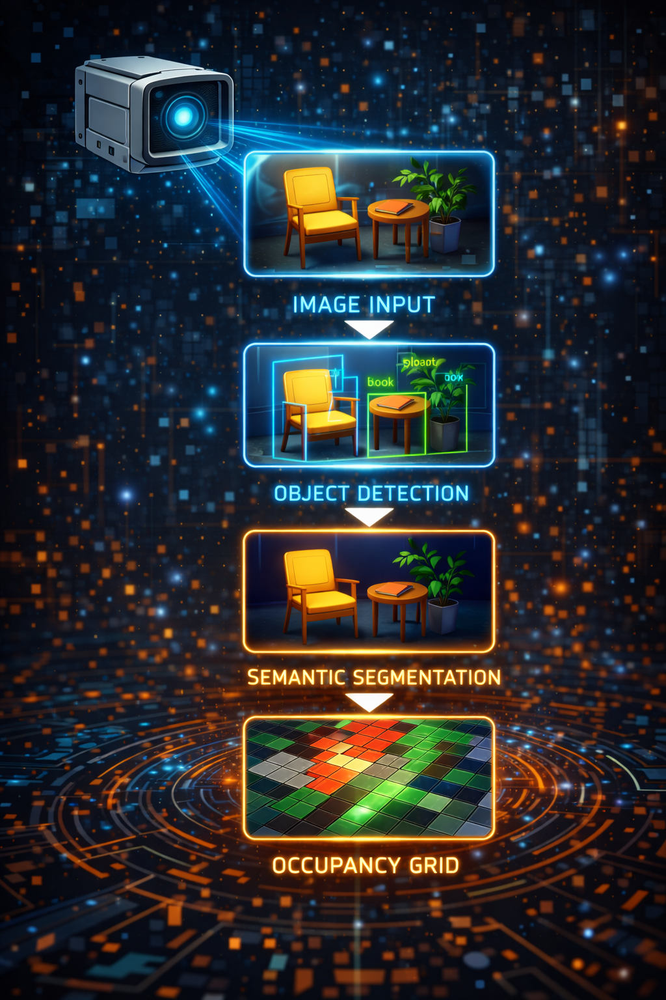

# Chapter 6: Seeing the World -- Camera to Grid



<!-- IMAGE_PROMPT: Isometric digital illustration, clean technical style, dark navy (#0d1117) background, soft neon accent lighting in cyan and magenta, a small wheeled robot with a glowing blue eye sensor as recurring character, flat vector aesthetic with subtle depth, no photorealism, 16:9 aspect ratio. Camera on robot captures a scene with chair and doorway. Image flows through four stages left-to-right: raw pixels, bounding boxes with labels, depth color gradients, projected occupancy grid cells. Arrows between stages. -->

---

A robot with distance sensors knows that something is 40 centimeters ahead. A robot
with a camera knows that a red chair is 40 centimeters ahead, and that there is a
doorway to the left, and that the floor changes from tile to carpet two meters out.
The gap between these two capabilities is enormous, and bridging it is the job of the
vision pipeline. In LLMos, a single camera frame travels through a vision-language
model, emerges as structured detections and scene analysis, and gets projected onto
the same occupancy grid that the rest of the navigation stack already knows how to
use. The result: the robot builds its spatial understanding of the world one camera
frame at a time, with no distance sensors required.

---

## The Pipeline

The vision pipeline is a four-stage transformation:

```
Camera Frame --> VLM (Qwen3-VL-8B) --> VisionFrame --> VisionWorldModelBridge --> Grid Updates
```

1. **Camera Frame**: A raw image from the robot's camera, captured each sensing cycle.
2. **VLM Processing**: Qwen3-VL-8B analyzes the frame and produces structured output --
   object detections with bounding boxes, depth estimates, region labels, and a scene
   analysis describing which directions are open or blocked.
3. **VisionFrame**: A typed data structure containing all VLM observations for one frame.
4. **VisionWorldModelBridge**: Projects the VisionFrame onto the 50x50 occupancy grid,
   marking cells as free, obstacle, or explored.

The bridge is the critical translation layer. It takes observations in camera space
(regions like "left", "center", "right" and depth estimates in centimeters) and
converts them into grid-space updates (cell coordinates and state values). Everything
downstream -- A* pathfinding, candidate generation, frontier detection -- works
identically whether the grid was built from ground-truth sensors or from VLM output.

---

## VisionWorldModelBridge

The `VisionWorldModelBridge` class (`lib/runtime/sensor-bridge.ts`) implements the
`IWorldModelBridge` interface, making it interchangeable with the ground-truth bridge
used in simulation. But the two bridges build the grid in fundamentally different ways.

### Key Differences from Ground-Truth

| Aspect | Ground-Truth Bridge | Vision Bridge |
|--------|-------------------|---------------|
| Grid initialization | Full rasterize() of arena geometry | Starts fully unknown, builds incrementally |
| Update method | Overwrite entire grid from scene state | Incremental ray-casting from VLM observations |
| Confidence levels | 1.0 (perfect knowledge) | 0.6-0.8 (VLM estimates) |
| Coverage | 360-degree awareness | Limited to camera FOV (~60 degrees per frame) |
| Object classification | Distinct wall/obstacle types | All solid objects marked as 'obstacle' |
| Temporal behavior | Stateless (re-rasterize each cycle) | Stateful with confidence decay |

The vision bridge trades certainty for generality. It does not need a pre-built 3D
model of the arena. It does not need distance sensors. It only needs a camera and a
VLM -- the same setup that would work in any real-world environment.

---

## The Update Pipeline

The primary method is `updateFromVision(pose, vision, timestamp)`. Each call processes
one VisionFrame and updates the occupancy grid through five steps:

```typescript
updateFromVision(
  pose: { x: number; y: number; rotation: number },
  vision: VisionFrame,
  timestamp: number = Date.now()
): void {
  // Mark robot position as explored
  this.markExplored(pose, timestamp);

  // Process scene analysis: mark free cells in open directions
  this.processOpenings(pose, vision.scene, timestamp);

  // Process detections: mark obstacles at estimated positions
  this.processDetections(pose, vision.detections, timestamp);

  // Process blocked directions: mark conservative obstacles
  this.processBlocked(pose, vision.scene, vision.detections, timestamp);

  // Decay confidence of old cells
  if (this.config.enableDecay) {
    this.decayOldCells(timestamp);
  }

  this.initialized = true;
}
```

### Step 1: Mark Robot Position

The robot's current cell is always marked as `'explored'` with confidence 1.0. This
is ground truth -- the robot was physically there. Explored cells are exempt from
confidence decay and cannot be overwritten by obstacle projections (if the robot
drove through a cell, it is definitionally not an obstacle).

### Step 2: Process Openings

When the VLM reports that a direction is "open" (no obstacles visible), the bridge
casts a ray of free cells in that direction. This is how the grid learns about
traversable space.

```typescript
private processOpenings(
  pose: { x: number; y: number; rotation: number },
  scene: SceneAnalysis,
  timestamp: number
): void {
  for (const direction of scene.openings) {
    const angleOffset = REGION_ANGLES[direction] ?? 0;
    const angle = pose.rotation + angleOffset;
    this.castFreeRay(pose, angle, this.config.defaultOpenDepthM, timestamp);
  }
}
```

### Step 3: Process Detections

Each VLM detection has a region (left/center/right), a bounding box, and a depth
estimate. The bridge converts these into a world-space angle and distance, then:
- Marks all cells along the ray up to the obstacle as free
- Marks the cell at the obstacle position as obstacle

```typescript
private processDetections(
  pose: { x: number; y: number; rotation: number },
  detections: Detection[],
  timestamp: number
): void {
  for (const det of detections) {
    // Use bbox x-center for finer angular resolution within the region
    const bboxCenterX = det.bbox.x + det.bbox.width / 2;
    // Map bbox center (0-1) to angle within FOV
    const fovOffset = (bboxCenterX - 0.5) * this.config.cameraFovRad;
    const angle = pose.rotation - fovOffset;

    const depthM = det.estimatedDepthCm / 100;

    // Mark free cells along the ray up to the obstacle
    this.castFreeRay(pose, angle, Math.max(0, depthM - this.config.rayStepM), timestamp);

    // Mark obstacle at the detection position
    const obsX = pose.x + Math.sin(angle) * depthM;
    const obsY = pose.y - Math.cos(angle) * depthM;
    this.markObstacle(obsX, obsY, det.confidence, timestamp);
  }
}
```

### Step 4: Process Blocked Directions

When the VLM says a direction is "blocked" but no specific detection covers it, the
bridge places a conservative obstacle at the default blocked depth (0.5m). This
handles cases where the VLM can see something is in the way but cannot classify it
precisely.

```typescript
private processBlocked(
  pose: { x: number; y: number; rotation: number },
  scene: SceneAnalysis,
  detections: Detection[],
  timestamp: number
): void {
  const detectedRegions = new Set(detections.map(d => d.region));

  for (const direction of scene.blocked) {
    // Skip if a specific detection already covers this region
    if (detectedRegions.has(direction as Detection['region'])) continue;

    const angleOffset = REGION_ANGLES[direction] ?? 0;
    const angle = pose.rotation + angleOffset;
    const depthM = this.config.defaultBlockedDepthM;

    this.castFreeRay(pose, angle, Math.max(0, depthM - this.config.rayStepM), timestamp);

    const obsX = pose.x + Math.sin(angle) * depthM;
    const obsY = pose.y - Math.cos(angle) * depthM;
    this.markObstacle(obsX, obsY, 0.6, timestamp);
  }
}
```

### Step 5: Confidence Decay

This is the step that makes the vision bridge fundamentally different from a
ground-truth bridge. Cells that have not been re-observed recently lose confidence
and eventually revert to unknown, forcing the robot to re-observe them. This is
temporal coherence -- the grid forgets what it has not seen lately.

---

## Region-to-Angle Mapping

The VLM reports object positions using three coarse regions: left, center, and right.
These map to angular offsets from the robot's heading:

```typescript
const REGION_ANGLES: Record<string, number> = {
  left: Math.PI / 6,     // +30 degrees (left of center)
  center: 0,             // straight ahead
  right: -Math.PI / 6,   // -30 degrees (right of center)
};
```

For detections (as opposed to scene-level openings/blocked), the bridge uses the
bounding box x-center for finer angular resolution. The bbox center is mapped from
the normalized [0, 1] image range to an angle within the camera's field of view.
This gives sub-region precision: an object at the far left of the "center" region
will be placed at a slightly different angle than one at the far right.

---

## Ray Casting

Ray casting is how the bridge marks free space. Starting from the robot's position,
it steps outward along a direction vector at `rayStepM` intervals (default: 0.1m),
marking each cell as free. Confidence is attenuated with distance -- cells closer to
the robot get higher confidence than cells at the edge of the observation range.

```typescript
private castFreeRay(
  pose: { x: number; y: number },
  angle: number,
  depthM: number,
  timestamp: number
): void {
  const step = this.config.rayStepM;
  const grid = this.worldModel.getGrid();

  for (let d = step; d <= depthM; d += step) {
    const wx = pose.x + Math.sin(angle) * d;
    const wy = pose.y - Math.cos(angle) * d;
    const { gx, gy } = this.worldModel.worldToGrid(wx, wy);

    if (this.worldModel.isValidGridCoord(gx, gy)) {
      const cell = grid[gy][gx];
      // Only mark as free if unknown or already free (don't overwrite explored/obstacle)
      if (cell.state === 'unknown' || cell.state === 'free') {
        const confidence = this.config.freeConfidence * Math.max(0.5, 1.0 - d / (depthM + 0.01));
        if (confidence >= cell.confidence || cell.state === 'unknown') {
          cell.state = 'free';
          cell.confidence = Math.max(cell.confidence, confidence);
          cell.lastUpdated = timestamp;
        }
      }
    }
  }
}
```

The coordinate convention follows the LLMos world model: `sin(angle)` for the X
component, `-cos(angle)` for the Y component. When `rotation=0`, the robot faces
the -Y direction, so moving "forward" decreases Y.

The confidence attenuation formula `freeConfidence * max(0.5, 1.0 - d / depth)` means
a cell at half the observation depth gets about 75% of the base confidence, and a cell
at the maximum depth gets 50%. This reflects reality: VLM depth estimates are less
reliable at greater distances.

---

## Temporal Confidence Decay

The decay system ensures the grid reflects current reality, not stale observations.
Without decay, a single misidentified obstacle would persist in the grid forever,
potentially blocking valid paths.

The decay rules:

- Cells not re-observed start losing confidence after `decayStartMs` (default: 5 seconds).
- Confidence drops at `decayRatePerSec` (default: 0.05 per second) after the grace period.
- Below `minConfidence` (default: 0.2) or older than `staleThresholdMs` (default: 30 seconds),
  cells revert to `'unknown'`.
- **Explored cells are exempt.** If the robot physically occupied a cell, that information
  does not decay. The robot knows it was there.

```typescript
private decayOldCells(now: number): void {
  const grid = this.worldModel.getGrid();
  const dims = this.worldModel.getGridDimensions();

  for (let gy = 0; gy < dims.height; gy++) {
    for (let gx = 0; gx < dims.width; gx++) {
      const cell = grid[gy][gx];

      // Skip unknown cells (nothing to decay) and explored cells (robot was there)
      if (cell.state === 'unknown' || cell.state === 'explored') continue;
      if (cell.lastUpdated === 0) continue;

      const age = now - cell.lastUpdated;

      // No decay if cell was recently updated
      if (age < this.config.decayStartMs) continue;

      // Compute decayed confidence
      const decayTime = (age - this.config.decayStartMs) / 1000;
      const decayedConfidence = cell.confidence - decayTime * this.config.decayRatePerSec;

      if (decayedConfidence < this.config.minConfidence || age > this.config.staleThresholdMs) {
        // Revert to unknown -- this forces re-observation
        cell.state = 'unknown';
        cell.confidence = 0;
      } else {
        cell.confidence = decayedConfidence;
      }
    }
  }
}
```

The practical effect: as the robot moves through the environment, a "bubble" of known
space travels with it. Cells behind the robot gradually fade to unknown, while cells
ahead are continually refreshed by new observations. This naturally drives exploration
-- frontier cells (free/explored cells adjacent to unknown cells) appear at the
boundary of the bubble, pulling the robot toward unobserved areas.

---

## Frontier Detection

Frontier detection is identical in the vision bridge and the ground-truth bridge. A
frontier cell is any free or explored cell that has at least one unknown neighbor in
the cardinal directions:

```typescript
findFrontiers(): FrontierCell[] {
  const grid = this.worldModel.getGrid();
  const dims = this.worldModel.getGridDimensions();
  const frontiers: FrontierCell[] = [];

  for (let gy = 1; gy < dims.height - 1; gy++) {
    for (let gx = 1; gx < dims.width - 1; gx++) {
      const cell = grid[gy][gx];
      if (cell.state !== 'free' && cell.state !== 'explored') continue;

      let unknownNeighbors = 0;
      if (grid[gy - 1][gx].state === 'unknown') unknownNeighbors++;
      if (grid[gy + 1][gx].state === 'unknown') unknownNeighbors++;
      if (grid[gy][gx - 1].state === 'unknown') unknownNeighbors++;
      if (grid[gy][gx + 1].state === 'unknown') unknownNeighbors++;

      if (unknownNeighbors > 0) {
        const { x: wx, y: wy } = this.worldModel.gridToWorld(gx, gy);
        frontiers.push({ gx, gy, wx, wy, unknownNeighbors });
      }
    }
  }

  frontiers.sort((a, b) => b.unknownNeighbors - a.unknownNeighbors);
  return frontiers;
}
```

Frontiers are sorted by the number of unknown neighbors -- cells with more unknown
neighbors are more likely to reveal new territory when visited. The candidate
generator uses these frontiers to propose exploration targets for the navigation loop.

---

## Configuration

The `VisionBridgeConfig` interface controls all parameters of the vision pipeline:

```typescript
export interface VisionBridgeConfig {
  /** Device/robot ID for the WorldModel singleton */
  deviceId: string;
  /** Camera horizontal field of view in radians (default: ~60 degrees) */
  cameraFovRad: number;
  /** Default free-space depth when VLM says "open" (meters) */
  defaultOpenDepthM: number;
  /** Default obstacle depth when VLM says "blocked" (meters) */
  defaultBlockedDepthM: number;
  /** Confidence assigned to VLM-derived free cells */
  freeConfidence: number;
  /** Confidence assigned to VLM-derived obstacle cells */
  obstacleConfidence: number;
  /** Grid cell step size for ray-casting (meters) */
  rayStepM: number;
  /** Whether to enable temporal confidence decay */
  enableDecay: boolean;
  /** Age in ms after which cells start losing confidence */
  decayStartMs: number;
  /** Age in ms after which non-explored cells revert to unknown */
  staleThresholdMs: number;
  /** Confidence decay rate per second after decayStartMs */
  decayRatePerSec: number;
  /** Minimum confidence below which a cell reverts to unknown */
  minConfidence: number;
  /** World model config overrides */
  worldModelConfig?: Partial<WorldModelConfig>;
}
```

The defaults are tuned for a small indoor robot with a standard webcam:

| Parameter | Default | Rationale |
|-----------|---------|-----------|
| `cameraFovRad` | PI/3 (60 degrees) | Typical webcam horizontal FOV |
| `defaultOpenDepthM` | 1.0m | Conservative; VLM depth estimates are noisy beyond this |
| `defaultBlockedDepthM` | 0.5m | Half the open depth; assume obstacles are close if unspecified |
| `freeConfidence` | 0.7 | Less than ground-truth (1.0) but sufficient for pathfinding |
| `obstacleConfidence` | 0.8 | Slightly higher than free; false obstacles are more dangerous than false free space |
| `decayStartMs` | 5000ms | Five seconds of grace before decay begins |
| `staleThresholdMs` | 30000ms | Hard cutoff: after 30 seconds, the cell is unknown |
| `decayRatePerSec` | 0.05 | Gentle decay; a cell at confidence 0.7 lasts ~10 seconds past the grace period |
| `minConfidence` | 0.2 | Below this, the cell is effectively unknown |

---

## The Factory Function

The convenience factory follows the LLMos `Partial<Config>` pattern:

```typescript
export function createVisionBridge(
  config: Partial<VisionBridgeConfig> = {}
): VisionWorldModelBridge {
  return new VisionWorldModelBridge(config);
}
```

Typical usage in a navigation runtime:

```typescript
const bridge = createVisionBridge({ deviceId: 'robot-1' });

// Each sensing cycle:
const visionFrame = await vlmDetector.processFrame(cameraImage);
bridge.updateFromVision(pose, visionFrame);
const serialized = bridge.getWorldModel().serialize('auto', pose, goal);
```

The bridge creates or retrieves a `WorldModel` singleton via `getWorldModel(deviceId)`.
Multiple bridges with the same device ID share the same grid, which is essential for
fleet coordination where multiple sensors feed into a shared world model.

---

## Chapter Summary

The vision pipeline transforms raw camera frames into the same occupancy grid
representation that the rest of the navigation stack expects. The VisionWorldModelBridge
builds the grid incrementally through ray casting -- marking free space along open
directions and obstacles at detection positions. Temporal confidence decay ensures the
grid stays fresh: cells that have not been re-observed fade to unknown, naturally
driving exploration toward unvisited areas. The bridge implements the same
`IWorldModelBridge` interface as the ground-truth bridge, so the navigation loop,
A* planner, and candidate generator work identically regardless of whether the grid
came from perfect simulation data or noisy VLM estimates.

The source files for this chapter:

- `lib/runtime/sensor-bridge.ts` -- VisionWorldModelBridge, ray casting, confidence decay
- `lib/runtime/world-model.ts` -- The underlying 50x50 occupancy grid
- `lib/runtime/world-model-bridge.ts` -- IWorldModelBridge interface and FrontierCell type

---

*Previous: [Chapter 5 -- The Dual Brain: Instinct, Planning, and Escalation](05-dual-brain-controller.md)*
*Next: [Chapter 7 -- The HAL: One Interface, Two Worlds](07-hal-and-hardware.md)*
