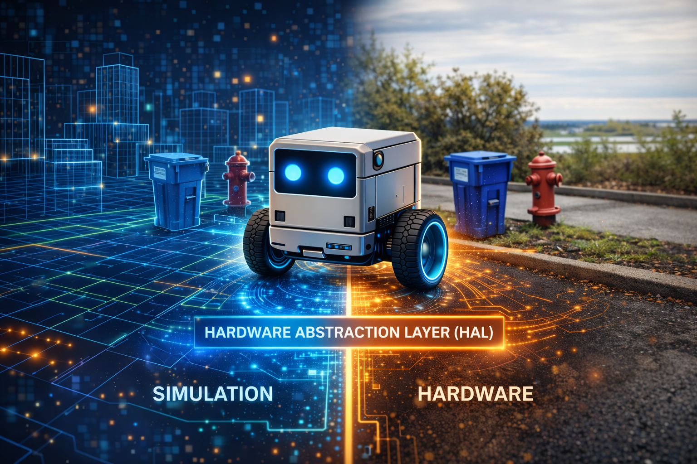

# Chapter 7: The Hardware Abstraction Layer -- One Interface, Two Worlds



<!-- IMAGE_PROMPT: Isometric digital illustration, clean technical style, dark navy (#0d1117) background, soft neon accent lighting in cyan and magenta, a small wheeled robot with a glowing blue eye sensor as recurring character, flat vector aesthetic with subtle depth, no photorealism, 16:9 aspect ratio. Robot straddles a dividing line. Left: Three.js wireframe 3D environment in browser window. Right: physical workbench with ESP32 chip, wires, motors. Center: single glowing "HAL" interface layer bridges both worlds. -->

There is a moment in every robotics project where you realize that your beautifully
architected software works perfectly in simulation and catastrophically on real
hardware. Motors overshoot. Sensors return garbage. Serial connections drop mid-command.
The gap between the simulated world and the physical one is not a crack -- it is a
canyon. Traditional robotics deals with this by writing two separate codebases: one for
testing, one for deployment. LLMos takes a different approach. It places a single
interface between the LLM and all hardware, simulated or physical, and guarantees that
the same high-level command produces equivalent behavior in both worlds.

---

## The Design Principle

The HAL exists because of a fundamental architectural decision: the LLM should never
know or care whether it is controlling a Three.js mesh in a browser or a differential
drive robot on a desk. It issues commands like "move to position (2.5, 1.0, 0)" and
"rotate left 90 degrees." The HAL translates those into the correct low-level
operations for the target environment. The firmware becomes a servant, not a master.

The full interface is defined in `lib/hal/types.ts`.

---

## HALMode and HALToolResult

Every HAL instance operates in one of three modes:

```typescript
// lib/hal/types.ts
export type HALMode = 'simulation' | 'physical' | 'hybrid';
```

Simulation mode routes commands to the Three.js engine. Physical mode routes them over
serial, WiFi, or Bluetooth to an ESP32. Hybrid mode runs both simultaneously.

Every HAL call returns the same result structure:

```typescript
// lib/hal/types.ts
export interface HALToolResult {
  success: boolean;
  data?: Record<string, unknown>;
  error?: string;
  timestamp: number;
  mode: HALMode;
  executionTime?: number;
}
```

The `mode` field tells the caller which world the command ran in. If a command succeeds
in simulation but fails in physical mode, you know the problem is hardware-specific.

---

## The Five Subsystems

The complete HAL interface composes five subsystem interfaces plus lifecycle methods:

```typescript
// lib/hal/types.ts
export interface HardwareAbstractionLayer {
  mode: HALMode;
  locomotion: LocomotionInterface;
  vision: VisionInterface;
  manipulation?: ManipulationInterface;  // optional for wheeled robots
  communication: CommunicationInterface;
  safety: SafetyInterface;
  initialize(): Promise<void>;
  cleanup(): Promise<void>;
  isReady(): boolean;
  getDeviceInfo(): { id: string; type: string; mode: HALMode; capabilities: string[] };
}
```

### Locomotion

The most heavily used subsystem provides both low-level differential drive control and
high-level movement commands:

```typescript
// lib/hal/types.ts
export interface LocomotionInterface {
  drive(left: number, right: number, durationMs?: number): Promise<HALToolResult>;
  moveTo(x: number, y: number, z: number, speed?: number): Promise<HALToolResult>;
  rotate(direction: 'left' | 'right', degrees: number): Promise<HALToolResult>;
  moveForward(distanceCm: number): Promise<HALToolResult>;
  moveBackward(distanceCm: number): Promise<HALToolResult>;
  stop(): Promise<HALToolResult>;
  getPose(): Promise<{
    position: { x: number; y: number; z: number };
    rotation: { yaw: number; pitch: number; roll: number };
    velocity: { linear: number; angular: number };
  }>;
}
```

The `drive` method gives raw wheel-level control: left and right motor power from -255
to 255. The higher-level methods -- `moveTo`, `rotate`, `moveForward` -- are what the
navigation loop actually uses. The HAL translates between the two.

### Vision

The vision subsystem abstracts over cameras and distance sensors. `captureFrame`
returns a base64-encoded image -- a rendered Three.js snapshot in simulation, or a
frame from the OV2640 camera on hardware. The navigation loop feeds this to Qwen3-VL
for spatial reasoning. `getDistanceSensors` returns readings from front, left, and
right sensors. `getIMU` provides acceleration, gyroscope, and heading data.

### Communication

Robots communicate state through LEDs, speaker output, and telemetry: `speak(text)`,
`setLED(r, g, b, pattern)`, `playSound(soundId)`, and `log(message, level)`.

### Safety

Safety is the only subsystem with synchronous state queries. `isEmergencyStopped()`
returns cached local state immediately -- you never want to wait for an async
round-trip to check emergency status. The `getSafetyStatus()` method returns battery
level, temperature, and accumulated errors.

---

## HAL Configuration

```typescript
// lib/hal/types.ts
export interface HALConfig {
  mode: HALMode;
  deviceId: string;
  connection?: {
    type: 'serial' | 'wifi' | 'bluetooth';
    port?: string;
    baudRate?: number;
    host?: string;
  };
  simulator?: unknown;
  capabilities?: string[];
}
```

For simulation, pass a Three.js simulator reference. For physical mode, pass connection
settings. The `capabilities` array declares what the device supports.

---

## The Physical Adapter

The `PhysicalHAL` class in `lib/hal/physical-adapter.ts` implements the full HAL for
real ESP32-S3 hardware over a newline-delimited JSON protocol:

```typescript
// lib/hal/physical-adapter.ts
interface ESP32Command {
  type: 'command';
  command: string;
  params: Record<string, unknown>;
  timestamp: number;
}
```

Each subsystem class sends commands through a shared `PhysicalConnection` and parses
JSON responses. For example, the locomotion `rotate` method serializes direction and
degrees into an ESP32 command, awaits the response with a 5-second timeout, and wraps
it in a `HALToolResult`. If the ESP32 does not respond, the promise rejects and the
HAL returns `success: false`. The LLM never hangs waiting for hardware.

```typescript
// lib/hal/physical-adapter.ts (simplified)
export class PhysicalHAL implements HardwareAbstractionLayer {
  readonly mode: HALMode = 'physical';
  readonly locomotion: LocomotionInterface;
  readonly vision: VisionInterface;
  readonly communication: CommunicationInterface;
  readonly safety: SafetyInterface;

  constructor(options: { deviceId: string; connectionType: ConnectionType; ... }) {
    this.connection = new PhysicalConnection(options.connectionType, { ... });
    this.locomotion = new PhysicalLocomotion(this.connection);
    this.vision = new PhysicalVision(this.connection);
    this.communication = new PhysicalCommunication(this.connection);
    this.safety = new PhysicalSafety(this.connection);
  }
}
```

---

## The Safety Stack

Safety in LLMos is a four-layer stack. Each layer can independently prevent dangerous
actions:

1. **LLM picks an action** -- The navigation loop produces MOVE_TO or ROTATE_TO.
2. **HAL validates parameters** -- Coordinates within bounds, device not e-stopped.
3. **Firmware checks safety invariants** -- Motor current, stall detection, battery.
4. **Motors execute** -- Only after passing all three gates.

If any layer vetoes, the result propagates up as `HALToolResult` with `success: false`.
The LLM receives this and reasons about what went wrong.

---

## The Navigation HAL Bridge

The file `lib/runtime/navigation-hal-bridge.ts` connects the NavigationLoop to the HAL.
Each cycle follows four steps: capture a camera frame, run the LLM navigation cycle,
execute the decision on the HAL, and report the result back to the loop.

The decision execution translates action types to HAL calls:

```typescript
// lib/runtime/navigation-hal-bridge.ts (simplified)
switch (decision.action.type) {
  case 'MOVE_TO':
  case 'EXPLORE': {
    if (path?.success && path.waypoints.length > 0) {
      const wp = path.waypoints[Math.min(1, path.waypoints.length - 1)];
      await this.hal.locomotion.moveTo(wp.x, wp.y, 0);
    } else {
      await this.hal.locomotion.moveForward(10); // nudge recovery
    }
    break;
  }
  case 'ROTATE_TO': {
    const yaw = decision.action.yaw_deg ?? 90;
    await this.hal.locomotion.rotate(yaw >= 0 ? 'right' : 'left', Math.abs(yaw));
    break;
  }
  case 'STOP':
  default:
    await this.hal.locomotion.stop();
}
```

MOVE_TO and EXPLORE follow the A*-planned path. If no path exists, the bridge nudges
forward 10cm as recovery. The `run` method loops until the goal is reached or stopped.

---

## The ESP32 Device Manager

For multi-robot scenarios, `ESP32DeviceManager` in
`lib/hardware/esp32-device-manager.ts` manages a fleet with device registration,
firmware deployment, telemetry collection, and three fleet coordination modes:

```typescript
// lib/hardware/esp32-device-manager.ts
export interface FleetConfig {
  syncMode: 'independent' | 'synchronized' | 'leader-follower';
  leaderDeviceId?: string;
  defaultMap: string;
  defaultGame: string;
  autoStart: boolean;
}
```

Each device gets its own HAL instance via `createDeviceHAL()`, which routes to
simulation or physical mode based on device type.

---

## Hardware Target: Robot V1 -- Stepper Cube Robot

The reference hardware platform is the **Robot V1 -- Stepper Cube Robot**, an 8cm
3D-printed cube designed to tightly mount all components:

| Component | Specification |
|-----------|--------------|
| Motor Controller | ESP32-S3-DevKitC-1 (GPIO4-7, GPIO15-18 for ULN2003) |
| Camera | ESP32-CAM (AI-Thinker), OV2640, MJPEG streaming |
| Motors | 2x 28BYJ-48 stepper (5V unipolar, 4096 steps/rev, 64:1 gear ratio) |
| Drivers | 2x ULN2003 Darlington arrays |
| Wheels | 6cm diameter, 12cm wheel base |
| Support | Rear ball caster (low friction for stepper torque) |
| Power | 5V 2A USB-C |
| Chassis | 8cm 3D-printed cube from `Agent_Robot_Model/Robot_one/` |

The full bill of materials, wiring diagrams, and assembly instructions are in
`Agent_Robot_Model/Readme.md`.

---

## Stepper Kinematics

The file `lib/hal/stepper-kinematics.ts` encodes the precise math for the 28BYJ-48
stepper motors. Every distance and rotation command flows through these conversions:

| Parameter | Value |
|-----------|-------|
| Steps per revolution | 4096 (with 64:1 gear ratio) |
| Wheel circumference | 18.85 cm (pi x 6cm) |
| Steps per cm | ~217.3 |
| Max speed | 1024 steps/s (~4.71 cm/s) |
| Max acceleration | 512 steps/s^2 |

Key conversion functions:

```typescript
// lib/hal/stepper-kinematics.ts

distanceToSteps(cm)        // 217.3 steps per cm
rotationToSteps(degrees)   // differential drive arc calculation
velocityToStepsPerSecond(cmPerSec)
calculateArcSpeeds(radiusCm, speedCmS)  // inner/outer wheel speeds
calculateMoveDuration()    // trapezoidal motion profile
```

The `rotationToSteps` function computes the arc length each wheel must travel for an
in-place rotation. For a 90-degree turn with a 12cm wheel base, each wheel travels
`pi * 12 / 4 = 9.42 cm` in opposite directions, which is `9.42 * 217.3 = 2047 steps`.
If the calibrated wheel dimensions differ from the codebase defaults, the
`set_config` command updates the firmware constants.

---

## WiFi Transport

The V1 robot communicates over WiFi using two separate protocols on two separate
ESP32 chips. The file `lib/hal/wifi-connection.ts` implements the motor control
transport.

### Motor Commands (ESP32-S3, UDP, Port 4210)

UDP is used instead of TCP because it has zero handshake latency, which is required
for the 200ms instinct loop. The WiFi connection class provides:

- Sequence-based request-response matching
- Timeout: 2000ms with max 3 retries
- Continuous round-trip time tracking
- Statistics: commands sent, responses received, timeouts, retries

### Camera Stream (ESP32-CAM, HTTP, Port 80)

The camera serves standard HTTP MJPEG:

- `GET /stream` -- multipart/x-mixed-replace JPEG frames at 320x240 @ 10fps
- `GET /status` -- JSON status (FPS, frames served, uptime, WiFi RSSI)

The host PC's VLM (Qwen3-VL-8B) reads frames from this endpoint to generate
VisionFrames for the navigation loop.

---

## Communication Protocol

The ESP32-S3 firmware (`firmware/esp32-s3-stepper/esp32-s3-stepper.ino`) accepts
UDP JSON commands on port 4210:

```json
{"cmd":"move_steps","left":N,"right":N,"speed":N}
{"cmd":"move_cm","left_cm":F,"right_cm":F,"speed":F}
{"cmd":"rotate_deg","degrees":F,"speed":F}
{"cmd":"stop"}
{"cmd":"get_status"}
{"cmd":"set_config","wheel_diameter_cm":F,"wheel_base_cm":F}
```

The `get_status` response returns the current pose (x, y, heading), accumulated
step counts for each motor, whether the motors are currently running, and the
uptime. The host uses these step counts for dead-reckoning pose updates:

```
deltaLeft = currentLeftSteps - prevLeftSteps
deltaRight = currentRightSteps - prevRightSteps
linearCm = (leftDistCm + rightDistCm) / 2
angularRad = (rightDistCm - leftDistCm) / wheelBase
```

Because stepper motors execute precise discrete steps (unlike DC motors which can
slip), the odometry is highly accurate -- accurate enough for the navigation loop's
world model to remain consistent over many cycles.

---

## Firmware Safety

The file `lib/hal/firmware-safety-config.ts` defines the safety parameters that
the firmware enforces independently of the host:

**Stepper Safety (V1 hardware):**

| Parameter | Default | Range |
|-----------|---------|-------|
| Max steps/second | 1024 | 1-2048 |
| Max continuous steps | 40960 (10 revolutions) | per command |
| Host heartbeat timeout | 5000ms | 500-10000ms |
| Max coil current | 240mA | 0-300mA |

**Emergency Stop Triggers:**
- Host timeout (no command received for 2+ seconds)
- Step limit exceeded in single command
- Firmware watchdog timer

The firmware disables motor coils when idle to save power and prevent overheating.
When the host connection drops, the robot stops immediately rather than continuing
on its last command.

---

## Serial Protocol

For wired connections, `lib/hal/serial-protocol.ts` provides a reliable framing
protocol with:

- Monotonic sequence numbers for request-response matching
- CRC-16/CCITT-FALSE checksums on the payload
- Ack timeout (2000ms default) with retry (3 attempts)
- Statistics tracking: frames sent, acks received, checksum errors, timeouts

This protocol is used for development and debugging. For deployment, the WiFi UDP
transport is preferred because it eliminates the physical tether.

---

## Chapter Summary

The HAL is the seam between the LLM's abstract reasoning and the physical world. Five
subsystems provide a complete interface. The `PhysicalHAL` adapter translates HAL calls
into UDP JSON commands over WiFi. The V1 Stepper Cube Robot uses two ESP32 chips: one
for motor control (UDP port 4210) and one for camera streaming (HTTP port 80). The
stepper kinematics library converts distance and rotation commands to precise step
counts. The firmware enforces safety independently: host timeout triggers emergency stop,
step limits prevent runaway commands, and motor coils disable when idle. The four-layer
safety stack ensures no single failure produces dangerous behavior. The key insight: the
LLM says "move to (2.5, 1.0)" and the HAL translates -- whether to Three.js physics or
to UDP packets driving real stepper motors.

---

*Previous: [Chapter 6 -- Seeing the World: Camera to Grid](06-vision-pipeline.md)*
*Next: [Chapter 8 -- Agents, Skills, and the Markdown OS](08-agents-and-skills.md)*
