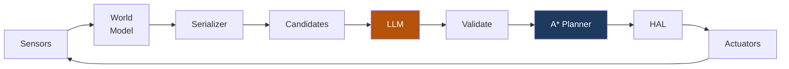

# Chapter 13: Getting Started -- Your First 10 Minutes


<!-- IMAGE_PROMPT: Isometric digital illustration, clean technical style, dark navy (#0d1117) background, soft neon accent lighting in cyan and magenta, a small wheeled robot with a glowing blue eye sensor as recurring character, flat vector aesthetic with subtle depth, no photorealism, 16:9 aspect ratio. Terminal window showing "npm install" and "npx tsx scripts/run-navigation.ts" with green output. Robot emerges from terminal into small test arena taking first steps. Clock shows "10:00" counting down. -->

You have read about occupancy grids, navigation loops, dual-brain controllers, and fleet
coordination. Now it is time to run the thing. This chapter walks you from a fresh clone
to a working navigation demo in under ten minutes. No GPU. No API key. No hardware.
Just a terminal and Node.js.

---

## Prerequisites

- **Node.js 18+** -- Any LTS release from 18 onward.
- **npm** -- Comes with Node.js.
- **GPU with 8GB+ VRAM** -- Only needed for local Qwen3-VL-8B. All tests and demos run on CPU.

Optional:
- **Claude Code** -- Enables the `/llmos` slash command for agent creation.
- **OpenRouter API key** -- For live LLM inference without a local GPU.

---

## Path A: Software Only (5 Commands)

### 1. Clone and Install

```bash
git clone https://github.com/EvolvingAgentsLabs/llmos
cd llmos
npm install
```

### 2. Run the Tests

```bash
npx jest --no-coverage
```

You should see 346+ passing tests across 21 suites. Every test runs without
network, GPU, or hardware. If any fail on a fresh clone, check your Node.js version.

> **Checkpoint:** Do you see green? All 346+ tests pass? If yes, the codebase is healthy.

### 3. Run the Navigation Demo

```bash
npx tsx scripts/run-navigation.ts --all --verbose
```

This runs all four test arenas with a deterministic mock LLM:
- **Simple Navigation**: Corner-to-corner with 3 obstacles
- **Exploration**: Reach 80% coverage of a 5m x 5m area
- **Dead-End Recovery**: Escape an L-shaped corridor
- **Narrow Corridor**: Thread a 0.6m gap

You will see cycle-by-cycle output: position, action chosen, distance to goal.

> **Checkpoint:** Do all four arenas pass? You're watching the full navigation
> stack -- world model, candidate generator, A* planner, mock LLM -- working
> end to end. Everything from here makes it smarter or more physical.

### 4. Try Real LLM Decisions

```bash
# Set your OpenRouter API key
export OPENROUTER_API_KEY=sk-or-...

# Run with Qwen3-VL-8B making every decision
npx tsx scripts/run-navigation.ts --live

# Run with simulated camera vision
npx tsx scripts/run-navigation.ts --vision
```

Same arenas, same code -- but now a language model reasons about each cycle instead
of following a script. The robot picks different routes, handles surprises differently,
and explains its choices.

### 5. Explore the 3D UI

```bash
npm run dev
```

Open `http://localhost:3000`. The RobotWorldPanel renders the 3D arena using
React Three Fiber -- robot, obstacles, walls, and occupancy grid in real time.

---

## Path B: Awaken the Physical Agent

If you have the V1 Stepper Cube Robot hardware on your desk:

```bash
# 1. Flash the motor controller (ESP32-S3)
#    firmware/esp32-s3-stepper/esp32-s3-stepper.ino
#    Set WiFi credentials first

# 2. Flash the camera (ESP32-CAM)
#    firmware/esp32-cam-mjpeg/esp32-cam-mjpeg.ino

# 3. Test the eyes
#    Open http://<ESP32-CAM-IP>/stream in browser

# 4. Test the muscles
echo '{"cmd":"move_cm","left_cm":10,"right_cm":10,"speed":500}' | \
  nc -u <ESP32-S3-IP> 4210

# 5. If you see video AND the robot moved 10cm:
#    The LLM takes over the steering wheel
```

> **Maker Checkpoint:** Video at `/stream`? Robot moved 10cm? If both yes,
> skip to [Chapter 15](15-v1-hardware-deployment.md) for full calibration.

---

## Use Claude Code for Agent Creation

If you have Claude Code installed:

```
/llmos Create an AI agent for a wall-avoiding robot
```

The SystemAgent discovers existing agents, consults memory, creates a multi-agent
plan, and produces the result as markdown agent definitions in the volume system.

---

## Key Files to Explore

Start with `navigation-loop.ts`. It is the center of the system. Every other file
is a dependency of this one.

| File | What It Does |
|------|-------------|
| `lib/runtime/navigation-loop.ts` | The 13-step cycle orchestrator |
| `lib/runtime/world-model.ts` | 50x50 occupancy grid |
| `lib/runtime/local-planner.ts` | A* pathfinding |
| `lib/runtime/candidate-generator.ts` | Subgoal scoring for the LLM |
| `lib/runtime/navigation-types.ts` | LLM I/O schemas |
| `lib/hal/types.ts` | HAL interface (5 subsystems) |
| `lib/runtime/dual-brain-controller.ts` | Instinct + planner brains |
| `lib/runtime/test-arenas.ts` | 4 test environments |
| `scripts/run-navigation.ts` | CLI demo script |
| `components/robot/RobotCanvas3D.tsx` | Three.js 3D visualization |
| `lib/hal/stepper-kinematics.ts` | 28BYJ-48 motor math |
| `lib/hal/wifi-connection.ts` | UDP transport (port 4210) |
| `firmware/esp32-s3-stepper/esp32-s3-stepper.ino` | Motor controller firmware |
| `firmware/esp32-cam-mjpeg/esp32-cam-mjpeg.ino` | Camera streaming firmware |

---

## The Navigation Loop in 30 Seconds



The `NavigationLoop` class orchestrates this cycle. It does not run the LLM itself.
It assembles the input, delegates to whatever `InferenceFunction` you provide, and
processes the output. This is the key design decision that makes the system both
testable (mock the LLM) and backend-agnostic (swap OpenRouter for local inference).

---

## What to Try Next

1. **Design your own arena** -- Edit `lib/runtime/test-arenas.ts`. Add walls, obstacles,
   a start pose and goal. Run with `--arena your_key`.

2. **Dive into the brain** -- [Chapter 3: The World Model](03-world-model.md) explains
   how 50x50 cells represent an entire room.

3. **Run with a real LLM** -- Set `OPENROUTER_API_KEY` and use `--live` to watch
   Qwen3-VL-8B make navigation decisions.

4. **Understand the HAL** -- [Chapter 7](07-hal-and-hardware.md) shows how the same
   code drives both simulation and real hardware.

5. **Build the robot** -- [Chapter 15](15-v1-hardware-deployment.md) walks through
   assembly, calibration, and first autonomous navigation.

---

## Chapter Summary

From clone to running demo in five commands: install, test, run, explore, build.
The mock LLM makes everything work without API keys or hardware. The four test
arenas exercise different navigation challenges. The `--live` flag brings real
LLM reasoning. And the `/llmos` command connects you to the development-time
intelligence for agent creation.

Everything else in this book is about understanding what happens inside those
five commands.

---

*Previous: [Chapter 12 -- 346+ Tests: Proving the System Works](12-testing.md)*
*Next: [Chapter 14 -- What's Next: From Research to Reality](14-whats-next.md)*
