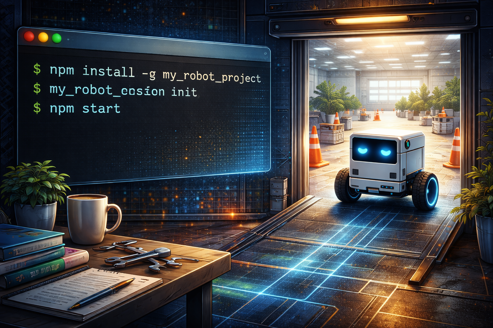

# Chapter 13: Getting Started -- Your First 10 Minutes



<!-- IMAGE_PROMPT: Isometric digital illustration, clean technical style, dark navy (#0d1117) background, soft neon accent lighting in cyan and magenta, a small wheeled robot with a glowing blue eye sensor as recurring character, flat vector aesthetic with subtle depth, no photorealism, 16:9 aspect ratio. Terminal window showing "npm install" and "npx tsx scripts/run-navigation.ts" with green output. Robot emerges from terminal into small test arena taking first steps. Clock shows "10:00" counting down. -->

You have read about occupancy grids, navigation loops, dual-brain controllers, and fleet
coordination. Now it is time to run the thing. This chapter walks you from a fresh clone
to a working navigation demo in under ten minutes. No GPU required for simulation mode.
No ESP32 required for the first run. Just a terminal and Node.js.

---

## Prerequisites

You need three things on your machine:

- **Node.js 18+** -- The runtime. LLMos is a Next.js 14.1.0 application written in
  TypeScript. Any LTS release from Node 18 onward will work.
- **npm** -- Comes with Node.js. Used for dependency installation and script execution.
- **GPU with 8GB+ VRAM** -- Only required if you want to run the local Qwen3-VL-8B
  model for real-time inference. The simulation mode and all tests run on CPU.

Optional but recommended:

- **Claude Code** -- Anthropic's CLI for Claude. Enables the `/llmos` slash command
  for agent creation through natural language.
- **OpenRouter API key** -- For live LLM inference without a local GPU. Set the
  `OPENROUTER_API_KEY` environment variable.

---

## Step 1: Clone and Install

```bash
git clone https://github.com/EvolvingAgentsLabs/llmos
cd llmos
npm install
```

The install pulls in Next.js, React Three Fiber, Jest, ts-jest, and the rest of the
dependency tree. On a typical connection this takes about a minute.

---

## Step 2: Run the Tests

Before you change anything, verify that the codebase is healthy:

```bash
npx jest --no-coverage
```

You should see 346+ passing tests across 21 test suites. Every test runs without
network access, GPU, or canvas. If any test fails on a fresh clone, something is
wrong with your Node.js version or platform -- check the error output.

You can also run the TypeScript type checker independently:

```bash
npx tsc --noEmit
```

This catches type errors without producing build output. It is faster than a full
build and useful during development.

---

## Step 3: Run the Navigation Demo

The CLI demo script runs a complete navigation session using the LLMos navigation
stack. By default it uses a deterministic mock LLM, so no API key is needed:

```bash
npx tsx scripts/run-navigation.ts
```

This runs the Simple Navigation arena: a robot starting in the bottom-left corner
of a 5m x 5m arena, navigating to the top-right corner while avoiding three
obstacles. You will see cycle-by-cycle output showing the robot's position, the
action chosen, and the distance to goal.

### Demo Options

The script at `scripts/run-navigation.ts` accepts several flags:

```bash
# Run all four test arenas in sequence
npx tsx scripts/run-navigation.ts --all

# Use a specific arena
npx tsx scripts/run-navigation.ts --arena exploration
npx tsx scripts/run-navigation.ts --arena dead_end
npx tsx scripts/run-navigation.ts --arena narrow_corridor

# Use a real LLM via OpenRouter (requires OPENROUTER_API_KEY)
npx tsx scripts/run-navigation.ts --live

# Enable vision mode (simulated camera)
npx tsx scripts/run-navigation.ts --vision

# Verbose output: show every cycle's position and action
npx tsx scripts/run-navigation.ts --all --verbose
```

The `--all` flag runs all four arenas and prints a summary showing how many passed.
The `--live` flag swaps the mock LLM for Qwen3-VL-8B via OpenRouter, turning the
demo into a real LLM-driven navigation session.

---

## Step 4: Explore the Web UI

Start the Next.js development server:

```bash
npm run dev
```

Open `http://localhost:3000` in your browser. The RobotWorldPanel component
(`components/robot/RobotWorldPanel.tsx`) renders the 3D arena using React Three
Fiber. You can see the robot, obstacles, walls, and the occupancy grid visualized
in real time.

The 3D visualization is powered by the RobotCanvas3D component
(`components/robot/RobotCanvas3D.tsx`), which renders the Three.js scene with
orbit controls, lighting, and robot model display.

---

## Step 5: Use Claude Code with /llmos

If you have Claude Code installed, you can use the `/llmos` slash command to invoke
the SystemAgent. This is the development-time LLM interface where Claude Opus 4.6
creates and evolves robot agents:

```
/llmos Create an AI agent for a wall-avoiding robot
```

The SystemAgent executes an 8-phase workflow: understanding the request, planning
which agents to involve, executing the multi-agent pipeline, and producing the
result as markdown agent definitions in the volume system.

---

## Step 6: Build for Production

When you are ready to deploy:

```bash
npm run build
```

This runs the Next.js production build. Do not use `npx next build` directly --
the `npm run build` script is configured correctly for the project's build pipeline.

For the Electron desktop application:

```bash
npm run electron:dev    # Development mode with hot reload
npm run electron:build  # Production build
```

---

## Key Files to Explore

Once the demo is running, these are the files worth reading first:

| File | Purpose |
|------|---------|
| `lib/runtime/navigation-loop.ts` | The main navigation cycle orchestrator |
| `lib/runtime/world-model.ts` | The 50x50 occupancy grid |
| `lib/runtime/local-planner.ts` | A* pathfinding on the grid |
| `lib/runtime/candidate-generator.ts` | Subgoal candidates for the LLM |
| `lib/runtime/navigation-types.ts` | LLM input/output schemas |
| `lib/hal/types.ts` | Hardware abstraction layer interface |
| `lib/runtime/dual-brain-controller.ts` | Instinct + planner architecture |
| `lib/runtime/test-arenas.ts` | The four predefined test environments |
| `scripts/run-navigation.ts` | The CLI demo script |
| `components/robot/RobotWorldPanel.tsx` | The 3D arena React component |

Start with `navigation-loop.ts`. It is the center of the system. The `runCycle()`
method shows the complete flow: check goal, detect stuck state, generate candidates,
serialize the world model, call the LLM, validate the decision, plan a path, and
return the result. Every other file is a dependency of this one.

---

## The Navigation Loop in 30 Seconds

The entire navigation stack boils down to one cycle that repeats until the goal is
reached or the cycle limit is hit:

```
Sensors --> WorldModel --> Serializer --> Candidates --> Prompt --> LLM
  --> Decision Validation --> Local Planner --> HAL --> Sensors
```

The `NavigationLoop` class orchestrates this cycle. It does not run the LLM itself.
It assembles the input, delegates to whatever `InferenceFunction` you provide, and
processes the output. This is the key architectural decision that makes the system
both testable and backend-agnostic.

---

## What to Try Next

1. **Modify a test arena** -- Edit `lib/runtime/test-arenas.ts` to add a fifth arena
   with your own wall layout. Run `npx tsx scripts/run-navigation.ts --arena your_key`.

2. **Read the world model chapter** -- Chapter 3 explains the occupancy grid in detail.

3. **Run with a real LLM** -- Set `OPENROUTER_API_KEY` and run with `--live` to see
   how Qwen3-VL-8B makes navigation decisions.

4. **Explore the HAL** -- Read `lib/hal/types.ts` to understand the hardware
   abstraction that lets the same navigation code run in simulation and on an ESP32.

---

## Chapter Summary

From clone to running demo in five commands: install, test, run, dev server, build.
The mock LLM makes the demo work without any API keys or GPU. The test arenas provide
structured challenges. The web UI gives you a 3D view. And the `/llmos` Claude Code
command connects you to the development-time LLM for agent creation. Everything else
in this book is about understanding what happens inside those five commands.

---

*Previous: [Chapter 12 -- 349 Tests: Proving the System Works](12-testing.md)*
*Next: [Chapter 14 -- What's Next: From Research to Reality](14-whats-next.md)*
