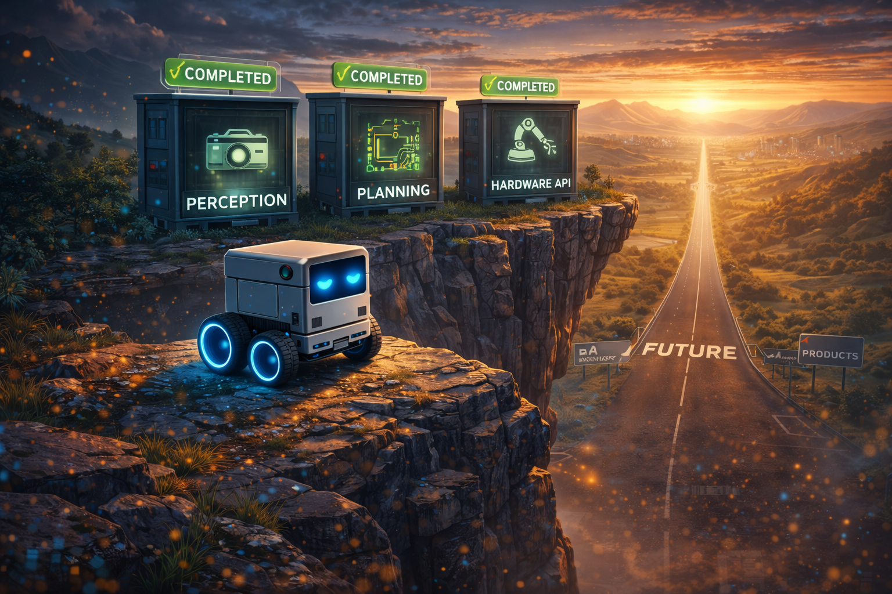
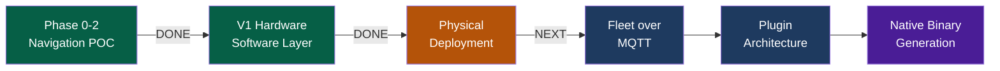
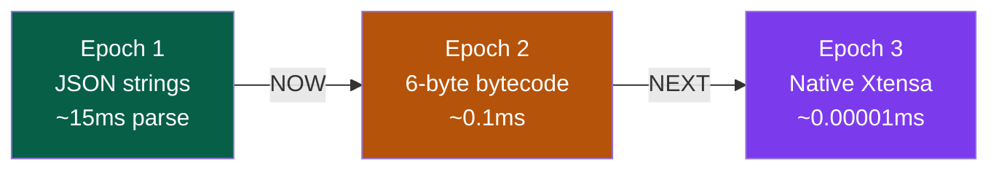

# Chapter 14: What's Next -- From Research to Reality



<!-- IMAGE_PROMPT: Isometric digital illustration, clean technical style, dark navy (#0d1117) background, soft neon accent lighting in cyan and magenta, a small wheeled robot with a glowing blue eye sensor as recurring character, flat vector aesthetic with subtle depth, no photorealism, 16:9 aspect ratio. Robot at cliff edge overlooking vast landscape. Behind: completed city of tested software modules. Ahead: road to distant landmarks (physical robot on desk, fleet in warehouse, satellite uplink). Road partially built with construction markers. Sunrise on horizon. -->

The system described in the preceding thirteen chapters is not a whiteboard design. It
runs. The occupancy grid builds a persistent spatial model from sensor data. The
navigation loop calls an LLM every cycle and validates its decisions against a strict
schema. The local planner finds collision-free paths through A* search. The vision
pipeline converts camera frames into scene graphs. The fleet coordinator merges world
models from multiple robots. There are 346 tests proving all of this works. But there
is a significant distance between "works in simulation with a mock LLM" and "works on
a physical robot navigating your living room." This chapter maps that distance.



---

## Current Implementation Status

Everything described in Phases 0 through 5 of the original roadmap is implemented and
tested:

| Component | Status | Test Coverage |
|-----------|--------|---------------|
| World Model (50x50 occupancy grid) | Done | world-model-bridge, metrics, serializer, provider |
| LLM Navigation Loop | Done | navigation-e2e, navigation-runtime, navigation-types |
| Candidate Generator | Done | candidate-generator |
| Local Planner (A*) | Done | local-planner |
| LLM World Model Corrections | Done | llm-corrections |
| Vision Simulator | Done | vision-simulator |
| Vision Scene Bridge | Done | vision-scene-bridge |
| Vision Pipeline E2E | Done | vision-pipeline-e2e |
| Sensor Bridge | Done | sensor-bridge |
| Predictive World Model | Done | predictive-world-model |
| Fleet Coordinator | Done | fleet-coordinator |
| Navigation HAL Bridge | Done | navigation-hal-bridge |
| Navigation UI Bridge | Done | navigation-ui-bridge |
| OpenRouter Inference Adapter | Done | openrouter-inference |

The full test suite: 346+ tests across 21 suites, all passing.

---

## The Next Milestone: V1 Stepper Cube Robot Physical Deployment

The software layer is complete. Every component -- firmware, kinematics, WiFi
transport, HAL bridge, navigation loop -- is implemented and tested. The next
milestone is physical deployment: assembling the V1 Stepper Cube Robot, flashing the
firmware, validating the communication protocols, and running the LLMos navigation
loop on real hardware.

The repository already dictates the exact hardware (ESP32-S3 + ESP32-CAM + 28BYJ-48
steppers + 8cm cube chassis). See `Agent_Robot_Model/Readme.md` for the complete BOM
and wiring diagrams. The full deployment plan is in
[Chapter 15](15-v1-hardware-deployment.md).

### Phase 1: Physical Assembly and Kinematic Calibration

The LLMos math relies on precise physical measurements. If the hardware deviates from
the `.stl` / `.blend` files, the LLM will hallucinate its location in space.

- 3D print the chassis from `Agent_Robot_Model/Robot_one/` (8cm cube)
- Mount the rear ball caster (stepper motors have low torque; reducing friction
  prevents wheel slip)
- Verify wheel dimensions match the codebase: 6.0 cm wheel diameter (18.85 cm
  circumference), 10.0 cm wheel base
- If wheels differ, calibrate with:
  `{"cmd":"set_config","wheel_diameter_cm":F,"wheel_base_cm":F}`

### Phase 2: Communication Protocol Validation

Two parallel networks for brain and body:

- **The "Eyes" (ESP32-CAM, Port 80)**: Flash with
  `firmware/esp32-cam-mjpeg/esp32-cam-mjpeg.ino`. Validate: hit
  `http://<ESP32-CAM-IP>/stream` in a browser and see 320x240 @ 10fps MJPEG.
- **The "Spinal Cord" (ESP32-S3, Port 4210)**: Flash with
  `firmware/esp32-s3-stepper/esp32-s3-stepper.ino`. Validate: send via UDP:
  `{"cmd":"move_cm","left_cm":10.0,"right_cm":10.0,"speed":500}` -- robot should
  move forward exactly 10cm (~2173 steps).

### Phase 3: Activating the LLMos Navigation Loop

- Configure ESP32 IP addresses in the runtime environment
- Run the NavigationHALBridge with PhysicalHAL connected to the V1 robot
- The local Qwen3-VL-8B looks at `/stream`, identifies open paths, and the TypeScript
  runtime compiles that into UDP commands
- Respect max speed: 1024 steps/s (~4.71 cm/s) -- exceeding this causes stepper skip

### Phase 4: Closing the Loop with Spatial Memory

- Continuously poll `{"cmd":"get_status"}` for step-count odometry
- Stepper motors are precise -- step counts provide accurate dead-reckoning
- Test: place robot facing a wall. Camera detects wall. Host LLM queries odometry.
  Generates `{"cmd":"rotate_deg","degrees":90.0,"speed":1024}`.

### Local Qwen3-VL-8B Server

The OpenRouter adapter (`lib/runtime/openrouter-inference.ts`) provides cloud-based
LLM inference, but real-time robot control will benefit from local inference. The plan
is to run Qwen3-VL-8B-Instruct through llama.cpp or vLLM on the host machine's GPU.
Target latency: under 500ms per frame for instinct decisions, under 3 seconds for
RSA-enhanced planning.

---

## Phase 3: Swarm Intelligence (Q3 2026)

The `FleetCoordinator` in `lib/runtime/fleet-coordinator.ts` already implements
world model merging and multi-robot coordination in memory. Phase 3 takes this to
physical hardware.

### MQTT Transport for ESP32 Fleet

ESP32 microcontrollers have native MQTT support through ESP-IDF. The fleet
communication protocol defines four message types: `SNAPSHOT_SHARE` (world model
exchange), `TASK_ASSIGN` (sector allocation), `HEARTBEAT` (liveness), and
`LEADER_ELECT` (coordination). The `esp32-device-manager.ts` in `lib/hardware/`
already defines the fleet configuration structure with leader-follower mode.

### RSA Swarm Consensus with Real Robots

The RSA engine (`lib/runtime/rsa-engine.ts`) supports a swarm consensus mode where
multiple robots' observations are aggregated through the Recursive Self-Aggregation
algorithm. Each robot contributes its local world model snapshot and camera frame.
The aggregation produces a unified world model and coordinated exploration plan.
Testing this with physical robots -- three ESP32 units simultaneously mapping an
unknown room -- is the milestone that validates the fleet architecture.

### Multi-Robot 3D Arena Visualization

The `RobotCanvas3D.tsx` component currently renders a single robot. Extending it to
display multiple robots with distinct colors, their individual world models, and
communication links between them provides the visual feedback needed for fleet
development and debugging.

### World Model Merging in Real-Time

The fleet coordinator's `mergeWorldModels()` method uses Bayesian confidence fusion
to resolve conflicting observations. Robot A sees a cell as free with confidence 0.7.
Robot B sees it as an obstacle with confidence 0.9. The merger produces a result
weighted by confidence and recency. Doing this in real-time over MQTT, with robots
moving and observing continuously, is the engineering challenge.

---

## Phase 4: Plugin Architecture (Q4 2026)

LLMos is built on markdown. Agents are markdown files. Skills are markdown files.
The kernel rules are markdown. This makes the system naturally extensible -- anyone
who can write a markdown document can contribute a robot behavior.

### Community Skill Marketplace

The volume system already supports three tiers: User, Team, and System. Skills
start in the User volume and get promoted to Team after 5+ successful uses with 80%+
success rate, then to System after 10+ uses with 90%+ success. A public registry
backed by Git would let the community share skills across installations.

### Plugin Manifest Format

Third-party contributions need a standard manifest: what hardware the plugin
requires, what HAL capabilities it uses, what inputs and outputs it expects. This
is the contract between plugin authors and the LLMos runtime.

### Third-Party Sensor Driver Plugins

The HAL's `VisionInterface` and `LocomotionInterface` are abstract. A plugin for a
LiDAR sensor, a depth camera, or a different motor controller would implement these
interfaces and register through the plugin system. The navigation loop does not
change -- it talks to the HAL, and the HAL talks to whatever hardware is plugged in.

---

## The Neural Compiler: From JSON to Machine Code

This is the defining research direction for LLMos. Today, the LLM outputs JSON
strings that the ESP32 must parse. Tomorrow, the LLM generates bytecode -- 6-byte
hex arrays that the ESP32 reads directly into hardware registers. Eventually, the
LLM generates native Xtensa machine code that executes without any interpreter.



### Epoch 2: The Bytecode VM

The **LLMos Instruction Set Architecture (ISA) v1** defines 13 opcodes in a 6-byte
frame. The same move command that takes 58 bytes of JSON becomes 6 bytes of hex:

```
JSON:     {"cmd":"move_cm","left_cm":10,"right_cm":10,"speed":500}  (58 bytes)
Bytecode: AA 01 64 64 CB FF                                         (6 bytes)
```

Grammar-constrained decoding via llama.cpp/vLLM ensures that Qwen3-VL-8B outputs
*only* valid hex -- no conversational text, no formatting drift. The firmware
transition is incremental: dual-mode (JSON + bytecode), then bytecode only.

### Epoch 3: Native Binary Generation

The LLM understands the Xtensa instruction set and generates raw `.bin` blocks that
execute via function pointers in the ESP32's IRAM. No parser. No interpreter. The
LLM's output *is* the machine code.

See [Chapter 16: The Neural Compiler](16-the-neural-compiler.md) for the full ISA
specification, grammar definitions, prompting techniques, and the firmware transition
plan.

---

## Open Research Questions

Three questions that do not yet have clear answers:

**How small can the runtime LLM be?** Qwen3-VL-8B works for navigation decisions,
but can a 3B or 1B model handle the same task? The model-size boundary determines
the minimum hardware cost for a robot that can reason about its environment. Every
halving of model size roughly halves the GPU memory requirement and doubles the
inference speed.

**Can RSA swarm consensus scale to 10+ robots?** The current fleet coordinator
handles a handful of robots. At ten or more, the world model merging becomes a
quadratic problem unless you introduce hierarchical aggregation -- cluster leaders
that merge locally before reporting to a global coordinator. The RSA algorithm
supports this in theory. Whether it works in practice with real latency and packet
loss is an open question.

**When does the distributed VM architecture collapse to single-device?** Today,
the LLM runs on a host computer and sends commands to the ESP32. As edge AI chips
improve, the LLM could run directly on the robot. At that point, the distributed
architecture becomes unnecessary overhead. When does this crossover happen? 2027?
2030? The answer depends on how fast edge inference catches up to the model sizes
that spatial reasoning requires.

**Can an LLM reliably generate safe machine code?** Grammar-constrained decoding
ensures valid bytecode format, but native code generation requires safety
guarantees -- the LLM must not emit code that violates step limits, disables the
emergency stop, or causes memory corruption. Formal verification of LLM-generated
binaries for constrained domains (motor control) is an open research problem that
sits at the intersection of AI safety and compiler verification.

---

## Contributing

The project welcomes contributions in several areas:

- **Test arenas** -- Design new navigation challenges in `lib/runtime/test-arenas.ts`
- **HAL drivers** -- Implement `HardwareAbstractionLayer` for new hardware platforms
- **Sensor integrations** -- Connect new sensor types through the `VisionInterface`
- **Navigation strategies** -- Improve the candidate generator or local planner
- **Documentation** -- Expand the book, add diagrams, improve code comments
- **Performance** -- Profile and optimize the navigation cycle pipeline
- **Bytecode VM** -- ESP32-S3 firmware that accepts 6-byte hex commands
- **Grammar-constrained inference** -- GBNF grammars for bytecode output
- **Native code safety** -- Formal methods for LLM-generated Xtensa binaries

See [CONTRIBUTING.md](../CONTRIBUTING.md) for setup instructions and contribution
guidelines. See [ROADMAP.md](../ROADMAP.md) for the full development plan with
timelines and milestone definitions.

---

## The Vision

The trajectory of this project points toward a single idea: the gap between human
intent and robot behavior should be zero.

Today, programming a robot requires learning C++, installing heavy IDEs, writing
firmware, debugging serial protocols, and manually coding every behavior. The robot
does not understand what it is doing. It executes compiled instructions.

Tomorrow, with LLMos: describe what you want in plain English. The development LLM
creates and evolves the agents as markdown files. The runtime LLM runs them in
real time on local hardware -- seeing, reasoning, and acting in the physical world.
Agents learn from every interaction, promote successful patterns through the volume
system, and coordinate as swarms. No cloud dependency for runtime. No coding
required.

The thirteen chapters before this one describe the machinery that makes this
possible: occupancy grids, navigation loops, vision pipelines, fleet coordination,
hardware abstraction, and a test suite that proves it all works. The V1 Stepper Cube
Robot hardware layer is built -- firmware, kinematics, WiFi transport, safety
enforcement. What remains is the physical assembly, protocol validation, and the
first time a robot navigates a room using LLMos as its brain.

The foundation is laid. The tests pass. The firmware is written. Now we build the
robot -- and then we teach the LLM to speak silicon's native language.

---

*Previous: [Chapter 13 -- Getting Started: Your First 10 Minutes](13-getting-started.md)*
*Next: [Chapter 15 -- V1 Hardware Deployment: From Code to Robot](15-v1-hardware-deployment.md)*
*See also: [Chapter 16 -- The Neural Compiler: From JSON to Machine Code](16-the-neural-compiler.md)*
