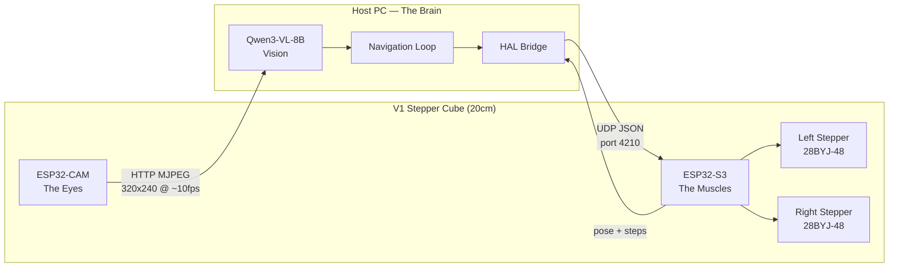

# Chapter 15: The Chassis — From Code to Robot (20cm V1 Platform)

The fourteen chapters before this one describe a complete navigation stack that runs in simulation: occupancy grids, A* pathfinding, LLM decision-making, vision pipelines, fleet coordination, and 346 tests proving it all works.

This chapter brings that stack into physical reality.

The **V1 Stepper Cube Robot (20cm Edition)** is the reference hardware platform — a lightweight (under 200g) 20×20×20 cm cube powered by two stepper motors, two ESP32 chips, and a camera.

The software layer is already built.

What follows is physical assembly, calibration, protocol validation, and the first time the robot moves under LLM control.

---

## The Two Nervous Systems

The robot maintains two completely independent communication pathways — one for vision, one for motion.



**Eyes (ESP32-CAM):**
Streams MJPEG over HTTP (port 80).

**Muscles (ESP32-S3):**
Listens for UDP JSON movement commands on port 4210.

UDP is used instead of TCP to avoid handshake latency in the 200ms control loop.

---

## Hardware Overview (20cm Platform)

| Component        | Part                              | Purpose                          |
| ---------------- | --------------------------------- | -------------------------------- |
| Motor Controller | ESP32-S3-DevKitC-1                | WiFi UDP listener, drives motors |
| Camera           | ESP32-CAM (AI Thinker)            | WiFi MJPEG streaming             |
| Motors           | 2× 28BYJ-48                       | Differential drive               |
| Drivers          | 2× ULN2003                        | Stepper motor drivers            |
| Wheels           | 6 cm diameter                     | Mounted to 28BYJ shaft           |
| Support          | Rear ball caster                  | Low friction pivot               |
| Power            | 5V 3A recommended (5V 2A minimum) | Stable system power              |
| Chassis          | 20 cm lightweight cube (<200g)    | Structural frame                 |

Even though the chassis is larger than the original 8 cm prototype, its low mass keeps torque requirements within safe limits for the 28BYJ-48 motors.

---

## Why 20cm Changes the Physics

The larger chassis increases:

* Moment of inertia during rotation
* Mechanical leverage
* Oscillation amplitude

Even at low weight, rotational precision becomes more sensitive to:

* Wheel base accuracy
* Friction in the ball caster
* Motor speed limits

Because of this, **calibration is mandatory before autonomous navigation**.

---

# Phase 1: Mechanical Assembly

### Mount Motors and Wheels

* Ensure wheel bore fits tightly on the shaft
* No wobble
* No vertical tilt
* Wheels must spin freely

### Install the Ball Caster

Critical for stepper performance.

28BYJ-48 motors have limited torque. Excess friction in the third contact point will:

* Cause skipped steps
* Corrupt odometry
* Create rotational drift

The ball caster must roll freely in all directions.

---

# Phase 2: Physical Parameter Calibration (Mandatory)

The codebase previously assumed:

* Wheel diameter: 6.0 cm
* Wheel base: 12.0 cm

With a 20cm chassis, **wheel base must be measured**.

---

## Step 1 — Measure Wheel Base

Measure center-to-center distance between wheels.

Example:

If measured 16.4 cm:

```json
{"cmd":"set_config","wheel_diameter_cm":6.0,"wheel_base_cm":16.4}
```

---

## Step 2 — Forward Calibration

Send:

```json
{"cmd":"move_cm","left_cm":50,"right_cm":50,"speed":600}
```

Measure real distance.

If robot moved 52 cm:

```
actual_diameter = 6.0 * (52 / 50) = 6.24
```

Apply:

```json
{"cmd":"set_config","wheel_diameter_cm":6.24}
```

---

## Step 3 — Rotation Calibration

Send:

```json
{"cmd":"rotate_deg","degrees":360,"speed":600}
```

If it over-rotates → wheel_base too small
If under-rotates → wheel_base too large

Adjust and repeat.

---

# Recommended Speed Limits (20cm Edition)

Even though motors support 1024 steps/sec, the 20cm chassis is more stable at:

* **Default: 600–800 steps/sec**
* Absolute max: 1024 (may skip steps)

Top speed ≈ 4.7 cm/s.

Faster speeds increase skipped-step risk.

---

# Wiring (Unchanged)

### Left Motor

| ESP32-S3 GPIO | ULN2003 |
| ------------- | ------- |
| GPIO 4        | IN1     |
| GPIO 5        | IN2     |
| GPIO 6        | IN3     |
| GPIO 7        | IN4     |

### Right Motor

| ESP32-S3 GPIO | ULN2003 |
| ------------- | ------- |
| GPIO 15       | IN1     |
| GPIO 16       | IN2     |
| GPIO 17       | IN3     |
| GPIO 18       | IN4     |

VCC → 5V
GND → Common ground

All grounds must be connected.

---

# Power Requirements

Because the system includes:

* 2 stepper motors
* ESP32-S3
* ESP32-CAM (WiFi bursts)

Power recommendation:

* **5V 3A supply preferred**
* 5V 2A minimum (may brownout during peaks)

Add a **1000uF capacitor** across 5V and GND rails.

---

# Phase 3: Eyes and Muscles Validation

## Eyes

Open:

```
http://<ESP32-CAM-IP>/stream
```

Confirm:

* 320x240 MJPEG
* ~10fps
* Stable image

---

## Muscles

Send UDP:

```json
{"cmd":"move_cm","left_cm":10,"right_cm":10,"speed":600}
```

Measure movement.

---

## Full Loop Test

1. Open camera stream
2. Command 360° rotation
3. Observe visual feedback

If video shows environment rotating while robot spins, the physical system matches software.

---

# Odometry on a 20cm Chassis

Odometry equations remain unchanged:

```
linearCm = (leftDistCm + rightDistCm) / 2
angularRad = (rightDistCm - leftDistCm) / wheelBaseCm
```

The only difference is that `wheelBaseCm` must reflect the real measured value.

Because stepper motors execute discrete steps, short-distance precision is high.

Longer paths accumulate small drift — corrected by vision.

---

# Updated Diagnostics

### “It overshoots rotation more than before”

Large chassis amplifies small errors.

Recalibrate wheel_base_cm precisely.

---

### “It vibrates during turns”

Likely causes:

* Speed too high
* Ball caster friction
* Wheel not centered
* Slight motor shaft misalignment

Reduce speed to 600.

---

### “It drifts over long runs”

Normal with dead reckoning.

Vision correction loop compensates.

---

# Final Architecture (Unchanged)

* Vision via HTTP MJPEG
* Motion via UDP JSON
* Navigation loop on host
* LLM-driven decisions
* Firmware-enforced safety

Only physical constants changed.

---

# Summary

The 20cm V1 Stepper Cube Robot preserves the original architecture but requires careful physical calibration.

Despite its larger footprint, its sub-200g weight keeps the 28BYJ-48 motors within safe torque limits.

With proper calibration:

* Linear accuracy within ±1cm over 50cm
* Rotational accuracy within ±2–3°
* Stable 600–800 steps/sec operation
* Fully functional LLM-driven navigation

The body is larger.
The mind remains the same.
