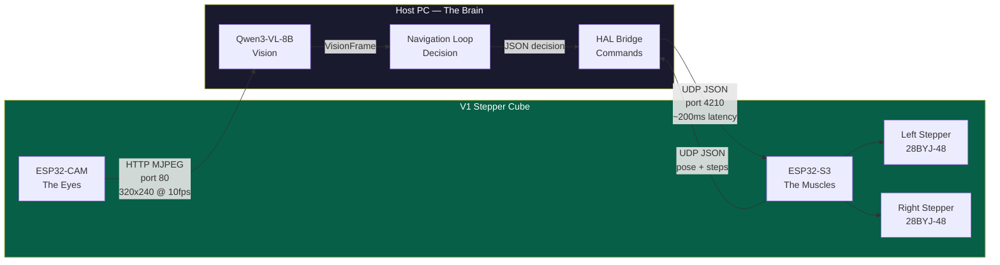
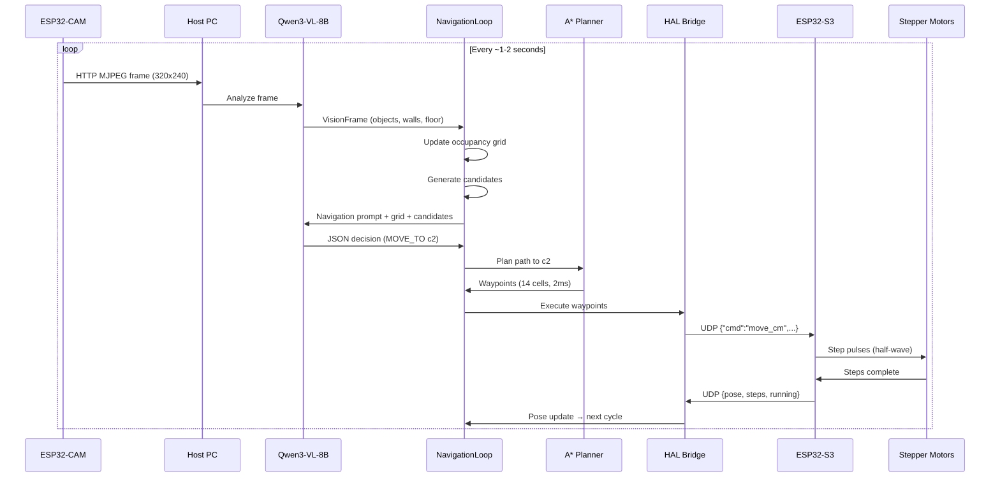

# Chapter 15: The Chassis -- From Code to Robot

<!-- IMAGE_PROMPT: Isometric digital illustration, clean technical style, dark navy (#0d1117) background, soft neon accent lighting in cyan and magenta, a small wheeled robot with a glowing blue eye sensor as recurring character, flat vector aesthetic with subtle depth, no photorealism, 16:9 aspect ratio. Four-panel sequence: (1) 3D-printed cube chassis being assembled with screwdriver, (2) ESP32 chips being wired on workbench, (3) UDP packet flying between laptop and robot, (4) robot navigating a small room with occupancy grid overlay. Arrow connecting all four panels. -->

The fourteen chapters before this one describe a complete navigation stack that runs
in simulation: occupancy grids, A* pathfinding, LLM decision-making, vision pipelines,
fleet coordination, and 346 tests proving it all works. This chapter takes that stack
off the screen and onto a desk.

The V1 Stepper Cube Robot is the reference hardware platform -- an 8cm 3D-printed cube
with two stepper motors, two ESP32 chips, and a camera. The software layer is built.
What follows is the physical assembly, protocol validation, and the first time the
robot drives under LLM control.

---

## The Two Nervous Systems

The robot has two completely separate communication paths -- like having separate
nerves for sight and motion:



**Eyes** (ESP32-CAM): HTTP MJPEG stream on port 80. The host pulls frames and feeds them to Qwen3-VL-8B for spatial understanding.

**Muscles** (ESP32-S3): UDP JSON listener on port 4210. The host sends movement commands; the firmware responds with pose and step counts. UDP instead of TCP because zero handshake latency matters in a 200ms control loop.

---

## The V1 Hardware at a Glance

| Component | Part | Purpose |
|-----------|------|---------|
| Motor Controller | ESP32-S3-DevKitC-1 | WiFi UDP listener, drives steppers via ULN2003 |
| Camera | ESP32-CAM (AI-Thinker) | WiFi MJPEG streaming to host VLM |
| Motors | 2x 28BYJ-48 stepper | Differential drive, 4096 steps/rev |
| Drivers | 2x ULN2003 Darlington | Stepper motor driver boards |
| Wheels | 6cm diameter (3D-printed) | Press-fit onto 28BYJ-48 shaft |
| Support | Ball caster | Rear low-friction contact point |
| Power | 5V 2A USB-C | Powers both ESP32s and motors |
| Chassis | 8cm 3D-printed cube | Mounts all components |

Full BOM, wiring tables, and 3D model files: `Agent_Robot_Model/Readme.md`.
Kinematic constants: `lib/hal/stepper-kinematics.ts`.

---

## Phase 1: Physical Assembly and Kinematic Calibration

The LLMos navigation math relies on precise physical measurements. If the assembled
robot deviates from the codebase constants, the LLM will miscalculate distances and
rotations -- it will "hallucinate" its position in space.

### Print the Chassis

3D print the chassis from `Agent_Robot_Model/Robot_one/`. The design is an 8cm cube
that tightly mounts:
- ESP32-S3-DevKitC-1 (motor controller)
- ESP32-CAM (camera)
- 2x ULN2003 driver boards
- 2x 28BYJ-48 stepper motors

### Mount the Ball Caster

The rear ball caster is critical. 28BYJ-48 stepper motors have relatively low torque
(~34 mN·m). If the third contact point has too much friction, the wheels will slip
during rotation commands, and the dead-reckoning odometry will drift. A smooth ball
caster minimizes this.

### Verify Wheel Dimensions

The codebase hardcodes these values in `lib/hal/stepper-kinematics.ts`:

| Parameter | Hardcoded Value |
|-----------|----------------|
| Wheel diameter | 6.0 cm |
| Wheel circumference | 18.85 cm |
| Wheel base (center-to-center) | 12.0 cm |
| Steps per cm | ~217.3 |

If your 3D-printed wheels are slightly different, calibrate with:

```json
{"cmd":"set_config","wheel_diameter_cm":6.2,"wheel_base_cm":11.8}
```

**Distance calibration:** Command 50cm forward, measure actual distance. If it moved
52cm, your actual diameter is `6.0 * (52/50) = 6.24 cm`.

**Rotation calibration:** Command a 360-degree turn. If it over-rotates, the wheel
base constant is too small. If it under-rotates, too large.

### Wiring

**Left Motor (ULN2003 #1):**

| ESP32-S3 GPIO | ULN2003 Pin | 28BYJ-48 Coil |
|---------------|-------------|----------------|
| GPIO 4 | IN1 | Blue |
| GPIO 5 | IN2 | Pink |
| GPIO 6 | IN3 | Yellow |
| GPIO 7 | IN4 | Orange |

**Right Motor (ULN2003 #2):**

| ESP32-S3 GPIO | ULN2003 Pin | 28BYJ-48 Coil |
|---------------|-------------|----------------|
| GPIO 15 | IN1 | Blue |
| GPIO 16 | IN2 | Pink |
| GPIO 17 | IN3 | Yellow |
| GPIO 18 | IN4 | Orange |

**Power:** ULN2003 VCC to 5V rail, GND to common ground.

> **Maker Checkpoint: The Skeleton.**
> Spin each wheel by hand. They should turn freely with no binding. If either
> resists, check that the motor shaft isn't misaligned with the wheel bore.
> Lift the robot — the ball caster should roll freely in all directions.
> If you pass this check, the body is ready for its nervous system.

---

## Phase 2: Giving It Eyes and Muscles

### The Eyes -- ESP32-CAM (Port 80)

**Firmware**: `firmware/esp32-cam-mjpeg/esp32-cam-mjpeg.ino`

Flash the ESP32-CAM using the Arduino IDE or PlatformIO. Before flashing, set your
WiFi credentials in the firmware source.

**What the firmware does:**
- QVGA resolution (320x240) with JPEG quality 12
- Target 10fps with frame interval throttling
- Double-buffered frame capture
- Auto exposure, white balance, and gain control
- Flash LED control

**Validation:**

1. Open `http://<ESP32-CAM-IP>/stream` in your browser
2. You should see a live 320x240 JPEG stream at approximately 10fps
3. Check `http://<ESP32-CAM-IP>/status` for FPS count and WiFi RSSI

> **Maker Checkpoint: The Eyes.**
> Do you see live video at `http://<ESP32-CAM-IP>/stream`?
> Point the camera at your hand and wave. Is the video smooth (~10fps)?
> If yes — the robot can see. If the stream stutters or shows artifacts,
> check your WiFi signal strength at `/status`.

### The Muscles -- ESP32-S3 (Port 4210)

**Firmware**: `firmware/esp32-s3-stepper/esp32-s3-stepper.ino`

Flash the ESP32-S3 with the UDP listener firmware. UDP is used instead of TCP
because it has zero handshake latency, critical for the 200ms instinct loop.

**Validation:**

Send this JSON over UDP to `<ESP32-S3-IP>:4210`:

```json
{"cmd":"move_cm","left_cm":10.0,"right_cm":10.0,"speed":500}
```

If the robot moves forward exactly 10cm (~2173 steps), the motor layer is complete.

> **Maker Checkpoint: The Muscles.**
> Did the robot move forward ~10cm? Place a ruler next to it and command another
> 10cm. Is the total ~20cm? If the distance is off by more than 1cm, recalibrate
> the wheel diameter with `set_config`.
> Try `{"cmd":"rotate_deg","degrees":90,"speed":500}` — did it turn exactly
> 90 degrees? Use a square corner as reference. If it over/under-rotates,
> adjust the wheel base constant.

**Available Commands:**

| Command | Example |
|---------|---------|
| `move_steps` | `{"cmd":"move_steps","left":2000,"right":2000,"speed":500}` |
| `move_cm` | `{"cmd":"move_cm","left_cm":10,"right_cm":10,"speed":500}` |
| `rotate_deg` | `{"cmd":"rotate_deg","degrees":90,"speed":500}` |
| `stop` | `{"cmd":"stop"}` |
| `get_status` | `{"cmd":"get_status"}` |
| `set_config` | `{"cmd":"set_config","wheel_diameter_cm":6.0,"wheel_base_cm":12.0}` |

**Safety features the firmware enforces:**
- 2-second host timeout → automatic emergency stop
- Maximum 40960 steps per command (10 revolutions)
- Maximum 1024 steps/second
- Status LED heartbeat (blink patterns indicate state)
- Motor coils disabled when idle (power saving, heat prevention)

> **Maker Checkpoint: Eyes + Muscles.**
> Can you see video AND command movement? Try this sequence:
> 1. Open the camera stream in your browser
> 2. Send `{"cmd":"rotate_deg","degrees":360,"speed":500}`
> 3. Watch the video feed — you should see the room spin
>
> If the video shows the room rotating while the robot turns, your robot has
> a working body. Everything from here is software.

---

## Phase 3: Connecting the Brain

Now that the hardware works, connect it to the LLMos TypeScript runtime.

### Configure IP Bindings

Set the local IP addresses of your ESP32-S3 (motor controller) and ESP32-CAM
(camera) in your environment configuration or `.env` file. The
`lib/hal/wifi-connection.ts` module uses these to establish the UDP transport.

### The Full Navigation Cycle on Hardware



Each cycle: see → think → act → observe → repeat.

**Speed limit:** The 28BYJ-48 maxes out at 1024 steps/second (~4.71 cm/s). The
firmware clamps to this limit, but the host should also validate. Commanding higher
speeds causes the steppers to skip steps, silently corrupting odometry.

---

## A Day in the Life of the V1 Robot

*What one navigation session looks like from the robot's perspective.*

```
Cycle 1: I wake up at (0.0, 0.0) facing north. Goal: reach (2.0, 1.5).
         I see a wall ahead through my camera.
         The VLM marks cells (0, -0.5) through (0, -1.0) as obstacles.
         I choose MOVE_TO candidate c1 at (0.5, 0.3) — clear path to the right.
         A* plans 6 waypoints. HAL sends move_cm. I roll 50cm.
         Odometry says I'm at (0.48, 0.29). Close enough.

Cycle 3: The wall is behind me now. I see open floor.
         Candidate c2 at (1.2, 0.8) scores highest — good progress toward goal.
         I move. 72cm forward and slightly left.
         Odometry: (1.18, 0.81). The grid shows a nice explored corridor behind me.

Cycle 5: Problem. I've moved less than 3cm in two cycles.
         stuck_counter: 2. Not stuck yet (threshold is 5), but something's wrong.
         Camera shows: chair leg at (1.3, 0.9). The VLM missed it last cycle.
         I add a world_model_update correction marking that cell as obstacle.
         New candidate c3 routes around the chair. MOVE_TO c3.
         I'm moving again.

Cycle 8: I can see the goal area. Distance: 0.4m.
         Candidate c4 is the goal itself at (2.0, 1.5), score 0.95.
         MOVE_TO c4. A* finds a 5-cell path. Clean run.

Cycle 9: Distance to goal: 0.22m. Within tolerance (0.3m).
         STOP. Goal reached. 9 cycles, 0 collisions.
         Total distance: 3.1m. Total time: 14 seconds.
```

This is the fundamental loop: see, think, act, observe. When the robot gets stuck, it
notices — and the LLM reasons about why and what to do differently. When the vision
pipeline misses an obstacle, the LLM can correct the map. When a path is blocked, the
fallback action fires without waiting for another inference call.

---

## Phase 4: Spatial Memory Through Odometry

The final step to autonomy is continuous position tracking.

### Continuous Status Polling

The host runtime continuously sends `{"cmd":"get_status"}` via UDP. The response
includes:

- Current pose (x, y, heading) computed by the firmware
- Accumulated left and right step counts
- Whether motors are currently running
- Uptime

The pose is computed on-chip using differential drive kinematics:

```
linearCm = (leftDistCm + rightDistCm) / 2
angularRad = (rightDistCm - leftDistCm) / wheelBaseCm
newX = prevX + linearCm * sin(prevHeading + angularRad / 2)
newY = prevY + linearCm * cos(prevHeading + angularRad / 2)
newHeading = prevHeading + angularRad
```

Because stepper motors execute precise discrete steps (unlike DC motors which slip),
this odometry is highly accurate over short distances. Over long runs, small errors
accumulate — the vision pipeline corrects this drift.

### The Closed Loop: See, Think, Act, Observe

Place the robot in front of a wall:

1. ESP32-CAM streams the frame to the host
2. Qwen3-VL-8B detects the wall
3. VisionWorldModelBridge marks wall cells as obstacles
4. Candidate generator avoids candidates behind the wall
5. LLM decides ROTATE_TO to clear the obstacle
6. Navigation loop sends `{"cmd":"rotate_deg","degrees":90.0,"speed":1024}`
7. Robot rotates 90 degrees. New camera frame shows open space
8. Navigation continues

> **Maker Checkpoint: The Full Loop.**
> Place the robot facing a wall, ~30cm away. Start the navigation loop with a
> goal behind and to the right of the robot.
> Watch: Does it see the wall? Does it turn away? Does it navigate around?
> If the robot avoids the wall and makes progress toward the goal —
> congratulations. The LLM is driving a physical robot.

---

## Agent Diagnostics & Therapy

*When your robot misbehaves, it's not broken — it's confused. Here's how to help.*

### "I asked it to go 50cm and it went 52cm"

**Diagnosis:** The robot's body image doesn't match its physical body. Its wheel
diameter constant is slightly wrong.

**Therapy:**
1. Command `{"cmd":"move_cm","left_cm":50,"right_cm":50,"speed":500}`
2. Measure actual distance
3. Actual diameter = `6.0 * (actual_cm / 50)` → e.g., `6.0 * (52/50) = 6.24`
4. `{"cmd":"set_config","wheel_diameter_cm":6.24}`

### "It keeps over-rotating (or under-rotating)"

**Diagnosis:** The robot thinks its wheels are closer together (or farther apart)
than they actually are.

**Therapy:**
1. Command `{"cmd":"rotate_deg","degrees":360,"speed":500}`
2. Over-rotates? Wheel base too small. Under-rotates? Too large.
3. Adjust: `{"cmd":"set_config","wheel_base_cm":12.3}`

### "The motors make noise but the robot barely moves"

**Diagnosis:** Stepper motors are skipping steps. They're being asked to move faster
than their torque allows, or there's too much friction.

**Therapy:**
- Reduce speed to 500-800 steps/second
- Check ball caster friction (should be very low)
- Verify power supply is 5V 2A minimum
- Spin wheels by hand — any binding?

### "The robot stops moving after 2 seconds"

**Diagnosis:** The firmware's safety system kicked in. It hasn't heard from the host
in 2 seconds, so it emergency-stopped. The robot is being cautious, not broken.

**Therapy:**
- Ensure the host is sending commands or status polls within the 2-second window
- Check WiFi — both ESP32s and host on the same network?
- Check WiFi RSSI via `GET /status` on the ESP32-CAM
- Move closer to the router or use a dedicated 2.4GHz network

### "The camera stream is stuttering"

**Diagnosis:** The ESP32-CAM has very limited memory. If something is consuming
too many resources, frames corrupt or drop.

**Therapy:**
- Check frame rate via `GET /status`
- Ensure only ONE client is consuming the stream
- If frames corrupt, restart the ESP32-CAM
- Try a dedicated 2.4GHz network (5GHz can have more interference)

---

## Key Code Files

| File | Purpose |
|------|---------|
| `firmware/esp32-s3-stepper/esp32-s3-stepper.ino` | Motor controller firmware |
| `firmware/esp32-cam-mjpeg/esp32-cam-mjpeg.ino` | Camera streaming firmware |
| `lib/hal/stepper-kinematics.ts` | Motor math (step/distance conversions) |
| `lib/hal/wifi-connection.ts` | UDP transport layer |
| `lib/hal/physical-adapter.ts` | PhysicalHAL implementation |
| `lib/hal/firmware-safety-config.ts` | Safety parameters |
| `lib/hal/serial-protocol.ts` | CRC-16 framing (wired connection) |
| `lib/runtime/navigation-hal-bridge.ts` | NavigationLoop to HAL bridge |
| `lib/runtime/openrouter-inference.ts` | Cloud LLM inference adapter |
| `Agent_Robot_Model/Readme.md` | Full BOM and wiring diagrams |

---

## What to Do Today

1. **Print the chassis** from `Agent_Robot_Model/Robot_one/`
2. **Flash both ESP32s** with firmware from `firmware/`
3. **Pass the three Maker Checkpoints**: skeleton, eyes, muscles
4. **Send your first UDP command**: `{"cmd":"move_cm","left_cm":10,"right_cm":10,"speed":800}`
5. **Open the camera stream**: `http://<ESP32-CAM-IP>/stream`
6. Once both work — **the LLM takes over the steering wheel**

---

## Chapter Summary

The V1 Stepper Cube Robot is the physical manifestation of everything described in
the preceding fourteen chapters. Two ESP32 chips — one for eyes, one for muscles —
communicate over WiFi with the host PC running the LLMos TypeScript runtime. The
camera feeds frames to Qwen3-VL-8B for spatial understanding. The motor controller
receives UDP JSON commands and drives precise stepper motors. The odometry loop
tracks position through step counting. The safety firmware enforces emergency stops
when the host goes silent.

The Maker Checkpoints guide you through validation: skeleton (wheels spin freely),
eyes (video streams), muscles (robot moves accurately), and the full loop (robot
navigates autonomously). The Agent Diagnostics help when things go wrong — because
a confused robot is not a broken robot, it just needs recalibration.

Assembly, calibration, and protocol validation take the system from simulation to
reality. The same navigation code, the same world model, the same LLM decision
loop — now driving a physical robot.

---

*Previous: [Chapter 14 -- What's Next: From Research to Reality](14-whats-next.md)*
