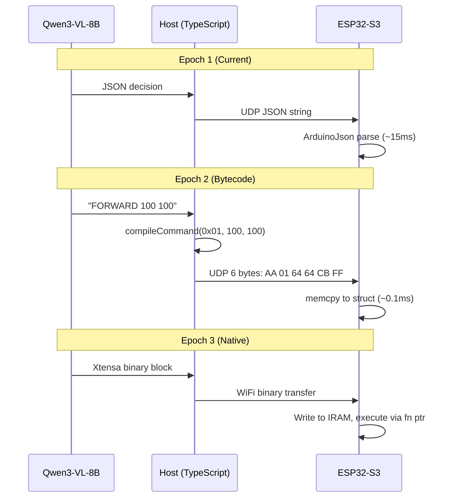

# Chapter 16: The Neural Compiler -- From JSON to Machine Code

<!-- IMAGE_PROMPT: Isometric digital illustration, clean technical style, dark navy (#0d1117) background, soft neon accent lighting in cyan and magenta, a small wheeled robot with a glowing blue eye sensor as recurring character, flat vector aesthetic with subtle depth, no photorealism, 16:9 aspect ratio. Three-panel evolution: (1) JSON text string floating between laptop and robot, (2) compact hex bytes flying as glowing pellets, (3) raw binary stream going directly into a chip. Arrow labeled "The Neural Compiler" connecting all three. -->

Every robotics system ever built follows the same pipeline: a human writes code in a
language designed for human readability, a compiler strips away that readability, and
the robot executes the result without understanding a single instruction. The LLM
changes this equation fundamentally. It can reason, perceive, and decide -- but today,
it still outputs its decisions in a format designed for humans: JSON strings that the
ESP32 must parse character by character.

This chapter describes the path from JSON to machine code. Three epochs of execution,
each eliminating a layer of abstraction between the LLM's reasoning and the robot's
actuators. The endgame is a language model that speaks directly to silicon.

---

## Why Latency Is the Enemy

A physical robot operates under hard time constraints. Every millisecond between
"the LLM decides to turn left" and "the stepper motor begins turning" is a
millisecond where the robot is acting on stale information. In a 200ms control loop,
even 15ms of JSON parsing consumes 7.5% of the cycle budget -- and that is before
the LLM inference, network transit, and motor ramp-up.

| Stage | Current (JSON) | Epoch 2 (Bytecode) | Epoch 3 (Native) |
|-------|---------------|-------------------|------------------|
| LLM output size | ~58 bytes (JSON string) | 6 bytes (hex array) | 4-16 bytes (machine code) |
| ESP32 parse time | ~15ms (ArduinoJson) | ~0.1ms (memcpy) | ~0.00001ms (direct execute) |
| Validation | String comparison | Byte range check | Type-safe by construction |
| Debugging | Human-readable | Hex dump | Disassembly required |

The JSON era is a stepping stone. It was the right choice for building and testing the
navigation stack -- 346 tests prove the system works end-to-end. Now the system works.
The question is: how fast can we make it speak?

---

## The Three Epochs

```mermaid
graph TD
    subgraph E1["Epoch 1: The Semantic Layer (Current)"]
        LLM1["LLM Reasoning"] --> JSON["JSON String<br/>{cmd: move_cm, left_cm: 10}"]
        JSON -->|"UDP"| PARSE["ArduinoJson Parser<br/>~15ms"]
        PARSE --> EXEC1["Execute Command"]
    end

    subgraph E2["Epoch 2: The Bytecode VM (Next)"]
        LLM2["LLM Reasoning"] --> HEX["6-byte Hex<br/>AA 01 64 64 CB FF"]
        HEX -->|"UDP"| READ["memcpy to struct<br/>~0.1ms"]
        READ --> EXEC2["Execute Command"]
    end

    subgraph E3["Epoch 3: Native Binary (Goal)"]
        LLM3["LLM Reasoning"] --> BIN["Xtensa Machine Code<br/>Raw .bin block"]
        BIN -->|"WiFi"| IRAM["Write to IRAM"]
        IRAM --> EXEC3["Execute via<br/>function pointer"]
    end

    style E1 fill:#065f46,color:#fff
    style E2 fill:#b45309,color:#fff
    style E3 fill:#7c3aed,color:#fff
```



### Epoch 1: The Semantic Layer (Where We Are)

The LLM outputs human-readable JSON:

```json
{"cmd":"move_cm","left_cm":10.0,"right_cm":10.0,"speed":500}
```

The ESP32-S3 firmware receives this 58-byte string over UDP port 4210, passes it
through ArduinoJson, extracts the fields, validates them, and translates them into
stepper motor commands.

**Pros:**
- Human-readable. You can see exactly what the LLM decided by reading the trace.
- Easy to debug. Paste the JSON into a terminal and replay it.
- Flexible. Adding a new command is adding a new string key.
- The entire test suite validates against this format.

**Cons:**
- 58 bytes for a command that needs 6 bytes of actual information.
- ArduinoJson parsing takes ~15ms on ESP32-S3 at 240MHz.
- String comparison for command dispatch (`if cmd == "move_cm"`).
- Fragile -- a single missing quote breaks the entire message.

This epoch was the right choice for building the system. Every component is tested,
every protocol is validated, every safety check works. But the overhead is real.

### Epoch 2: The Bytecode VM (The Next Step)

The LLM outputs a compact binary protocol -- the **LLMos Reduced Control Protocol
(RCP)**. Instead of JSON strings, the LLM generates a 6-byte hex array that the
ESP32 reads directly into a struct.

The same command as above becomes:

```
AA 01 64 64 CB FF
```

Six bytes. The ESP32 does a `memcpy` into a command struct, checks the start/end
markers, validates the checksum, and executes. No parsing. No string comparison.
No ArduinoJson.

**The LLMos Instruction Set Architecture (ISA) v1:**

```
Byte 0: START marker (0xAA)
Byte 1: OPCODE
Byte 2: PARAM_LEFT  (0-255)
Byte 3: PARAM_RIGHT (0-255)
Byte 4: CHECKSUM    (XOR of bytes 1-3)
Byte 5: END marker  (0xFF)
```

**Opcode Table:**

| Opcode | Name | PARAM_LEFT | PARAM_RIGHT | Behavior |
|--------|------|-----------|------------|----------|
| `0x01` | MOVE_FORWARD | speed (0-255) | speed (0-255) | Both wheels forward |
| `0x02` | MOVE_BACKWARD | speed | speed | Both wheels backward |
| `0x03` | TURN_LEFT | left_speed | right_speed | Differential turn |
| `0x04` | TURN_RIGHT | left_speed | right_speed | Differential turn |
| `0x05` | ROTATE_CW | degrees | speed | In-place clockwise |
| `0x06` | ROTATE_CCW | degrees | speed | In-place counter-clockwise |
| `0x07` | STOP | 0 | 0 | Immediate halt |
| `0x08` | GET_STATUS | 0 | 0 | Return pose + steps |
| `0x09` | SET_SPEED | max_speed | acceleration | Update limits |
| `0x0A` | MOVE_STEPS | left_hi | left_lo | Raw step count (left) |
| `0x0B` | MOVE_STEPS_R | right_hi | right_lo | Raw step count (right) |
| `0x10` | LED_SET | R | G | Set status LED |
| `0xFE` | RESET | 0 | 0 | Soft reset |

**Example: "Move forward at speed 100"**

```
LLM sees: clear path ahead, no obstacles
LLM outputs: AA 01 64 64 CB FF

Breakdown:
  AA    → Start marker
  01    → MOVE_FORWARD
  64    → Left speed = 100
  64    → Right speed = 100
  CB    → Checksum: 0x01 XOR 0x64 XOR 0x64 = 0xCB
  FF    → End marker
```

The ESP32 firmware transition: replace the ArduinoJson parser with a lightweight
byte reader. The UDP socket receives `uint8_t[6]` instead of `char*`. Command
dispatch becomes a switch on byte 1 instead of string comparison.

### Epoch 3: Native Binary Generation (The Research Goal)

The LLM understands the Xtensa instruction set (the architecture of the ESP32-S3)
and generates raw `.bin` execution blocks. These blocks are transmitted over WiFi,
written directly into the ESP32's instruction RAM (IRAM), and executed via function
pointers.

No interpreter. No parser. No virtual machine. The LLM's output *is* the machine
code.

This is the endgame of Software 2.0 applied to physical agents: the compiler is
not GCC or LLVM -- it is a language model that learned the mapping from spatial
reasoning to motor control instructions at the silicon level.

**Why this is feasible (eventually):**
- LLMs already generate correct x86 assembly in benchmarks
- The ESP32-S3 Xtensa LX7 has a relatively simple instruction set
- The motor control instruction space is small (move, turn, stop)
- Grammar-constrained decoding can enforce valid instruction encoding

**Why this is hard (right now):**
- Xtensa is a less common target -- less training data than x86/ARM
- Safety validation of raw machine code is an open problem
- The firmware safety layer (host timeout, step limits) must be preserved
- Debugging native code generated by an LLM requires new tooling

**The IRAM Sandbox Model:**

The ESP32-S3 has 512KB of IRAM. The native execution model allocates a fixed sandbox
region (e.g., 4KB) within IRAM for LLM-generated code. The execution pipeline:

1. **Receive:** LLM-generated binary arrives over WiFi (4-64 bytes typical)
2. **Validate:** Static analysis checks against safety invariants before loading
3. **Load:** `memcpy` into the IRAM sandbox region
4. **Execute:** Call via function pointer with a hardware watchdog timeout
5. **Reclaim:** Zero the sandbox after execution completes

The sandbox enforces hard boundaries: the generated code cannot access memory outside
its region, cannot disable interrupts, and cannot modify the watchdog timer. These
guarantees come from static validation of the binary before loading, not from runtime
checks during execution.

**Safety Invariants (must hold for any LLM-generated binary):**

```
1. No writes outside sandbox region (IRAM bounds check)
2. No interrupt disable instructions (RSIL, WAITI banned)
3. No watchdog modification (WDT registers read-only)
4. Max execution time: 10ms (hardware watchdog)
5. Max step count per execution: 4096 (one revolution)
6. Motor speed ceiling: 1024 steps/s (enforced in motor driver, not in generated code)
```

Invariants 1-3 are verified by static analysis of the binary before loading. Invariants
4-6 are enforced by hardware and the motor driver layer regardless of what the generated
code does. This defense-in-depth means that even if the LLM generates code that tries
to exceed safety limits, the hardware layer prevents it.

This epoch is a research goal, not an engineering task. It becomes practical when
models are large enough to reliably emit valid machine code for constrained domains,
and when formal verification tools can prove safety properties of LLM-generated
binaries.

---

## Teaching an LLM to Write Bytecode

The critical question: can a language model reliably output strict hex arrays instead
of chatty text? Yes -- with the right techniques.

### Technique 1: Grammar-Constrained Decoding

If running Qwen3-VL-8B locally through llama.cpp, vLLM, or Ollama, you can enforce
a strict grammar that makes it **mathematically impossible** for the model to output
anything except valid bytecode.

GBNF grammar for the LLMos RCP:

```ebnf
root     ::= "AA " opcode " " param " " param " " checksum " FF"
opcode   ::= hexbyte
param    ::= hexbyte
checksum ::= hexbyte
hexbyte  ::= hexdigit hexdigit
hexdigit ::= [0-9A-F]
```

With this grammar active, Qwen looks at the camera frame, reasons about obstacles
and goals, and is physically locked to output *only*:

```
AA 01 64 64 CB FF
```

No preamble. No explanation. No "Here is your bytecode:". Just the bytes. This
eliminates the formatting drift problem that smaller models suffer from.

### Technique 2: Few-Shot Instinct Prompting

For models that do not support grammar constraints (e.g., through OpenRouter), the
system prompt teaches the pattern through examples:

```markdown
# SYSTEM ROLE: VLM COMPILER
You are the LLMos Neural Compiler. You receive a Vision Frame and output
ONLY a 6-byte hex command. No text. No explanation. Just bytes.

ISA:
  01 = Forward, 02 = Backward, 03 = Turn Left,
  04 = Turn Right, 05 = Rotate CW, 07 = Stop

Examples:

Vision: Wall detected 15cm ahead, open space to the right.
Output: AA 04 50 C8 9C FF

Vision: Clear path ahead, goal is straight ahead.
Output: AA 01 FF FF 01 FF

Vision: Robot is stuck, no movement for 3 cycles.
Output: AA 02 64 64 CB FF

Now process the next frame. Output ONLY the 6 bytes.
```

With 3+ few-shot examples, Qwen3-VL-8B reliably outputs the hex format. The
key is the absolute prohibition on explanatory text -- "Output ONLY the 6 bytes."

### Technique 3: The Host Compiler Fallback

For maximum reliability, split the work: the LLM outputs a minimal structured
decision, and the TypeScript host compiles it to bytecode.

```
LLM outputs:  FORWARD 100 100
Host compiles: AA 01 64 64 CB FF
Host sends:    UDP bytes to ESP32-S3
```

This is the pragmatic middle ground. The LLM does not need to calculate checksums
or remember hex encoding. It outputs a one-line command in a constrained vocabulary.
The host's `BytecodeCompiler` (a 20-line function) translates to the wire format.

```typescript
// lib/hal/bytecode-compiler.ts (future)

function compileCommand(opcode: number, left: number, right: number): Uint8Array {
  const checksum = opcode ^ left ^ right;
  return new Uint8Array([0xAA, opcode, left, right, checksum, 0xFF]);
}
```

This approach preserves all the benefits of bytecode (6 bytes, no JSON parsing) while
keeping the LLM's job simple: pick an opcode and two parameters.

---

## The Firmware Transition

The ESP32-S3 firmware currently uses ArduinoJson to parse incoming UDP packets. The
transition to bytecode is a firmware update, not a rewrite:

**Phase 1 (Dual-mode):** The firmware listens on the same UDP port 4210. If the first
byte is `{`, it routes to the JSON parser (backward compatible). If the first byte is
`0xAA`, it routes to the bytecode handler. Both coexist.

**Phase 2 (Bytecode primary):** The JSON parser is removed. The firmware only accepts
bytecode. The host's `BytecodeCompiler` handles the translation.

**Phase 3 (Native execution):** The firmware allocates an IRAM execution buffer. When
it receives a native code block, it writes it to the buffer and calls it as a function
pointer. Safety validation gates the execution.



---

## The Model-Size Boundary Revisited

Chapter 1 introduced the model-size boundary -- the line between what the LLM decides
and what classical code executes. The bytecode vision shifts this boundary downward.

In Epoch 1, the LLM outputs high-level decisions (`MOVE_TO candidate c2`) and
classical code handles everything below: path planning, coordinate conversion,
motor commands, JSON serialization.

In Epoch 2, the LLM can optionally output the motor command directly (`AA 01 64 64
CB FF`), collapsing the path planner and HAL into the LLM's reasoning. The boundary
moves down -- the LLM controls more, the classical code controls less.

In Epoch 3, the boundary approaches zero. The LLM generates the actual instructions
the silicon executes. The only classical code remaining is the safety validator that
gates execution.

```
Epoch 1:  LLM → [JSON] → Host → [Path Plan] → [HAL] → [UDP] → [JSON Parse] → Motor
Epoch 2:  LLM → [Bytecode] → Host → [UDP] → Motor
Epoch 3:  LLM → [Native Code] → Motor
```

As models get smaller and faster, this compression becomes practical. An 8B model
running locally at 200ms per frame can afford to output a 6-byte command. A future
3B model running at 50ms per frame could afford to output 16 bytes of machine code.
The model-size boundary is not fixed -- it is a function of capability, and it moves
downward over time.

---

## The Grand Challenge: Latency to Zero

The ultimate enemy of a physical robot is latency. Every layer of abstraction between
"the LLM decides" and "the motor turns" adds delay, potential failure points, and
translation overhead.

| Layer Eliminated | Latency Saved | How |
|-----------------|--------------|-----|
| JSON string parsing | ~15ms | Bytecode protocol (Epoch 2) |
| Host-to-ESP32 translation | ~5ms | LLM outputs bytecode directly |
| Bytecode interpretation | ~0.1ms | Native code generation (Epoch 3) |
| Safety validation overhead | ~0.01ms | Formal verification of LLM output |

**The Latency Bounty:** We invite contributors -- C++ firmware engineers, LLM prompt
engineers, compiler researchers -- to collaborate on pushing this boundary. The
specific challenges:

1. **ESP32-S3 Bytecode VM:** Replace the ArduinoJson parser with a 6-byte command
   handler. Keep the safety layer (host timeout, step limits, e-stop).

2. **Grammar-Constrained Inference:** Configure llama.cpp or vLLM to enforce the
   GBNF grammar for Qwen3-VL-8B bytecode output.

3. **Host BytecodeCompiler:** The 20-line TypeScript function that translates
   LLM decisions to the 6-byte wire format.

4. **Native Code Safety:** Formal methods for validating that LLM-generated Xtensa
   code cannot violate safety invariants (max speed, step limits, timeout).

---

## Key Code Files

| File | Purpose |
|------|---------|
| `firmware/esp32-s3-stepper/esp32-s3-stepper.ino` | Current JSON-based firmware (transition target) |
| `lib/hal/wifi-connection.ts` | UDP transport (will carry bytecode) |
| `lib/hal/stepper-kinematics.ts` | Step/distance math (informs opcode parameters) |
| `lib/hal/firmware-safety-config.ts` | Safety limits (preserved across all epochs) |
| `lib/runtime/navigation-loop.ts` | Decision output (JSON today, bytecode tomorrow) |
| `lib/runtime/navigation-types.ts` | LLM output schema (will add bytecode variant) |

---

## Chapter Summary

The journey from JSON to machine code is the journey from "LLM as chatbot" to "LLM
as compiler." Three epochs mark the path: semantic JSON (human-readable, debuggable,
15ms parse overhead), bytecode (6 bytes, no parsing, ~0.1ms), and native binary
generation (direct to silicon, the research frontier).

The LLMos ISA v1 defines 13 opcodes in a 6-byte frame with start/end markers and XOR
checksum. Grammar-constrained decoding ensures that even an 8B model outputs strict
hex without conversational drift. The host compiler fallback provides a pragmatic
middle ground: the LLM picks the action, TypeScript compiles the bytes.

The firmware transition is incremental: dual-mode (JSON + bytecode), then bytecode
primary, then native execution. Safety validation is preserved at every epoch --
the host timeout, step limits, and emergency stop work regardless of how the
command arrives.

The grand challenge is latency to zero. Every layer of abstraction eliminated brings
the LLM's reasoning closer to the motor's rotation. When the language model speaks
silicon's native language, the entire traditional toolchain -- GCC, ROS, interpreters,
JSON parsers -- becomes unnecessary. That is the trajectory. That is the research goal.

---

*Previous: [Chapter 15 -- The Chassis: From Code to Robot](15-v1-hardware-deployment.md)*
