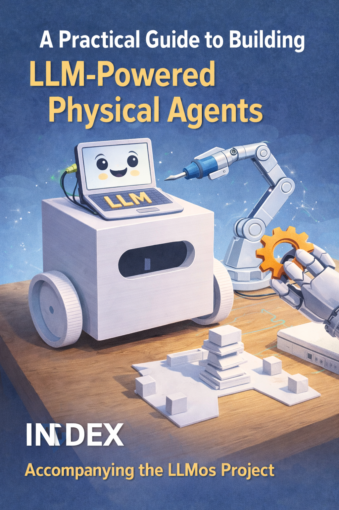

# Building Robot Minds



<!-- IMAGE_PROMPT: Isometric digital illustration, clean technical style, dark navy (#0d1117) background, soft neon accent lighting in cyan and magenta, a small wheeled robot with a glowing blue eye sensor as recurring character, flat vector aesthetic with subtle depth, no photorealism, 16:9 aspect ratio. A small wheeled robot at the center of a glowing circuit-board landscape. Above it, translucent exploded-view layers: an occupancy grid, neural network pattern, camera lens, and markdown documents as holographic pages. Title "Building Robot Minds" as clean sans-serif text. -->

> A practical guide to building LLM-powered physical agents. Accompanying the [LLMos](https://github.com/EvolvingAgentsLabs/llmos) project.

---

## The Question This Book Answers

What happens when you give a robot a language model as its brain — not as a chatbot
bolted onto a rover, but as the actual kernel that perceives, reasons, plans, and acts
in the physical world?

This book answers that question by building the entire system: from the philosophical
thesis through the TypeScript implementation to an 8cm cube robot driving across a desk
under LLM control. Every code snippet comes from the actual codebase. Every test count
reflects real output. Every architecture diagram reflects real module boundaries.

**You do not need a robot to follow along.** The entire navigation stack runs in
simulation with a mock LLM. No GPU, no API key, no hardware.

```bash
npm install && npx tsx scripts/run-navigation.ts --all --verbose
```

---

## Choose Your Path

**"I want to understand the philosophy."**
Start with [Chapter 1: The Thesis](01-the-thesis.md) and [Chapter 2: Two Brains](02-dual-llm-architecture.md).

**"I want to see the navigation system."**
Jump to [Chapter 3: The World Model](03-world-model.md) and [Chapter 4: The Navigation Loop](04-navigation-loop.md).

**"I want to run something right now."**
Go to [Chapter 13: Getting Started](13-getting-started.md) — clone to running demo in 5 commands.

**"I have hardware on my desk."**
Read [Chapter 7: The HAL](07-hal-and-hardware.md), then [Chapter 15: V1 Hardware Deployment](15-v1-hardware-deployment.md).

**"I want to understand how the robot learns."**
Start with [Chapter 8: Agents and Skills](08-agents-and-skills.md), then [Chapter 11: The Evolution Engine](11-evolution-engine.md).

**"I want to see where this is going — LLM as compiler."**
Read [Chapter 16: The Neural Compiler](16-the-neural-compiler.md) — the path from JSON to native machine code.

---

## The Book

This book is organized in three parts — like the layers of a mind.

### Prologue: The Thesis

| # | Chapter | The Question It Answers |
|---|---------|------------------------|
| 1 | [The Thesis: LLM as Kernel](01-the-thesis.md) | Why put a language model in charge of a robot? |
| 2 | [Two Brains: Development and Runtime](02-dual-llm-architecture.md) | Why does LLMos need two different LLMs? |

---

### Book I: The Body *(The Somatic Layer)*

How the robot touches the physical world — its eyes, muscles, and nervous system.

| # | Chapter | The Question It Answers |
|---|---------|------------------------|
| 6 | [Eyes: Camera to Grid](06-vision-pipeline.md) | How does a camera frame become an occupancy grid cell? |
| 7 | [The Nervous System: One Interface, Two Worlds](07-hal-and-hardware.md) | How does the same code drive a simulation and a real robot? |
| 15 | [The Chassis: From Code to Robot](15-v1-hardware-deployment.md) | How do you assemble, calibrate, and deploy the V1 Stepper Cube? |

---

### Book II: The Brain *(The Cognitive Layer)*

How the robot thinks — spatial memory, the decision loop, instinct vs. planning,
and the ability to predict what it hasn't seen yet.

| # | Chapter | The Question It Answers |
|---|---------|------------------------|
| 3 | [Spatial Memory: How a Robot Thinks About Space](03-world-model.md) | How does a 50x50 grid represent an entire room? |
| 4 | [The Thought Cycle: 13 Steps from Sensor to Motor](04-navigation-loop.md) | What happens in a single navigation cycle? |
| 5 | [Instinct vs. Deliberation](05-dual-brain-controller.md) | When should the robot react instantly vs. think carefully? |
| 9 | [Imagination: Thinking Before Acting](09-predictive-intelligence.md) | How does the robot predict unseen space? |

---

### Book III: The Soul *(The Evolutionary Layer)*

How the robot learns, cooperates, and evolves — its identity as a markdown file,
its social behavior in a fleet, and the mutation engine that makes it better.

| # | Chapter | The Question It Answers |
|---|---------|------------------------|
| 8 | [Identity: Agents, Skills, and the Markdown OS](08-agents-and-skills.md) | What does it mean for a program to be a markdown file? |
| 10 | [Social Behavior: Multiple Robots, One World](10-fleet-coordination.md) | How do robots share what they know? |
| 11 | [Dreams: The Evolution Engine](11-evolution-engine.md) | How does a robot improve while it sleeps? |

---

### The North Star: LLM as Compiler

| # | Chapter | The Question It Answers |
|---|---------|------------------------|
| 16 | [The Neural Compiler: From JSON to Machine Code](16-the-neural-compiler.md) | How does an LLM learn to speak directly to silicon? |

The three epochs: JSON strings (now) → 6-byte bytecode (next) → native Xtensa machine code (goal).

---

### Appendices: Practice

| # | Chapter | What You Get |
|---|---------|-------------|
| 12 | [346+ Tests: Proving the System Works](12-testing.md) | The testing philosophy — how every layer is validated without hardware |
| 13 | [Getting Started: Your First 10 Minutes](13-getting-started.md) | Clone to running demo in 5 commands |
| 14 | [What's Next: From Research to Reality](14-whats-next.md) | The roadmap from simulation to physical deployment |

---

## Key Numbers

| Metric | Value |
|--------|-------|
| Tests | 346+ across 21 suites |
| Navigation criteria (live LLM) | 6/6 passed |
| World model grid | 50x50 cells at 10cm resolution |
| Navigation cycle time | ~1.4s/cycle (cloud), ~200ms (local) |
| Action types | 5 (MOVE_TO, EXPLORE, ROTATE_TO, FOLLOW_WALL, STOP) |
| HAL subsystems | 5 (locomotion, vision, manipulation, communication, safety) |
| Test arenas | 4 predefined environments |
| V1 Robot | 8cm cube, 6cm wheels, ~4.7 cm/s max |
| V1 Motor precision | 4096 steps/revolution |

---

## Prerequisites

**To read the book and run simulations:**
- Node.js 18+ and npm
- TypeScript familiarity
- Git

**To use real LLM inference (optional):**
- OpenRouter API key, or
- GPU with 8GB+ VRAM for local Qwen3-VL-8B

**To build the physical robot ([Chapter 15](15-v1-hardware-deployment.md)):**
- ESP32-S3-DevKitC-1 (motor controller)
- ESP32-CAM AI-Thinker (camera)
- 2x 28BYJ-48 steppers + 2x ULN2003 drivers
- 8cm 3D-printed chassis
- 5V 2A USB-C power supply

---

## About

This is a living document. As the codebase evolves, the book is updated to match.
Every file path is relative to the repository root — when a chapter says
`lib/runtime/navigation-loop.ts`, you can open that file and see the exact code
being discussed.

Built by [Evolving Agents Labs](https://github.com/EvolvingAgentsLabs).

---

*Start reading: [Chapter 1 -- The Thesis: LLM as Kernel](01-the-thesis.md)*
