# LLMos Architecture v2: Adaptive Physical Intelligence

## The iPhone Moment for Robotics

This architecture transforms LLMos from a robot simulation platform into the **Smartphone of Robotics**:

| Smartphone | LLMos Robot |
|------------|-------------|
| Hardware (screen, touch) | ESP32 + Camera + Arm |
| Operating System (iOS/Android) | Gemini 3 Flash Kernel |
| App (.apk/.ipa) | Skill Cartridge (.md) |

**Result**: Generic hardware that runs *apps* to do anything.

---

## System Overview


---

## Component Deep Dive

### 1. Skill Cartridge (The "App")

A Skill Cartridge is a markdown file that transforms a generic robot into a specialist:

```markdown
---
name: PlantCare_Specialist
type: physical_skill
base_model: gemini-3-flash
hardware_profile: standard_arm_v1
version: 1.2.0
---

# Role
You are an expert botanist. Identify dry soil and water plants.

# Visual Cortex Instructions (Gemini Vision)
**Scan for:** withered_leaves, dry_soil_texture (cracked/light brown)
**Ignore:** Plastic pots, furniture
**Alert:** yellow_leaves → flag "Nutrient Deficiency"

# Motor Cortex Protocols (Tool Use)
- Use `arm.precision_mode(true)` for watering
- Verify water flow visually
- Stop if water reaches 1cm from rim

# Evolution History
- v1.0: Initial prompts
- v1.1: Added check_drainage (Dreaming discovered root rot risk)
- v1.2: Reduced water flow rate by 20% (field optimization)
```

### 2. Gemini 3 Flash Kernel (The "OS")

The kernel processes multimodal inputs with **Agentic Vision**:

```mermaid
sequenceDiagram
    participant Robot as Robot Camera
    participant Browser as LLMos Browser
    participant Gemini as Gemini 3 Flash
    participant HAL as HAL Layer

    Robot->>Browser: MJPEG Video Stream
    Browser->>Gemini: Image + Skill Context

    Note over Gemini: THINK Phase
    Gemini->>Gemini: Analyze scene + formulate plan

    Note over Gemini: ACT Phase
    Gemini->>Gemini: Execute Python code<br/>Zoom/Crop/Annotate

    Note over Gemini: OBSERVE Phase
    Gemini->>Gemini: Verify with transformed image

    Gemini->>Browser: Tool Calls (JSON)
    Browser->>HAL: hal.move_to(x, y, z)
    HAL->>Robot: Motor Commands
```



**Key Insight**: Agentic Vision doesn't just "see" - it *investigates*. When detecting fine details, it:
- Generates Python code to crop/zoom the region
- Appends the transformed image to its context
- Makes decisions grounded in pixel-level evidence

### 3. Hardware Abstraction Layer (HAL)

The HAL enables the same skill to run in both worlds:


### 4. The Dreaming Engine (Evolution)

Digital twins learn while the live instance operates:


**The Dream Cycle**:
1. **Record**: Live instance logs failures to BlackBox
2. **Replay**: Dreaming engine reconstructs scenario in simulation
3. **Mutate**: Generate skill variants with different approaches
4. **Evaluate**: Test variants in accelerated simulation (1000x real-time)
5. **Patch**: Deploy winning strategy to live instance

---

## Data Flow Architecture

### Camera to Action Pipeline


### Skill Hot-Swapping


---

## Physical/Simulated Duality Architecture

### Shared Components

```
┌─────────────────────────────────────────────────────────────────┐
│                     SHARED (100% Code Reuse)                    │
│  ┌─────────────┐  ┌─────────────┐  ┌─────────────────────────┐ │
│  │ Agent Def   │  │ Tool Specs  │  │ 3D Navigation System    │ │
│  │ (Markdown)  │  │ (JSON)      │  │ (Pathfinding, Mapping)  │ │
│  └─────────────┘  └─────────────┘  └─────────────────────────┘ │
└─────────────────────────────────────────────────────────────────┘
                              │
            ┌─────────────────┼─────────────────┐
            ▼                                   ▼
┌───────────────────────┐           ┌───────────────────────────┐
│    SIMULATED WORLD    │           │       REAL WORLD          │
│ ┌───────────────────┐ │           │ ┌───────────────────────┐ │
│ │ Three.js Renderer │ │           │ │ ESP32-S3 + WASMachine │ │
│ ├───────────────────┤ │           │ ├───────────────────────┤ │
│ │ Cannon.js Physics │ │           │ │ Real World Physics    │ │
│ ├───────────────────┤ │           │ ├───────────────────────┤ │
│ │ Simulated Sensors │ │           │ │ OV2640 Camera         │ │
│ │ (Raycasting)      │ │           │ │ Distance Sensors      │ │
│ ├───────────────────┤ │           │ ├───────────────────────┤ │
│ │ Virtual Motors    │ │           │ │ Stepper/DC Motors     │ │
│ └───────────────────┘ │           │ └───────────────────────┘ │
└───────────────────────┘           └───────────────────────────┘
```

### Deployment Pipeline


---

## Inversion of Control Model

### Traditional Robotics (Firmware-Centric)

```
┌─────────────────────────────────────┐
│         MICROCONTROLLER             │
│  ┌───────────────────────────────┐  │
│  │         FIRMWARE              │  │
│  │  - Hardcoded behaviors        │  │
│  │  - Fixed sensor processing    │  │
│  │  - Predetermined responses    │  │
│  └───────────────────────────────┘  │
│                │                    │
│    ┌───────────┴───────────┐       │
│    ▼                       ▼       │
│  Sensors                Motors     │
└─────────────────────────────────────┘
```

### LLMos (LLM-Centric)

```
┌─────────────────────────────────────────────────────────────┐
│                    CLOUD LLM (Gemini 3)                     │
│  ┌───────────────────────────────────────────────────────┐  │
│  │              SKILL CARTRIDGE                          │  │
│  │  - Dynamic behaviors (markdown)                       │  │
│  │  - Contextual reasoning                               │  │
│  │  - Natural language evolution                         │  │
│  └───────────────────────────────────────────────────────┘  │
└──────────────────────────┬──────────────────────────────────┘
                           │ Tool Calls (JSON)
                           ▼
┌─────────────────────────────────────────────────────────────┐
│                    MICROCONTROLLER                          │
│  ┌───────────────────────────────────────────────────────┐  │
│  │              TOOL EXECUTOR                             │  │
│  │  - Exposes sensors as readable tools                  │  │
│  │  - Exposes actuators as callable tools                │  │
│  │  - No behavior logic - just I/O                       │  │
│  └───────────────────────────────────────────────────────┘  │
│                     │               │                       │
│         ┌───────────┘               └───────────┐          │
│         ▼                                       ▼          │
│  Tool: read_sensors()                 Tool: drive(l, r)   │
│  Tool: use_camera(prompt)             Tool: set_led(rgb)   │
└─────────────────────────────────────────────────────────────┘
```

**Key Difference**: The microcontroller becomes a "peripheral" that exposes tools. All intelligence lives in the cloud-based LLM with downloadable skill cartridges.

---

## Implementation Priorities

### Phase 1: Core Infrastructure
1. Gemini 3 Flash API integration wrapper
2. Agentic Vision Think-Act-Observe loop
3. Skill Cartridge loader with hot-swapping

### Phase 2: HAL Unification
1. Abstract existing Three.js simulation
2. Abstract ESP32 hardware interface
3. Unified tool definitions

### Phase 3: Dreaming Engine
1. BlackBox recorder for failures
2. Headless simulation for replay
3. Evolutionary skill patcher

### Phase 4: Production Ready
1. Multi-robot fleet support
2. Collaborative skill evolution (Team Volume)
3. Skill marketplace

---

*Architecture Version: 2.0*
*Last Updated: 2026-01-28*
*Status: Design Complete, Implementation Pending*
