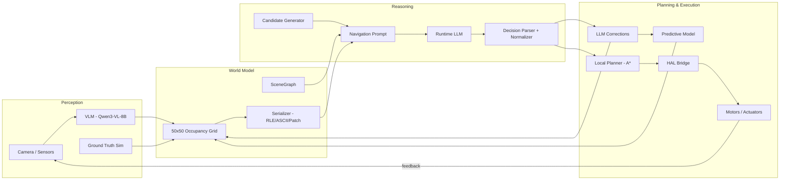
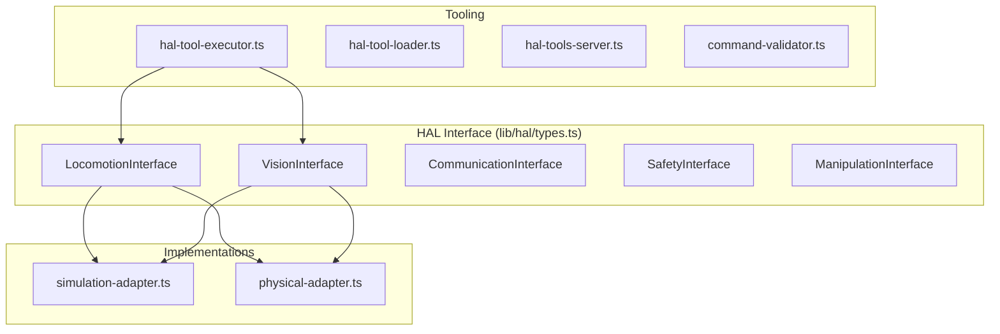
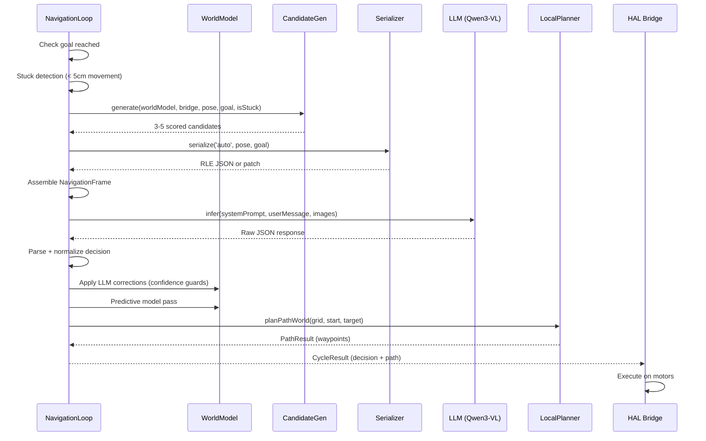
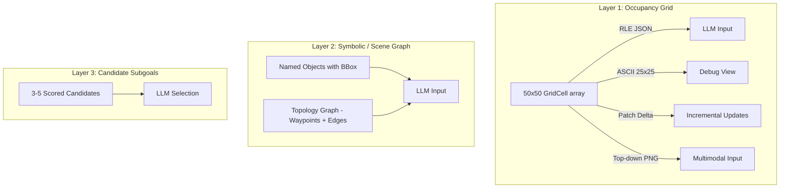
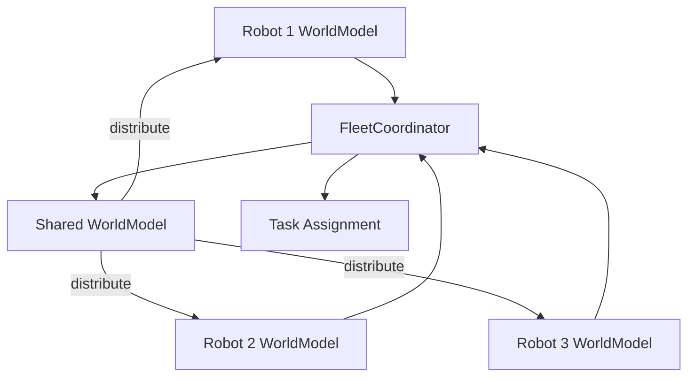

# LLMos System Architecture

Technical architecture documentation for LLMos -- the Operating System for AI Physical Agents.

---

## Table of Contents

1. [System Overview](#system-overview)
2. [Full Pipeline](#full-pipeline)
3. [Module Map](#module-map)
4. [HAL Layer](#hal-layer)
5. [Navigation Pipeline](#navigation-pipeline)
6. [World Model Layers](#world-model-layers)
7. [Fleet Coordination](#fleet-coordination)
8. [Testing Architecture](#testing-architecture)
9. [Technology Stack](#technology-stack)

---

## System Overview

LLMos is an operating system for AI physical agents (robots). The central idea: an LLM acts as the robot's "brain," choosing **where** to go, while classical algorithms handle **how** to get there safely. The system maintains a cognitive world model -- a 50x50 occupancy grid at 10cm/cell resolution -- that bridges raw sensor data and high-level LLM reasoning.

The architecture enforces a strict separation of concerns:

- **LLM** picks strategy (subgoal selection, exploration direction, recovery)
- **Local planner** (A\*) computes collision-free paths on the grid
- **HAL** executes motor commands and enforces safety limits
- **World model** provides the shared representation all layers read from

---

## Full Pipeline

The navigation cycle runs in a loop. Each iteration:

| Step | Component | Description |
|------|-----------|-------------|
| 1 | Sensor / Camera | Capture raw frame or distance readings |
| 2 | VisionWorldModelBridge / WorldModelBridge | Convert observations to grid cell updates |
| 3 | WorldModel | 50x50 occupancy grid (10cm/cell), centered at (25,25) |
| 4 | WorldModelSerializer | Serialize grid to RLE JSON, ASCII, or patch format |
| 5 | CandidateGenerator | Detect frontiers, generate 3-5 scored subgoals |
| 6 | NavigationPrompt | Assemble system prompt + world model + map image + camera |
| 7 | LLM (Qwen3-VL-8B via OpenRouter) | Choose action: MOVE_TO, EXPLORE, ROTATE_TO, FOLLOW_WALL, STOP |
| 8 | Decision Parser + Normalizer | Parse JSON (strip markdown fences, think tags, free-form normalize) |
| 9 | LLM Corrections | Apply optional world_model_update with confidence guards |
| 10 | Predictive Model | 4 heuristics fill unknown cells with low-confidence predictions |
| 11 | Local Planner (A\*) | Plan collision-free path on cost map |
| 12 | HAL Bridge | Translate waypoints to HAL locomotion commands |
| 13 | Motors | Execute movement, report result back to loop |

---

## Module Map

All navigation modules live under `lib/runtime/`. Grouped by subsystem:

### World Model Subsystem

| File | Purpose |
|------|---------|
| `world-model.ts` | 50x50 occupancy grid, coordinate conversion, sensor raycasting, ASCII visualization, singleton management |
| `world-model-serializer.ts` | RLE JSON (Format A), ASCII 25x25 (Format C), patch delta encoding, downsampling |
| `world-model-bridge.ts` | `IWorldModelBridge` interface + ground-truth `WorldModelBridge` (Bresenham rasterization) |
| `sensor-bridge.ts` | `VisionWorldModelBridge` -- builds grid from camera + VLM output with temporal decay |
| `predictive-world-model.ts` | 4 spatial heuristics (wall continuation, corridor, open space, boundary walls) + verification |
| `world-model-metrics.ts` | Grid accuracy comparison (cell accuracy, obstacle recall/precision, false positive/negative) |
| `world-model-provider.ts` | Provider interface for world model access |
| `map-renderer.ts` | Top-down PNG renderer (Format B) for multimodal LLM input |

### Navigation Subsystem

| File | Purpose |
|------|---------|
| `navigation-loop.ts` | Top-level orchestrator: cycle counter, stuck detection, LLM inference, corrections, path planning |
| `navigation-types.ts` | `NavigationFrame` input schema, `LLMNavigationDecision` output schema, free-form normalizer |
| `navigation-prompt.ts` | System prompt template, user message assembly, multimodal message builder, fallback decisions |
| `candidate-generator.ts` | Frontier detection, goal subgoals, recovery candidates, scoring (goal/clearance/novelty/feasibility) |
| `local-planner.ts` | A\* pathfinding with octile heuristic, cost map with obstacle inflation, waypoint downsampling |
| `navigation-hal-bridge.ts` | Translates `CycleResult` to HAL locomotion commands, continuous run loop |
| `navigation-ui-bridge.ts` | State bridge to React UI (callbacks for mode, path, predictions, fleet) |
| `navigation-runtime.ts` | Session entry point, supports ground-truth and vision bridge modes, lightweight physics simulation |
| `navigation-evaluator.ts` | Pass/fail evaluation (goal reached, collisions, exploration, coherence, cycle limit, stuck recovery) |
| `navigation-logger.ts` | Cycle-by-cycle logging, run summary generation |

### Test Infrastructure

| File | Purpose |
|------|---------|
| `test-arenas.ts` | 4 predefined arenas: Simple Navigation, Exploration, Dead-End Recovery, Narrow Corridor |
| `vision-simulator.ts` | `GroundTruthVisionSimulator` -- generates VisionFrames from simulation for vision-mode testing |
| `vision-scene-bridge.ts` | Converts `VisionFrame` detections to `SceneGraph` nodes |

### Scene Graph

| File | Purpose |
|------|---------|
| `scene-graph/scene-graph.ts` | Core SceneGraph data structure (nodes with spatial data) |
| `scene-graph/scene-graph-manager.ts` | Manager for scene graph lifecycle, LLM serialization |
| `scene-graph/topology.ts` | Topological graph (waypoints + edges with traversal cost/status) |
| `scene-graph/semantic-query.ts` | Semantic queries over scene graph nodes |
| `scene-graph/world-model-integration.ts` | Bidirectional sync between SceneGraph and WorldModel |
| `scene-graph/types.ts` | Shared types for scene graph subsystem |

### LLM Inference

| File | Purpose |
|------|---------|
| `openrouter-inference.ts` | OpenRouter API adapter with vision support, retries, exponential backoff, token tracking |
| `llm-inference.ts` | Generic LLM inference interface |

### Fleet Coordination

| File | Purpose |
|------|---------|
| `fleet-coordinator.ts` | Multi-robot world model merging, frontier-based task assignment, conflict resolution |

---

## HAL Layer

The Hardware Abstraction Layer (`lib/hal/`) provides a unified interface that works identically in simulation (Three.js) and on physical hardware (ESP32).

### HAL Files

| File | Purpose |
|------|---------|
| `types.ts` | All HAL interfaces: `HardwareAbstractionLayer`, `LocomotionInterface`, `VisionInterface`, `CommunicationInterface`, `SafetyInterface`, `ManipulationInterface` |
| `simulation-adapter.ts` | Three.js simulation backend |
| `physical-adapter.ts` | ESP32/serial/WiFi/Bluetooth physical backend |
| `hal-tool-executor.ts` | Executes HAL tool calls from LLM |
| `hal-tool-loader.ts` | Dynamic tool loading |
| `hal-tools-server.ts` | Tool server for HAL commands |
| `command-validator.ts` | Validates HAL commands before execution |

### LocomotionInterface

| Method | Signature | Description |
|--------|-----------|-------------|
| `drive` | `(left, right, durationMs?) => HALToolResult` | Differential drive (PWM -255 to 255) |
| `moveTo` | `(x, y, z, speed?) => HALToolResult` | Move to absolute position |
| `rotate` | `(direction, degrees) => HALToolResult` | Rotate in place (left/right, 1-360 deg) |
| `moveForward` | `(distanceCm) => HALToolResult` | Move forward 1-200cm |
| `moveBackward` | `(distanceCm) => HALToolResult` | Move backward 1-200cm |
| `stop` | `() => HALToolResult` | Emergency stop |
| `getPose` | `() => {position, rotation, velocity}` | Current pose |

### VisionInterface

| Method | Signature | Description |
|--------|-----------|-------------|
| `captureFrame` | `() => string` | Base64 camera frame |
| `scan` | `(mode?) => {objects, clearAhead, nearestObstacle}` | Environment scan |
| `getDistanceSensors` | `() => {front, left, right, ...}` | Distance readings |
| `getLineSensors` | `() => number[]` | Line following sensors |
| `getIMU` | `() => {acceleration, gyroscope, heading}` | Inertial measurement |

---

## Navigation Pipeline

The `NavigationLoop` class (`navigation-loop.ts`) is the central orchestrator. Each call to `runCycle()` executes the following steps:

### Key Configuration

| Parameter | Default | Description |
|-----------|---------|-------------|
| `maxCycles` | 200 | Cycle limit before abort |
| `maxHistory` | 5 | History entries sent to LLM |
| `stuckThreshold` | 5 | Cycles without movement to declare stuck |
| `goalToleranceM` | 0.3 | Distance to consider goal reached |
| `inferenceTimeoutMs` | 5000 | LLM call timeout |
| `unknownCellCost` | 5 (GT) / 50 (vision) | A\* cost for unknown cells |
| `applyLLMCorrections` | true | Whether LLM can correct the grid |
| `llmCorrectionMinConfidence` | 0.6 | Minimum LLM correction confidence |
| `llmCorrectionMaxOverride` | 0.7 | Max sensor confidence LLM can override |
| `enablePredictiveModel` | false | Run spatial heuristics each cycle |

---

## World Model Layers

The navigation system uses a three-layer world representation:

### Layer 1: Occupancy Grid (GridCell)

Each cell stores:
- `state`: one of `unknown`, `free`, `obstacle`, `wall`, `explored`, `path`, `collectible`, `collected`
- `confidence`: 0.0-1.0
- `lastUpdated`: timestamp
- `visitCount`: number of robot visits
- `distanceReading`: optional distance sensor value

### Layer 2: SceneGraph

Objects with bounding boxes, labels, and types. Topology graph with waypoints (id, position, label) and edges (from, to, cost, status: clear/blocked/unknown).

### Layer 3: Candidates

3-5 ranked subgoals with:
- `id`: e.g. "c1", "f2", "r3"
- `type`: subgoal, frontier, waypoint, recovery
- `pos_m`: world coordinates
- `score`: 0-1 heuristic score
- `note`: human-readable explanation

---

## Fleet Coordination

The `FleetCoordinator` manages multiple robots exploring the same arena.

### Merge Strategy

- **max_confidence**: keeps the highest-confidence cell across all robots
- **latest_update**: keeps the most recently updated cell

### Task Assignment

Greedy frontier assignment:
1. Sort frontiers by exploration value (unknown neighbor count)
2. Enforce minimum target separation between robots (default 0.5m)
3. Assign closest available robot to each frontier
4. Distribute shared model back to all robots (indirect data at 0.8x confidence)

### Key Configuration

| Parameter | Default | Description |
|-----------|---------|-------------|
| `mergeStrategy` | max_confidence | Cell merge rule |
| `minTargetSeparation` | 0.5m | Minimum distance between robot targets |
| `reassignIntervalMs` | 5000 | Task reassignment interval |
| `maxRobots` | 10 | Fleet size limit |

---

## Testing Architecture

The test suite covers 21 test files with comprehensive coverage of every subsystem.

### Test Files

| Test File | Covers |
|-----------|--------|
| `world-model-bridge.test.ts` | Ground-truth rasterization, frontier detection, obstacle inflation |
| `world-model-serializer.test.ts` | RLE encoding/decoding, ASCII grid, patch computation |
| `world-model-metrics.test.ts` | Grid accuracy comparison, obstacle recall/precision |
| `sensor-bridge.test.ts` | VisionWorldModelBridge, temporal decay, ray casting |
| `predictive-world-model.test.ts` | 4 heuristics, prediction verification, accuracy tracking |
| `candidate-generator.test.ts` | Goal subgoals, frontier clustering, recovery candidates, scoring |
| `local-planner.test.ts` | A\* pathfinding, cost map, diagonal movement, blocked paths |
| `navigation-types.test.ts` | Decision validation, free-form normalization, Qwen3 think-tag stripping |
| `navigation-hal-bridge.test.ts` | Decision-to-HAL translation, continuous run loop |
| `navigation-ui-bridge.test.ts` | State callbacks, cycle loop, prediction visualization |
| `navigation-runtime.test.ts` | End-to-end simulation, ground-truth + vision modes |
| `navigation-e2e.test.ts` | Full pipeline integration across all 4 arenas |
| `vision-pipeline-e2e.test.ts` | Camera-to-grid pipeline with VLM simulation |
| `vision-simulator.test.ts` | Ground-truth VisionFrame generation |
| `vision-scene-bridge.test.ts` | VisionFrame to SceneGraph conversion |
| `openrouter-inference.test.ts` | API adapter, retries, token tracking |
| `llm-corrections.test.ts` | Confidence guards, explored cell protection |
| `fleet-coordinator.test.ts` | World model merging, task assignment, conflict resolution |
| `world-model-provider.test.ts` | Provider interface tests |
| `result.test.ts` | Core result type tests |
| `adapter.test.ts` | Storage adapter tests |

### Test Arenas

4 predefined arenas for end-to-end evaluation:

| Arena | Layout | Challenge |
|-------|--------|-----------|
| Simple Navigation | Open 5m x 5m, 3 obstacles | Corner-to-corner navigation |
| Exploration | 5 scattered obstacles | Explore >80% coverage |
| Dead-End Recovery | L-shaped internal wall | Escape dead end, navigate around |
| Narrow Corridor | Two parallel walls with 0.6m gap | Navigate through tight passage |

---

## Technology Stack

| Layer | Technology |
|-------|-----------|
| Frontend Framework | Next.js 14, React 18 |
| 3D Simulation | Three.js (via @react-three/fiber) |
| Language | TypeScript (strict mode) |
| Test Framework | Jest |
| LLM Inference | OpenRouter API (Qwen3-VL-8B, Claude Sonnet, configurable) |
| Build | Next.js built-in (Webpack 5 / Turbopack) |
| Package Manager | npm |

### Coordinate System

- Rotation 0 faces -Y (North in grid)
- Rotation PI/2 faces +X (East in grid)
- Movement: `sin(angle)` for X displacement, `-cos(angle)` for Y displacement
- Grid center: `(offsetX=25, offsetY=25)` for a 50x50 grid
- World-to-grid: `gx = floor(worldX * 100 / resolution) + offsetX`
- Grid-to-world: `x = (gx - offsetX) * resolution / 100`
