# LLMos Architecture

Technical architecture documentation for the LLMos - The Evolutionary Operating System for Physical AI Agents.

---

## Table of Contents

1. [System Overview](#system-overview)
2. [Architecture Principles](#architecture-principles)
3. [Directory Structure](#directory-structure)
4. [Core Architecture](#core-architecture)
5. [Agent System](#agent-system)
6. [Runtime Environments](#runtime-environments)
7. [Hardware Integration](#hardware-integration)
8. [Evolution System](#evolution-system)
9. [Tool System](#tool-system)
10. [State Management](#state-management)
11. [Data Flow](#data-flow)
12. [Security Considerations](#security-considerations)

---

## System Overview

LLMos is a **100% client-side operating system** that runs entirely in the browser. There is no backend server required - all computation, compilation, and execution happens in WebAssembly runtimes within the browser.

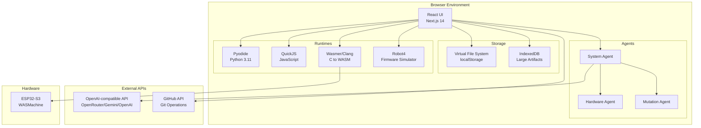

---

## Architecture Principles

### Zero Backend

Everything runs in the browser:
- **No server-side compilation** - Clang runs in WASM
- **No backend database** - localStorage + IndexedDB
- **No proxy servers** - Direct API calls to OpenAI-compatible providers
- **No file servers** - Virtual File System in browser

### File-First

All artifacts are real files in persistent storage:
- Every output saved to organized project structures
- Complete file tree with real paths
- Git-backed persistence via isomorphic-git
- Read-only system volume with immutable artifacts

### Agent-Native

Agents are first-class citizens:
- Markdown-defined agent specifications
- Persistent agent memory and tools
- Evolutionary improvement over time
- Inter-agent communication protocol

### Physical AI First-Class

Hardware is a core primitive:
- Browser-to-hardware deployment pipeline
- Closed-loop telemetry feedback
- Robot4 abstraction for LLM-friendly APIs
- Virtual simulation before physical deployment

---

## Directory Structure

```
llmos/
├── README.md                       # Project overview
├── package.json                    # Project configuration
│
├── app/                            # Next.js App Router
│   ├── page.tsx                    # Main entry point
│   └── api/                        # API routes
│       ├── auth/github/            # GitHub OAuth
│       └── git-proxy/              # Git operations
│
├── components/                     # React components
│   ├── workspace/                  # Layout orchestration
│   ├── panels/                     # UI panels
│   │   ├── session/                # Chat interface
│   │   ├── artifacts/              # Artifact viewers
│   │   └── volumes/                # File explorer
│   ├── applets/                    # Interactive applets
│   ├── chat/                       # Chat components
│   ├── settings/                   # Settings UI
│   └── common/                     # Shared components
│
├── lib/                            # Core libraries
│   ├── llm/                        # LLM client (OpenAI-compatible)
│   ├── agents/                     # Agent system
│   ├── runtime/                    # Execution runtimes
│   ├── hardware/                   # Hardware integration
│   ├── kernel/                     # OS kernel
│   ├── llm-tools/                  # Tool definitions
│   └── artifacts/                  # Artifact management
│
├── contexts/                       # React contexts
├── hooks/                          # Custom hooks
│
├── public/                         # Static assets
│   ├── sdk/wasi-headers/           # ESP32 SDK headers
│   └── system/                     # System files
│       ├── agents/                 # Agent definitions
│       ├── applets/                # System applets
│       ├── domains/                # Domain knowledge
│       ├── kernel/                 # Kernel configuration
│       └── tools/                  # Tool specifications
│
├── volumes/                        # Persistent storage
│   └── system/                     # System volume
│       ├── agents/                 # Agent definitions
│       ├── skills/                 # Learned skills
│       ├── tools/                  # Tool specs
│       └── project-templates/      # Scaffolding
│
├── backend/                        # Optional backend services
│   ├── chat.py                     # Chat API
│   ├── collaboration-server.py    # Collaboration
│   └── webhooks/                   # Git webhooks
│
├── electron/                       # Desktop app
│   ├── main.ts                     # Electron main process
│   ├── preload.ts                  # Preload scripts
│   └── services/                   # Native services
│
├── docs/                           # Documentation
│   ├── architecture/               # Architecture docs
│   ├── guides/                     # User guides
│   ├── hardware/                   # Hardware guides
│   └── ui/                         # UI documentation
│
├── __tests__/                      # Test files
│   ├── lib/                        # Library tests
│   └── integration/                # Integration tests
│
├── scripts/                        # Build scripts
└── styles/                         # Global styles
```

---

## Core Architecture

### Three-Layer System

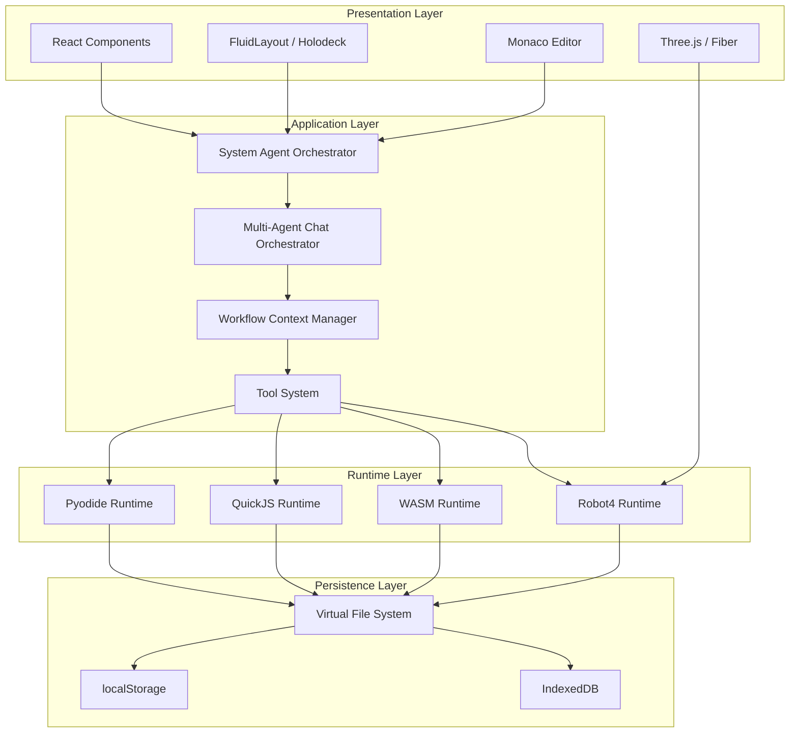

### Kernel Boot Sequence

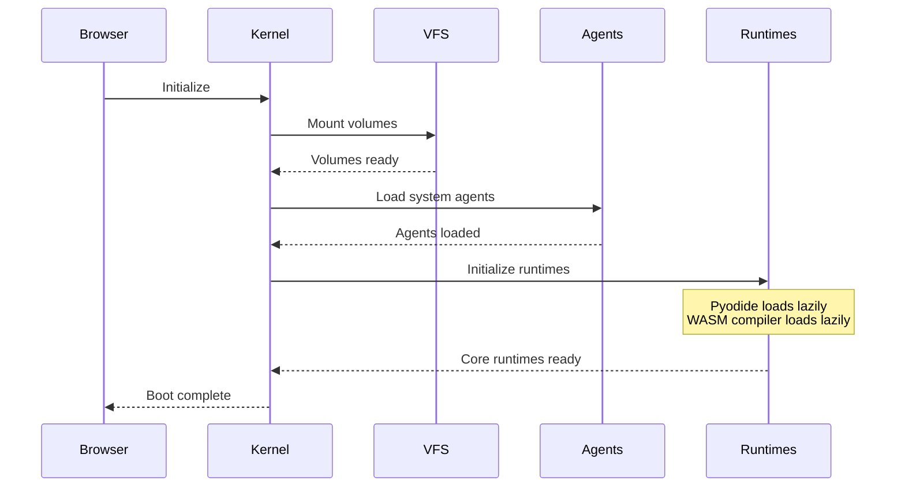

---

## Agent System

### Markdown-First Architecture

Agents are defined as markdown files with YAML frontmatter:

```markdown
---
name: HardwareControlAgent
type: specialized
capabilities:
  - esp32-control
  - wasm-deployment
  - sensor-reading
version: 1.0.0
---

# Hardware Control Agent

You are a specialized agent for controlling ESP32 hardware...

## Workflow

1. Analyze hardware requirements
2. Generate appropriate firmware
3. Compile and deploy
4. Monitor telemetry

## Tools Available

- deploy-wasm-app
- query-wasm-apps
- connect-device
```

### Agent Hierarchy

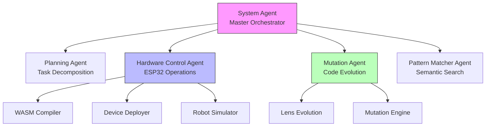

### Agent Execution Flow

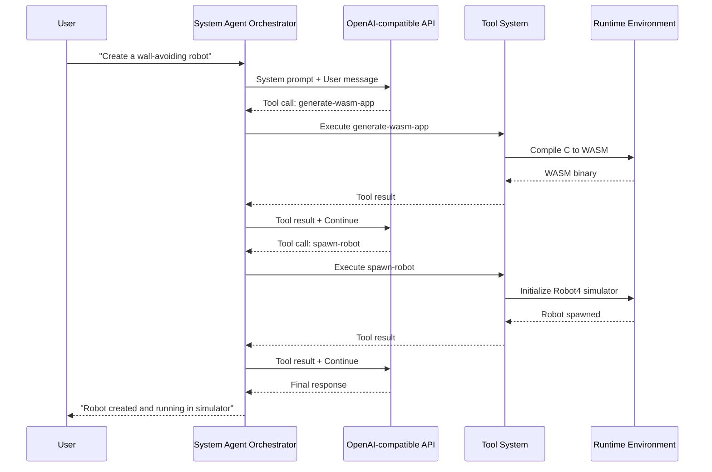

### Model-Aware Execution

The orchestrator adapts based on LLM capabilities:

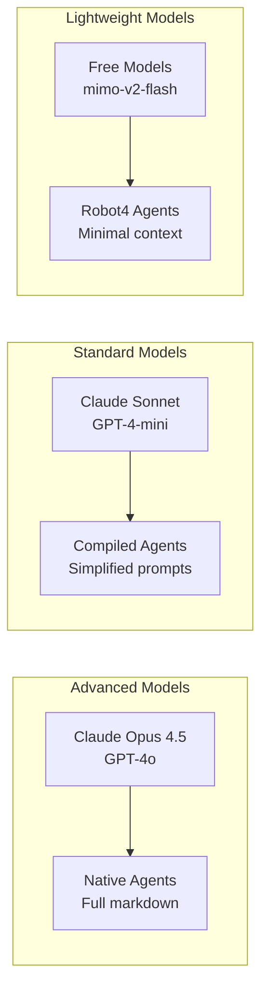

---

## Runtime Environments

### Overview

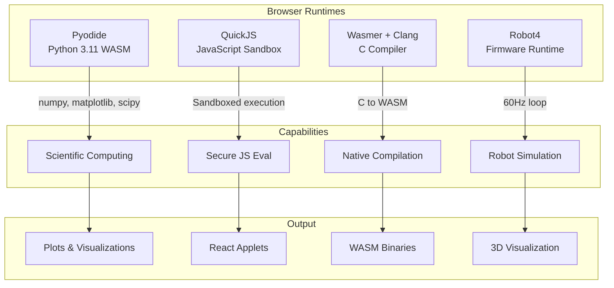

### Pyodide Runtime

Python execution in the browser:

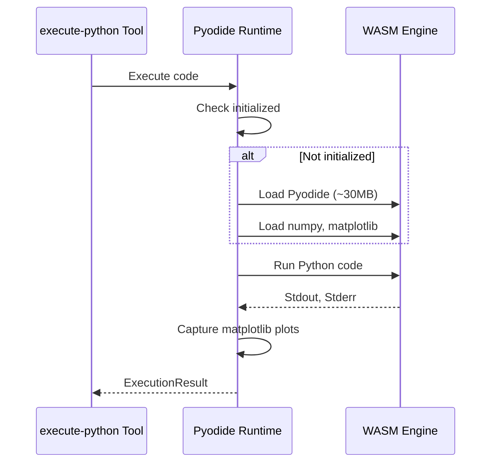

### WASM Compiler

Browser-based C compilation:

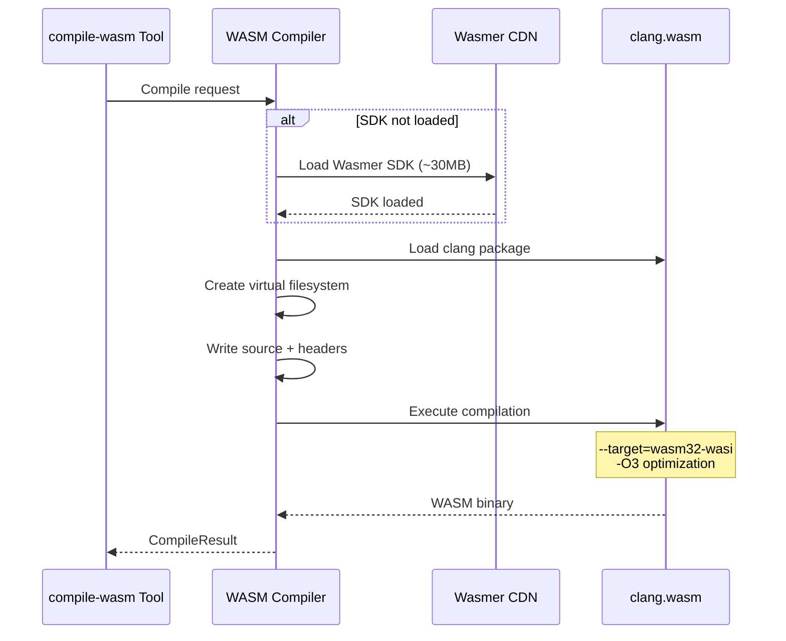

### Robot4 Runtime

WASM4-inspired robot firmware runtime:

```mermaid
graph TB
    subgraph "Robot4 Architecture"
        FW[Firmware Code<br/>C with robot4.h]

        subgraph "API Functions"
            DR[drive(l, r)]
            DI[distance(sensor)]
            LE[led(r, g, b)]
            UP[update() @ 60Hz]
        end

        subgraph "Execution"
            LOOP[Main Loop<br/>16.6ms tick]
            SEN[Sensor Simulation]
            MOT[Motor Simulation]
            COL[Collision Detection]
        end

        subgraph "Visualization"
            TJS[Three.js Scene]
            ROB[Robot Model]
            ENV[Environment]
        end
    end

    FW --> DR
    FW --> DI
    FW --> LE
    FW --> UP

    UP --> LOOP
    LOOP --> SEN
    LOOP --> MOT
    LOOP --> COL

    MOT --> TJS
    COL --> TJS
    TJS --> ROB
    TJS --> ENV
```

---

## Hardware Integration

### ESP32 Deployment Pipeline

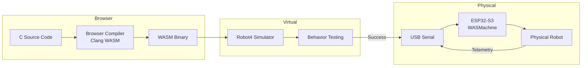

### TCP Deployment Protocol

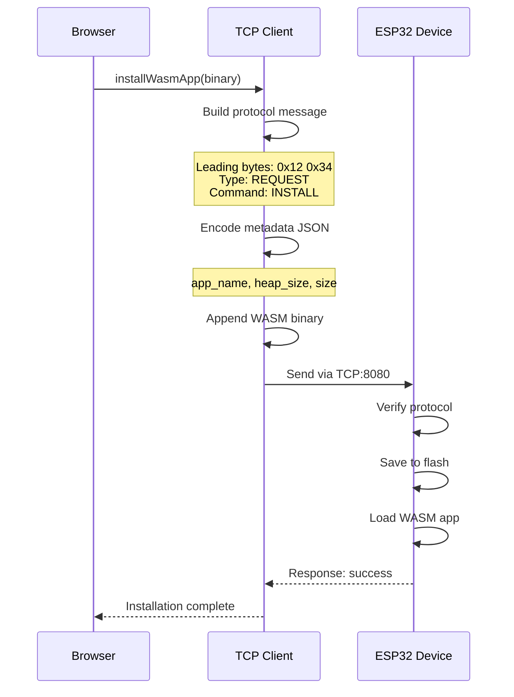

### Device Communication

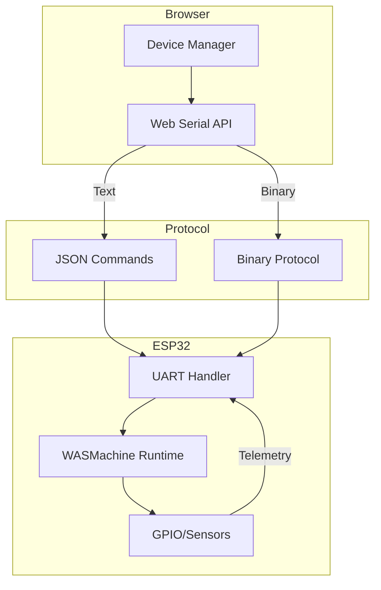

---

## Evolution System

### Mutation Engine

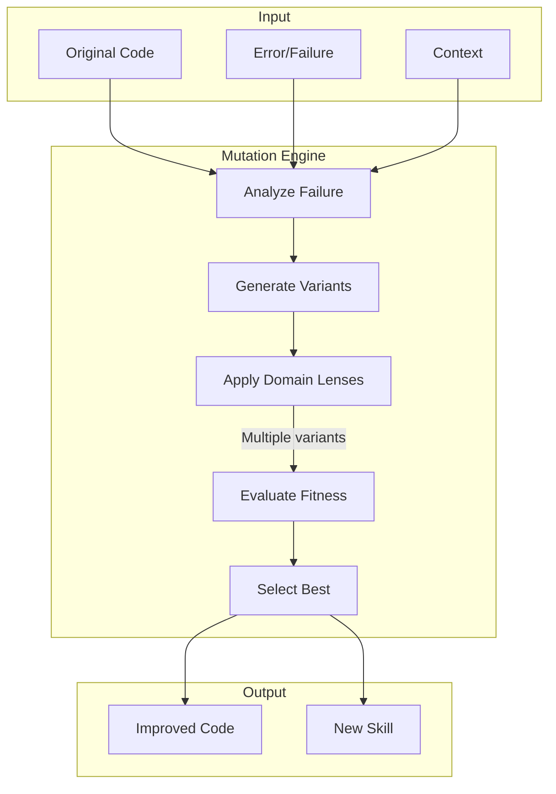

### Evolution Loop

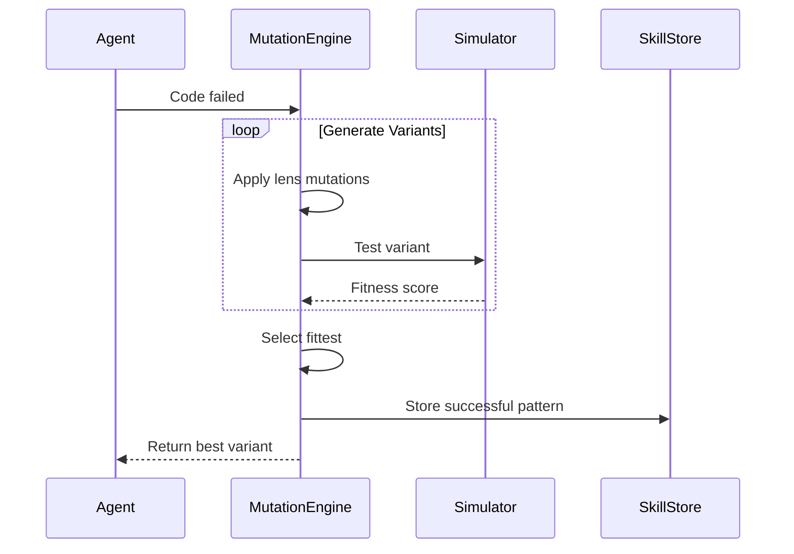

### Lens Evolution

Domain lenses evolve through:

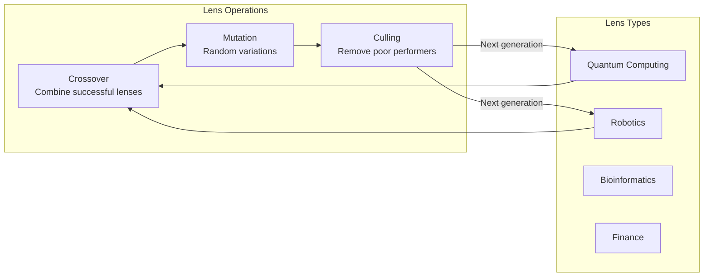

---

## Tool System

### Tool Categories

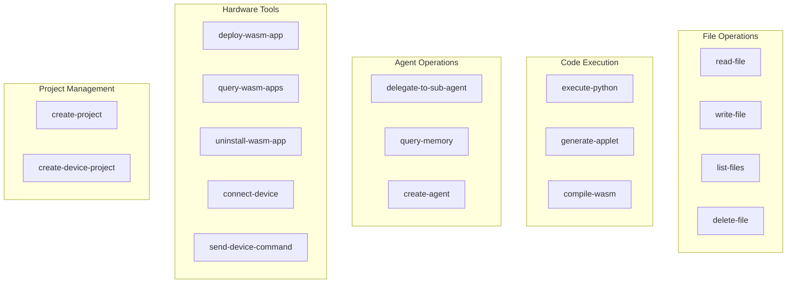

### Tool Execution Architecture

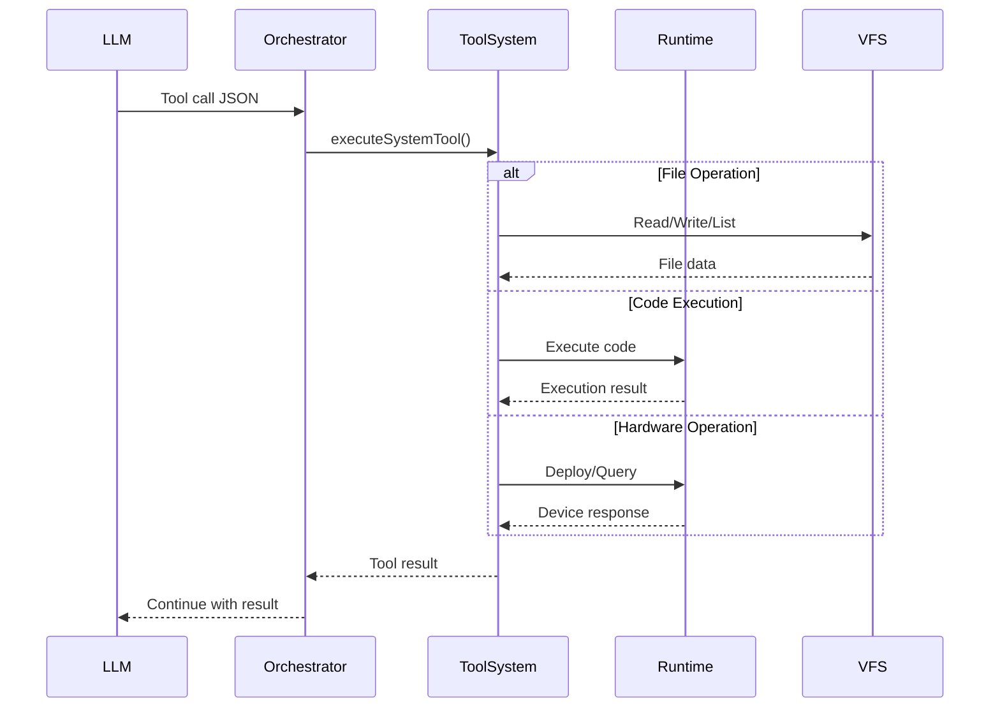

---

## State Management

### State Architecture

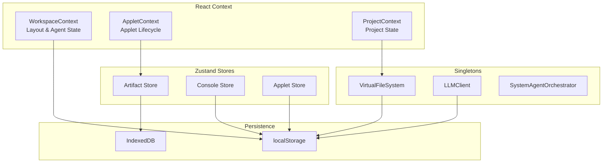

### State Flow

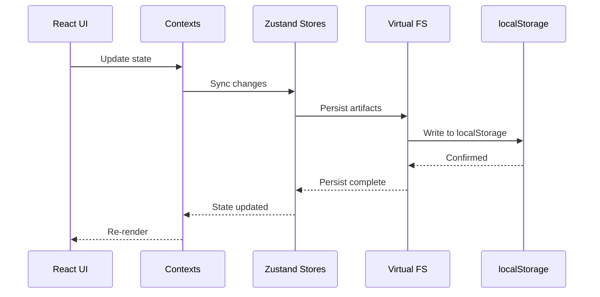

---

## Data Flow

### Complete Request Cycle

```mermaid
sequenceDiagram
    participant User
    participant ChatUI
    participant SAO as System Agent Orchestrator
    participant LLM as OpenAI-compatible API
    participant Tools as Tool System
    participant Runtime as Runtimes
    participant VFS as Virtual FS
    participant Display as UI Display

    User->>ChatUI: "Create a wall-avoiding robot"
    ChatUI->>SAO: Process message

    SAO->>LLM: System prompt + message
    LLM-->>SAO: Tool: generate-wasm-app

    SAO->>Tools: Execute tool
    Tools->>Runtime: Compile C to WASM
    Runtime->>VFS: Write binary
    Runtime-->>Tools: Compile result

    alt Compilation Error
        Tools-->>SAO: Error result
        SAO->>LLM: Error + retry
        LLM-->>SAO: Tool: fix-wasm-app
        SAO->>Tools: Execute fix
        Tools->>Runtime: Recompile
    end

    Tools-->>SAO: Success
    SAO->>LLM: Continue
    LLM-->>SAO: Tool: spawn-robot

    SAO->>Tools: Execute spawn
    Tools->>Runtime: Start Robot4 simulator
    Runtime->>Display: Render 3D scene

    Tools-->>SAO: Robot running
    SAO->>LLM: Final response
    LLM-->>SAO: Summary message
    SAO-->>ChatUI: Display response
    ChatUI-->>User: "Robot created and running!"
```

### Artifact Creation Flow

```mermaid
graph LR
    subgraph "Input"
        REQ[User Request]
    end

    subgraph "Processing"
        LLM[LLM Generation]
        TOOL[Tool Execution]
        RT[Runtime Processing]
    end

    subgraph "Storage"
        VFS[Virtual FS]
        ART[Artifact Store]
    end

    subgraph "Output"
        FILE[File in Tree]
        VIS[Visualization]
        HW[Hardware Deploy]
    end

    REQ --> LLM
    LLM --> TOOL
    TOOL --> RT
    RT --> VFS
    RT --> ART
    VFS --> FILE
    ART --> VIS
    VFS --> HW
```

---

## Security Considerations

### Sandboxed Execution

```mermaid
graph TB
    subgraph "Browser Sandbox"
        subgraph "WASM Isolation"
            PY[Pyodide<br/>No network access]
            QJS[QuickJS<br/>Limited APIs]
            CLANG[Clang<br/>Virtual filesystem only]
        end

        subgraph "Storage Isolation"
            LS[localStorage<br/>Origin-bound]
            IDB[IndexedDB<br/>Origin-bound]
        end
    end

    subgraph "API Security"
        KEY[API Keys<br/>Encrypted in storage]
        LLMAPI[LLM API<br/>HTTPS only]
        GH[GitHub<br/>OAuth tokens]
    end

    PY --> LS
    QJS --> LS
    KEY --> LLMAPI
    KEY --> GH
```

### Key Security Features

- **No Server-Side Code Execution** - All code runs in browser sandboxes
- **WASM Isolation** - Runtimes cannot access arbitrary system resources
- **Origin-Bound Storage** - Data isolated per domain
- **HTTPS Only** - All external API calls use TLS
- **No Eval** - JavaScript execution uses QuickJS sandbox, not native eval

### Execution Timeouts

```mermaid
graph LR
    CODE[User Code] --> TIMEOUT{Timeout<br/>30 seconds}
    TIMEOUT --> |Success| RESULT[Return Result]
    TIMEOUT --> |Exceeded| ERROR[Timeout Error]
```

---

## Performance Characteristics

| Component | First Load | Subsequent |
|-----------|-----------|------------|
| Pyodide | ~30MB, 5-10s | Instant (cached) |
| Wasmer SDK | ~30MB, 5-10s | Instant (cached) |
| WASM Compilation | 2-5s | 1-3s |
| Robot4 Simulation | <100ms | <100ms |
| File Operations | <10ms | <10ms |

### Optimization Strategies

- **Lazy Loading** - Heavy runtimes load on first use
- **CDN Caching** - WASM modules cached by browser
- **Virtual FS Caching** - LRU cache for frequently accessed files
- **Incremental Updates** - Only changed artifacts re-rendered

---

## Dependencies

### Core Dependencies

```json
{
  "next": "^14.0.0",
  "react": "^18.2.0",
  "pyodide": "^0.29.0",
  "@wasmer/sdk": "^0.10.0",
  "quickjs-emscripten": "^0.29.2",
  "@monaco-editor/react": "^4.6.0",
  "@react-three/fiber": "^8.15.0",
  "isomorphic-git": "^1.27.1",
  "zustand": "^4.5.0"
}
```

### Browser Requirements

- **Chrome 90+** / **Firefox 90+** / **Safari 15+**
- **WebAssembly** support required
- **Web Serial API** for hardware (Chrome only)
- **SharedArrayBuffer** for optimal performance

---

## Future Architecture

### Planned Improvements

```mermaid
graph TB
    subgraph "Current"
        LS[localStorage<br/>5-10MB limit]
        SYNC[Single-user]
    end

    subgraph "Planned"
        OPFS[Origin Private FS<br/>Unlimited storage]
        COLLAB[Real-time Collaboration<br/>Y.js CRDT]
        WW[Web Workers<br/>Background runtimes]
        SW[Service Worker<br/>Offline support]
    end

    LS --> OPFS
    SYNC --> COLLAB

    subgraph "Hardware Evolution"
        ESP32[ESP32-S3]
        SWARM[Swarm Intelligence]
        TELEMETRY[Telemetry Loop]
    end

    ESP32 --> SWARM
    SWARM --> TELEMETRY
    TELEMETRY --> ESP32
```

---

## Related Documentation

- **README.md** - Project overview and quick start
- **docs/hardware/ESP32_COMPLETE_TUTORIAL.md** - Hardware integration guide
- **docs/guides/** - User guides and tutorials
- **docs/architecture/** - Technical architecture documentation
- **docs/ui/** - UI-specific documentation
- **volumes/system/skills/** - Learned skill definitions

---

*Last Updated: January 2026*
