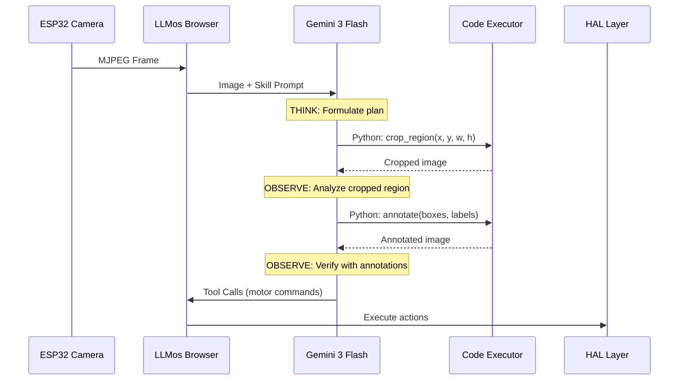

# Gemini 3 Flash Agentic Vision Integration Design

## Overview

Gemini 3 Flash introduces **Agentic Vision** - a capability that transforms image understanding from a static act into an active investigation process. This document details how to integrate Agentic Vision into LLMos for enhanced robot perception.

---

## What is Agentic Vision?

Traditional vision models process images in a single glance. If they miss a detail (serial number, distant sign), they guess.

Agentic Vision uses a **Think-Act-Observe** loop:

```
┌─────────────────────────────────────────────────────────────┐
│                    AGENTIC VISION LOOP                      │
│                                                             │
│   ┌─────────┐     ┌─────────┐     ┌───────────┐           │
│   │  THINK  │────►│   ACT   │────►│  OBSERVE  │───┐       │
│   │         │     │         │     │           │   │       │
│   │ Analyze │     │ Execute │     │  Inspect  │   │       │
│   │ & Plan  │     │  Code   │     │  Result   │   │       │
│   └─────────┘     └─────────┘     └───────────┘   │       │
│        ▲                                           │       │
│        └───────────────────────────────────────────┘       │
│                    (Continue if needed)                    │
└─────────────────────────────────────────────────────────────┘
```

### Key Capabilities

1. **Zooming & Inspecting**: Model generates code to crop and zoom on details
2. **Image Annotation**: Draws bounding boxes and labels on canvas
3. **Visual Math**: Offloads calculations to Python for deterministic results
4. **Active Investigation**: Doesn't guess - verifies with pixel-level evidence

### Performance Impact
- **5-10% quality boost** across vision benchmarks with code execution enabled

---

## Integration Architecture

### Current LLMos Vision Pipeline

```
ESP32 Camera → Browser → camera-vision-model.ts → Generic LLM → Tool Calls
```

### Proposed Gemini 3 Pipeline



---

## API Integration

### Gemini API Wrapper

```typescript
// lib/llm/gemini-agentic-vision.ts

import { GoogleGenAI, Tool, ToolCodeExecution } from '@google/genai';

interface AgenticVisionConfig {
  enableCodeExecution: boolean;
  maxIterations: number;
  imageFormat: 'jpeg' | 'png';
}

export class GeminiAgenticVision {
  private client: GoogleGenAI;
  private config: AgenticVisionConfig;

  constructor(apiKey: string, config?: Partial<AgenticVisionConfig>) {
    this.client = new GoogleGenAI(apiKey);
    this.config = {
      enableCodeExecution: true,
      maxIterations: 3,
      imageFormat: 'jpeg',
      ...config
    };
  }

  async analyzeWithAgenticVision(
    imageDataUrl: string,
    skillPrompt: string,
    sensorContext?: object
  ): Promise<AgenticVisionResult> {
    const tools: Tool[] = [];

    if (this.config.enableCodeExecution) {
      tools.push({
        codeExecution: {} as ToolCodeExecution
      });
    }

    // Add HAL tools for robot control
    tools.push({
      functionDeclarations: this.getHALToolDeclarations()
    });

    const response = await this.client.models.generateContent({
      model: 'gemini-3-flash-preview',
      contents: [
        {
          role: 'user',
          parts: [
            { inlineData: { mimeType: `image/${this.config.imageFormat}`, data: this.extractBase64(imageDataUrl) } },
            { text: this.buildPrompt(skillPrompt, sensorContext) }
          ]
        }
      ],
      tools,
      generationConfig: {
        temperature: 0.7,
        maxOutputTokens: 2048
      }
    });

    return this.parseResponse(response);
  }

  private buildPrompt(skillPrompt: string, sensorContext?: object): string {
    return `
# Active Skill
${skillPrompt}

# Sensor Context
${sensorContext ? JSON.stringify(sensorContext, null, 2) : 'No additional sensors'}

# Instructions
1. Analyze the image using the Visual Cortex instructions from the skill
2. If you need to inspect details, use code execution to zoom/crop
3. Determine the appropriate action based on Motor Cortex protocols
4. Return tool calls for HAL operations

Use the Think-Act-Observe pattern:
- THINK: What do you see? What does the skill tell you to do?
- ACT: If needed, execute code to investigate further
- OBSERVE: Verify your conclusions with visual evidence
`;
  }

  private getHALToolDeclarations() {
    return [
      {
        name: 'hal_vision_scan',
        description: 'Scan environment and return detected objects with 3D coordinates',
        parameters: { type: 'object', properties: {} }
      },
      {
        name: 'hal_move_to',
        description: 'Move robot to position',
        parameters: {
          type: 'object',
          properties: {
            x: { type: 'number', description: 'X coordinate in meters' },
            y: { type: 'number', description: 'Y coordinate in meters' },
            z: { type: 'number', description: 'Z coordinate in meters' }
          }
        }
      },
      {
        name: 'hal_drive',
        description: 'Control wheel motors',
        parameters: {
          type: 'object',
          properties: {
            left: { type: 'number', description: 'Left wheel power (-255 to 255)' },
            right: { type: 'number', description: 'Right wheel power (-255 to 255)' }
          }
        }
      },
      {
        name: 'hal_grasp',
        description: 'Control gripper',
        parameters: {
          type: 'object',
          properties: {
            force: { type: 'number', description: 'Grip force percentage (0-100)' }
          }
        }
      },
      {
        name: 'hal_speak',
        description: 'Output audio message',
        parameters: {
          type: 'object',
          properties: {
            text: { type: 'string', description: 'Message to speak' }
          }
        }
      }
    ];
  }

  private extractBase64(dataUrl: string): string {
    return dataUrl.split(',')[1];
  }

  private parseResponse(response: any): AgenticVisionResult {
    // Parse Gemini response into structured result
    return {
      reasoning: response.text,
      codeExecutions: response.codeExecutionResults || [],
      toolCalls: response.functionCalls || [],
      confidence: this.extractConfidence(response)
    };
  }

  private extractConfidence(response: any): number {
    // Extract confidence from response metadata
    return 0.85; // Placeholder
  }
}

interface AgenticVisionResult {
  reasoning: string;
  codeExecutions: Array<{
    code: string;
    output: string;
  }>;
  toolCalls: Array<{
    name: string;
    args: object;
  }>;
  confidence: number;
}
```

---

## Skill Cartridge Visual Cortex Specification

### Updated Skill Template

```markdown
---
name: {{skill_name}}
type: physical_skill
base_model: gemini-3-flash
agentic_vision: true  # Enable code execution for active vision
version: 1.0.0
---

# Role
{{role_description}}

# Visual Cortex Instructions

## Primary Targets
Objects to actively scan for:
- `{{target_1}}`: {{description}}
- `{{target_2}}`: {{description}}

## Investigation Triggers
When to use code execution for deeper analysis:
- **Zoom Required**: When detecting `{{small_object}}`, crop to 4x magnification
- **Measurement Required**: When estimating `{{measurable_property}}`, use pixel analysis
- **Verification Required**: When confidence < 70%, annotate with bounding boxes

## Attention Ignore List
Objects to exclude from analysis:
- `{{ignore_1}}`
- `{{ignore_2}}`

## Alert Conditions
Special cases requiring immediate action:
- `{{alert_condition}}` → Action: `{{response}}`

# Motor Cortex Protocols
{{motor_protocols}}

# Safety Protocols
{{safety_protocols}}
```

### Example: Enhanced Gardener Skill

```markdown
---
name: PlantCare_Specialist_v2
type: physical_skill
base_model: gemini-3-flash
agentic_vision: true
version: 2.0.0
---

# Role
You are an expert botanist robot. Identify plant health issues and provide care.

# Visual Cortex Instructions

## Primary Targets
Objects to actively scan for:
- `plant_leaves`: Check color, texture, drooping angle
- `soil_surface`: Analyze moisture level from color/texture
- `pot_drainage`: Verify water flow capability
- `pest_indicators`: Spots, holes, webbing on leaves

## Investigation Triggers
When to use code execution for deeper analysis:
- **Zoom Required**: When detecting leaf spots, crop to 8x to classify disease type
- **Measurement Required**: Use pixel analysis to measure leaf drooping angle (>20° = needs water)
- **Color Analysis Required**: Convert soil region to HSV, measure saturation for moisture
- **Verification Required**: Before watering, annotate soil region and confirm dry classification

## Attention Ignore List
Objects to exclude from analysis:
- Plastic decorative plants
- Plant stands and furniture
- Pots (focus on contents, not container)

## Alert Conditions
Special cases requiring immediate action:
- `yellow_leaves + black_spots` → Alert: "Possible fungal infection" + Do NOT water
- `webbing_on_stems` → Alert: "Spider mite infestation" + Log to User Volume
- `soil_mold` → Alert: "Overwatering detected" + Skip this plant

# Motor Cortex Protocols
- Enable `arm.precision_mode(true)` before any plant interaction
- Approach speed: max 30% motor power near plants
- Watering: Pour in 50ml increments, verify absorption between pours
- Never water if Alert condition detected

# Safety Protocols
- Stop immediately if visual confidence < 60%
- Maximum water per plant: 200ml
- If unable to identify plant species, log and skip
```

---

## Integration with Existing LLMos Components

### Updating camera-vision-model.ts

```typescript
// Modify existing camera-vision-model.ts to support Gemini 3 Agentic Vision

import { GeminiAgenticVision } from './gemini-agentic-vision';

export class CameraVisionModel {
  private geminiAgentic: GeminiAgenticVision | null = null;

  async initializeAgenticVision(apiKey: string) {
    this.geminiAgentic = new GeminiAgenticVision(apiKey, {
      enableCodeExecution: true,
      maxIterations: 3
    });
  }

  async analyzeFrame(
    frameDataUrl: string,
    activeSkill: ParsedSkill,
    sensorData: SensorReading
  ): Promise<VisionAnalysisResult> {
    // Check if skill requires agentic vision
    if (activeSkill.frontmatter.agentic_vision && this.geminiAgentic) {
      return this.analyzeWithAgenticVision(frameDataUrl, activeSkill, sensorData);
    }

    // Fall back to standard vision analysis
    return this.analyzeWithStandardVision(frameDataUrl, activeSkill, sensorData);
  }

  private async analyzeWithAgenticVision(
    frameDataUrl: string,
    skill: ParsedSkill,
    sensors: SensorReading
  ): Promise<VisionAnalysisResult> {
    const result = await this.geminiAgentic!.analyzeWithAgenticVision(
      frameDataUrl,
      skill.visualCortexPrompt,
      sensors
    );

    return {
      objects: this.extractObjectsFromReasoning(result.reasoning),
      toolCalls: result.toolCalls,
      confidence: result.confidence,
      agenticSteps: result.codeExecutions.length,
      reasoning: result.reasoning
    };
  }
}
```

### HAL Layer Tool Execution

```typescript
// lib/hardware/hal-tool-executor.ts

export class HALToolExecutor {
  constructor(
    private mode: 'simulation' | 'physical',
    private simulator?: CubeRobotSimulator,
    private serialManager?: SerialManager
  ) {}

  async executeToolCall(toolCall: ToolCall): Promise<ToolResult> {
    switch (toolCall.name) {
      case 'hal_move_to':
        return this.moveTo(toolCall.args as MoveToArgs);

      case 'hal_drive':
        return this.drive(toolCall.args as DriveArgs);

      case 'hal_grasp':
        return this.grasp(toolCall.args as GraspArgs);

      case 'hal_speak':
        return this.speak(toolCall.args as SpeakArgs);

      case 'hal_vision_scan':
        return this.visionScan();

      default:
        throw new Error(`Unknown HAL tool: ${toolCall.name}`);
    }
  }

  private async drive(args: DriveArgs): Promise<ToolResult> {
    if (this.mode === 'simulation') {
      this.simulator!.setMotors(args.left, args.right);
      return { success: true, message: 'Motors set in simulation' };
    } else {
      await this.serialManager!.send({
        type: 'command',
        command: 'drive',
        params: args
      });
      return { success: true, message: 'Motors commanded on hardware' };
    }
  }

  // ... other tool implementations
}
```

---

## OpenRouter Compatibility

Gemini 3 Flash is available through OpenRouter, maintaining LLMos's provider flexibility:

```typescript
// Using existing LLM client with OpenRouter's Gemini endpoint
const response = await llmClient.chat({
  model: 'google/gemini-3-flash-preview',
  messages: [...],
  tools: [
    {
      type: 'code_execution',
      code_execution: {}
    },
    ...halTools
  ]
});
```

---

## Implementation Roadmap

### Phase 1: API Integration (Week 1-2)
- [ ] Create `GeminiAgenticVision` wrapper class
- [ ] Add Gemini 3 Flash to model selector
- [ ] Test basic image analysis with code execution

### Phase 2: Skill Enhancement (Week 3-4)
- [ ] Update skill template with Visual Cortex v2 spec
- [ ] Create example skills using agentic vision
- [ ] Build skill validator for agentic vision requirements

### Phase 3: HAL Unification (Week 5-6)
- [ ] Standardize tool declarations for Gemini
- [ ] Implement HAL tool executor with mode routing
- [ ] Test end-to-end simulation pipeline

### Phase 4: Production Hardening (Week 7-8)
- [ ] Add error handling for code execution failures
- [ ] Implement confidence thresholds
- [ ] Performance optimization (frame rate balancing)
- [ ] Cost monitoring and optimization

---

## Considerations

### Cost Optimization
- Gemini 3 Flash pricing: ~$0.0375 per 1K input tokens (including images)
- Code execution may add latency (200-500ms per iteration)
- Consider frame sampling rate to balance cost vs responsiveness

### Latency Management
- Agentic Vision loop can take 1-3 seconds for complex scenes
- Use prediction buffer for smooth motor control
- Fall back to sensor-only navigation during high latency

### Safety
- Code execution is sandboxed by Gemini
- Always validate tool calls before HAL execution
- Implement emergency stop on confidence drop

---

*Document Version: 1.0*
*Last Updated: 2026-01-28*
*Status: Design Complete*
