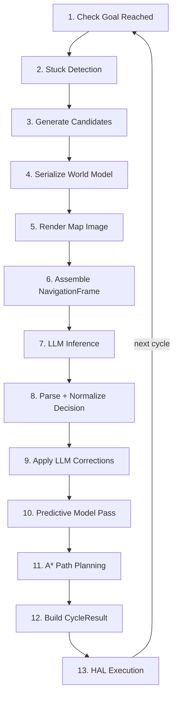
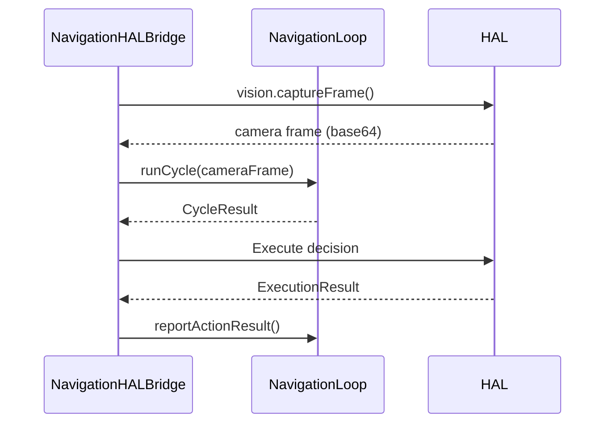
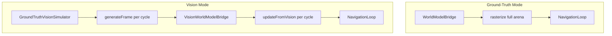

# Navigation Pipeline -- Step-by-Step Reference

Technical reference for the LLMos navigation pipeline: every stage from sensor input to motor output, including candidate generation, prompt assembly, LLM inference, decision parsing, corrections, predictive model, A\* planning, HAL execution, runtime modes, test arenas, and evaluation.

---

## Table of Contents

1. [Pipeline Overview](#pipeline-overview)
2. [Candidate Generation](#candidate-generation)
3. [Prompt Assembly](#prompt-assembly)
4. [LLM Inference](#llm-inference)
5. [Decision Parsing and Normalization](#decision-parsing-and-normalization)
6. [LLM World Model Corrections](#llm-world-model-corrections)
7. [Predictive Model Pass](#predictive-model-pass)
8. [Local Planner (A\*)](#local-planner-a)
9. [HAL Execution Bridge](#hal-execution-bridge)
10. [Navigation Runtime](#navigation-runtime)
11. [Test Arenas](#test-arenas)
12. [Evaluation Criteria](#evaluation-criteria)

---

## Pipeline Overview

The navigation loop (`NavigationLoop.runCycle()` in `navigation-loop.ts`) is the core cycle. Each call executes 13 sequential steps:



### Step 1: Goal Check

If a goal is set, compute Euclidean distance from current position. If distance <= `goalToleranceM` (default 0.3m), set mode to `goal_reached`, return STOP decision, and end.

### Step 2: Stuck Detection

Compare current position with previous position. If movement < 5cm, increment `stuckCounter`. If `stuckCounter >= stuckThreshold` (default 5), set `isStuck = true` and mode to `recovering`. The stuck flag triggers recovery candidate generation and is communicated to the LLM.

### Steps 3-13: Detailed in Sections Below

---

## Candidate Generation

**File**: `candidate-generator.ts`

The `CandidateGenerator` produces 3-5 ranked subgoal candidates each cycle. The LLM selects from these candidates rather than choosing raw coordinates, which keeps decisions grounded in validated positions.

### Candidate Types

| Type | ID Prefix | When Generated | Purpose |
|------|-----------|---------------|---------|
| `subgoal` | `c` | When goal is set | Points along straight line toward goal |
| `frontier` | `f` | Always | Boundaries between explored and unknown |
| `recovery` | `r` | When stuck | Safe retreat positions |
| `waypoint` | `w` | When topology exists | Named topology waypoints |

### Goal-Directed Subgoals

When a goal is set, subgoals are placed every `subgoalSpacing` meters (default 1.0m) along the straight line from robot to goal:

1. Compute unit direction vector from robot to goal
2. Place up to 3 subgoals along the line at 1m, 2m, 3m
3. Always include the goal itself as a candidate
4. Score each by weighted sum of goal proximity, clearance, novelty, feasibility

### Frontier Candidates

Frontiers are discovered via `IWorldModelBridge.findFrontiers()` -- free/explored cells with at least one unknown 4-connected neighbor.

Processing:
1. Get all frontier cells from the bridge
2. Cluster nearby frontiers within 0.5m radius
3. Pick the centroid of each of the top 3 clusters
4. Score by cluster size (novelty), distance from robot (feasibility), and alignment with goal direction

### Recovery Candidates

Generated only when `isStuck = true`:
1. Scan cells in a ring around robot (3 to `recoveryRadius` cells away, default 1.0m)
2. Filter to free/explored cells with clearance > 0.1m
3. Sort by clearance (descending), then visit count (ascending) -- prefer wide, unvisited cells
4. Take top 2 recovery candidates

### Scoring Formula

```
score = w_goal * goalFactor
      + w_clearance * clearance
      + w_novelty * noveltyFactor
      + w_feasibility * feasibilityFactor
```

| Weight | Default | Description |
|--------|---------|-------------|
| `wGoal` | 0.4 | Proximity to goal (1/distance) |
| `wClearance` | 0.2 | Min distance to nearest obstacle (meters) |
| `wNovelty` | 0.25 | Fraction of unknown cells in 3-cell radius |
| `wFeasibility` | 0.15 | Whether position is reachable (clearance > 0 -> 1.0) |

### Deduplication

After generating all candidates, any pair within `minCandidateSpacing` (default 0.5m) is deduplicated by keeping the higher-scored one. The final list is sorted by score and capped at `maxCandidates` (default 5).

---

## Prompt Assembly

**File**: `navigation-prompt.ts`

The prompt has two parts: a system message (set once per session) and a user message (rebuilt each cycle).

### System Prompt

The `NAVIGATION_SYSTEM_PROMPT` defines:
- Role: "You are the navigation brain of a mobile robot"
- Input format: 6 inputs (world model, symbolic layer, candidates, state, history, images)
- Output schema: strict JSON with `action`, `fallback`, optional `world_model_update`, and `explanation`
- 10 rules including: prefer candidates over raw coordinates, always provide fallback, never output non-JSON

### User Message Assembly

`buildNavigationPrompt(frame: NavigationFrame)` assembles:

```
=== CYCLE N ===
GOAL: <goal text>

STATE:
  position: (x, y)
  heading: N degrees
  mode: navigating|exploring|recovering|...
  battery: N%
  [STUCK for N cycles]

LAST ACTION: <action> -> <result>
  <details>

WORLD MODEL:
  grid: 50x50 @ 0.1m
  exploration: N%
  robot: (x, y) heading N degrees
  [goal: (x, y) +/- tolerance]
  occupancy: <RLE string>

[OBJECTS: ... ]
[WAYPOINTS: N waypoints, N edges]

CANDIDATES:
  c1 [subgoal] (x, y) score=0.85 -- 1.0m toward goal
  f2 [frontier] (x, y) score=0.72 -- explore unknown (15 frontier cells)
  ...

HISTORY:
  cycle N: MOVE_TO c1 -> planned
  cycle N-1: EXPLORE f2 -> planned

Respond with a JSON navigation decision:
```

### Multimodal Message

`buildMultimodalMessage(frame)` builds an array of content blocks for VLM APIs:
1. Map image (if available) with caption: "[Above: Top-down map of the arena. Green=robot, Red=goal, Blue/Orange=candidates]"
2. Camera frame (if available) with caption: "[Above: Current camera view from the robot]"
3. Text prompt from `buildNavigationPrompt`

---

## LLM Inference

**File**: `openrouter-inference.ts`

### OpenRouter Adapter

The `OpenRouterInference` class calls the OpenRouter API at `https://openrouter.ai/api/v1/chat/completions`.

| Config | Default | Description |
|--------|---------|-------------|
| `model` | `anthropic/claude-sonnet-4-5-20250929` | Model identifier |
| `maxTokens` | 512 | Max response tokens |
| `temperature` | 0.3 | Low for deterministic navigation |
| `timeoutMs` | 15000 | Request timeout |
| `maxRetries` | 1 | Retry count on failure |
| `supportsVision` | true | Send images as multimodal input |

### Vision Support

When images are provided and the model supports vision, the user message is sent as an array of content blocks:
- `{ type: 'text', text: '...' }` for the prompt
- `{ type: 'image_url', image_url: { url: 'data:image/png;base64,...' } }` for each image

### Retry Logic

On failure, the adapter retries with exponential backoff: wait `1000 * (attempt + 1)` ms between attempts. After all retries exhausted, the error propagates.

### Statistics Tracking

The adapter tracks:
- `totalCalls`, `successfulCalls`, `failedCalls`
- `totalTokens`, `promptTokens`, `completionTokens`
- `averageLatencyMs`, `totalLatencyMs`

### Inference Timeout in NavigationLoop

The navigation loop wraps the inference call in a `Promise.race` with its own timeout (`inferenceTimeoutMs`, default 5000ms). On timeout:
- Return a fallback STOP decision
- Decrease confidence by 0.3

### Mock Inference

For testing, any function matching `InferenceFunction` signature works:

```typescript
type InferenceFunction = (
  systemPrompt: string,
  userMessage: string,
  images?: string[]
) => Promise<string>;
```

Test suites provide deterministic mock inference functions that return valid JSON decisions based on candidate IDs.

---

## Decision Parsing and Normalization

**File**: `navigation-types.ts`

### Strict Schema

```typescript
interface LLMNavigationDecision {
  action: {
    type: 'MOVE_TO' | 'EXPLORE' | 'ROTATE_TO' | 'FOLLOW_WALL' | 'STOP';
    target_id?: string;       // Reference to candidate ID
    target_m?: [number, number]; // Novel coordinate
    yaw_deg?: number;          // For ROTATE_TO
  };
  fallback: {
    if_failed: 'EXPLORE' | 'ROTATE_TO' | 'STOP';
    target_id?: string;
  };
  world_model_update?: {
    corrections: Array<{
      pos_m: [number, number];
      observed_state: 'free' | 'obstacle' | 'unknown';
      confidence: number;
    }>;
  };
  explanation: string;
}
```

### Parsing Pipeline

`parseNavigationDecision(raw: string)` handles common LLM output issues:

1. **Strip markdown fences**: remove ````json` / ````
2. **Strip Qwen3 think tags**: remove `<think>...</think>` blocks
3. **Extract JSON from prose**: if response starts with non-JSON text, extract first `{...}` block
4. **Remove trailing commas**: common LLM mistake, e.g. `{"a": 1,}` -> `{"a": 1}`
5. **Parse JSON**: `JSON.parse(cleaned)`
6. **Direct validation**: check if parsed object matches schema
7. **Free-form normalization**: if direct validation fails, try normalizing

### Free-Form Normalizer

`normalizeLLMResponse()` handles non-standard LLM output formats. It maps common variations to the expected schema:

**Action type normalization**:

| LLM Output | Normalized To |
|-------------|--------------|
| `"move"`, `"go"`, `"go_to"`, `"navigate"`, `"moveto"` | `MOVE_TO` |
| `"explore"`, `"scan"` | `EXPLORE` |
| `"rotate"`, `"rotate_to"`, `"turn"` | `ROTATE_TO` |
| `"follow_wall"`, `"wall_follow"` | `FOLLOW_WALL` |
| `"stop"`, `"halt"`, `"wait"` | `STOP` |

**Target extraction**: looks for `target`, `target_id`, `subgoal`, or `candidate` fields. String values become `target_id`; 2-element arrays become `target_m`.

**Explanation extraction**: looks for `explanation`, `reason`, `reasoning`, or `rationale` fields.

### Validation Rules

- `action.type` must be one of the 5 valid types
- `MOVE_TO` requires either `target_id` or `target_m` (2-element array)
- `ROTATE_TO` requires `yaw_deg`
- `fallback.if_failed` must be `EXPLORE`, `ROTATE_TO`, or `STOP`
- `explanation` must be a non-empty string
- If `world_model_update` is present, each correction must have valid `pos_m`, `observed_state`, and `confidence` (0-1)

### Fallback on Parse Failure

If parsing fails entirely, `getFallbackDecision(reason)` returns:

```json
{
  "action": { "type": "STOP" },
  "fallback": { "if_failed": "STOP" },
  "explanation": "Fallback: <reason>"
}
```

---

## LLM World Model Corrections

After parsing the decision, the navigation loop checks for `world_model_update.corrections` and applies them to the grid with strict guards.

### Guard Chain

For each correction:

```
1. correction.confidence >= llmCorrectionMinConfidence (0.6)?
   NO  -> skip
   YES -> continue

2. cell.state == 'explored'?
   YES -> skip (never override ground-truth from physical visit)
   NO  -> continue

3. cell.confidence > llmCorrectionMaxOverride (0.7)?
   YES -> skip (high-confidence sensor data wins)
   NO  -> apply correction

4. Applied confidence = min(correction.confidence, llmCorrectionMaxOverride)
```

This ensures the LLM can correct low-confidence or unknown cells but cannot overwrite data from the robot's own visit or high-confidence sensor readings.

---

## Predictive Model Pass

If `enablePredictiveModel` is true, the predictive model runs two operations each cycle:

1. **Verify**: check active predictions against newly observed cells
   - Correct predictions: increment `verifiedCount`
   - Wrong predictions: increment `wrongCount`
   - Both: remove prediction from active set

2. **Predict**: run all 4 heuristics on current grid
   - Wall continuation, corridor detection, open space expansion, boundary walls
   - New predictions applied to unknown cells at low confidence (0.2-0.3)
   - See [WORLD_MODEL_SYSTEM.md](./WORLD_MODEL_SYSTEM.md#predictive-world-model) for heuristic details

---

## Local Planner (A\*)

**File**: `local-planner.ts`

The local planner computes collision-free paths on the occupancy grid. It receives a target position from the parsed decision and returns a list of waypoints for HAL execution.

### Algorithm

A\* search with octile distance heuristic (consistent for 8-directional movement):

```
heuristic(a, b) = max(|dx|, |dy|) + (sqrt(2) - 1) * min(|dx|, |dy|)
```

### Cost Map

The planner builds a cost map from the occupancy grid:

| Cell State | Base Cost |
|------------|-----------|
| `obstacle`, `wall` | 999 (impassable) |
| `unknown` | `unknownCellCost` (5 in GT mode, 50 in vision mode) |
| All other states | 1 |

**Obstacle inflation**: cells within `obstacleInflationCells` (default 1) of any obstacle get an inflated cost:

```
inflatedCost = 1 + (nearObstacleCostMultiplier - 1) * (1 - distance / (inflation + 1))
```

Default `nearObstacleCostMultiplier` is 2.0, so cells adjacent to obstacles cost ~2x more than open cells. This pushes paths away from walls.

### Movement

- **8-directional**: cardinal + diagonal (when `allowDiagonal = true`, which is the default)
- **Diagonal cost**: sqrt(2) per cell (vs 1.0 for cardinal)
- **Maximum planning time**: 100ms (default). If exceeded, returns null (no path found).

### Path to Waypoints

The raw A\* path (every grid cell) is downsampled to waypoints at `waypointSpacing` intervals (default: every 3 cells). Start and end points are always included.

```typescript
interface PathWaypoint {
  x: number;     // World X (meters)
  y: number;     // World Y (meters)
  gx: number;    // Grid X
  gy: number;    // Grid Y
  index: number;  // Waypoint index
}
```

### Path Result

```typescript
interface PathResult {
  success: boolean;
  waypoints: PathWaypoint[];
  totalCost: number;        // Sum of cost map values along path
  pathLengthM: number;      // Total path length in meters
  rawPathLength: number;    // Number of grid cells in raw path
  planningTimeMs: number;
  error?: string;           // "Goal position is blocked", "No path found", etc.
}
```

### Failure Handling

If the planner cannot find a path:
1. Log warning: "Path planning failed: <reason>"
2. Switch to fallback action from the LLM decision
3. If fallback is `ROTATE_TO`, rotate 90 degrees
4. If fallback is `STOP`, stop
5. Report `blocked` result back to navigation loop for next cycle's history

---

## HAL Execution Bridge

**File**: `navigation-hal-bridge.ts`

The `NavigationHALBridge` connects the `NavigationLoop` to the physical HAL interface. Each cycle:



### Decision Execution

| Decision Type | HAL Command |
|--------------|-------------|
| `MOVE_TO` / `EXPLORE` with path | `locomotion.moveTo(waypoint.x, waypoint.y, 0)` -- next waypoint in path |
| `MOVE_TO` / `EXPLORE` without path | `locomotion.moveForward(10)` -- 10cm nudge |
| `ROTATE_TO` | `locomotion.rotate(direction, degrees)` |
| `STOP` | `locomotion.stop()` |

The bridge targets the second waypoint in the path (index 1) rather than the first (which is the current position).

### Continuous Run

`NavigationHALBridge.run()` executes cycles in a loop until:
- Goal reached
- STOP decision in non-exploration mode
- `stop()` called externally

### Key Configuration

| Parameter | Default | Description |
|-----------|---------|-------------|
| `moveSpeedMs` | 0.15 | Movement speed in m/s |
| `rotateSpeedDegS` | 45 | Rotation speed in deg/s |
| `waypointThresholdM` | 0.05 | Waypoint arrival distance |
| `captureFrames` | true | Capture camera each cycle |
| `frameCaptureInterval` | 1 | Capture every N cycles |
| `actionTimeoutMs` | 3000 | Max execution time per action |

---

## Navigation Runtime

**File**: `navigation-runtime.ts`

The `NavigationRuntime` is the top-level entry point for running a complete navigation session. It wires together the bridge, loop, physics simulation, logger, and evaluator.

### Two Modes



**Ground-truth mode** (`bridgeMode: 'ground-truth'`):
- Creates `WorldModelBridge`, calls `rasterize(arena.world)` once
- Grid is fully populated at start
- A\* unknown cell cost: 5
- Used for testing LLM decision quality in isolation

**Vision mode** (`bridgeMode: 'vision'`):
- Creates `VisionWorldModelBridge` (grid starts fully unknown)
- Creates `GroundTruthVisionSimulator` from arena world
- Initial 360-degree scan: 6 rotations x 60-degree FOV to build initial awareness
- Each cycle: generate simulated VisionFrame from current pose, call `updateFromVision`
- A\* unknown cell cost: 50 (heavily penalize unknown paths)
- Tests the full camera-to-decision pipeline

### Physics Simulation

The runtime includes lightweight physics (no Three.js or WASM required):
- **Movement**: move toward first path waypoint by `moveStepM` (default 0.3m) per cycle
- **Heading**: `rotation = atan2(dx, -dy)` to face movement direction
- **Collision detection**: check bounds, circular obstacles, and wall segments (point-to-segment distance)
- **Collision radius**: 0.15m default

On collision:
- Report `collision` result to navigation loop
- In vision mode, mark collision point as obstacle (confidence 0.95) for future avoidance
- Robot does not move

### Session Flow

```
1. Create bridge (GT or Vision)
2. Create NavigationLoop with arena criteria
3. Set initial pose
4. Set goal or exploration mode
5. [Vision only] Initial 360-degree scan
6. Loop up to maxCycles:
   a. [Vision only] Generate VisionFrame, updateFromVision
   b. Run navigation cycle
   c. Simulate movement
   d. Update pose in loop
   e. Log cycle entry
   f. Check termination (goal reached, cycle limit)
7. Evaluate run against criteria
8. Return NavigationRunResult
```

---

## Test Arenas

**File**: `test-arenas.ts`

All arenas use a 5m x 5m coordinate space (bounds: -2.5 to +2.5 in both axes). Arena definitions include walls, obstacles, beacons, robot start pose, goal, and success criteria.

### Arena 1: Simple Navigation

```
+---------------------------+
|                       G   |
|              *            |
|                           |
|        *                  |
|   *                       |
| R                         |
+---------------------------+
```

- **Start**: (-1.5, -1.5), heading NE (PI/4)
- **Goal**: (1.5, 1.5) -- "Reach the goal at (1.5, 1.5)"
- **Obstacles**: 3 circular, radius 0.2m, at (-0.5,-0.5), (0.5,0.3), (1.0,1.2)
- **Criteria**: maxCycles=100, maxCollisions=0, goalTolerance=0.3m

### Arena 2: Exploration

```
+---------------------------+
|  *              *         |
|                           |
|       *    R    *         |
|                           |
|   *                       |
+---------------------------+
```

- **Start**: (0, 0), heading North (0)
- **Goal**: none (exploration mode)
- **Obstacles**: 5 circular, radius 0.15m
- **Criteria**: maxCycles=150, maxCollisions=0, minExploration=0.8

### Arena 3: Dead-End Recovery

```
+-----------+---------------+
|           |               |
|   R       |      G        |
|           |               |
|           |               |
|           +---------------+
|                           |
|                           |
+---------------------------+
```

- **Start**: (-1.5, 1.0), heading North
- **Goal**: (1.5, 1.0) -- "Reach the goal past the L-wall"
- **Internal walls**: vertical segment (0, 2.5) to (0, -0.5), horizontal segment (0, -0.5) to (2.5, -0.5)
- **Criteria**: maxCycles=120, maxCollisions=0

### Arena 4: Narrow Corridor

```
+---------------------------+
| R       | | |          G  |
|         | | |             |
|         | | |             |
|         | | |             |
|                           |
+---------------------------+
```

- **Start**: (-1.5, 1.5), heading North
- **Goal**: (1.5, 1.5) -- "Reach the other side through the corridor"
- **Corridor walls**: two parallel vertical walls at x=-0.3 and x=0.3, from y=2.5 to y=-1.0 (gap width: 0.6m)
- **Criteria**: maxCycles=80, maxCollisions=0

---

## Evaluation Criteria

**File**: `navigation-evaluator.ts`

The evaluator takes a `NavigationRunSummary` and `SuccessCriteria` and produces a structured pass/fail report.

### Criteria Checked

| Criterion | Pass Condition | Notes |
|-----------|---------------|-------|
| **Goal Reached** | Robot within `goalToleranceM` of goal | Only checked if goal exists |
| **Collisions** | Total collisions <= `maxCollisions` | Default: 0 (zero tolerance) |
| **Exploration** | Known cells / total cells >= `minExploration` | Only checked if minExploration > 0 |
| **Decision Coherence** | (Implicit in other criteria) | Stuck loops, repetitive actions |
| **Cycle Limit** | Total cycles <= `maxCycles` | Arena-specific limit |
| **Stuck Recovery** | Final stuckCounter <= `maxStuckCounter` | Tests recovery from dead ends |

### Evaluation Result

```typescript
interface EvaluationResult {
  arenaName: string;
  passed: boolean;           // All criteria passed
  passedCount: number;
  totalCount: number;
  criteria: CriterionResult[];
  summary: NavigationRunSummary;
}

interface CriterionResult {
  name: string;
  passed: boolean;
  actual: string;
  expected: string;
  detail: string;
}
```

### Report Format

`formatEvaluationReport(result)` generates a human-readable report:

```
=== Navigation Evaluation: Simple Navigation ===
RESULT: PASSED (4/4 criteria)

  [PASS] Goal Reached: Reached at cycle 23 (expected: within 0.3m)
  [PASS] Collisions: 0 collisions (expected: <= 0)
  [PASS] Cycle Limit: 23 of 100 cycles (expected: <= 100)
  [PASS] Stuck Recovery: stuckCounter=0 (expected: <= 10)
```

### NavigationRunResult

The complete output of a `NavigationRuntime.run()` call:

```typescript
interface NavigationRunResult {
  evaluation: EvaluationResult;       // Pass/fail + criteria
  summary: NavigationRunSummary;      // Aggregate statistics
  entries: CycleLogEntry[];           // Full cycle-by-cycle log
  totalTimeMs: number;                // Wall-clock time
  report: string;                     // Human-readable report
}
```

### Running a Full Evaluation

```typescript
import { NavigationRuntime, runNavigation } from './navigation-runtime';
import { ARENA_SIMPLE_NAVIGATION } from './test-arenas';

// One-line API:
const result = await runNavigation(ARENA_SIMPLE_NAVIGATION, mockInference);
console.log(result.report);
console.log(`Passed: ${result.evaluation.passed}`);
console.log(`Cycles: ${result.summary.totalCycles}`);
console.log(`Collisions: ${result.summary.totalCollisions}`);
```
