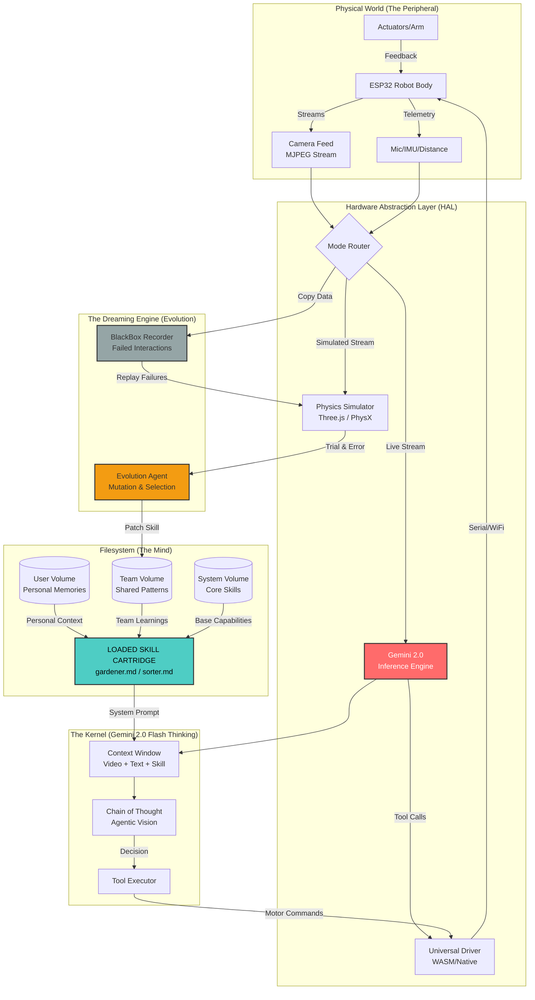
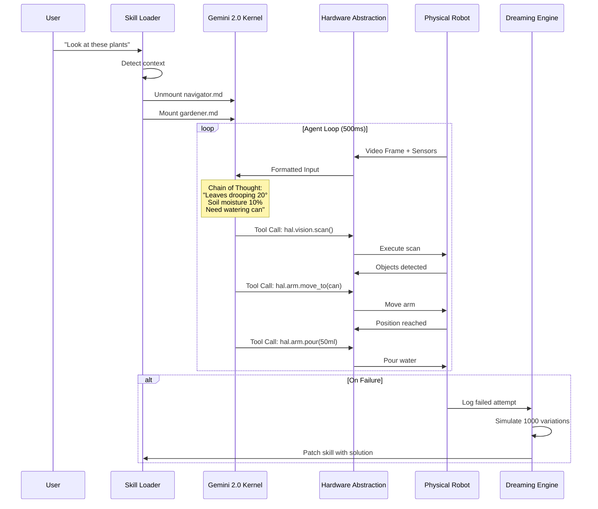
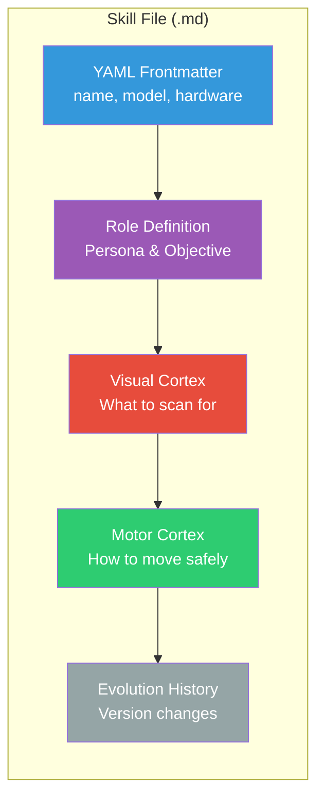
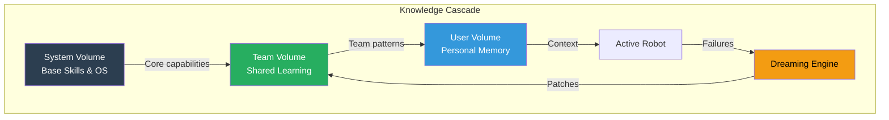
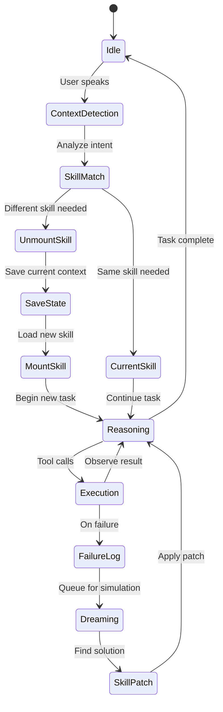
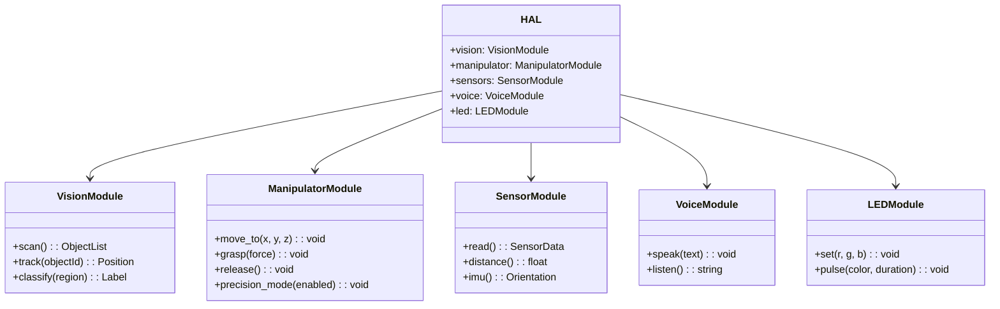

# LLMOS Architecture v2: The Skill Cartridge Model

> The "iPhone moment" for robotics: generic hardware running downloadable skills.

## System Overview (Mermaid)

## Data Flow Diagram

## Skill Cartridge Structure

## Volume Hierarchy

## Skill Hot-Swap Process

## HAL Tool Interface

---

## Key Architecture Decisions

### 1. Gemini 2.0 as the Kernel

**Why Gemini 2.0 Flash Thinking?**
- Native multimodal input (video + text in one context)
- Chain-of-thought reasoning visible in output
- Fast inference for real-time control (~200ms)
- Tool use / function calling support
- Live API for streaming video analysis

### 2. Markdown as the App Format

**Why Markdown?**
- Human-readable and editable
- Version controllable (git)
- Same format Claude Code uses for agents
- Can be generated/patched by LLM
- No compilation needed

### 3. Three-Layer Volume System

| Volume | Purpose | Persists Across |
|--------|---------|-----------------|
| System | Core skills, OS | All users |
| Team | Shared learnings | Team/org |
| User | Personal tweaks | Individual |

### 4. Dreaming for Evolution

The key insight: **failures are training data**.

Instead of discarding errors:
1. Log everything to BlackBox
2. Replay in physics simulation
3. Mutate approach thousands of times
4. Patch the skill when solution found
5. Propagate to fleet via Team Volume

---

*This architecture enables the "infinite app store for reality" - one robot body, infinite downloadable skills.*
