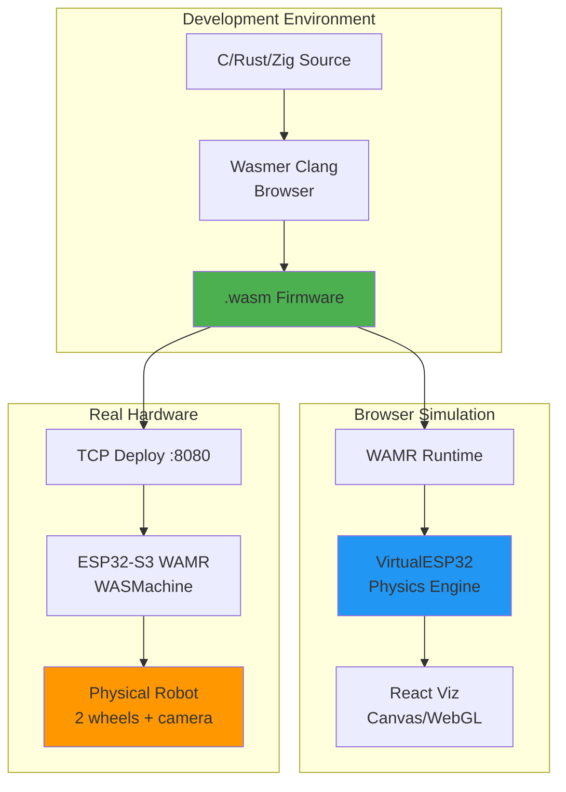
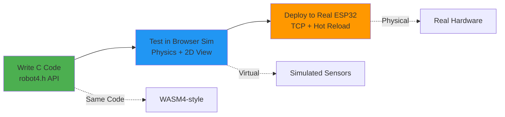

# WASM4-Style Robot Firmware Architecture

**Last Updated:** January 2026

## Vision: "Hall of Fame" Physical Robot Gaming

Imagine a physical play area (like a living room floor or dedicated arena) where **real ESP32-S3 robots** play retro games - navigating mazes, collecting items, following lines, and competing against each other. The robot firmware runs as **WebAssembly**, just like WASM4 fantasy console games, enabling:

- **Same code runs in browser simulation AND on real hardware**
- **60 FPS game loop** with deterministic physics
- **Hardware abstraction** through memory-mapped I/O (like WASM4)
- **Hot-swappable game cartridges** - upload new behaviors without reflashing

## System Architecture Overview



## WASM4 Paradigm Applied to Robotics

### WASM4 Fantasy Console Specifications

WASM4 provides a simple, constrained environment for retro games:

| Feature | WASM4 | Robot Equivalent |
|---------|-------|------------------|
| Display | 160x160 pixels, 4 colors | Camera 160x120 (scaled), obstacle map |
| Framerate | 60 Hz fixed | 60 Hz control loop |
| Input | 4 gamepads (8 buttons each) | Sensors: ultrasonic, IR, line, bumpers |
| Audio | 4 channels (pulse, triangle, noise) | Buzzer, speaker |
| Memory | 64 KB linear RAM | 64 KB WASM heap |
| Storage | 1024 bytes disk | LittleFS /storage (64KB) |
| API | Memory-mapped I/O | VFS ioctl() calls |

### Robot Hardware Abstraction Layer (RHAL)

Following WASM4's memory-mapped I/O pattern:

```c
// ═══════════════════════════════════════════════════════════════════════════
//                        ROBOT-4 API HEADER (robot4.h)
// ═══════════════════════════════════════════════════════════════════════════

// ─────────────────────────────────────────────────────────────────────────────
// MEMORY MAP (WASM4-style addresses)
// ─────────────────────────────────────────────────────────────────────────────
#define R4_MOTORS        ((volatile int16_t*)0x00)   // [0-1] Left/Right PWM (-255 to 255)
#define R4_ENCODERS      ((volatile int32_t*)0x04)   // [2-3] Left/Right encoder ticks
#define R4_IMU           ((volatile int16_t*)0x0C)   // [6] ax,ay,az,gx,gy,gz (scaled)
#define R4_BATTERY       ((volatile uint8_t*)0x18)   // [1] Battery % (0-100)
#define R4_LED           ((volatile uint8_t*)0x19)   // [3] R,G,B values
#define R4_SENSORS       ((volatile uint8_t*)0x1C)   // [8] Distance sensors (cm)
#define R4_LINE          ((volatile uint8_t*)0x24)   // [5] Line sensor array
#define R4_BUTTONS       ((volatile uint8_t*)0x29)   // [1] Bumper switches
#define R4_CAMERA_CMD    ((volatile uint8_t*)0x2A)   // [1] Camera command register
#define R4_CAMERA_STATUS ((volatile uint8_t*)0x2B)   // [1] Camera status
#define R4_SYSTEM_FLAGS  ((volatile uint8_t*)0x2C)   // [1] System configuration
#define R4_TICK_COUNT    ((volatile uint32_t*)0x30)  // [4] Milliseconds since boot

// Camera framebuffer (160x120 grayscale = 19200 bytes)
#define R4_FRAMEBUFFER   ((volatile uint8_t*)0x1000)
#define R4_FB_WIDTH      160
#define R4_FB_HEIGHT     120

// ─────────────────────────────────────────────────────────────────────────────
// BUTTON MASKS (similar to WASM4 gamepad)
// ─────────────────────────────────────────────────────────────────────────────
#define R4_BUMPER_FRONT  0x01
#define R4_BUMPER_LEFT   0x02
#define R4_BUMPER_RIGHT  0x04
#define R4_BUMPER_BACK   0x08
#define R4_BUTTON_USER   0x10  // User button on ESP32-S3

// ─────────────────────────────────────────────────────────────────────────────
// SYSTEM FLAGS
// ─────────────────────────────────────────────────────────────────────────────
#define R4_FLAG_CAMERA_ENABLE    0x01
#define R4_FLAG_MOTOR_ENABLE     0x02
#define R4_FLAG_LED_ENABLE       0x04
#define R4_FLAG_WIFI_CONNECTED   0x80  // Read-only status

// ─────────────────────────────────────────────────────────────────────────────
// CAMERA COMMANDS
// ─────────────────────────────────────────────────────────────────────────────
#define R4_CAM_CAPTURE   0x01  // Request single frame
#define R4_CAM_STREAM    0x02  // Start continuous capture
#define R4_CAM_STOP      0x00  // Stop capture

// Camera status values
#define R4_CAM_IDLE      0x00
#define R4_CAM_BUSY      0x01
#define R4_CAM_READY     0x02  // Frame available in framebuffer

// ─────────────────────────────────────────────────────────────────────────────
// CORE API FUNCTIONS (like WASM4's imports)
// ─────────────────────────────────────────────────────────────────────────────

// Called by runtime before each frame (60 Hz)
void update(void);

// Called once at startup
void start(void);

// Debug output (like WASM4's trace)
extern void trace(const char* message);

// Millisecond delay (use sparingly - blocks the game loop)
extern void delay_ms(uint32_t ms);

// Get random number (seeded from hardware RNG)
extern uint32_t random(void);

// Play tone on buzzer (frequency_hz, duration_ms, volume 0-255)
extern void tone(uint32_t freq, uint32_t duration, uint8_t volume);

// ─────────────────────────────────────────────────────────────────────────────
// CONVENIENCE MACROS
// ─────────────────────────────────────────────────────────────────────────────

// Set motor speeds (-255 to 255)
#define drive(left, right) do { \
    R4_MOTORS[0] = (int16_t)(left); \
    R4_MOTORS[1] = (int16_t)(right); \
} while(0)

// Stop both motors
#define stop() drive(0, 0)

// Get distance from sensor index (0-7)
#define distance(idx) (R4_SENSORS[(idx)])

// Check if bumper is pressed
#define bumper(mask) ((*R4_BUTTONS) & (mask))

// Set LED color
#define led(r, g, b) do { \
    R4_LED[0] = (r); R4_LED[1] = (g); R4_LED[2] = (b); \
} while(0)

// Request camera frame and wait for it
#define capture_frame() do { \
    *R4_CAMERA_CMD = R4_CAM_CAPTURE; \
    while (*R4_CAMERA_STATUS != R4_CAM_READY); \
} while(0)

// Get pixel from camera framebuffer (0-255 grayscale)
#define pixel(x, y) (R4_FRAMEBUFFER[(y) * R4_FB_WIDTH + (x)])
```

## Example Robot Programs

### 1. Basic Wall Avoider (Like a Simple WASM4 Game)

```c
// wall_avoider.c - Robot game: avoid walls, collect beacons
#include "robot4.h"

#define SPEED 150
#define TURN_SPEED 120
#define MIN_DISTANCE 30  // cm

typedef enum { FORWARD, TURNING_LEFT, TURNING_RIGHT } State;

State state = FORWARD;
uint32_t score = 0;

void start(void) {
    trace("Wall Avoider v1.0");
    *R4_SYSTEM_FLAGS = R4_FLAG_MOTOR_ENABLE | R4_FLAG_LED_ENABLE;
    led(0, 255, 0);  // Green = ready
}

void update(void) {
    uint8_t front = distance(0);    // Front sensor
    uint8_t left = distance(1);     // Left sensor
    uint8_t right = distance(2);    // Right sensor

    switch (state) {
        case FORWARD:
            if (front < MIN_DISTANCE) {
                // Wall ahead! Choose turn direction
                if (left > right) {
                    state = TURNING_LEFT;
                    led(255, 255, 0);  // Yellow = turning left
                } else {
                    state = TURNING_RIGHT;
                    led(255, 128, 0);  // Orange = turning right
                }
            } else {
                drive(SPEED, SPEED);
                led(0, 255, 0);  // Green = moving forward
            }
            break;

        case TURNING_LEFT:
            drive(-TURN_SPEED, TURN_SPEED);
            if (front > MIN_DISTANCE + 10) {
                state = FORWARD;
            }
            break;

        case TURNING_RIGHT:
            drive(TURN_SPEED, -TURN_SPEED);
            if (front > MIN_DISTANCE + 10) {
                state = FORWARD;
            }
            break;
    }

    // Check for bumper collision (game over condition)
    if (bumper(R4_BUMPER_FRONT)) {
        stop();
        led(255, 0, 0);  // Red = game over
        tone(200, 500, 128);  // Sad sound
    }
}
```

### 2. Line Following Game (Track Racing)

```c
// line_racer.c - Follow the track as fast as possible
#include "robot4.h"

#define BASE_SPEED 180
#define KP 25  // Proportional gain

int32_t lap_start_tick = 0;
int lap_count = 0;

void start(void) {
    trace("Line Racer v1.0");
    *R4_SYSTEM_FLAGS = R4_FLAG_MOTOR_ENABLE | R4_FLAG_LED_ENABLE;
    lap_start_tick = *R4_TICK_COUNT;
}

void update(void) {
    // Read 5 line sensors (0=white, 255=black)
    int sensors[5];
    for (int i = 0; i < 5; i++) {
        sensors[i] = R4_LINE[i];
    }

    // Calculate weighted position (-200 to +200)
    // Sensors arranged: [0]=far left, [2]=center, [4]=far right
    int position =
        -200 * (sensors[0] > 128 ? 1 : 0) +
        -100 * (sensors[1] > 128 ? 1 : 0) +
           0 * (sensors[2] > 128 ? 1 : 0) +
         100 * (sensors[3] > 128 ? 1 : 0) +
         200 * (sensors[4] > 128 ? 1 : 0);

    int count = 0;
    for (int i = 0; i < 5; i++) {
        if (sensors[i] > 128) count++;
    }
    if (count > 0) position /= count;

    // PD control for steering
    int correction = (position * KP) / 100;

    int left_speed = BASE_SPEED + correction;
    int right_speed = BASE_SPEED - correction;

    // Clamp speeds
    if (left_speed > 255) left_speed = 255;
    if (left_speed < -255) left_speed = -255;
    if (right_speed > 255) right_speed = 255;
    if (right_speed < -255) right_speed = -255;

    drive(left_speed, right_speed);

    // LED indicates position (red=left, green=center, blue=right)
    if (position < -50) {
        led(255, 0, 0);
    } else if (position > 50) {
        led(0, 0, 255);
    } else {
        led(0, 255, 0);
    }

    // Check for finish line (all sensors see black)
    if (count == 5) {
        lap_count++;
        uint32_t lap_time = *R4_TICK_COUNT - lap_start_tick;
        lap_start_tick = *R4_TICK_COUNT;
        tone(1000, 100, 200);  // Beep for lap completed
    }
}
```

### 3. Camera-Based Object Tracking (Vision Game)

```c
// blob_hunter.c - Use camera to find and approach colored targets
#include "robot4.h"

#define BLOB_THRESHOLD 200  // Brightness threshold
#define TARGET_SIZE 500     // Minimum blob size to pursue

void start(void) {
    trace("Blob Hunter v1.0");
    *R4_SYSTEM_FLAGS = R4_FLAG_MOTOR_ENABLE | R4_FLAG_LED_ENABLE | R4_FLAG_CAMERA_ENABLE;
}

// Simple blob detection - find brightest region
void find_blob(int* cx, int* cy, int* size) {
    int sum_x = 0, sum_y = 0, count = 0;

    for (int y = 0; y < R4_FB_HEIGHT; y += 4) {  // Subsample for speed
        for (int x = 0; x < R4_FB_WIDTH; x += 4) {
            if (pixel(x, y) > BLOB_THRESHOLD) {
                sum_x += x;
                sum_y += y;
                count++;
            }
        }
    }

    if (count > 0) {
        *cx = sum_x / count;
        *cy = sum_y / count;
        *size = count * 16;  // Scale back up
    } else {
        *cx = R4_FB_WIDTH / 2;
        *cy = R4_FB_HEIGHT / 2;
        *size = 0;
    }
}

void update(void) {
    // Capture a frame
    capture_frame();

    // Find brightest blob
    int blob_x, blob_y, blob_size;
    find_blob(&blob_x, &blob_y, &blob_size);

    if (blob_size < TARGET_SIZE) {
        // No target - spin to search
        drive(-100, 100);
        led(255, 255, 0);  // Yellow = searching
    } else {
        // Target found - pursue
        int error = blob_x - (R4_FB_WIDTH / 2);
        int correction = error / 2;

        // Larger blob = closer = slower approach
        int speed = 200 - (blob_size / 50);
        if (speed < 50) speed = 50;

        drive(speed - correction, speed + correction);
        led(0, 255, 0);  // Green = tracking

        // Check if "caught" (blob fills most of frame)
        if (blob_size > 5000) {
            stop();
            led(0, 0, 255);  // Blue = caught!
            tone(880, 200, 200);
        }
    }
}
```

## Simulation Architecture (VirtualESP32)

The existing `VirtualESP32` class provides the physics engine:

```typescript
// Key features of the simulation
class VirtualESP32 {
  // Differential drive kinematics
  WHEEL_BASE = 0.5;       // 50cm between wheels
  SPEED_SCALE = 0.01;     // motor_value → m/s
  PHYSICS_DT = 0.1;       // 100ms physics tick (internally 10Hz)
  TICKS_PER_METER = 1000; // Encoder resolution

  // Physics loop runs at 10Hz, updating:
  updateDiffDrivePhysics(dt: number) {
    // Linear velocity: v = (v_right + v_left) / 2
    // Angular velocity: ω = (v_right - v_left) / wheel_base
    // Position: x += v * cos(θ) * dt, y += v * sin(θ) * dt
    // Rotation: θ += ω * dt (normalized to [-π, π])
    // Encoders: ticks += velocity * dt * TICKS_PER_METER
  }
}
```

### Browser WASM Runtime Integration

```typescript
// Proposed: WASM execution layer for robot firmware
class RobotWasmRuntime {
  private wasmInstance: WebAssembly.Instance;
  private memory: WebAssembly.Memory;
  private robot: VirtualESP32;

  // Memory-mapped regions (mirrors robot4.h addresses)
  private MOTORS_ADDR = 0x00;
  private ENCODERS_ADDR = 0x04;
  private SENSORS_ADDR = 0x1C;
  private FRAMEBUFFER_ADDR = 0x1000;

  async loadCartridge(wasmBinary: Uint8Array) {
    const imports = {
      env: {
        trace: (ptr: number) => console.log(this.readString(ptr)),
        delay_ms: (ms: number) => { /* no-op in sim */ },
        random: () => Math.floor(Math.random() * 0xFFFFFFFF),
        tone: (freq: number, dur: number, vol: number) => {
          this.audioContext.playTone(freq, dur, vol);
        }
      }
    };

    const module = await WebAssembly.compile(wasmBinary);
    this.wasmInstance = await WebAssembly.instantiate(module, imports);
    this.memory = this.wasmInstance.exports.memory as WebAssembly.Memory;

    // Call start() once
    (this.wasmInstance.exports.start as Function)();
  }

  // Called 60 times per second by the game loop
  tick() {
    // 1. Write sensor data TO WASM memory
    this.syncSensorsToMemory();

    // 2. Call update() in WASM
    (this.wasmInstance.exports.update as Function)();

    // 3. Read motor commands FROM WASM memory
    this.syncMotorsFromMemory();

    // 4. Update physics simulation
    this.robot.updateDiffDrivePhysics(1/60);
  }

  private syncSensorsToMemory() {
    const view = new DataView(this.memory.buffer);
    const pose = this.robot.getRobotPose();
    const encoders = this.robot.getEncoders();

    // Write encoder values
    view.setInt32(this.ENCODERS_ADDR, encoders.left, true);
    view.setInt32(this.ENCODERS_ADDR + 4, encoders.right, true);

    // Write simulated distance sensors
    // (would calculate ray-cast distances in real sim)
    for (let i = 0; i < 8; i++) {
      view.setUint8(this.SENSORS_ADDR + i, this.calculateDistance(i, pose));
    }
  }

  private syncMotorsFromMemory() {
    const view = new DataView(this.memory.buffer);
    const left = view.getInt16(this.MOTORS_ADDR, true);
    const right = view.getInt16(this.MOTORS_ADDR + 2, true);

    this.robot.processCommand({
      action: 'drive',
      l: left,
      r: right
    });
  }
}
```

## Real Hardware Deployment (ESP32-S3 + WAMR)

### Hardware Requirements

| Component | Specification | Purpose |
|-----------|--------------|---------|
| **MCU** | ESP32-S3 (240MHz dual-core, 512KB SRAM) | Run WAMR + robot control |
| **Camera** | OV2640 (640x480 → downscaled 160x120) | Vision for games |
| **Motor Driver** | TB6612FNG or L298N | Control 2 DC motors |
| **Wheels** | 65mm diameter with encoders | Differential drive |
| **Battery** | 2S LiPo (7.4V, 1000mAh) | ~30 min runtime |
| **Sensors** | HC-SR04 ultrasonic, QTR-8RC line sensor | Navigation |
| **Chassis** | 10cm cube with mounting holes | "Game Boy" aesthetic |

### ESP32 WAMR Runtime Setup

Using [esp-wasmachine](https://github.com/espressif/esp-wasmachine):

```bash
# Clone ESP-WASMachine
git clone https://github.com/espressif/esp-wasmachine.git
cd esp-wasmachine

# Configure for ESP32-S3 with camera
idf.py set-target esp32s3
idf.py menuconfig
# Enable: Component config → WASM Micro Runtime → Interpreter mode
# Enable: Component config → ESP32 Camera → OV2640

# Build and flash
idf.py build flash monitor
```

### Native Extensions for Robot Hardware

The WASI VFS approach (already in codebase) maps hardware to files:

```c
// Native host functions registered with WAMR
static NativeSymbol native_symbols[] = {
    // Motor control via PWM
    {"motor_set", motor_set_native, "(ii)i", NULL},

    // Sensor reading
    {"sensor_read", sensor_read_native, "(i)i", NULL},

    // Camera capture
    {"camera_capture", camera_capture_native, "()i", NULL},
    {"camera_get_pixel", camera_get_pixel_native, "(ii)i", NULL},

    // Encoder reading
    {"encoder_read", encoder_read_native, "(i)i", NULL},
};

// Example: Motor control implementation
int motor_set_native(wasm_exec_env_t exec_env, int motor_id, int pwm_value) {
    // motor_id: 0=left, 1=right
    // pwm_value: -255 to 255

    int channel = (motor_id == 0) ? MOTOR_LEFT_PWM : MOTOR_RIGHT_PWM;
    int dir_pin = (motor_id == 0) ? MOTOR_LEFT_DIR : MOTOR_RIGHT_DIR;

    if (pwm_value >= 0) {
        gpio_set_level(dir_pin, 1);  // Forward
        ledc_set_duty(LEDC_MODE, channel, pwm_value);
    } else {
        gpio_set_level(dir_pin, 0);  // Reverse
        ledc_set_duty(LEDC_MODE, channel, -pwm_value);
    }
    ledc_update_duty(LEDC_MODE, channel);

    return 0;
}
```

## Deployment Flow: Simulator → Real Robot



### LLMos Integration Points

1. **Browser WASM Compiler** (`/lib/runtime/wasm-compiler.ts`):
   - Compiles C → WASM using Wasmer SDK
   - Includes robot4.h headers
   - Outputs .wasm binary

2. **TCP Deployer** (`/lib/hardware/wasm-deployer.ts`):
   - Connects to ESP32 on port 8080
   - Uploads WASM binary with metadata
   - Queries/uninstalls apps

3. **Virtual ESP32** (`/lib/hardware/virtual-esp32.ts`):
   - Differential drive physics
   - Sensor simulation
   - Camera frame buffer (to be added)

4. **React Visualization** (applets):
   - 2D top-down robot view
   - Camera feed display
   - Telemetry dashboard

## "Hall of Fame" Game Ideas

Physical arena games where robots compete:

| Game | Description | Sensors Used |
|------|-------------|--------------|
| **Maze Escape** | Navigate out of a cardboard maze | Ultrasonic, bumpers |
| **Line Racer** | Follow track, fastest lap wins | Line sensors |
| **Sumo Bot** | Push opponent out of ring | Bumpers, line (edge detect) |
| **Beacon Hunter** | Find IR beacons scattered around | Camera + IR |
| **Tag** | Chase/evade other robots | Camera, ultrasonic |
| **Pac-Man** | Collect dots, avoid ghosts | Camera, odometry |
| **Drawing** | Draw shapes on whiteboard floor | Encoders, pen lift servo |

### Physical Arena Setup

```
┌────────────────────────────────────────────────────────┐
│                    GAME ARENA                          │
│  ┌──────────────────────────────────────────────────┐  │
│  │                                                  │  │
│  │     ██████                    ██████             │  │
│  │     █    █    START           █    █             │  │
│  │     █    █      ▼             █    █             │  │
│  │     ██████   [ROBOT]          ██████             │  │
│  │                                                  │  │
│  │  ════════════════════════════════════════════   │  │
│  │  ║  Line track for racing games              ║  │  │
│  │  ════════════════════════════════════════════   │  │
│  │                                                  │  │
│  │     ● Beacon    ● Beacon         ● Beacon       │  │
│  │                                                  │  │
│  │  ┌──────┐                         ┌──────┐      │  │
│  │  │Charger│                        │Charger│     │  │
│  │  └──────┘        GOAL ★           └──────┘      │  │
│  │                                                  │  │
│  └──────────────────────────────────────────────────┘  │
│                                                        │
│   [Overhead Camera for Spectator View / Positioning]   │
└────────────────────────────────────────────────────────┘
```

## Benefits of WASM-Based Robot Firmware

1. **Sandboxed Execution**: Firmware bugs can't crash the whole system
2. **Hot-Swappable**: Upload new behaviors without reflashing
3. **Language Agnostic**: C, Rust, Zig, AssemblyScript all compile to WASM
4. **Deterministic**: Same code behaves identically in sim and hardware
5. **Small Binaries**: Typical robot program < 8KB WASM
6. **Easy Updates**: OTA via WiFi, no USB cable needed
7. **Marketplace Ready**: Share robot "cartridges" like WASM4 games

## WASI Integration

For more complex applications, WASI provides standardized system interfaces:

```c
// Using WASI for file I/O (persistent storage)
#include <stdio.h>

void save_high_score(int score) {
    FILE *f = fopen("/storage/scores.txt", "w");
    if (f) {
        fprintf(f, "%d\n", score);
        fclose(f);
    }
}

int load_high_score(void) {
    FILE *f = fopen("/storage/scores.txt", "r");
    if (f) {
        int score = 0;
        fscanf(f, "%d", &score);
        fclose(f);
        return score;
    }
    return 0;
}
```

The ESP-WASMachine firmware implements WASI filesystem operations mapped to LittleFS, allowing the same code that works in browser simulation (via WASI polyfill) to work on real hardware.

## Next Steps for Implementation

1. **Extend VirtualESP32** with camera framebuffer simulation
2. **Create robot4.h** header and browser WASM runtime integration
3. **Build React visualization** with 2D arena view
4. **Design physical robot** PCB with ESP32-S3 + camera + motor driver
5. **Port example games** from WASM4 to robot4 API
6. **Create arena calibration** using overhead camera + ArUco markers

## References

- [WASM-4 Fantasy Console](https://wasm4.org/) - Inspiration for memory-mapped API design
- [WASI Specification](https://wasi.dev/) - WebAssembly System Interface for file/network access
- [ESP-WASMachine](https://github.com/espressif/esp-wasmachine) - ESP32 WASM runtime by Espressif
- [WAMR](https://github.com/bytecodealliance/wasm-micro-runtime) - WebAssembly Micro Runtime for embedded
- [Wasmer SDK](https://wasmer.io/) - Browser-based WASM compilation

---

*This architecture enables the dream of programming robots like retro games - write once, simulate in browser, deploy to real hardware, compete in physical arenas.*
