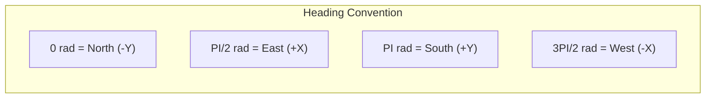
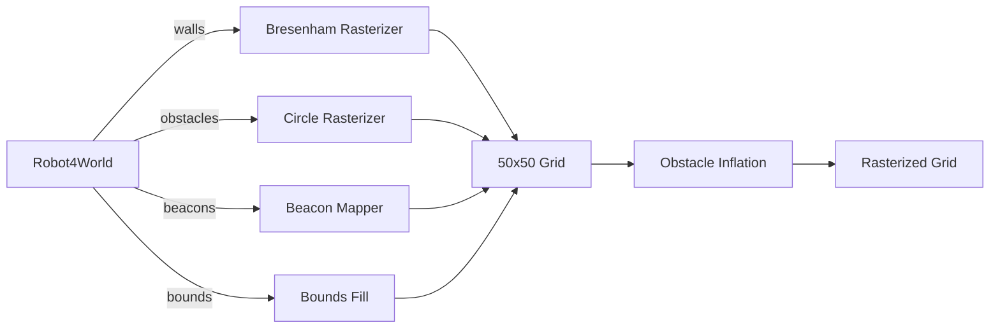
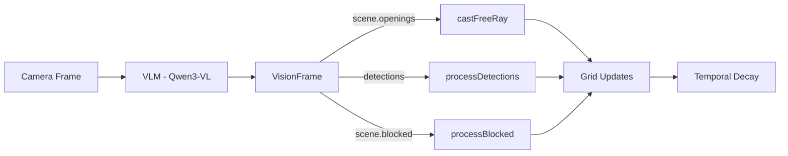
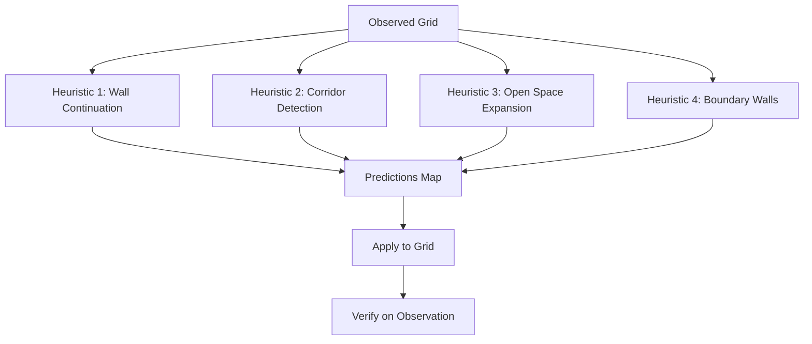

# World Model System -- Deep Dive

Technical reference for the LLMos World Model subsystem: the occupancy grid, serialization formats, bridge implementations, predictive model, LLM corrections, temporal decay, and accuracy metrics.

---

## Table of Contents

1. [GridCell Structure](#gridcell-structure)
2. [CellState Types](#cellstate-types)
3. [Coordinate Conversion](#coordinate-conversion)
4. [Serialization Formats](#serialization-formats)
5. [Ground-Truth Bridge](#ground-truth-bridge)
6. [Sensor Bridge (Vision)](#sensor-bridge-vision)
7. [Predictive World Model](#predictive-world-model)
8. [LLM Corrections](#llm-corrections)
9. [Temporal Decay](#temporal-decay)
10. [World Model Metrics](#world-model-metrics)

---

## GridCell Structure

Every cell in the 50x50 occupancy grid is a `GridCell` instance defined in `lib/runtime/world-model.ts`:

```typescript
interface GridCell {
  x: number;             // Grid X coordinate (0-49)
  y: number;             // Grid Y coordinate (0-49)
  state: CellState;      // Occupancy state (see below)
  confidence: number;    // 0.0 to 1.0 -- how confident we are
  lastUpdated: number;   // Timestamp of last update (ms since epoch)
  visitCount: number;    // How many times the robot has been here
  distanceReading?: number; // Last distance sensor reading (cm)
}
```

### Grid Dimensions

| Parameter | Value | Source |
|-----------|-------|--------|
| Default world size | 500cm x 500cm (5m x 5m) | `WorldModelConfig.worldWidth/worldHeight` |
| Grid resolution | 10cm per cell | `WorldModelConfig.gridResolution` |
| Grid dimensions | 50 columns x 50 rows | `ceil(500 / 10)` |
| Center offset | (25, 25) | `floor(gridWidth / 2)` |
| Total cells | 2,500 | 50 x 50 |

### Configuration

```typescript
interface WorldModelConfig {
  gridResolution: number;    // Cell size in cm (default: 10)
  worldWidth: number;        // World width in cm (default: 500)
  worldHeight: number;       // World height in cm (default: 500)
  confidenceDecay: number;   // Decay multiplier per call (default: 0.995)
  explorationBonus: number;  // Bonus for new areas (default: 0.1)
}
```

---

## CellState Types

The `CellState` type is a string union with 8 possible values. Each has distinct semantics for the planner, serializer, and LLM:

| State | Meaning | A\* Cost | RLE Code | ASCII Char | Can LLM Override? |
|-------|---------|----------|----------|------------|-------------------|
| `unknown` | Not yet observed | 5 (GT) / 50 (vision) | `U` | `?` | Yes |
| `free` | Safe to traverse | 1 | `F` | `.` | Yes |
| `obstacle` | Contains an obstacle | 999 (impassable) | `O` | `#` | Yes (if confidence < 0.7) |
| `wall` | Wall boundary | 999 (impassable) | `W` | `=` | Yes (if confidence < 0.7) |
| `explored` | Visited by robot | 1 | `E` | `.` | Never |
| `path` | Part of a planned path | 1 | `P` | `o` | Yes |
| `collectible` | Contains a collectible item | 1 | `C` | `*` | Yes |
| `collected` | Item was here but collected | 1 | `X` | `x` | Yes |

### State Transition Rules

1. `unknown` -> any state: always allowed
2. `free` -> `explored`: when robot visits the cell
3. `free` -> `obstacle`: sensor or VLM detects something
4. `explored` -> `free`: **blocked** (explored cells are never downgraded)
5. `obstacle` -> `free`: only via LLM correction with confidence guards
6. `collectible` -> `collected`: when robot picks up the item

### Priority for Downsampling

When the serializer downsamples 50x50 to 25x25 (2x2 blocks), it uses max-priority:

```
wall(6) > obstacle(5) > collectible(4) > collected(3) > explored(2) = path(2) > free(1) > unknown(0)
```

---

## Coordinate Conversion

The world model uses a coordinate system where the grid origin is offset to allow negative world coordinates. All world coordinates are in **meters**; grid coordinates are integer indices.

### worldToGrid

Converts world coordinates (meters) to grid indices:

```typescript
worldToGrid(worldX: number, worldY: number): { gx: number; gy: number } {
  const gx = Math.floor((worldX * 100) / this.config.gridResolution) + this.offsetX;
  const gy = Math.floor((worldY * 100) / this.config.gridResolution) + this.offsetY;
  return { gx, gy };
}
```

**Example** (default config, resolution=10, offset=25):
- World (0, 0) -> Grid (25, 25) -- center
- World (1.0, 0) -> Grid (35, 25) -- 1m east
- World (-2.5, -2.5) -> Grid (0, 0) -- bottom-left corner

### gridToWorld

Converts grid indices back to world coordinates:

```typescript
gridToWorld(gx: number, gy: number): { x: number; y: number } {
  const x = ((gx - this.offsetX) * this.config.gridResolution) / 100;
  const y = ((gy - this.offsetY) * this.config.gridResolution) / 100;
  return { x, y };
}
```

### Heading Convention

The coordinate system follows this convention:
- **rotation = 0**: faces -Y (North in grid, "up")
- **rotation = PI/2**: faces +X (East in grid, "right")
- **Movement formula**: `x += sin(angle) * distance`, `y -= cos(angle) * distance`



---

## Serialization Formats

The `WorldModelSerializer` (in `world-model-serializer.ts`) converts the grid into compact formats for LLM consumption. The raw 2,500-cell grid is never dumped directly.

### Format A: RLE JSON (Primary)

Run-length encoded occupancy grid. Used for structured LLM reasoning.

```typescript
interface GridSerializationJSON {
  frame: 'world';
  size_m: [number, number];         // [5, 5]
  resolution_m: number;             // 0.1
  origin_m: [number, number];       // [0, 0]
  grid_size: [number, number];      // [50, 50]
  occupancy_rle: string;            // "U:1200,F:1000,O:300"
  exploration: number;              // 0.0-1.0
  robot: { pose_m: [x, y]; yaw_deg: number };
  goal?: { pose_m: [x, y]; tolerance_m: number };
}
```

**RLE encoding**: The grid is flattened row-major (row 0 left-to-right, then row 1, etc.) and each cell state is mapped to a single character (`U`, `F`, `O`, `W`, `E`, `P`, `C`, `X`). Consecutive identical states are collapsed: `"U:1200,F:1000,O:300"` means 1200 unknown, 1000 free, 300 obstacle.

### Format B: Top-Down PNG (Map Renderer)

A rendered PNG image of the grid produced by `map-renderer.ts`. Sent as multimodal input alongside the text prompt. Shows robot position (green), goal (red), candidates (blue/orange), and frontiers.

### Format C: ASCII 25x25 (Debug)

A downsampled text grid for debugging and lightweight contexts:

```typescript
interface GridSerializationASCII {
  type: 'ascii';
  grid: string;     // Multi-line 25x25 character grid
  legend: string;   // "# obstacle  = wall  . free  ? unknown  G goal  ^ v < > robot"
}
```

The 50x50 grid is downsampled to 25x25 using a factor-of-2 max-priority rule. The robot position is shown as `^`, `v`, `<`, or `>` depending on heading. The goal is shown as `G`.

### Patch Format (Delta Updates)

On subsequent cycles, only changed cells are sent:

```typescript
interface GridPatchUpdate {
  frame: 'world_patch';
  cycle: number;
  changes: Array<[gridX, gridY, newState]>;
  robot: { pose_m: [x, y]; yaw_deg: number };
  exploration: number;
  num_changes: number;
}
```

### Auto Selection (`serialize('auto', ...)`)

The serializer automatically chooses between full RLE JSON and patch:
- **First cycle** or **no previous state**: full JSON
- **Patch would cover >30% of grid**: full JSON (patch would be larger)
- **Otherwise**: patch update

---

## Ground-Truth Bridge

`WorldModelBridge` in `world-model-bridge.ts` is the ground-truth pipeline. It rasterizes the full simulation world (`Robot4World`) onto the occupancy grid with perfect knowledge.



### Rasterization Steps

1. **Bounds fill**: All cells within world bounds marked as `free` (confidence 1.0)
2. **Wall rasterization**: Bresenham's line algorithm draws walls as `wall` cells
3. **Obstacle rasterization**: Filled circles for each obstacle as `obstacle` cells
4. **Beacon mapping**: Active beacons marked as `collectible` cells
5. **Obstacle inflation**: Expand obstacles by N cells (default 1) as safety margin. Inflated cells get `obstacle` state at 0.7 confidence.

### Frontier Detection

Frontiers are free/explored cells adjacent to unknown cells (4-connected neighbors). They represent the boundary of knowledge -- natural exploration targets.

```typescript
findFrontiers(): FrontierCell[] {
  // For each free/explored cell, count unknown 4-connected neighbors
  // Return cells sorted by unknownNeighbors descending
}
```

`FrontierCell` contains: grid coordinates (`gx`, `gy`), world coordinates (`wx`, `wy`), and `unknownNeighbors` count.

---

## Sensor Bridge (Vision)

`VisionWorldModelBridge` in `sensor-bridge.ts` builds the occupancy grid incrementally from camera + VLM output. Unlike the ground-truth bridge, it has no `rasterize()` call -- the grid starts fully unknown and grows as the robot moves and observes.



### VisionFrame Processing

Each cycle, the bridge processes a VisionFrame containing:
- **scene.openings**: directions the VLM says are clear -> cast free rays
- **detections**: objects with depth estimates -> mark obstacles at estimated positions
- **scene.blocked**: blocked directions without specific detections -> conservative obstacle marks

### Region-to-Angle Mapping

VLM detections include a `region` label mapped to angular offsets from robot heading:

| Region | Angle Offset |
|--------|-------------|
| `left` | +PI/6 (+30 degrees) |
| `center` | 0 |
| `right` | -PI/6 (-30 degrees) |

For fine-grained angular resolution, the detection's bounding box x-center is mapped across the camera FOV (default 60 degrees = PI/3 radians).

### Confidence Levels

| Source | Confidence |
|--------|-----------|
| Robot physically visited cell | 1.0 (explored, exempt from decay) |
| Ground-truth rasterization | 1.0 |
| VLM free-space ray | 0.7 * distance attenuation |
| VLM detection obstacle | detection.confidence * 0.8 |
| VLM blocked direction (no detection) | 0.6 |
| Obstacle inflation | 0.7 |

### Key Configuration

```typescript
interface VisionBridgeConfig {
  cameraFovRad: number;          // Default: PI/3 (60 degrees)
  defaultOpenDepthM: number;     // Default: 1.0m
  defaultBlockedDepthM: number;  // Default: 0.5m
  freeConfidence: number;        // Default: 0.7
  obstacleConfidence: number;    // Default: 0.8
  rayStepM: number;              // Default: 0.1m
  enableDecay: boolean;          // Default: true
  decayStartMs: number;          // Default: 5000ms
  staleThresholdMs: number;      // Default: 30000ms
  decayRatePerSec: number;       // Default: 0.05
  minConfidence: number;         // Default: 0.2
}
```

### Key Differences from Ground-Truth Bridge

| Aspect | Ground-Truth | Vision |
|--------|-------------|--------|
| Initialization | `rasterize()` fills entire grid | Grid starts fully unknown |
| Coverage | Full 360 degree knowledge | Limited to camera FOV (~60 degrees) per frame |
| Confidence | 1.0 everywhere | 0.6-0.8, distance-attenuated |
| Wall vs Obstacle | Distinct states | All solid objects marked as `obstacle` |
| Temporal decay | Not needed | Required (cells go stale) |
| A\* unknown cost | 5 | 50 (heavily penalize unknown paths) |

---

## Predictive World Model

`PredictiveWorldModel` in `predictive-world-model.ts` fills unknown cells with low-confidence predictions using spatial heuristics. It runs each cycle (when enabled) without LLM inference cost.



### Heuristic 1: Wall Continuation

If a wall segment is observed (at least 2 adjacent wall/obstacle cells in a line), predict the wall continues into unknown territory for up to `maxWallExtrapolation` cells (default 5).

- Confidence: `wallContinuationConfidence * (1 - step * 0.1)` -- decays with distance from known wall
- Default confidence: 0.3

### Heuristic 2: Corridor Detection

Scans for parallel walls with free space between them:
- **Horizontal corridors**: walls above and below free cells for at least `minCorridorLength` cells (default 3)
- **Vertical corridors**: walls left and right of free cells

Predicts the corridor continues forward (free cells) with walls on the sides.

- Free cell confidence: `corridorConfidence` (default 0.25)
- Side wall confidence: `corridorConfidence * 0.8`

### Heuristic 3: Open Space Expansion

If a free/explored cell has 2+ free neighbors and some unknown neighbors, predict the unknown neighbors as free.

- Confidence: `openSpaceConfidence` (default 0.2)

### Heuristic 4: Boundary Walls

If more than 5 edge cells are walls, predict all remaining unknown edge cells as walls.

- Confidence: `wallContinuationConfidence` (default 0.3)

### Verification

After the grid is updated with real sensor data, `verify()` checks each active prediction:
- **Correct**: predicted state category matches observed (obstacle/wall both count as "solid"; free/explored both count as "passable")
- **Wrong**: predicted state category does not match
- Verified predictions are removed; wrong predictions are removed and counted

Statistics are tracked: `verifiedCount`, `wrongCount`, `accuracy = verified / (verified + wrong)`.

### Application Rules

Predictions only apply to cells that are:
- Currently `unknown`, OR
- Have lower confidence than the prediction

Predictions do NOT update `lastUpdated` -- this distinguishes predictions from real observations for the verification system.

---

## LLM Corrections

The LLM can optionally include `world_model_update.corrections` in its decision response. These are advisory corrections validated by the navigation loop before application.

### Decision Schema

```typescript
world_model_update?: {
  corrections: Array<{
    pos_m: [number, number];           // World coordinates (meters)
    observed_state: 'free' | 'obstacle' | 'unknown';
    confidence: number;                 // 0.0-1.0
  }>;
};
```

### Confidence Guards

The `applyCorrections()` method in `NavigationLoop` enforces strict guards:

1. **Minimum LLM confidence**: correction.confidence must be >= `llmCorrectionMinConfidence` (default 0.6). Low-confidence corrections are silently dropped.

2. **Explored cell protection**: cells with state `explored` are NEVER overridden. The robot physically visited these cells -- that data is ground truth.

3. **Maximum sensor override**: cells with confidence > `llmCorrectionMaxOverride` (default 0.7) are not overridden. High-confidence sensor data takes precedence over LLM guesses.

4. **Capped confidence**: the applied correction confidence is capped at `llmCorrectionMaxOverride` so it can be overridden by future sensor data.

### Example Flow

```
LLM says: { pos_m: [1.2, 0.8], observed_state: "free", confidence: 0.75 }

Cell at grid(37, 33):
  - state: obstacle, confidence: 0.65

Checks:
  1. LLM confidence 0.75 >= 0.6 (min threshold)   -> PASS
  2. Cell state != explored                          -> PASS
  3. Cell confidence 0.65 <= 0.7 (max override)      -> PASS

Result: Cell updated to free, confidence = min(0.75, 0.7) = 0.7
```

---

## Temporal Decay

The `VisionWorldModelBridge` implements temporal confidence decay for cells that have not been re-observed recently. This models the fact that the world can change, and old observations become less reliable.

### Decay Parameters

| Parameter | Default | Description |
|-----------|---------|-------------|
| `decayStartMs` | 5000 | Age in ms before decay begins |
| `decayRatePerSec` | 0.05 | Confidence loss per second after decay starts |
| `staleThresholdMs` | 30000 | Age in ms after which cells revert to unknown |
| `minConfidence` | 0.2 | Confidence below which cells revert to unknown |

### Decay Formula

For a cell with age `A` milliseconds since last update:

```
if A < decayStartMs:
    no change

decayTime = (A - decayStartMs) / 1000
newConfidence = cell.confidence - decayTime * decayRatePerSec

if newConfidence < minConfidence OR A > staleThresholdMs:
    cell -> unknown, confidence = 0
else:
    cell.confidence = newConfidence
```

### Exempt Cells

- **`unknown` cells**: nothing to decay
- **`explored` cells**: robot physically visited -- exempt from staleness
- **Cells with `lastUpdated = 0`**: never been observed -- skip

### Effect on Navigation

In vision mode, temporal decay forces the robot to re-observe areas periodically. Cells behind the robot gradually lose confidence and eventually revert to unknown, creating new frontiers that pull the exploration loop back to verify assumptions. This prevents the grid from becoming stale when the robot is in a dynamic environment.

---

## World Model Metrics

`world-model-metrics.ts` provides quantitative comparison between a sensor-built grid and a ground-truth grid.

### Grid Accuracy Metrics

```typescript
interface GridAccuracyMetrics {
  cellAccuracy: number;        // % of cells with matching state (0-1)
  obstacleRecall: number;      // % of true obstacles detected (0-1)
  obstaclePrecision: number;   // % of sensor-detected obstacles that are real (0-1)
  falsePositiveRate: number;   // sensor sees obstacle where none exists (0-1)
  falseNegativeRate: number;   // sensor misses real obstacle (0-1)
  totalCells: number;
  matchingCells: number;
  stateBreakdown: Record<string, { correct: number; total: number }>;
}
```

### How Comparison Works

1. Both grids must have the same dimensions
2. Cells that are `unknown` in the sensor grid are **excluded** from accuracy calculations (the sensor hasn't observed them yet)
3. States are grouped for comparison:
   - **Solid**: `obstacle`, `wall`
   - **Passable**: `free`, `explored`, `path`, `collectible`, `collected`
4. Obstacle recall = true positives / (true positives + false negatives) among ground-truth solid cells
5. Obstacle precision = true positives / (true positives + false positives) among sensor-detected solid cells

### Decision Quality Metrics

```typescript
interface DecisionQualityMetrics {
  goalConvergence: number;    // Is distance to goal decreasing over time?
  actionDiversity: number;    // Shannon entropy of action distribution
  pathEfficiency: number;     // straight-line / actual distance (1.0 = perfect)
  stuckRecoveryRate: number;  // % of stuck episodes resolved within budget
  avgStuckDuration: number;   // Average cycles per stuck episode
}
```

### Usage

```typescript
import { compareGrids } from './world-model-metrics';

const metrics = compareGrids(sensorWorldModel, groundTruthWorldModel);
console.log(`Accuracy: ${(metrics.cellAccuracy * 100).toFixed(1)}%`);
console.log(`Obstacle recall: ${(metrics.obstacleRecall * 100).toFixed(1)}%`);
console.log(`Obstacle precision: ${(metrics.obstaclePrecision * 100).toFixed(1)}%`);
```
