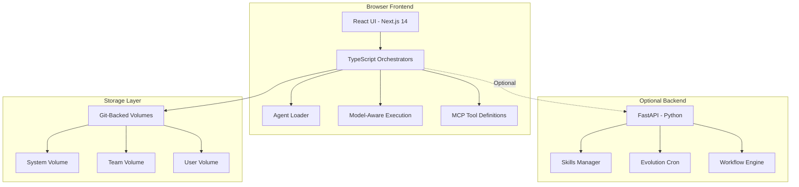

# LLM Operating System Architecture Comparison

**Last Updated:** January 2026

## Executive Summary

This document provides a comprehensive comparison between two fundamentally different approaches to building LLM-powered operating systems:

1. **LLMos**: A **Web-Based, Full-Stack OS Simulation** with structured agents, Pyodide runtime, and React UI
2. **llmunix**: A **Text-Based, Self-Modifying Kernel** operating on a "Pure Markdown" philosophy

**Recommendation**: Adopt llmunix's dynamic, text-first philosophy while retaining LLMos's infrastructure advantages (UI, hardware integration, WASM runtime, deployment flexibility).

---

## Architectural Philosophy

### LLMos: Structured Agent Architecture



**Key Characteristics:**
- Agents are **Markdown files** interpreted by LLM orchestrator
- Evolution is **LLM-driven** using pattern matching
- Skills are loaded/filtered by **semantic search**
- Creating an agent requires **writing markdown + deployment**

### llmunix: Self-Modifying Kernel Architecture

```
┌─────────────────────────────────────────────────────────────────┐
│                     Claude Code CLI (Terminal)                   │
├─────────────────────────────────────────────────────────────────┤
│                     Markdown Kernel Prompt                       │
│                    (/llmunix slash command)                      │
├─────────────────────────────────────────────────────────────────┤
│                    Dynamic Agent Discovery                       │
│              (Glob filesystem for *.md agents)                   │
├─────────────────────────────────────────────────────────────────┤
│                     Markdown File System                         │
│  ┌─────────────┐  ┌─────────────┐  ┌──────────────────────┐    │
│  │   Agents/   │  │   Memory/   │  │    Projects/         │    │
│  │   *.md      │  │   *.md      │  │    *.md              │    │
│  └─────────────┘  └─────────────┘  └──────────────────────┘    │
└─────────────────────────────────────────────────────────────────┘
```

**Key Characteristics:**
- Agents are **Markdown files** the LLM reads and follows
- Evolution is **LLM editing its own prompts**
- Memory is **structured text files** searchable via grep
- Creating an agent = **writing a text file**

---

## Feature Comparison Matrix

| Feature | LLMos | llmunix | Winner | Notes |
|---------|-----------|---------|--------|-------|
| **Agent Definition** | Markdown interpreted by LLM | Pure Markdown | Tie | Both use markdown |
| **Agent Count** | 11+ specialized agents | 3 core agents | LLMos | More capability out-of-box |
| **Orchestration** | TypeScript + LLM interpreter | Single prompt | LLMos | More flexible execution |
| **Memory System** | Structured traces + Git | Markdown logs | Tie | Both work, different tradeoffs |
| **UI Capabilities** | Rich React GUI + Applets | Terminal only | LLMos | Visual tools matter for end users |
| **Hardware Integration** | ESP32, WASM robots, Serial | None | LLMos | IoT/edge computing support |
| **Code Execution** | Pyodide (browser WASM) | Claude Code Bash | LLMos | Sandboxed browser execution |
| **Self-Modification** | LLM edits markdown | LLM edits markdown | Tie | Both support self-modification |
| **Deployment** | Static hosting (Vercel, etc.) | Claude Code extension | LLMos | Production-ready infrastructure |
| **API Flexibility** | OpenAI-compatible (multi-provider) | Claude only | LLMos | Works with OpenRouter/Gemini/OpenAI |
| **Evolution Speed** | LLM-driven real-time | Instant (text edit) | Tie | Both support real-time learning |
| **Trace Linking** | Implemented | Explicit parent_id | Tie | Both track execution flow |
| **Tool Mapping** | MCP-compatible | Explicit documentation | LLMos | Industry standard protocol |

---

## The Autonomy Gap

### Why Early LLMos Versions Inhibited Autonomy

In early versions, creating a new capability required:

```
1. Write Python class in backend/*.py
2. Register in API endpoints
3. Update TypeScript types (lib/*.ts)
4. Rebuild frontend (npm run build)
5. Redeploy
6. Hope nothing breaks
```

**Time to new capability: Hours to days**

### Why Current LLMos Enables Autonomy

In current LLMos, creating a new capability requires:

```
1. LLM writes a markdown file describing the agent
   Write("/public/system/agents/NewAgent.md", content="...")
2. LLM interpreter loads and executes the agent
```

**Time to new capability: Seconds**

### The Critical Difference

```python
# llmos-lite: Agent is CODE that must be deployed
class DataAnalyzerAgent:
    def __init__(self):
        self.tools = [...]

    async def analyze(self, data):
        # Hardcoded logic
        ...

# llmunix: Agent is TEXT that can be edited instantly
"""
# DataAnalyzerAgent.md
---
name: DataAnalyzer
capabilities:
  - Statistical analysis
  - Pattern detection
---

You are a data analysis specialist...
When given data, perform the following steps:
1. Calculate summary statistics
2. Identify patterns
3. Generate insights
"""
```

---

## The Hybrid Recommendation

### Keep from LLMos (Infrastructure)

1. **React UI** - Visual interface for non-technical users
2. **Pyodide Runtime** - Sandboxed Python in browser
3. **Generative Applets** - Interactive React components
4. **Git-Backed Volumes** - Version control for everything
5. **Hardware Integration** - ESP32, WASM robots, serial
6. **Flexible Deployment** - Static hosting, Vercel, Netlify, etc.
7. **Model-Aware Execution** - Adapt to different LLMs via OpenAI-compatible API
8. **MCP Tool Support** - Industry-standard tool protocol

### Adopt from llmunix (Architecture)

1. **Pure Markdown Agents** ✅ - Already implemented
2. **Dynamic Agent Discovery** ✅ - Already implemented
3. **Instant Evolution** ✅ - Already implemented via LLM-driven pattern matching
4. **Formalized Interfaces** - QueryMemory, ToolMap specs (in progress)
5. **Trace Linking** ✅ - Already implemented
6. **Single Entry Point** ✅ - `/llmos` slash command available
7. **Self-Documenting System** - Concept-to-tool mapping (partially implemented)

---

## Implementation Roadmap

### Phase 1: Documentation Layer (Week 1)

Create missing specification files:

```
ui/public/system/kernel/
├── query-memory-spec.md    # Formal query interface
├── concept-to-tool-map.md  # How to implement X using Y
└── trace-linking.md        # Parent-child trace relationships
```

### Phase 2: Dynamic Agent Layer (Week 2)

Transform Python orchestration to "dumb executor":

```python
# BEFORE: Python decides logic
class AgentOrchestrator:
    def route(self, task):
        if "analysis" in task:
            return AnalysisAgent()
        elif "coding" in task:
            return CodingAgent()

# AFTER: Python executes markdown instructions
class MarkdownExecutor:
    def execute(self, agent_path: str, task: str):
        # Read markdown agent
        agent_spec = read_file(agent_path)

        # Parse frontmatter + instructions
        capabilities = parse_capabilities(agent_spec)

        # Execute with LLM following the markdown
        return llm.complete(
            system=agent_spec,
            user=task
        )
```

### Phase 3: Trace & Memory Enhancement (Week 3)

Implement trace linking:

```yaml
# Enhanced trace format
trace_id: trace_20240115_abc123
parent_trace_id: trace_20240115_xyz789  # NEW
link_type: hierarchical                   # NEW
lifecycle_state: active                   # NEW
```

### Phase 4: Claude Code Integration (Week 4)

Create `/llmos` slash command:

```markdown
# .claude/commands/llmos.md
---
description: Execute a goal using the LLMos multi-agent system
---

You are the LLMos SystemAgent. Your filesystem IS your memory.

## Available Actions

| Action | Implementation |
|--------|---------------|
| Create agent | Write("projects/X/agents/Y.md", ...) |
| Query memory | Glob + Grep + Read |
| Execute code | Bash (Python) or generate-applet |
| Log trace | Write("projects/X/memory/traces/...") |

## Workflow

1. Query existing agents: Glob("**/agents/*.md")
2. Query memory for similar tasks: Grep("keyword", "memory/**/*.md")
3. Create/evolve agents as needed
4. Execute task using markdown agents
5. Log execution trace
6. Consolidate learnings

Your goal is: $ARGUMENTS
```

---

## Architecture Diagram: The Hybrid OS

```
┌─────────────────────────────────────────────────────────────────────────────┐
│                              LLMos Hybrid                                    │
├─────────────────────────────────────────────────────────────────────────────┤
│                                                                              │
│  ┌────────────────────────────────────────────────────────────────────────┐ │
│  │                         Entry Points                                    │ │
│  │                                                                         │ │
│  │   /llmos "goal"          React Chat UI         ESP32 Serial            │ │
│  │   (Claude Code)          (Next.js)             (Hardware)              │ │
│  └────────────────────────────────────────────────────────────────────────┘ │
│                                    │                                         │
│                                    ▼                                         │
│  ┌────────────────────────────────────────────────────────────────────────┐ │
│  │                    Markdown Kernel (The "Soul")                         │ │
│  │                                                                         │ │
│  │   ui/public/system/kernel/                                             │ │
│  │   ├── orchestration-rules.md   # How to orchestrate                    │ │
│  │   ├── evolution-rules.md       # How to learn                          │ │
│  │   ├── memory-schema.md         # Memory structure                      │ │
│  │   ├── query-memory-spec.md     # Query interface (NEW)                 │ │
│  │   ├── concept-to-tool-map.md   # Tool mappings (NEW)                   │ │
│  │   └── trace-linking.md         # Trace relationships (NEW)             │ │
│  └────────────────────────────────────────────────────────────────────────┘ │
│                                    │                                         │
│                                    ▼                                         │
│  ┌────────────────────────────────────────────────────────────────────────┐ │
│  │                  Dynamic Agent Discovery & Execution                    │ │
│  │                                                                         │ │
│  │   1. Glob("**/agents/*.md") → Find all agents                          │ │
│  │   2. Read agent markdown → Get system prompt                           │ │
│  │   3. LLM.complete(system=agent, user=task) → Execute                   │ │
│  │   4. Write trace → Log execution                                        │ │
│  │   5. Pattern detection → Generate new skills                           │ │
│  └────────────────────────────────────────────────────────────────────────┘ │
│                                    │                                         │
│                                    ▼                                         │
│  ┌────────────────────────────────────────────────────────────────────────┐ │
│  │                    Execution Backends (The "Body")                      │ │
│  │                                                                         │ │
│  │   ┌─────────────┐  ┌─────────────┐  ┌─────────────┐  ┌─────────────┐  │ │
│  │   │   Pyodide   │  │   FastAPI   │  │  Claude     │  │   Hardware  │  │ │
│  │   │   (WASM)    │  │  (Python)   │  │  Code Bash  │  │   (ESP32)   │  │ │
│  │   └─────────────┘  └─────────────┘  └─────────────┘  └─────────────┘  │ │
│  └────────────────────────────────────────────────────────────────────────┘ │
│                                    │                                         │
│                                    ▼                                         │
│  ┌────────────────────────────────────────────────────────────────────────┐ │
│  │                        Storage Layer                                    │ │
│  │                                                                         │ │
│  │   Git-Backed Volumes (Vercel Blob/KV or Local)                         │ │
│  │   ├── system/     (read-only system agents & skills)                   │ │
│  │   ├── teams/      (shared team resources)                              │ │
│  │   └── users/      (personal workspaces)                                │ │
│  │                                                                         │ │
│  │   Every write = git commit (auditable, rollback-able)                  │ │
│  └────────────────────────────────────────────────────────────────────────┘ │
│                                                                              │
└─────────────────────────────────────────────────────────────────────────────┘
```

---

## Self-Modification Example

### Scenario: AI Learns a New Pattern

```
User: "Analyze this CSV data and create a forecast"

AI Execution:
1. Query memory → No similar task found
2. Create new agent: Write("projects/forecast/agents/ForecastAgent.md", ...)
3. Execute agent → Success (95% accuracy)
4. Log trace with success_rating: 0.95
5. Pattern detected: CSV → Forecast (3 occurrences, 90% success)
6. Evolution: Write("system/skills/csv-forecasting.md", ...)

Next time:
1. Query memory → Found! csv-forecasting skill
2. Use existing skill → Faster, proven approach
```

### Key Insight

The AI can improve itself by:
1. **Writing new agent files** (instant capability addition)
2. **Editing existing agent files** (capability modification)
3. **Writing skill files** (pattern consolidation)
4. **Editing kernel files** (behavior modification)

**No code changes. No deployments. Pure text evolution.**

---

## Migration Guide: From llmos-lite to Hybrid

### Step 1: Move Logic to Markdown

**Before (Python):**
```python
# core/evolution.py
class PatternDetector:
    def analyze_traces(self, traces):
        # 100 lines of pattern detection logic
```

**After (Markdown):**
```markdown
# system/agents/PatternDetectorAgent.md
---
name: PatternDetector
type: analyst
---

You analyze execution traces to detect patterns.

## Detection Rules
1. Group traces by goal similarity (normalized lowercase comparison)
2. Require 3+ occurrences for a valid pattern
3. Require 70%+ success rate

## Output Format
Return detected patterns as:
- pattern_signature: [hash]
- description: [goal text]
- count: [occurrences]
- success_rate: [percentage]
```

### Step 2: Python Becomes Executor

```python
# core/executor.py (NEW - simple file)
async def execute_markdown_agent(agent_path: str, task: str, llm_client):
    """Execute a markdown agent - the ONLY orchestration logic needed"""

    # Read agent spec
    agent_content = read_file(agent_path)

    # Parse frontmatter
    metadata, system_prompt = parse_agent_markdown(agent_content)

    # Execute with LLM
    result = await llm_client.complete(
        system=system_prompt,
        user=task,
        tools=metadata.get('tools', [])
    )

    return result
```

### Step 3: Update API to Delegate

```python
# api/chat.py (SIMPLIFIED)
@app.post("/chat")
async def chat(request: ChatRequest):
    # Find relevant agent
    agents = glob("**/agents/*.md")
    best_agent = select_agent(agents, request.message)

    # Execute the markdown agent
    result = await execute_markdown_agent(
        best_agent,
        request.message,
        llm_client
    )

    return {"response": result}
```

---

## Conclusion

The hybrid approach combines:

| From llmos-lite | From llmunix |
|-----------------|--------------|
| Rich React UI | Pure Markdown agents |
| Pyodide WASM runtime | Dynamic agent creation |
| Hardware integration | Instant evolution |
| Vercel deployment | Self-documenting specs |
| Model-aware execution | Trace linking |
| Git-backed storage | Formalized interfaces |

**Result**: A visual, production-ready operating system where the AI can evolve its own architecture by editing text files. True autonomy with enterprise infrastructure.
