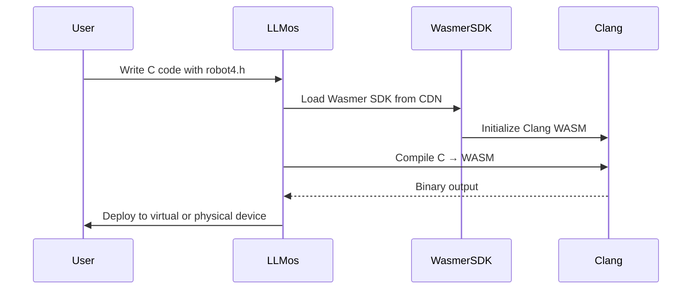

# ESP32 Hardware Integration - Complete Tutorial

**Branch:** main
**Date:** 2026-01-14
**Audience:** Developers and End Users

---

## Table of Contents

1. [Overview](#overview)
2. [Quick Start (Virtual Device)](#quick-start-virtual-device)
3. [Robot4 Architecture](#robot4-architecture)
4. [Physical ESP32 Setup](#physical-esp32-setup)
5. [Firmware Development](#firmware-development)
6. [Browser-Based WASM Compilation](#browser-based-wasm-compilation)
7. [LLM Tools for Robot Control](#llm-tools-for-robot-control)
8. [Building Custom Applets](#building-custom-applets)
9. [Advanced Examples](#advanced-examples)
10. [Fleet Management](#fleet-management)
11. [Troubleshooting](#troubleshooting)

---

## Overview

LLMos treats **physical hardware as a first-class citizen**. The ESP32-S3 integration enables a complete browser-to-hardware pipeline for autonomous robots:

```
┌─────────────────────────────────────────────────────────────────┐
│                      LLMos Browser Environment                   │
├─────────────────────────────────────────────────────────────────┤
│  ┌─────────────┐    ┌─────────────┐    ┌─────────────┐         │
│  │ C Source    │───>│ Wasmer/Clang│───>│ WASM Binary │         │
│  │ (robot4.h)  │    │ (in browser)│    │ (.wasm)     │         │
│  └─────────────┘    └─────────────┘    └──────┬──────┘         │
│                                                │                 │
│        ┌───────────────────────────────────────┼─────────────┐  │
│        ▼                                       ▼             │  │
│  ┌─────────────────────┐         ┌─────────────────────┐    │  │
│  │ Browser Simulation  │         │ Physical Hardware   │    │  │
│  │ - VirtualESP32      │         │ - ESP32-S3 WAMR     │    │  │
│  │ - CubeRobotSimulator│         │ - WASMachine        │    │  │
│  │ - 3D Visualization  │         │ - TCP Deploy:8080   │    │  │
│  └─────────────────────┘         └─────────────────────┘    │  │
│                                                              │  │
└──────────────────────────────────────────────────────────────┘  │
```

**Key Benefits:**
- Zero backend - everything runs in the browser
- Privacy-first - code never leaves your machine
- Same code runs in simulation AND on hardware
- 60Hz game loop with deterministic physics
- Hot-swappable firmware without reflashing

---

## Quick Start (Virtual Device)

**No hardware needed! Test immediately with virtual device.**

### 1. Start LLMos

```bash
cd llmos-lite/ui
npm install
npm run dev
```

Open http://localhost:3000

### 2. Create a Virtual Robot

In the LLMos chat interface, type:

```
Create a virtual cube robot for simulation
```

**What happens:**
- SystemAgent uses `create-virtual-device` tool
- Virtual ESP32-S3 instance with physics simulation
- Returns deviceId: `virtual-1704134567-abc123`

**Expected response:**
```
Created virtual robot "Robot-1" (virtual-1704134567-abc123)
Device type: virtual
Status: connected
Map: ovalTrack
```

### 3. Control the Robot

**Drive forward:**
```
Drive the robot forward at speed 150
```

**Turn left:**
```
Spin the robot left
```

**Set LED color:**
```
Set the robot LED to green
```

**Get robot state:**
```
Show me the robot's current position and sensors
```

### 4. Load a Game

**Load built-in line follower:**
```
Load the line follower game on my robot
```

**Start the simulation:**
```
Start the robot device
```

### 5. Available Floor Maps

The simulation includes several preset floor maps:

| Map Name | Description |
|----------|-------------|
| `ovalTrack` | Simple oval line-following track |
| `maze` | Maze with walls and obstacles |
| `figure8` | Figure-8 track with crossing |
| `obstacleArena` | Open arena with scattered obstacles |

**Change the map:**
```
Set the floor map to maze
```

---

## Robot4 Architecture

Robot4 is a WASM4-inspired API for robot firmware. Think of it as a "Game Boy for Robots" - simple, constrained, and deterministic.

### Memory-Mapped I/O

Following WASM4's design, Robot4 uses memory-mapped registers:

```c
// ═══════════════════════════════════════════════════════════════
//                     ROBOT4 MEMORY MAP
// ═══════════════════════════════════════════════════════════════

#define R4_MOTORS        ((volatile int16_t*)0x00)   // Left/Right PWM (-255 to 255)
#define R4_ENCODERS      ((volatile int32_t*)0x04)   // Encoder ticks
#define R4_LED           ((volatile uint8_t*)0x19)   // R,G,B values
#define R4_SENSORS       ((volatile uint8_t*)0x1C)   // 8 distance sensors (cm)
#define R4_LINE          ((volatile uint8_t*)0x24)   // 5 line sensors
#define R4_BUTTONS       ((volatile uint8_t*)0x29)   // Bumper switches
#define R4_TICK_COUNT    ((volatile uint32_t*)0x30)  // Milliseconds since boot
```

### Robot4 API Header

```c
// robot4.h - The "Game Boy for Robots" API

// Core callbacks (implement these in your game)
void start(void);   // Called once at startup
void update(void);  // Called 60 times per second

// Convenience macros
#define drive(left, right) do { \
    R4_MOTORS[0] = (int16_t)(left); \
    R4_MOTORS[1] = (int16_t)(right); \
} while(0)

#define stop() drive(0, 0)

#define distance(idx) (R4_SENSORS[(idx)])

#define led(r, g, b) do { \
    R4_LED[0] = (r); R4_LED[1] = (g); R4_LED[2] = (b); \
} while(0)

// Runtime-provided functions
extern void trace(const char* message);
extern void tone(uint32_t freq, uint32_t duration, uint8_t volume);
extern uint32_t random(void);
```

### Example: Wall Avoider

```c
#include "robot4.h"

#define SPEED 150
#define MIN_DISTANCE 30

void start(void) {
    trace("Wall Avoider v1.0");
    led(0, 255, 0);  // Green = ready
}

void update(void) {
    int front = distance(0);  // Front sensor

    if (front < MIN_DISTANCE) {
        stop();
        led(255, 0, 0);  // Red = obstacle

        // Choose turn direction
        if (distance(6) > distance(1)) {
            drive(-80, 80);  // Turn Left
        } else {
            drive(80, -80);  // Turn Right
        }
    } else {
        drive(SPEED, SPEED);
        led(0, 255, 0);  // Green = moving
    }
}
```

### Differential Drive Kinematics

The cube robot uses differential drive:

```
Linear Velocity:  v = (v_right + v_left) / 2
Angular Velocity: ω = (v_right - v_left) / wheel_base

Position Update (per dt):
  rotation += ω * dt
  x += v * cos(rotation) * dt
  y += v * sin(rotation) * dt
```

### Movement Patterns

| Left Motor | Right Motor | Movement |
|------------|-------------|----------|
| +150 | +150 | Forward |
| -150 | -150 | Backward |
| +100 | -100 | Spin Right (CW) |
| -100 | +100 | Spin Left (CCW) |
| +150 | +80 | Curve Right |
| +80 | +150 | Curve Left |
| 0 | 0 | Stop |

---

## Physical ESP32 Setup

### Hardware Requirements

**Supported Boards:**
- ESP32-S3-DevKitC (recommended)
- ESP32-DevKitC
- Any ESP32/ESP32-S3 with USB CDC support

**Cube Robot Components:**

| Component | Specification | Purpose |
|-----------|---------------|---------|
| MCU | ESP32-S3 (240MHz, 512KB SRAM) | Run WAMR + robot control |
| Motors | 2x DC motors with encoders | Differential drive |
| Motor Driver | TB6612FNG or L298N | PWM control |
| Distance Sensors | HC-SR04 ultrasonic (x3-8) | Obstacle detection |
| Line Sensors | QTR-5RC array | Line following |
| LED | WS2812B RGB | Status indication |
| Battery | 2S LiPo (7.4V, 1000mAh) | ~30 min runtime |

### Wiring Diagram

```
ESP32-S3                    Components
=========                   ===========

GPIO 16 (PWM) ────────────── Motor Left PWM
GPIO 17 (DIR) ────────────── Motor Left Direction
GPIO 18 (PWM) ────────────── Motor Right PWM
GPIO 19 (DIR) ────────────── Motor Right Direction

GPIO 4  ──────────────────── Ultrasonic Front TRIG
GPIO 5  ──────────────────── Ultrasonic Front ECHO
GPIO 6  ──────────────────── Ultrasonic Left TRIG
GPIO 7  ──────────────────── Ultrasonic Left ECHO

GPIO 32-36 ───────────────── QTR-5RC Line Sensors

GPIO 48 ──────────────────── WS2812B LED Data

ENC_A (GPIO 21) ──────────── Left Encoder A
ENC_B (GPIO 22) ──────────── Left Encoder B
ENC_A (GPIO 23) ──────────── Right Encoder A
ENC_B (GPIO 24) ──────────── Right Encoder B
```

---

## Firmware Development

### JSON Protocol Firmware

For direct control from LLMos, use the JSON protocol:

```cpp
/**
 * LLMos ESP32 Firmware - JSON Protocol
 * Baud Rate: 115200
 */

#include <Arduino.h>
#include <ArduinoJson.h>

JsonDocument doc;

void setup() {
  Serial.begin(115200);
  while (!Serial) delay(10);

  pinMode(2, OUTPUT);
  Serial.println("{\"status\":\"ok\",\"msg\":\"ESP32-S3 ready\"}");
}

void loop() {
  if (Serial.available() > 0) {
    String input = Serial.readStringUntil('\n');
    input.trim();
    if (input.length() == 0) return;

    DeserializationError error = deserializeJson(doc, input);
    if (error) {
      sendError("JSON parse error");
      return;
    }

    String action = doc["action"].as<String>();

    if (action == "drive") {
      handleDrive();
    } else if (action == "stop") {
      handleStop();
    } else if (action == "set_led") {
      handleSetLED();
    } else if (action == "get_pose") {
      handleGetPose();
    } else if (action == "get_info") {
      handleGetInfo();
    } else {
      sendError("Unknown action: " + action);
    }
  }
}

void handleDrive() {
  int left = doc["l"];
  int right = doc["r"];

  setMotors(left, right);

  JsonDocument response;
  response["status"] = "ok";
  response["msg"] = "motors set";
  serializeJson(response, Serial);
  Serial.println();
}

void handleStop() {
  setMotors(0, 0);

  JsonDocument response;
  response["status"] = "ok";
  response["msg"] = "motors stopped";
  serializeJson(response, Serial);
  Serial.println();
}

void handleSetLED() {
  int r = doc["r"];
  int g = doc["g"];
  int b = doc["b"];

  setLED(r, g, b);

  JsonDocument response;
  response["status"] = "ok";
  response["msg"] = "LED color set";
  serializeJson(response, Serial);
  Serial.println();
}

void sendError(String msg) {
  JsonDocument response;
  response["status"] = "error";
  response["msg"] = msg;
  serializeJson(response, Serial);
  Serial.println();
}
```

### WASMachine Firmware

For autonomous WASM apps, flash the ESP-WASMachine firmware:

```bash
# Clone ESP-WASMachine
git clone https://github.com/espressif/esp-wasmachine.git
cd esp-wasmachine

# Configure for ESP32-S3
idf.py set-target esp32s3
idf.py menuconfig
# Enable: Component config → WASM Micro Runtime → Interpreter mode

# Build and flash
idf.py build flash monitor
```

---

## Browser-Based WASM Compilation

**LLMos compiles C code to WebAssembly entirely in your browser** - no backend required!

### How It Works



### Compilation Example

```typescript
import { WasmCompiler } from '@/lib/runtime/wasm-compiler';

const compiler = WasmCompiler.getInstance();
await compiler.initialize(); // Loads Clang from CDN (~30MB, cached)

const result = await compiler.compile({
  source: `
    #include "robot4.h"

    void start(void) {
      led(0, 255, 0);
    }

    void update(void) {
      int front = distance(0);
      if (front < 30) {
        drive(-100, 100);
      } else {
        drive(150, 150);
      }
    }
  `,
  name: 'wall_avoider',
  optimizationLevel: '3'
});

// result.wasmBinary contains compiled WebAssembly
```

### Performance

| Operation | First Time | Subsequent |
|-----------|------------|------------|
| SDK Load | ~30MB, 5-10s | Instant (cached) |
| Compilation | 2-5 seconds | 1-3 seconds |
| Deploy to Virtual | <100ms | <100ms |
| Deploy to Physical | 1-2 seconds | 1-2 seconds |

### Available Headers

Headers loaded automatically from `/public/sdk/wasi-headers/`:
- `robot4.h` - Robot4 API
- `wm_ext_wasm_native.h` - GPIO, WiFi, HTTP
- `wm_ext_wasm_native_mqtt.h` - MQTT client
- `wm_ext_wasm_native_rainmaker.h` - ESP RainMaker cloud

---

## LLM Tools for Robot Control

LLMos provides natural language tools for robot control:

### Device Management

| Tool | Description | Example |
|------|-------------|---------|
| `create-virtual-device` | Create virtual robot | "Create a virtual robot" |
| `list-robot-devices` | List all robots | "Show connected robots" |
| `disconnect-robot-device` | Remove device | "Disconnect Robot-1" |

### Robot Control

| Tool | Description | Example |
|------|-------------|---------|
| `drive-robot` | Set motor speeds | "Drive forward at 150" |
| `stop-robot` | Stop all motors | "Stop the robot" |
| `set-robot-led` | Set LED color | "Make the LED blue" |
| `get-robot-state` | Get telemetry | "Where is the robot?" |

### Games & Maps

| Tool | Description | Example |
|------|-------------|---------|
| `load-robot-game` | Load game template | "Load line follower game" |
| `list-robot-games` | Show available games | "What games are available?" |
| `set-floor-map` | Change arena | "Use the maze map" |
| `list-floor-maps` | Show available maps | "What maps are there?" |

### Device Lifecycle

| Tool | Description | Example |
|------|-------------|---------|
| `start-robot-device` | Begin simulation | "Start the robot" |
| `stop-robot-device` | Pause simulation | "Pause the robot" |
| `reset-robot-device` | Reset to start | "Reset robot position" |

### Natural Language Examples

```
User: "Create a virtual robot and make it drive in a circle"

SystemAgent:
1. Uses create-virtual-device → Gets deviceId
2. Uses start-robot-device → Begins simulation
3. Uses drive-robot with left=100, right=180 → Curved motion
```

```
User: "Load the obstacle avoidance game and show me the robot's sensors"

SystemAgent:
1. Uses load-robot-game with gameName="obstacleAvoidance"
2. Uses start-robot-device
3. Uses get-robot-state → Returns sensor readings
```

---

## Building Custom Applets

### Robot Control Dashboard

**User prompt:** "Create an applet with a D-pad to control the robot"

```javascript
function Applet() {
  const [motors, setMotors] = useState({ left: 0, right: 0 });
  const [led, setLed] = useState({ r: 0, g: 255, b: 0 });

  async function drive(left, right) {
    setMotors({ left, right });
    await window.__executeSystemTool('drive-robot', {
      deviceId: 'virtual-...',
      left,
      right
    });
  }

  async function stop() {
    setMotors({ left: 0, right: 0 });
    await window.__executeSystemTool('stop-robot', {
      deviceId: 'virtual-...'
    });
  }

  const btnClass = "w-12 h-12 bg-gray-700 hover:bg-gray-600 rounded flex items-center justify-center text-xl";

  return (
    <div className="p-4 bg-gray-900 text-white rounded-lg">
      <h2 className="text-xl font-bold mb-4 text-center">Robot Control</h2>

      <div className="flex justify-center mb-4">
        <div className="grid grid-cols-3 gap-1">
          <div></div>
          <button className={btnClass} onMouseDown={() => drive(150, 150)} onMouseUp={stop}>↑</button>
          <div></div>
          <button className={btnClass} onMouseDown={() => drive(-100, 100)} onMouseUp={stop}>←</button>
          <button className={btnClass} onClick={stop}>■</button>
          <button className={btnClass} onMouseDown={() => drive(100, -100)} onMouseUp={stop}>→</button>
          <div></div>
          <button className={btnClass} onMouseDown={() => drive(-150, -150)} onMouseUp={stop}>↓</button>
          <div></div>
        </div>
      </div>

      <div className="flex justify-between items-center bg-gray-800 p-2 rounded">
        <span className="text-sm text-gray-400">Motors:</span>
        <span>L: {motors.left} R: {motors.right}</span>
      </div>
    </div>
  );
}
```

### Sensor Dashboard

**User prompt:** "Create an applet showing real-time sensor readings"

```javascript
function Applet() {
  const [state, setState] = useState(null);
  const [deviceId, setDeviceId] = useState(null);

  useEffect(() => {
    const interval = setInterval(async () => {
      if (deviceId) {
        const result = await window.__executeSystemTool('get-robot-state', { deviceId });
        if (result.success) {
          setState(result);
        }
      }
    }, 100);
    return () => clearInterval(interval);
  }, [deviceId]);

  if (!state) {
    return <div className="p-4">Connect a robot first...</div>;
  }

  return (
    <div className="p-4 bg-gray-900 text-white rounded-lg">
      <h2 className="text-xl font-bold mb-4">Robot Telemetry</h2>

      <div className="grid grid-cols-2 gap-4">
        {/* Position */}
        <div className="bg-gray-800 p-4 rounded">
          <h3 className="text-sm text-gray-400 mb-2">Position</h3>
          <div>X: {state.robot.pose.x}</div>
          <div>Y: {state.robot.pose.y}</div>
          <div>θ: {state.robot.pose.rotation}</div>
        </div>

        {/* Sensors */}
        <div className="bg-gray-800 p-4 rounded">
          <h3 className="text-sm text-gray-400 mb-2">Distance Sensors</h3>
          <div>Front: {state.robot.sensors.distanceFront}</div>
          <div>Left: {state.robot.sensors.distanceLeft}</div>
          <div>Right: {state.robot.sensors.distanceRight}</div>
        </div>

        {/* Battery */}
        <div className="bg-gray-800 p-4 rounded">
          <h3 className="text-sm text-gray-400 mb-2">Battery</h3>
          <div className="text-2xl font-bold text-green-400">
            {state.robot.battery.percentage}
          </div>
        </div>

        {/* Motors */}
        <div className="bg-gray-800 p-4 rounded">
          <h3 className="text-sm text-gray-400 mb-2">Motors</h3>
          <div>Left: {state.robot.motors.left}</div>
          <div>Right: {state.robot.motors.right}</div>
        </div>
      </div>
    </div>
  );
}
```

---

## Advanced Examples

### Example 1: Line Following Robot

```c
#include "robot4.h"

#define BASE_SPEED 150
#define KP 25

void start(void) {
    trace("Line Racer v1.0");
}

void update(void) {
    // Read 5 line sensors (0=white, 255=black)
    int sensors[5];
    for (int i = 0; i < 5; i++) {
        sensors[i] = R4_LINE[i];
    }

    // Calculate weighted position
    int position =
        -200 * (sensors[0] > 128 ? 1 : 0) +
        -100 * (sensors[1] > 128 ? 1 : 0) +
           0 * (sensors[2] > 128 ? 1 : 0) +
         100 * (sensors[3] > 128 ? 1 : 0) +
         200 * (sensors[4] > 128 ? 1 : 0);

    int count = 0;
    for (int i = 0; i < 5; i++) {
        if (sensors[i] > 128) count++;
    }
    if (count > 0) position /= count;

    // PD control
    int correction = (position * KP) / 100;

    int left_speed = BASE_SPEED + correction;
    int right_speed = BASE_SPEED - correction;

    // Clamp speeds
    if (left_speed > 255) left_speed = 255;
    if (left_speed < -255) left_speed = -255;
    if (right_speed > 255) right_speed = 255;
    if (right_speed < -255) right_speed = -255;

    drive(left_speed, right_speed);

    // LED indicates position
    if (position < -50) {
        led(255, 0, 0);  // Red = too far left
    } else if (position > 50) {
        led(0, 0, 255);  // Blue = too far right
    } else {
        led(0, 255, 0);  // Green = centered
    }
}
```

### Example 2: Maze Solver (Wall Following)

```c
#include "robot4.h"

#define SPEED 120
#define WALL_DISTANCE 40

typedef enum {
    FOLLOW_WALL,
    TURN_LEFT,
    TURN_RIGHT,
    FORWARD_CLEAR
} State;

State state = FOLLOW_WALL;

void start(void) {
    trace("Maze Runner v1.0");
}

void update(void) {
    int front = distance(0);
    int left = distance(3);
    int right = distance(4);

    switch (state) {
        case FOLLOW_WALL:
            if (front < WALL_DISTANCE) {
                // Wall ahead, need to turn
                if (right > left) {
                    state = TURN_RIGHT;
                    led(255, 128, 0);
                } else {
                    state = TURN_LEFT;
                    led(255, 255, 0);
                }
            } else if (right < WALL_DISTANCE) {
                // Following right wall
                int error = WALL_DISTANCE - right;
                int correction = error / 2;
                drive(SPEED - correction, SPEED + correction);
                led(0, 255, 0);
            } else {
                // No wall on right, turn right to find one
                drive(SPEED, SPEED / 2);
                led(0, 255, 255);
            }
            break;

        case TURN_LEFT:
            drive(-SPEED, SPEED);
            if (front > WALL_DISTANCE + 20) {
                state = FOLLOW_WALL;
            }
            break;

        case TURN_RIGHT:
            drive(SPEED, -SPEED);
            if (front > WALL_DISTANCE + 20) {
                state = FOLLOW_WALL;
            }
            break;
    }
}
```

### Example 3: Multi-Device Coordination

```javascript
// Coordinate multiple virtual robots

// Create fleet
const devices = [];
for (let i = 0; i < 3; i++) {
  const result = await executeSystemTool('create-virtual-device', {
    name: `Robot-${i + 1}`,
    mapName: 'obstacleArena'
  });
  devices.push(result.deviceId);
}

// Formation driving
async function driveFormation(direction, speed) {
  const commands = devices.map((deviceId, index) => {
    const offset = (index - 1) * 20; // Stagger formation
    return executeSystemTool('drive-robot', {
      deviceId,
      left: speed + offset,
      right: speed - offset
    });
  });

  await Promise.all(commands);
}

// Start all
await executeSystemTool('start-all-robot-devices');

// Drive formation forward
await driveFormation('forward', 150);
```

---

## Fleet Management

The ESP32 Device Manager supports fleet-wide operations:

### Creating a Fleet

```
User: "Create 3 virtual robots for swarm testing"

SystemAgent:
1. Uses create-virtual-device × 3
2. Returns: Robot-1, Robot-2, Robot-3 with unique IDs
```

### Fleet Commands

```
User: "Start all robots"
→ Uses start-all-robot-devices

User: "Stop all robots"
→ Uses stop-all-robot-devices

User: "Reset all robots to starting positions"
→ Uses reset-all-robot-devices
```

### Fleet Configuration

```typescript
interface FleetConfig {
  syncMode: 'independent' | 'synchronized' | 'leader-follower';
  leaderDeviceId?: string;
  defaultMap: string;
  defaultGame: string;
  autoStart: boolean;
}
```

### Event System

Subscribe to fleet events:

```typescript
const manager = getDeviceManager();

manager.on('device:connected', ({ deviceId, name }) => {
  console.log(`Robot connected: ${name}`);
});

manager.on('device:telemetry', (telemetry) => {
  console.log(`Robot ${telemetry.deviceId} at position:`, telemetry.robotState.pose);
});

manager.on('device:collision', ({ deviceId, x, y }) => {
  console.log(`Robot ${deviceId} collision at (${x}, ${y})`);
});

manager.on('device:checkpoint', ({ deviceId, checkpointIndex }) => {
  console.log(`Robot ${deviceId} reached checkpoint ${checkpointIndex}`);
});
```

---

## Troubleshooting

### Problem: Browser doesn't show device picker

**Cause:** Web Serial API requires HTTPS or localhost

**Solution:**
- Use `https://` URL in production
- Use `http://localhost:3000` in development
- OR use virtual device (no hardware required)

### Problem: "Device not found" error

**Cause:** ESP32 not recognized by browser

**Solution:**
1. Check USB cable (must be data cable, not charge-only)
2. Install CH340/CP2102 drivers if needed
3. In Arduino IDE: Tools → USB CDC On Boot → **Enabled**
4. Re-upload firmware

### Problem: Commands timeout

**Cause:** Firmware not responding or wrong baud rate

**Solution:**
1. Open Serial Monitor (115200 baud)
2. Manually test: `{"action":"get_info"}`
3. Verify JSON response
4. Check firmware uploaded correctly

### Problem: Virtual robot drifts

**Cause:** Motor calibration or physics simulation

**Solution:**
1. Reset the robot: `reset-robot-device`
2. Check motor values are balanced
3. Use encoder feedback from `get-robot-state`

### Problem: Compilation fails

**Cause:** Invalid C syntax or missing headers

**Solution:**
1. Check the error message for line numbers
2. Ensure `#include "robot4.h"` is present
3. Verify function signatures match
4. Check for missing semicolons

### Problem: WASM binary doesn't run on hardware

**Cause:** Binary compiled for wrong target

**Solution:**
1. Verify target is `wasm32-wasi`
2. Check heap size configuration
3. Ensure native functions are available
4. Use `query-wasm-apps` to verify installation

---

## Summary

### What You Have Now

| Feature | Status |
|---------|--------|
| Virtual Device Simulation | Complete |
| Robot4 API | Complete |
| Browser-Based WASM Compiler | Complete |
| LLM Natural Language Tools | Complete |
| Fleet Management | Complete |
| Physical Hardware Support | Complete |

### Quick Reference

**Create Robot:**
```
"Create a virtual cube robot"
```

**Control Robot:**
```
"Drive forward at speed 150"
"Turn left"
"Stop the robot"
"Set LED to red"
```

**Load Games:**
```
"Load the line follower game"
"Load obstacle avoidance"
"Load maze runner"
```

**Change Environment:**
```
"Set floor map to maze"
"Use the figure8 track"
```

**Get State:**
```
"Show robot position"
"What are the sensor readings?"
"Get robot telemetry"
```

### Architecture Files

- **ARCHITECTURE.md** - Full system architecture with mermaid diagrams
- **docs/WASM4-ROBOT-ARCHITECTURE.md** - Robot4 API specification
- **docs/ESP32-S3-INTEGRATION-TEST-GUIDE.md** - End-to-end testing guide
- **llmos-lite/volumes/system/skills/** - ESP32 skill definitions

### Source Code

- `lib/hardware/virtual-esp32.ts` - Virtual device emulator
- `lib/hardware/esp32-device-manager.ts` - Fleet management
- `lib/hardware/esp32-wasm4-vm.ts` - WASM4 runtime + robot simulator
- `lib/llm-tools/esp32-wasm4-tools.ts` - LLM tool definitions

---

**Status:** Complete and ready for use
**Document Version:** 3.0.0 (Robot4 Architecture + Fleet Management)
**Date:** 2026-01-14
**Branch:** main
